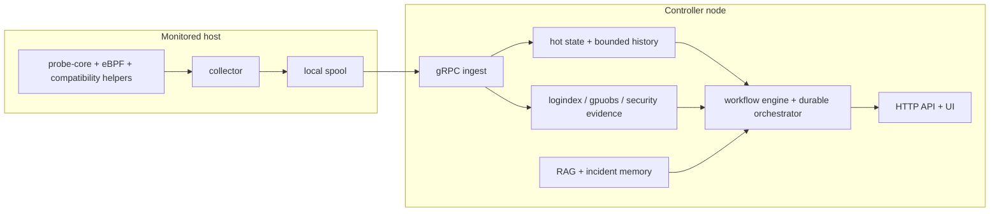

# Architecture (v0.8)

This document is the deeper architecture note for reviewers who want the mechanism-level explanation of the current repository.

It focuses on the maintained Go collector/controller path and the controller-side incident runtime that now exists in the code.

## Architectural Statement

AI SRE Agent is best understood as two systems layered together:

1. a push-first evidence pipeline
2. a governed incident workflow runtime built on top of that pipeline

The first layer preserves facts.
The second layer turns those facts into investigation, recommendation, and bounded action.

## Why The Architecture Is Split

The split is driven by operational constraints, not by style.

| Constraint | If ignored | Architectural response |
| --- | --- | --- |
| host evidence is short-lived | first-onset incident evidence disappears before central analysis sees it | host-local collector with push-first delivery |
| steady-state overhead must stay low | the observability stack becomes part of the workload problem | suppression, tiered helper cadence, and local protection modes |
| partial payloads must still be meaningful | downstream analysis becomes inconsistent | controller-side normalization and state carry-forward |
| knowledge lookup is useful but expensive | retrieval turns into generic prompt stuffing | selective retrieval over static knowledge plus incident memory |
| automation is risky | suggestions become unsafe actions | policy, approval, dry-run, verification, and compensation in the workflow runtime |

## Runtime Topology

## Collector Architecture

The collector is designed around one non-negotiable idea: it must be useful before the controller is reachable and cheap enough to leave running.

### What problem existed before this design

- pull-based polling can miss the start of fast incidents
- always sending every payload wastes CPU, network, and spool space
- controller stalls can create blind spots

### Why this implementation exists

- `probe-core` and eBPF keep high-fidelity data collection close to the kernel and device state
- compatibility helpers prevent total blindness when the primary path is unavailable
- the spool decouples observation from delivery

### Real files

- [`../../backend/internal/collector/collector.go`](../../backend/internal/collector/collector.go)
- [`../../backend/internal/collector/aux_sampling.go`](../../backend/internal/collector/aux_sampling.go)
- [`../../backend/internal/collector/metric_suppression.go`](../../backend/internal/collector/metric_suppression.go)
- [`../../backend/internal/collector/process_payload_suppression.go`](../../backend/internal/collector/process_payload_suppression.go)
- [`../../backend/internal/collector/spool/spool.go`](../../backend/internal/collector/spool/spool.go)
- [`../../backend/internal/collector/transport/client.go`](../../backend/internal/collector/transport/client.go)

### Practical consequence

The collector is not a generic metrics sidecar. It is a host observer with a conservative cost model.

## Ingest And State Reconstruction

The controller does not reason directly from transport batches. It first rebuilds one fact model.

### What problem existed before this layer

- collector suppression would be unsafe if missing fields were treated as deletion
- different APIs and workflows could interpret the same batch differently

### Mechanism

- ingest validates and normalizes batch payloads
- `NodeSnapshot` becomes the controller’s current-state object
- metric history is retained only for trend-safe metrics
- specialty evidence stores hold logs, GPU context, security findings, and runtime state

### Real files

- [`../../backend/internal/controller/ingest/server.go`](../../backend/internal/controller/ingest/server.go)
- [`../../backend/internal/controller/ingest/store.go`](../../backend/internal/controller/ingest/store.go)
- [`../../backend/internal/controller/logindex/`](../../backend/internal/controller/logindex/)
- [`../../backend/internal/controller/gpuobs/`](../../backend/internal/controller/gpuobs/)

### Practical consequence

Every controller-facing subsystem now depends on one normalized state boundary rather than independently decoding batches.

## Analysis Layer

The analysis layer sits between raw state and incident workflow.

### Why it is necessary

If the controller sent raw telemetry directly to retrieval or prompt assembly:

- drift and spikes would be mixed together
- compound incidents would be harder to detect
- prompt cost would rise faster than diagnostic value
- deterministic fallback would be weaker

### Mechanism

The current control plane builds:

- trend assessments
- weak-signal events and cooccurrences
- predictive hints
- scope risk summaries
- change links
- adaptive baseline insights

### Real files

- [`../../backend/internal/controller/agentcore/workflow_eventization.go`](../../backend/internal/controller/agentcore/workflow_eventization.go)
- [`../../backend/internal/controller/predictive/`](../../backend/internal/controller/predictive/)
- [`../../backend/internal/controller/changeintel/`](../../backend/internal/controller/changeintel/)
- [`../../backend/internal/controller/agentcore/workflow_intelligence.go`](../../backend/internal/controller/agentcore/workflow_intelligence.go)

## Knowledge Layer

The controller now has two different knowledge surfaces.

| Knowledge surface | Package | What it answers |
| --- | --- | --- |
| static knowledge | [`../../backend/internal/controller/rag/`](../../backend/internal/controller/rag/) | what runbooks, prior incidents, and reference documents say in general |
| incident memory | [`../../backend/internal/controller/incidentmemory/`](../../backend/internal/controller/incidentmemory/) | what this system previously tried or learned during real workflow runs |

This split exists because static knowledge and operational memory are not the same thing.

## Incident Workflow Runtime

The workflow runtime is the main architectural step from analysis system toward operational agent.

### What problem existed before it

- controller workflows were useful, but not durably reconstructable enough
- policy and approval handling risked being spread across tools
- action success and failure were harder to write back into future retrieval

### Mechanism

The runtime combines:

- workflow engine for sequencing and RCA construction
- durable orchestrator for run persistence
- unified tool gateway for governance
- verification and compensation records
- evidence packaging

### Real files

- [`../../backend/internal/controller/agentcore/workflow_engine.go`](../../backend/internal/controller/agentcore/workflow_engine.go)
- [`../../backend/internal/controller/agentcore/workflow_orchestrator.go`](../../backend/internal/controller/agentcore/workflow_orchestrator.go)
- [`../../backend/internal/controller/agentcore/workflow_tools.go`](../../backend/internal/controller/agentcore/workflow_tools.go)
- [`../../backend/internal/controller/agentcore/workflow_memory.go`](../../backend/internal/controller/agentcore/workflow_memory.go)

### What it solves in practice

- step-level auditability
- replayable run inspection
- explicit policy and approval state
- post-action verification records
- future retrieval over prior outcomes

## Change Intelligence And Causal Graph

These are new enough and important enough to call out separately.

### Change intelligence

What problem existed before:

- the system could infer a recent regression without a first-class change model

What the current subsystem does:

- normalizes changes
- derives additional change hints from labels and logs
- scores temporal adjacency and scope overlap
- emits change-linked RCA evidence

### Causal graph

What problem existed before:

- symptoms and causes could compete in the same ranking list

What the current subsystem does:

- merges change, topology, lineage, runtime, and symptom nodes
- boosts likely upstream causes
- renders explainable causal and impact paths

Together, these subsystems move the RCA path from "ranked symptoms plus guesses" toward "ranked causes with explicit evidence paths."

## Evaluation Architecture

The repository now tests three different things:

1. runtime availability
2. golden workflow/retrieval behavior
3. replay stability

### Real files

- [`../../backend/internal/controller/eval/`](../../backend/internal/controller/eval/)
- [`../../backend/internal/controller/evaluation/`](../../backend/internal/controller/evaluation/)
- [`../../eval_data/`](../../eval_data/)

### Why it matters

Without this layer, architectural claims about retrieval, RCA, and workflow governance would be much harder to verify after changes.

## Production Advantages

The current architecture is stronger than naive LLM ops tooling because it:

- preserves more onset evidence
- uses structured intermediate evidence before prompt assembly
- keeps retrieval selective
- stores workflow state durably
- gives operators audit artifacts rather than only prose

## Current Boundaries

The implementation still has practical limits:

- durable state is local-first rather than a distributed workflow service
- change intelligence is heuristic and repository-local
- incident memory is local durable retrieval, not a global knowledge graph
- action automation remains conservative by design
- evaluation is strong on regression detection, not open-world benchmarking

Those boundaries are the current engineering truth of the repo.
