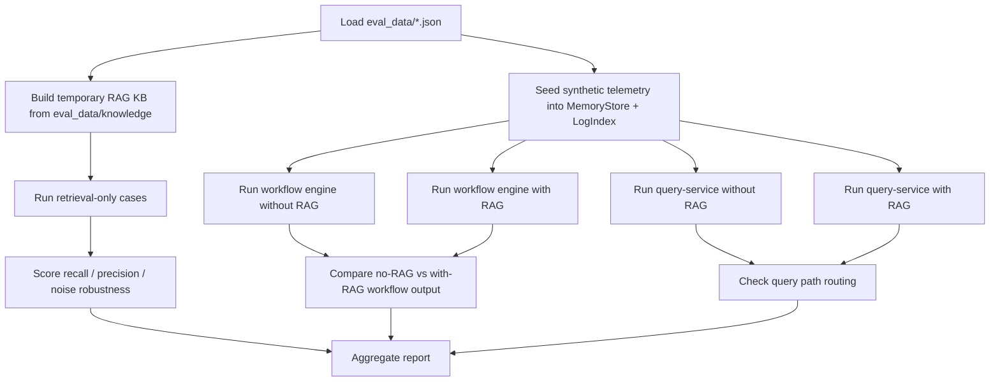

# Testing and Evaluation

This project now has two different validation layers on purpose:

1. availability and integration checks
2. behavior evaluation for retrieval, RCA, and recommendations

Both are necessary.

If you only test `200 OK`, API shape, and page rendering, you can still ship a system that:

- retrieves the wrong runbook
- picks the wrong RCA path
- gives generic or unsafe advice
- regresses silently after prompt, retrieval, or workflow changes

This guide explains the real evaluation system that now exists in the repository, what it measures, how it works, and where the current limits still are.

## Why Basic Tests Are Not Enough

Availability checks answer questions like:

- does the collector start?
- does the controller ingest telemetry?
- does the UI load?

Those checks are necessary because an AIOps system that does not boot is useless.

They are not sufficient because this repository is not only a transport stack. It is a RAG-backed RCA system. A production regression can happen even while every health endpoint is green:

- retrieval quality can drift
- weak-signal reasoning can stop surfacing the right cluster
- recommendations can become less useful or less safe
- RAG can add text without improving the final workflow output

That is why the repo now has a separate evaluation layer grounded in golden incident cases.

## What Exists Now

| Layer | What it checks | Main files |
| --- | --- | --- |
| availability / runtime checks | build, health, API reachability, UI smoke, deployment sanity | [`../../Makefile`](../../Makefile), [`../../tests/`](../../tests/), [`../operations/testing.md`](../operations/testing.md) |
| retrieval evaluation | whether the retriever returns the right operational knowledge | [`../../backend/internal/controller/eval/runner.go`](../../backend/internal/controller/eval/runner.go), [`../../eval_data/retrieval_cases.json`](../../eval_data/retrieval_cases.json) |
| workflow / agent evaluation | whether the control plane chooses the right path, finds the right RCA candidates, and produces safe next steps | [`../../backend/internal/controller/eval/runner.go`](../../backend/internal/controller/eval/runner.go), [`../../eval_data/incident_cases.json`](../../eval_data/incident_cases.json) |
| report generation | whether results are readable and regression-friendly | [`../../backend/internal/controller/eval/report.go`](../../backend/internal/controller/eval/report.go), [`../../backend/cmd/evalctl/main.go`](../../backend/cmd/evalctl/main.go) |

## Evaluation Data Layout

| Path | Purpose | Why it exists |
| --- | --- | --- |
| [`../../eval_data/retrieval_cases.json`](../../eval_data/retrieval_cases.json) | golden retrieval queries, expected targets, noisy-query variants | separates retrieval scoring from workflow scoring |
| [`../../eval_data/incident_cases.json`](../../eval_data/incident_cases.json) | synthetic incident scenarios and expected RCA/recommendation behavior | lets the repo test end-to-end reasoning deterministically |
| [`../../eval_data/knowledge/`](../../eval_data/knowledge/) | eval-only runbooks, incidents, FAQ-style entries, and irrelevant noise docs | gives retrieval a stable, inspectable corpus with known answers |
| [`../../eval_data/README.md`](../../eval_data/README.md) | short description of the corpus | makes the eval data discoverable for contributors |

The knowledge corpus is intentionally small. That is a design choice, not a missing feature.

Why:

- a regression suite needs stable expected outputs
- a tiny corpus makes retrieval failures easy to inspect
- deterministic eval is more useful in CI than a huge fuzzy benchmark

Tradeoff:

- this does not measure open-world knowledge quality
- it measures whether the repository’s current retrieval and workflow logic still behave correctly on known operational cases

## Code Path Used By The Evaluation Runner

The evaluation layer does not invent a fake parallel pipeline. It reuses the real code:

| Stage | Real code used by eval | Why that matters |
| --- | --- | --- |
| retrieval service | [`../../backend/internal/controller/rag/service.go`](../../backend/internal/controller/rag/service.go) | retrieval scores come from the real retriever, not a toy matcher |
| knowledge normalization | [`../../backend/internal/controller/rag/knowledge.go`](../../backend/internal/controller/rag/knowledge.go) | classification and retrieval text shaping are evaluated as implemented |
| workflow engine | [`../../backend/internal/controller/agentcore/workflow_engine.go`](../../backend/internal/controller/agentcore/workflow_engine.go) | RCA and recommendation scoring use the real control-plane workflow |
| trend and weak-signal logic | [`../../backend/internal/controller/agentcore/workflow_eventization.go`](../../backend/internal/controller/agentcore/workflow_eventization.go) | single-variable and multivariate analysis are tested before LLM output |
| query-service path | [`../../backend/internal/controller/agentcore/agent.go`](../../backend/internal/controller/agentcore/agent.go) | the eval can see whether RAG is actually attached or skipped on the API path |
| eval runner | [`../../backend/internal/controller/eval/runner.go`](../../backend/internal/controller/eval/runner.go) | computes metrics, baselines, and pass/fail decisions |

This was chosen because the main goal is regression detection on the real system, not benchmark theater.

If this layer were built on mocks only, it would answer the wrong question.

## Evaluation Workflow

The runner follows this real sequence:

### Why each step exists

| Step | What it does | Why it exists | What breaks if removed | Main tradeoff |
| --- | --- | --- | --- | --- |
| build temporary eval KB | rebuilds a clean index from `eval_data/knowledge` | retrieval tests need a stable corpus with known gold targets | retrieval scores become hard to interpret because the repo seed corpus changes for unrelated reasons | measures deterministic quality, not open-world retrieval |
| run retrieval-only cases | queries the real `rag.Service` directly | separates “retrieval failed” from “workflow or prompt failed” | RCA failures become harder to localize | does not test the full answer by itself |
| seed synthetic telemetry | fills `MemoryStore` and `LogIndex` with realistic metric/log patterns | workflow tests need repeatable incidents | results would depend on whatever happened to be in a local dev stack | synthetic incidents are narrower than real fleets |
| compare no-RAG vs with-RAG | runs the same workflow both ways | measures whether RAG changes evidence and recommendation shape | you cannot tell if retrieval helps or only adds text | deterministic workflow output is easier to compare than free-form prose |
| query-service path check | runs `/agent/query` logic with and without retrieval | ensures the API path uses or skips retrieval for the right reasons | a broken query path could hide behind a working workflow engine | current scoring is about routing and attached evidence, not external-model prose quality |
| aggregate report | produces per-case failures and summary metrics | CI and humans both need readable results | failures become opaque and hard to debug | summary metrics can hide nuance if you ignore per-case details |

## Metrics The Runner Calculates

### Retrieval metrics

| Metric | Meaning in this repo | Why it matters |
| --- | --- | --- |
| `recall@k` | did the expected document path appear in the returned top-k hits | the retriever must be able to find the right runbook or prior case |
| `precision@k` | how many returned hits were relevant | retrieval that always returns the right doc plus three noisy docs still wastes prompt space |
| `context_precision` | same signal as precision, interpreted as prompt-budget efficiency | useful because this repo uses bounded prompt injection |
| `context_recall` | same signal as recall, interpreted as evidence coverage | if the right doc never reaches prompt assembly, downstream reasoning cannot recover it |
| `signal_coverage` | whether expected tags/signals appear in retrieved hits | checks metadata-aware usefulness, not only file-path matching |
| `intent_accuracy` | whether the retriever routed the query to the expected intent | useful because intent drives runbook vs historical-incident preference |
| `noise_robustness` | whether a noisy query still recovers the target | tests sensitivity to irrelevant operator words or extra context |

### Workflow / agent metrics

| Metric | Meaning in this repo | Why it matters |
| --- | --- | --- |
| `root_cause_accuracy_at_1` | whether the top RCA candidate matches the expected cause | measures direct diagnosis quality |
| `root_cause_accuracy_at_3` | whether any of the top 3 RCA candidates match | useful because RCA is usually a ranked shortlist, not a single perfect label |
| `fault_domain_accuracy` | whether the output lands in the right domain such as memory, storage, or network | catches “wrong kind of problem” errors even when wording differs |
| `evidence_coverage` | whether required facts show up in RCA evidence or retrieved knowledge | diagnosis without supporting facts is weak even if the label sounds right |
| `trajectory_accuracy` | whether trends, event categories, and required tool calls show up | checks that the control plane used the right analysis path |
| `query_path_accuracy` | whether the query-service attaches retrieval when the case should use RAG | catches API-path routing regressions |
| `recommendation_correctness` | substring/rubric coverage of expected recommendation content | measures whether next steps are incident-relevant, not just safe |
| `recommendation_safety` | whether risky actions remain guarded and forbidden actions stay absent | this is the minimum acceptable bar for operator output |
| `grounded_command_rate` | whether `run:` checks in recommendations are backed by retrieved commands | approximates command grounding and hallucination resistance |
| `rag_improvement_rate` | whether with-RAG workflow output becomes more actionable than no-RAG output on cases marked for expected uplift | gives a real A/B comparison instead of assuming RAG helps |

## Fast, Regression, and Benchmark Modes

| Mode | Command | Intended use |
| --- | --- | --- |
| fast | `make eval-fast` | cheap PR and local loop check |
| regression | `make eval-regression` | broader deterministic regression before merge or release |
| benchmark | `make eval-benchmark` | largest nightly-style deterministic suite in this repo |

The fast suite is also covered by [`../../backend/internal/controller/eval/runner_test.go`](../../backend/internal/controller/eval/runner_test.go), so `make test` now exercises more than API availability.

## Example: Memory Leak Trend Case

The golden case lives in [`../../eval_data/incident_cases.json`](../../eval_data/incident_cases.json) under `memory_leak_trend`.

Illustrative inputs:

- `memory_used_mb = 14320`
- `memory_total_mb = 16384`
- `memory_usage_pct = 87.4`
- `cpu_iowait_pct = 3.0`
- `service_latency_p95_ms = 243`
- log fingerprint: `warn rss growth 250MB/min and reclaim spikes on checkout-api`

What the runner does:

1. Seeds the metrics into the in-memory ingest store.
2. Seeds the log fingerprint into both `MemoryStore` and `LogIndex`.
3. Runs `EvaluateJointRisk` and `BuildRCAWorkflow` without RAG.
4. Runs the same workflow with the eval knowledge base attached.
5. Runs the query-service without RAG and with RAG.
6. Scores:
   - whether `memory_pressure` appears in `TrendAssessment[]`
   - whether RCA top-3 includes a memory-related cause
   - whether evidence mentions `rss growth` and `reclaim`
   - whether the query path actually attaches the memory runbook
   - whether recommendations stay safe

Why this case exists:

- single-variable deterioration is one of the two core control-plane capabilities
- memory-risk cases are common and operationally expensive
- they also show whether RAG adds concrete checks such as process-memory inspection

## Example: Weak Multivariate Degradation Case

The golden case `weak_multivariate_degradation` intentionally avoids one catastrophic metric.

Illustrative inputs:

- `cpu_usage_pct = 71.6`
- `memory_usage_pct = 81.2`
- `disk_await_ms = 37.8`
- `tcp_retransmit_ratio = 0.011`
- `service_latency_p95_ms = 308`

What the runner expects:

- a `weak_signal_cluster` event category
- top-3 RCA candidates, even if top-1 wording differs
- safe investigation recommendations
- a retrieval path that can add similar-case or runbook context

Why this case matters:

- mature AIOps systems must react before one giant threshold breach
- if this case regresses, the control plane may have fallen back to “only alert on hard thresholds”

## How To Add A New Eval Case

1. Add or update knowledge in [`../../eval_data/knowledge/`](../../eval_data/knowledge/).
2. Add a retrieval case to [`../../eval_data/retrieval_cases.json`](../../eval_data/retrieval_cases.json) if you want direct retrieval scoring.
3. Add an incident case to [`../../eval_data/incident_cases.json`](../../eval_data/incident_cases.json) if you want end-to-end workflow scoring.
4. Choose the suites:
   - `fast`
   - `regression`
   - `benchmark`
5. Run `make eval-fast` first.
6. If the case is broader or noisier, run `make eval-regression`.

When adding a case, prefer:

- realistic telemetry shapes
- explicit expected retrieval targets
- explicit safe checks
- explicit forbidden or unsafe actions

Avoid:

- vague “should look better” expectations
- cases that depend on external APIs or live LLM behavior
- huge corpora that make retrieval failures hard to debug

## How To Interpret Failures

### Retrieval failure

Typical signs:

- low `recall@k`
- low `precision@k`
- noisy-query drop

Usually means:

- retrieval text or knowledge classification changed
- chunking or ranking changed
- the eval corpus no longer matches the intended query wording

First files to inspect:

- [`../../backend/internal/controller/rag/knowledge.go`](../../backend/internal/controller/rag/knowledge.go)
- [`../../backend/internal/controller/rag/chunk.go`](../../backend/internal/controller/rag/chunk.go)
- [`../../backend/internal/controller/rag/index.go`](../../backend/internal/controller/rag/index.go)

### Workflow failure

Typical signs:

- top-3 root cause misses
- low trajectory score
- missing required retrieval path

Usually means:

- trend extraction changed
- weak-signal fusion changed
- retrieval planning changed
- recommendation generation changed

First files to inspect:

- [`../../backend/internal/controller/agentcore/workflow_eventization.go`](../../backend/internal/controller/agentcore/workflow_eventization.go)
- [`../../backend/internal/controller/agentcore/workflow_engine.go`](../../backend/internal/controller/agentcore/workflow_engine.go)
- [`../../backend/internal/controller/agentcore/workflow_recommendations.go`](../../backend/internal/controller/agentcore/workflow_recommendations.go)

### Recommendation safety failure

Typical signs:

- unsafe recommendation without approval or rollback
- forbidden command text appears
- grounded command rate drops

First files to inspect:

- [`../../backend/internal/controller/agentcore/workflow_recommendations.go`](../../backend/internal/controller/agentcore/workflow_recommendations.go)
- [`../../backend/internal/controller/agentcore/workflow_types.go`](../../backend/internal/controller/agentcore/workflow_types.go)

## What This Still Does Not Measure Well

The repo now has a serious deterministic evaluation layer, but it still has limits:

- it does not score live external LLM quality against a human judge
- it does not evaluate free-form prose style or empathy
- it does not benchmark open-world retrieval over large incident corpora
- query-service final text is still evaluated mostly through path selection, retrieved evidence attachment, and structured explainability, not through a learned judge
- `rag_improvement_rate` is currently about structured workflow usefulness, not universal answer quality

Those limits are documented on purpose. The goal is to avoid fake evaluation claims while still giving the project a real regression harness.
