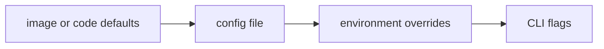

# Configuration Guide (v0.6)

## Precedence



## Primary files

- Source-mode controller defaults: `configs/controller.yaml`
- Controller-side target inventory: `configs/controller_targets.yaml`
- Source-mode collector defaults: `configs/collector.yaml`
- Container image defaults: `configs/container/controller.yaml`, `configs/container/controller_targets.yaml`, `configs/container/collector.yaml`
- Container stack env template: `.env.example`

## Why there are separate source and container configs

The source-mode configs keep local development predictable: loopback listeners, repo-relative paths, and direct execution assumptions.
The container configs change only what the runtime boundary changes:

- bind addresses move from loopback to `0.0.0.0`
- data paths move from repo-relative directories to mounted paths under `/var/lib/ai-sre-agent/...`
- the controller web path points at the web assets baked into the image
- the controller RAG dataset path points at the dataset copied into the controller image
- the controller target inventory path points at the collector inventory file shipped with or mounted into the image

This split avoids a common operational failure mode where one YAML file tries to serve both host-side development and container deployment, then quietly carries the wrong bind/path defaults into one of them.

## Collector primary path

The collector now has two primary low-level signal paths:

- `probe_core`: primary host/process/runtime telemetry
- `ebpf`: primary syscall/network/file/security/runtime event telemetry

`/proc` and sysfs remain compatibility fallbacks for the host telemetry path only.

Representative collector config:

```yaml
probe_core:
  enabled: true
  binary_path: "./build/sre-probe-core"   # container image uses /usr/local/bin/sre-probe-core
  args: ["--host-mode", "auto"]
  fallback_to_go: true

ebpf:
  enabled: true
  socket_path: "./data/collector/run/sre_collector_ebpf.sock"
  categories: ["syscall", "process", "network", "file", "security", "resource"]

security:
  enabled: true
  audit_interval: "5m"
  recent_event_limit: 128
  baseline_warmup_samples: 3
  max_walk_entries: 6000
  large_file_threshold_bytes: 104857600
  rapid_growth_threshold_bytes: 16777216
```

Design notes:

- `probe_core.enabled` should remain `true` in normal deployments.
- `probe_core.args=["--host-mode","auto"]` means “prefer kernel-oriented collectors first, then degrade to `/proc` only when necessary.”
- `probe_core.fallback_to_go` enables the compatibility host collector when probe-core cannot start or its IPC stream goes stale. It does not redefine the steady-state architecture.
- `ebpf` is started independently of the compatibility host collector so kernel-event telemetry remains available even when the Go fallback path never activates.
- `ebpf.socket_path` should point at a writable runtime directory. The shipped source config uses `./data/collector/run/...`; the container config uses `/var/lib/ai-sre-agent/collector/data/run/...`.
- If the eBPF runtime cannot start because the environment blocks the Unix socket or required capabilities, the collector now stays up in degraded mode instead of exiting. The degraded reason is emitted in collector runtime metrics.
- `security` is a collector-side audit module. It uses eBPF runtime events as the primary source for runtime/process/network/file security signals, uses probe-core process snapshots for resource correlation, and uses `/proc` plus bounded filesystem walks only for posture checks and compatibility gaps.
- Containerized host-observer deployments usually need additional capabilities/mounts to get the highest-fidelity kernel visibility.

### Collector cadence and adaptive polling

`collection_interval` is the baseline cadence for the main host telemetry loop. In `v0.6` the default remains `10s`, bounded by:

- `min_collection_interval`: `2s`
- `max_collection_interval`: `30s`

The collector no longer speeds up just because the host is idle. Instead:

- it backs off when collector CPU or spool backlog is high, to avoid turning the observer into part of the incident
- it temporarily tightens the interval when multiple pressure signals emerge and the collector still has headroom
- it returns to the configured baseline when the node is calm

That makes the cadence operational rather than cosmetic: more detail when an incident is starting, less self-inflicted pressure when the collector or transport path is stressed.

### Collector low-level source map

| Signal family | Primary source | Compatibility path | Why the split exists |
|---|---|---|---|
| host CPU/memory/process/runtime | probe-core (`perf`/netlink/sysinfo/PSI/cgroup) | Go host collector via `/proc` and sysfs | snapshots and counters are different from kernel event streams; keep the fast host path in probe-core |
| syscall/network/file/runtime events | dedicated eBPF runtime | synthetic `/proc/net/tcp` assist for a few degraded counters | event streams need a socket/ring-buffer style runtime, not a host metrics poller |
| GPU inventory/utilization/process attribution | probe-core dynamic NVML load | bounded `nvidia-smi` queries inside probe-core | NVML is closer to the driver/runtime boundary and exposes richer PCIe/BAR1/ECC/process state |
| security posture and drift | collector security audit fed by eBPF + probe-core | bounded `/proc` and filesystem posture scans | state drift and runtime behavior are different classes of evidence |

### GPU collection path

- probe-core refreshes GPU metrics on its own cadence (`gpu_interval_samples` inside probe-core).
- The collector does not treat the old Go GPU collector as the steady-state source anymore; the primary path is probe-core.
- Probe-core now attempts dynamic NVML loading first. If the NVIDIA management library is unavailable, it falls back to bounded `nvidia-smi` queries instead of blocking the sampling loop.
- Exported GPU metrics now include device inventory, SM/memory utilization, PCIe link state and throughput, BAR1 memory, ECC counters, and per-process GPU memory/context attribution.
- GPU process names are resolved opportunistically from `/proc/<pid>/comm` only for already-identified GPU-active PIDs. That is a small metadata read, not the main telemetry path.

### Tracing and event correlation path

- The eBPF runtime keeps recent event envelopes, but it also now exports bounded correlation aggregates:
  - category totals/rates/bytes/latency
  - remote endpoint scope totals/rates
  - sensitive-path class totals/rates
  - top per-process category totals/rates
- This is intentional. Raw event replay belongs in event buffers or external pipelines; controller and agent reasoning need bounded summaries that survive ingestion, indexing, and UI rendering without label explosion.

## Controller sections

| Key | Purpose |
|---|---|
| `listen`, `grpc_listen` | HTTP and gRPC bind addresses |
| `ingest` | retention bounds + embedded persistence |
| `tsdb` | optional controller-side InfluxDB durable trend store |
| `analysis` | threshold/stat/ML/correlation/LLM analysis knobs |
| `agent` | query and incident workflow behavior |
| `ha` | active/standby mode |
| `inventory` | collector inventory + heartbeat APIs |
| `kubernetes` | optional K8s inventory/topology |
| `orchestration` | scheduling/policy/status APIs |
| `gpu` | GPU aggregation/timeline/event store |
| `checks` | runtime checks endpoints |

## Ingest retention and persistence

```yaml
ingest:
  node_retention: "24h"
  history_samples_per_node: 1440
  max_nodes: 5000
  persistence:
    enabled: false
    path: "./data/controller/ingest/store.db"
    sync_interval: "5s"
    compaction_interval: "30m"
    max_db_size_bytes: 536870912
    compact_tx_max_size: 8388608
```

Containerized deployments normally keep the same logic but mount the path inside the controller data volume instead of the repo worktree.

## Controller-side TSDB

```yaml
tsdb:
  enabled: false
  provider: "influxdb"
  url: "http://127.0.0.1:8086"
  org: "ai-sre-agent"
  bucket: "controller_metrics"
  measurement: "telemetry_metric"
  retention: "168h"
  write_batch_size: 512
  write_queue_size: 256
  flush_interval: "2s"
  query_timeout: "5s"
  fallback_to_memory: true
  manage_bucket: false
```

Design notes:

- The collector intentionally has no DB dependency; durable time-series storage lives on the controller side only.
- `ingest` remains the hot cache and latest-state API source.
- `tsdb` is used for longer-window history reads by trend APIs and Agent workflows, with automatic memory fallback when unavailable.
- `SRE_TSDB_TOKEN` stays env-driven; do not commit it to YAML.

## Controller target inventory file

`configs/controller_targets.yaml` is a separate controller-side inventory of known collectors.

It stores:

- collector IDs
- hostnames and addresses
- ports
- labels/tags
- enabled/disabled state
- descriptive auth metadata

In the current push-first design, this file does not replace collector -> controller gRPC delivery. It complements it by giving the controller a stable list of expected collectors even before telemetry arrives.

Important keys:

| Key | Purpose |
|---|---|
| `id` | stable collector identifier used in inventory and policy scope |
| `hostname` / `address` / `port` | operator-maintained endpoint metadata |
| `enabled` | whether the collector should be considered part of the active estate |
| `labels` / `tags` | grouping, filtering, and future policy scoping |
| `auth.*` | descriptive transport/auth expectations for future reverse-dial or management flows |

## Container-first env model

The canonical container stack is env-driven. Copy `.env.example` to `.env` when using `docker compose` locally.

Important variables:

| Env var | Effect |
|---|---|
| `SRE_BIND_HOST` | host interface for published controller ports |
| `SRE_CONTROLLER_HTTP_PORT` | published controller UI/API port |
| `SRE_CONTROLLER_GRPC_PORT` | published controller ingest port |
| `SRE_DOCKER_NETWORK_MODE` | plain-docker fallback mode: `auto`, `bridge`, `host` |
| `REPO_URL` | optional alternate Git source for Docker image builds |
| `REPO_REF` | optional branch/tag/commit fetched from `REPO_URL` |
| `SRE_COLLECTOR_CONTROLLER_ENDPOINTS` | remote controller gRPC target for collector containers |
| `SRE_AGENT_RAG_ENABLED` | enable local-first RAG inside the controller image |
| `SRE_AGENT_RAG_REBUILD_POLICY` | RAG bootstrap behavior on startup |
| `SRE_AGENT_LLM_ENABLED` | enable external LLM calls |
| `SRE_AGENT_DRY_RUN` | keep action generation read-only by default |
| `SRE_CONTROLLER_CONFIG_FILE` | host-side mount path for `docker-run-controller.sh` |
| `SRE_CONTROLLER_TARGETS_MOUNT` | host-side mount path for controller target inventory |
| `SRE_COLLECTOR_CONFIG_FILE` | host-side mount path for `docker-run-collector.sh` |

## Useful environment overrides

| Env var | Effect |
|---|---|
| `SRE_COLLECTOR_PROBE_CORE_ENABLED` | enable/disable the primary probe-core host telemetry path |
| `SRE_COLLECTOR_PROBE_CORE_BINARY_PATH` | probe-core binary location |
| `SRE_COLLECTOR_PROBE_CORE_COLLECTORS` | explicit probe-core module selection |
| `SRE_COLLECTOR_PROBE_CORE_ARGS` | raw extra probe-core arguments (for example `--host-mode,auto`) |
| `SRE_COLLECTOR_PROBE_CORE_FALLBACK_TO_GO` | enable the compatibility Go host collector when probe-core is unavailable |
| `SRE_COLLECTOR_EBPF_SOCKET_PATH` | Unix socket used by the eBPF runtime |
| `SRE_COLLECTOR_EBPF_CATEGORIES` | event categories enabled in the eBPF runtime |
| `SRE_COLLECTOR_SECURITY_ENABLED` | enable collector-side structured security auditing |
| `SRE_COLLECTOR_SECURITY_AUDIT_INTERVAL` | cadence for security posture/drift scans |
| `SRE_COLLECTOR_SECURITY_RECENT_EVENT_LIMIT` | number of recent eBPF security/runtime events folded into findings |
| `SRE_COLLECTOR_SECURITY_BASELINE_WARMUP_SAMPLES` | minimum local observations before drift scoring becomes active |
| `SRE_COLLECTOR_SECURITY_MAX_WALK_ENTRIES` | bound on filesystem posture scans |
| `SRE_COLLECTOR_SECURITY_LARGE_FILE_THRESHOLD_BYTES` | size threshold for large-file findings |
| `SRE_COLLECTOR_SECURITY_RAPID_GROWTH_THRESHOLD_BYTES` | per-audit growth threshold for rapid file growth findings |
| `SRE_INGEST_NODE_RETENTION` | override `ingest.node_retention` |
| `SRE_INGEST_HISTORY_SAMPLES_PER_NODE` | override `ingest.history_samples_per_node` |
| `SRE_INGEST_MAX_NODES` | override `ingest.max_nodes` |
| `SRE_INGEST_PERSIST_ENABLED` | enable embedded persistence |
| `SRE_INGEST_PERSIST_PATH` | persistence file path |
| `SRE_INGEST_PERSIST_SYNC_INTERVAL` | persistence sync interval |
| `SRE_INGEST_PERSIST_COMPACTION_INTERVAL` | persistence compaction interval |
| `SRE_INGEST_PERSIST_MAX_DB_BYTES` | persistence size cap |
| `SRE_TSDB_ENABLED` | enable controller-side TSDB |
| `SRE_TSDB_PROVIDER` | TSDB backend selector (`influxdb`) |
| `SRE_TSDB_URL` | InfluxDB base URL |
| `SRE_TSDB_ORG` | InfluxDB org |
| `SRE_TSDB_BUCKET` | InfluxDB bucket |
| `SRE_TSDB_TOKEN` | InfluxDB token |
| `SRE_TSDB_MEASUREMENT` | measurement name used for durable metric writes |
| `SRE_TSDB_RETENTION` | desired retention window |
| `SRE_TSDB_WRITE_BATCH_SIZE` | async write batch size |
| `SRE_TSDB_WRITE_QUEUE_SIZE` | async in-memory queue size |
| `SRE_TSDB_FLUSH_INTERVAL` | write flush cadence |
| `SRE_TSDB_QUERY_TIMEOUT` | TSDB read/write timeout |
| `SRE_TSDB_FALLBACK_TO_MEMORY` | keep APIs/Agent readable when TSDB is unhealthy |
| `SRE_TSDB_MANAGE_BUCKET` | let controller create bucket when credentials allow |
| `SRE_ANALYSIS_ML_ANOMALY_ENABLED` | ML anomaly path on/off |
| `SRE_ANALYSIS_ML_METHOD` | ML method selector |
| `SRE_ANALYSIS_ML_SEASONAL_PERIOD` | seasonal period |
| `SRE_ANALYSIS_ML_SCORE_THRESHOLD` | anomaly score threshold |
| `SRE_ANALYSIS_CROSS_NODE_CORRELATION` | cross-node correlations on/off |
| `SRE_CONTROLLER_HA_ENABLED` | HA mode enabled |
| `SRE_CONTROLLER_HA_MODE` | `active` / `standby` |
| `SRE_AGENT_K8S_REMEDIATION_ENABLED` | allow controlled pod restart action |

## Deterministic workflow engine overrides

Joint-risk/RCA workflows use runtime env overrides (controller startup + workflow engine init):

| Env var | Effect |
|---|---|
| `SRE_AGENT_WORKFLOW_ENABLED` | enable/disable deterministic workflow engine |
| `SRE_AGENT_WORKFLOW_WINDOW` | default evaluation window (`45m`, `1h`, ...) |
| `SRE_AGENT_WORKFLOW_MAX_WINDOW` | max request window clamp |
| `SRE_AGENT_WORKFLOW_MAX_SAMPLES` | max metric samples consumed per run |
| `SRE_AGENT_WORKFLOW_MAX_SIGNALS` | cap ranked signal count in joint-risk output |
| `SRE_AGENT_WORKFLOW_MAX_HYPOTHESES` | cap ranked hypotheses in RCA output |
| `SRE_AGENT_WORKFLOW_AUDIT_RETENTION` | in-memory workflow audit record retention |
| `SRE_AGENT_WORKFLOW_DRY_RUN` | default dry-run mode for generated actions |
| `SRE_AGENT_WORKFLOW_REQUIRE_APPROVAL` | force approval gate on non-safe execution |
| `SRE_AGENT_WORKFLOW_ALLOW_PROFILING_EXEC` | allow profiling tool to run command |
| `SRE_AGENT_WORKFLOW_PROFILING_COMMAND` | profiling command template |
| `SRE_AGENT_WORKFLOW_INSIGHTS_ENABLED` | enable optional insights interface metadata |
| `SRE_AGENT_WORKFLOW_INSIGHTS_PROVIDER` | insights provider label |
| `SRE_AGENT_WORKFLOW_INSIGHTS_MODEL` | insights model label |
| `SRE_AGENT_WORKFLOW_INSIGHTS_API_KEY_ENV` | env var name to read insights API key from |
| `SRE_AGENT_WORKFLOW_HIGH_RISK_THRESHOLD` | `high` risk threshold |
| `SRE_AGENT_WORKFLOW_MEDIUM_RISK_THRESHOLD` | `medium` risk threshold |

## LLM provider and optional RAG overrides

| Env var | Effect |
|---|---|
| `SRE_AGENT_LLM_PROVIDER` | provider selector (`mock`/`stub`/`local_stub`/`openai`/`jimmynight`) |
| `SRE_AGENT_LLM_MODEL` | model name |
| `SRE_AGENT_LLM_BASE_URL` | provider base URL override |
| `SRE_AGENT_LLM_API_KEY` | primary API key env |
| `SRE_AGENT_JIMMYNIGHT_API_KEY` | JimmyNight-compatible API key env fallback |
| `SRE_AGENT_LLM_TIMEOUT` | request timeout |
| `SRE_AGENT_LLM_MAX_QUERY_CHARS` | query truncation limit |
| `SRE_AGENT_LLM_MAX_TOKENS` | output token cap |
| `SRE_AGENT_LLM_MAX_RETRIES` | retry count |
| `SRE_AGENT_LLM_RETRY_BASE` | retry base backoff |
| `SRE_AGENT_LLM_RETRY_MAX` | retry max backoff |
| `SRE_AGENT_LLM_RATE_LIMIT_RPS` | request-per-second limiter |
| `SRE_AGENT_LLM_RATE_BURST` | limiter burst |
| `SRE_AGENT_RAG_ENABLED` | enable the local-first dataset-backed RAG service |
| `SRE_AGENT_RAG_DATASET_PATH` | recursive dataset root (default `./dataset`) |
| `SRE_AGENT_RAG_SOURCE_PATHS` | optional comma-separated extra files/directories to ingest |
| `SRE_AGENT_RAG_INDEX_PATH` | persistent index path (default `./data/agent/rag/index.json`) |
| `SRE_AGENT_RAG_TOP_K` | retrieved hit count |
| `SRE_AGENT_RAG_MAX_SNIPPET_CHARS` | snippet truncation length |
| `SRE_AGENT_RAG_CHUNK_SIZE` | chunk size before indexing |
| `SRE_AGENT_RAG_CHUNK_OVERLAP` | overlap preserved between adjacent chunks |
| `SRE_AGENT_RAG_CHUNK_STRATEGY` | `auto`, `paragraph`, `markdown`, `line`, or `record` |
| `SRE_AGENT_RAG_RETRIEVAL_MODE` | `hybrid`, `lexical`, or `vector` |
| `SRE_AGENT_RAG_EMBEDDING_PROVIDER` | `local` by default, or an external provider label |
