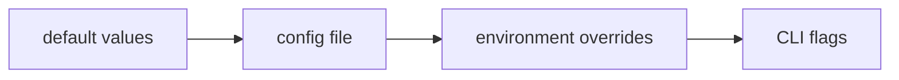

# Configuration Guide (v0.5)

## Precedence



## Primary files

- `configs/controller.yaml`
- `configs/collector.yaml`

## Controller sections

| Key | Purpose |
|---|---|
| `listen`, `grpc_listen` | HTTP and gRPC bind addresses |
| `ingest` | retention bounds + embedded persistence |
| `analysis` | threshold/stat/ML/correlation/LLM analysis knobs |
| `agent` | query and incident workflow behavior |
| `ha` | active/standby mode |
| `inventory` | collector inventory + heartbeat APIs |
| `kubernetes` | optional K8s inventory/topology |
| `orchestration` | scheduling/policy/status APIs |
| `gpu` | GPU aggregation/timeline/event store |
| `checks` | runtime checks endpoints |

## Ingest retention and persistence

```yaml
ingest:
  node_retention: "24h"
  history_samples_per_node: 1440
  max_nodes: 5000
  persistence:
    enabled: false
    path: "./data/controller/ingest/store.db"
    sync_interval: "5s"
    compaction_interval: "30m"
    max_db_size_bytes: 536870912
    compact_tx_max_size: 8388608
```

## Analysis ML and correlation knobs

```yaml
analysis:
  enabled: true
  interval: "30s"
  threshold_alerts: true
  anomaly_detection: true
  ml_anomaly_detection: true
  ml_method: "seasonal_baseline"
  ml_seasonal_period: 12
  ml_score_threshold: 3.0
  correlation_analysis: true
  cross_node_correlation: true
  llm_enabled: false
  llm_provider: "openai"
  llm_model: "gpt-4o-mini"
```

## HA mode

```yaml
ha:
  enabled: false
  mode: "active"   # active | standby
```

When `mode=standby`, controller remains API-readable but mutation paths are blocked.

## Collector sections

| Key | Purpose |
|---|---|
| `controller_endpoints` | gRPC destination(s) |
| `collection_interval` | base collection interval |
| `adaptive_polling` | dynamic interval adjustment |
| `spool_dir`, `spool_max_bytes` | local durability and cap |
| `transport` | retry/timeout/TLS settings |
| `probe_core` | C++ kernel-first collector integration |
| `ebpf` | optional eBPF event input |

## Probe-core tuning baseline

```yaml
probe_core:
  enabled: true
  args:
    - --host-mode
    - auto
    - --max-interval-ms
    - "5000"
    - --process-interval-samples
    - "2"
    - --host-proc-fallback-interval-samples
    - "10"
    - --netlink-interval-samples
    - "2"
```

## Useful environment overrides

| Env var | Effect |
|---|---|
| `SRE_INGEST_NODE_RETENTION` | override `ingest.node_retention` |
| `SRE_INGEST_HISTORY_SAMPLES_PER_NODE` | override `ingest.history_samples_per_node` |
| `SRE_INGEST_MAX_NODES` | override `ingest.max_nodes` |
| `SRE_INGEST_PERSIST_ENABLED` | enable embedded persistence |
| `SRE_INGEST_PERSIST_PATH` | persistence file path |
| `SRE_INGEST_PERSIST_SYNC_INTERVAL` | persistence sync interval |
| `SRE_INGEST_PERSIST_COMPACTION_INTERVAL` | persistence compaction interval |
| `SRE_INGEST_PERSIST_MAX_DB_BYTES` | persistence size cap |
| `SRE_ANALYSIS_ML_ANOMALY_ENABLED` | ML anomaly path on/off |
| `SRE_ANALYSIS_ML_METHOD` | ML method selector |
| `SRE_ANALYSIS_ML_SEASONAL_PERIOD` | seasonal period |
| `SRE_ANALYSIS_ML_SCORE_THRESHOLD` | anomaly score threshold |
| `SRE_ANALYSIS_CROSS_NODE_CORRELATION` | cross-node correlations on/off |
| `SRE_CONTROLLER_HA_ENABLED` | HA mode enabled |
| `SRE_CONTROLLER_HA_MODE` | `active` / `standby` |
| `SRE_AGENT_K8S_REMEDIATION_ENABLED` | allow controlled pod restart action |

## Deterministic workflow engine overrides

Joint-risk/RCA workflows use runtime env overrides (controller startup + workflow engine init):

| Env var | Effect |
|---|---|
| `SRE_AGENT_WORKFLOW_ENABLED` | enable/disable deterministic workflow engine |
| `SRE_AGENT_WORKFLOW_WINDOW` | default evaluation window (`45m`, `1h`, ...) |
| `SRE_AGENT_WORKFLOW_MAX_WINDOW` | max request window clamp |
| `SRE_AGENT_WORKFLOW_MAX_SAMPLES` | max metric samples consumed per run |
| `SRE_AGENT_WORKFLOW_MAX_SIGNALS` | cap ranked signal count in joint-risk output |
| `SRE_AGENT_WORKFLOW_MAX_HYPOTHESES` | cap ranked hypotheses in RCA output |
| `SRE_AGENT_WORKFLOW_AUDIT_RETENTION` | in-memory workflow audit record retention |
| `SRE_AGENT_WORKFLOW_DRY_RUN` | default dry-run mode for generated actions |
| `SRE_AGENT_WORKFLOW_REQUIRE_APPROVAL` | force approval gate on non-safe execution |
| `SRE_AGENT_WORKFLOW_ALLOW_PROFILING_EXEC` | allow profiling tool to run command |
| `SRE_AGENT_WORKFLOW_PROFILING_COMMAND` | profiling command template |
| `SRE_AGENT_WORKFLOW_INSIGHTS_ENABLED` | enable optional insights interface metadata |
| `SRE_AGENT_WORKFLOW_INSIGHTS_PROVIDER` | insights provider label |
| `SRE_AGENT_WORKFLOW_INSIGHTS_MODEL` | insights model label |
| `SRE_AGENT_WORKFLOW_INSIGHTS_API_KEY_ENV` | env var name to read insights API key from |
| `SRE_AGENT_WORKFLOW_HIGH_RISK_THRESHOLD` | `high` risk threshold |
| `SRE_AGENT_WORKFLOW_MEDIUM_RISK_THRESHOLD` | `medium` risk threshold |

## LLM provider and optional RAG overrides

| Env var | Effect |
|---|---|
| `SRE_AGENT_LLM_PROVIDER` | provider selector (`mock`/`stub`/`local_stub`/`openai`/`jimmynight`) |
| `SRE_AGENT_LLM_MODEL` | model name |
| `SRE_AGENT_LLM_BASE_URL` | provider base URL override |
| `SRE_AGENT_LLM_API_KEY` | primary API key env |
| `SRE_AGENT_JIMMYNIGHT_API_KEY` | JimmyNight-compatible API key env fallback |
| `SRE_AGENT_LLM_TIMEOUT` | request timeout |
| `SRE_AGENT_LLM_MAX_QUERY_CHARS` | query truncation limit |
| `SRE_AGENT_LLM_MAX_TOKENS` | output token cap |
| `SRE_AGENT_LLM_MAX_RETRIES` | retry count |
| `SRE_AGENT_LLM_RETRY_BASE` | retry base backoff |
| `SRE_AGENT_LLM_RETRY_MAX` | retry max backoff |
| `SRE_AGENT_LLM_RATE_LIMIT_RPS` | request-per-second limiter |
| `SRE_AGENT_LLM_RATE_BURST` | limiter burst |
| `SRE_AGENT_RAG_ENABLED` | enable local retriever wiring |
| `SRE_AGENT_RAG_INDEX_PATH` | local index path (default `var/rag/index.json`) |
| `SRE_AGENT_RAG_DOC_PATHS` | comma-separated source docs to index |
| `SRE_AGENT_RAG_TOP_K` | retrieved snippet count |
| `SRE_AGENT_RAG_MAX_SNIPPET_CHARS` | snippet truncation length |

## Secret handling

- Keep secrets only in environment variables (`SRE_AGENT_LLM_API_KEY`, webhook tokens, API bearer tokens).
- Do not commit real tokens or keys to YAML/env example files.
