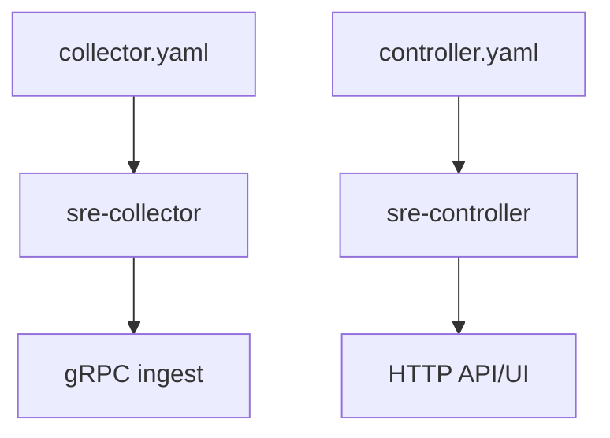

# Configuration Guide (v0.4)

## Config Sources and Precedence
```mermaid
flowchart LR
    A[defaults in DefaultConfig()] --> B[file config yaml]
    B --> C[env overrides]
    C --> D[CLI flag overrides]
```

## Primary Config Files
- controller: `configs/controller.yaml`
- collector: `configs/collector.yaml`

## Controller Key Blocks
| Block | Purpose | Default |
|---|---|---|
| `listen` | HTTP bind | `:8080` (file uses loopback) |
| `grpc_listen` | ingest gRPC bind | `:9090` (file uses loopback) |
| `analysis` | anomaly/threshold/correlation + optional LLM | enabled |
| `orchestration` | workload queueing/scheduling | enabled |
| `inventory` | static + heartbeat probe inventory | enabled |
| `kubernetes` | read-only cluster discovery | disabled |
| `agent` | report/query/action plane | enabled |
| `gpu` | GPU aggregation + persistence | enabled |
| `checks` | external dependency checks | disabled |
| `incidents` | external alert context orchestration | enabled |

## Collector Key Blocks
| Block | Purpose | Default |
|---|---|---|
| `controller_endpoints` | gRPC target list | `localhost:9090` |
| `collection_interval` | base polling interval | `10s` |
| `adaptive_polling` | pressure-aware interval adjustment | `true` |
| `spool_dir` / `spool_max_bytes` | durable queue path and cap | `./data/collector/spool`, `128MiB` |
| `transport` | dial/rpc timeout + optional TLS/mTLS | TLS disabled |
| `probe_core` | optional C++ probe source | disabled |
| `ebpf` | optional event socket ingestion | disabled |
| `metrics_listen_address` | collector Prometheus endpoint | `:9464` in sample config |

## Runtime Diagram


## CLI Overrides
### `sre-controller`
- `--config`
- `--listen`
- `--grpc-listen`
- `--web-path`
- `--nodes`
- `--log-level`, `--log-format`

### `sre-collector`
- `--config`
- `--level`
- `--interval`
- `--endpoint` (repeatable)
- `--metrics-listen`
- `--log-level`, `--log-format`

## High-Impact Environment Overrides
### Controller
- `SRE_CONTROLLER_CONFIG`
- `SRE_CONTROLLER_HTTP_LISTEN`
- `SRE_CONTROLLER_GRPC_LISTEN`
- `SRE_CONTROLLER_WEB_PATH`
- `SRE_AGENT_CONTROLLER_API_KEY` (when auth enabled)

### Collector
- `SRE_COLLECTOR_CONFIG`
- `SRE_COLLECTOR_CONTROLLER_ENDPOINTS`
- `SRE_COLLECTOR_ID`
- `SRE_COLLECTOR_HOSTNAME`
- `SRE_COLLECTOR_SPOOL_DIR`

## Validation Workflow
```bash
make build
curl -sS http://127.0.0.1:8080/api/v1/status
curl -sS http://127.0.0.1:8080/api/v1/ingest/schema
```
