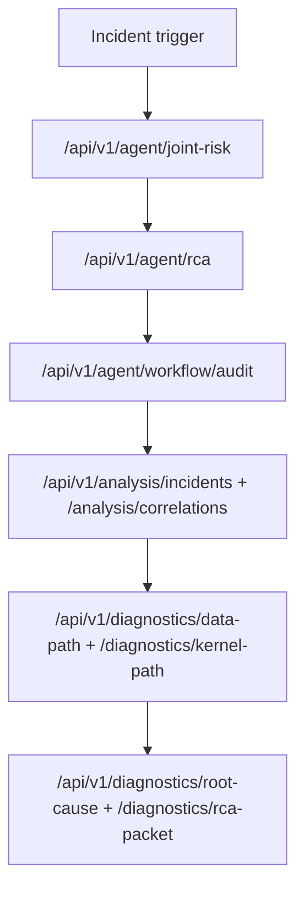

# RCA Playbook (v0.6)

## Goal
Drive incident triage from measured signals to a reproducible root-cause record using existing diagnostics APIs.

## RCA Workflow


## Step-by-Step
1. Confirm runtime health.
```bash
curl -sS http://127.0.0.1:8080/api/v1/status
curl -sS http://127.0.0.1:8080/api/v1/ingest/status
```

2. Run deterministic joint-risk scoring for the incident window.
```bash
curl -sS "http://127.0.0.1:8080/api/v1/agent/joint-risk?collector_id=<id>&window=45m&limit=3"
```

3. Generate structured RCA workflow output (hypotheses + evidence + guarded recommendations).
```bash
curl -sS "http://127.0.0.1:8080/api/v1/agent/rca?collector_id=<id>&window=45m&limit=3&trigger=incident_alert"
```

4. Inspect workflow/tool audit trail for replayability.
```bash
curl -sS "http://127.0.0.1:8080/api/v1/agent/workflow/audit?limit=50"
```

5. Identify dominant processes and resource categories.
```bash
curl -sS "http://127.0.0.1:8080/api/v1/top/programs?limit=20"
```

6. Pull analysis-layer conclusions first (classification + evidence).
```bash
curl -sS "http://127.0.0.1:8080/api/v1/analysis/status"
curl -sS "http://127.0.0.1:8080/api/v1/analysis/incidents?collector_id=<id>&limit=5"
curl -sS "http://127.0.0.1:8080/api/v1/analysis/correlations?collector_id=<id>"
curl -sS "http://127.0.0.1:8080/api/v1/analysis/anomalies"
```

7. Pull diagnostics chain.
```bash
curl -sS "http://127.0.0.1:8080/api/v1/diagnostics/data-path?collector_id=<id>"
curl -sS "http://127.0.0.1:8080/api/v1/diagnostics/kernel-path?collector_id=<id>"
curl -sS "http://127.0.0.1:8080/api/v1/diagnostics/root-cause?collector_id=<id>"
```

8. Generate portable RCA packet.
```bash
curl -sS "http://127.0.0.1:8080/api/v1/diagnostics/rca-packet?collector_id=<id>&format=markdown&download=1"
```

## Evidence Checklist
- incident time window and affected collector IDs
- analysis incident classification, confidence, and supporting signals
- top resource categories from `/top/programs`
- data-path and kernel-path evidence used by root-cause output
- relevant logs (`/api/v1/logs/search`) and GPU events (`/api/v1/gpu/events`) when applicable

## Safe Remediation Rules
- prefer reversible mitigations first;
- avoid changing multiple subsystems at once;
- record metric impact before and after action;
- for AGENT execution paths, keep approval controls enabled.
