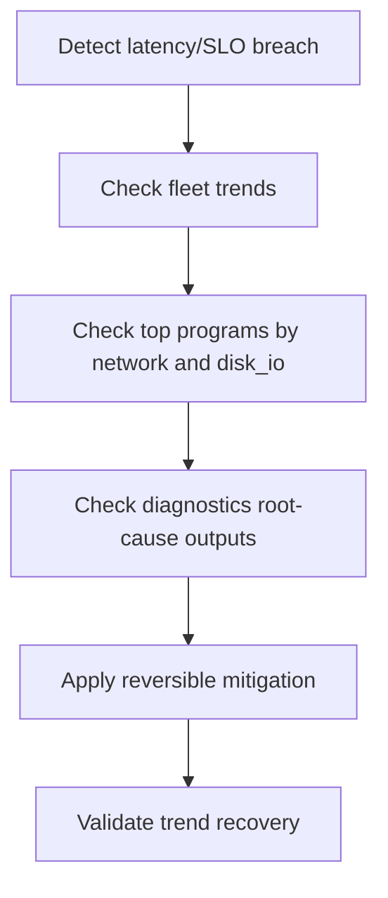

# RDMA and Storage Operations Playbook (v0.7)

## Scope
Targets incidents where RDMA/network pressure and storage pressure appear together in fleet telemetry.

## Signal Groups
- RDMA/network pressure:
  - `node_rdma_errors_per_second`
  - `node_rdma_congestion_events_per_second`
  - `node_tcp_retransmit_ratio`
  - `node_softnet_dropped_per_second`
- Storage pressure:
  - `node_disk_total_iops_per_second`
  - `node_disk_queue_depth_total`
  - `node_disk_utilization_peak_percent`
  - `node_disk_avg_request_latency_seconds`

## Triage Flow


## 中文说明

- RDMA/network 和 storage 被放在同一份 playbook，不是因为它们属于同一个子系统，而是因为训练、checkpoint、远端数据装载这类场景里，这两类压力常常一起出现。
- 这张图强调“先看趋势，再看归因，再做动作”。原因是很多问题表面上像网络抖动，实际上是存储队列把上游拖慢，或者反过来。
- `Apply reversible mitigation` 被单独列出来，是提醒操作者优先做可回退动作。复合型性能事件里，过早做不可逆调整很容易把现场进一步污染。

## Command Set
```bash
# fleet trend window
curl -sS "http://127.0.0.1:8080/api/v1/fleet/timeseries?collector_id=<id>&window=30m"

# process ranking
curl -sS "http://127.0.0.1:8080/api/v1/top/programs?collector_id=<id>&limit=20"

# diagnostics chain
curl -sS "http://127.0.0.1:8080/api/v1/diagnostics/workload-path?collector_id=<id>"
curl -sS "http://127.0.0.1:8080/api/v1/diagnostics/root-cause?collector_id=<id>"
```

## Mitigation Ordering
1. Throttle or defer non-critical batch workloads.
2. Reduce contention from top offending processes identified in `disk_io` and `network` categories.
3. Re-check queue depth, retransmit ratio, and latency metrics before broader changes.

## Exit Criteria
- queue depth and retransmit ratios return toward baseline;
- root-cause output severity drops;
- no sustained increase in ingest reject or log error rates.
