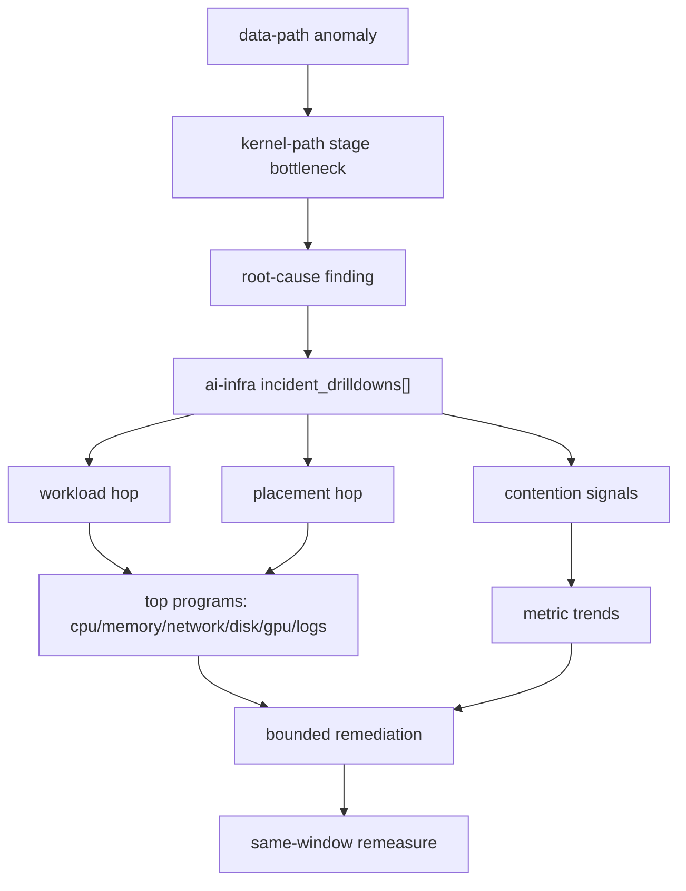

# RDMA + Storage Operations Playbook

Production playbook for ultra-low-latency GPU fabrics and high-throughput training/inference data paths.

## 1. Scope

- RDMA/RoCE/InfiniBand fabric health and congestion control.
- NCCL/collective communication pressure patterns at node and cluster level.
- Distributed storage throughput and latency for dataset read, cache fill, and checkpoint write paths.

## 2. SLO Baseline (starting point)

Tune these per hardware generation and workload class.

| Domain | SLI | Target | Page threshold |
|---|---|---|---|
| RDMA fabric | `node_rdma_port_transmit_bytes_per_second` + `node_rdma_port_receive_bytes_per_second` skew | balanced within 20% for symmetric collective phases | imbalance > 35% for 5m |
| RDMA reliability | `node_rdma_errors_per_second` | near-zero steady-state | > 0 for 3 consecutive intervals |
| Congestion | `node_rdma_congestion_events_per_second`, `node_rdma_pfc_pause_frames_per_second`, `node_rdma_ecn_marked_ratio` | bounded burst, no sustained growth | sustained non-zero 10m + rising retransmit ratio |
| Network loss recovery | `node_tcp_retransmit_ratio` | < 0.5% | > 1% for 5m |
| Storage latency | `node_disk_request_latency_p99_seconds` | workload-specific, typically < 20ms | > 40ms for 5m |
| NVMe path | `node_nvme_utilization_peak_percent` + `node_nvme_queue_depth_total` | headroom > 20% | > 90% util and deep queue 5m |
| Data pipeline | `node_dataloader_prefetch_stall_ratio` | < 5% | > 15% for 10m |
| Object/checkpoint | `node_object_storage_get_latency_p99_seconds`, `node_checkpoint_write_latency_p99_seconds` | stable baseline | > 2x baseline for 10m |

## 3. On-call workflow (SMART START)

Run in this order:

```bash
# S/M
curl -s http://127.0.0.1:8080/api/v1/status
curl -s http://127.0.0.1:8080/api/v1/ingest/status

# A/R
curl -s "http://127.0.0.1:8080/api/v1/fleet/timeseries?collector_id=<collector>&window=1h&limit=360"
curl -s "http://127.0.0.1:8080/api/v1/top/programs?collector_id=<collector>&limit=30"

# T/S/T
curl -s "http://127.0.0.1:8080/api/v1/diagnostics/data-path?collector_id=<collector>"
curl -s "http://127.0.0.1:8080/api/v1/diagnostics/kernel-path?collector_id=<collector>"
curl -s "http://127.0.0.1:8080/api/v1/diagnostics/root-cause?collector_id=<collector>"
curl -s "http://127.0.0.1:8080/api/v1/diagnostics/workload-path?cluster=<cluster>&namespace=<ns>"
curl -s "http://127.0.0.1:8080/api/v1/fleet/<collector>"
curl -s "http://127.0.0.1:8080/api/v1/topology?collector_id=<collector>"
```

Use `Data Path Diagnostics` -> `Open trends` plus `/diagnostics/kernel-path` and `/diagnostics/root-cause` findings to jump directly into focused curve and process ranking.

Troubleshooting graph (implemented workflow):



## 4. RDMA diagnostics guide

Primary signals:

- Load: `node_network_utilization_peak_percent`, `node_network_interface_tx_queue_fill_percent`
- Loss/recovery: `node_tcp_retransmit_ratio`, `node_softnet_dropped_per_second`
- Fabric pressure: `node_rdma_congestion_events_per_second`, `node_rdma_pfc_pause_frames_per_second`, `node_rdma_ecn_marked_ratio`
- Device errors: `node_rdma_errors_per_second`, `node_rdma_port_errors_per_second`
- Imbalance: compare `node_rdma_port_transmit_bytes_per_second` vs `node_rdma_port_receive_bytes_per_second`

Typical root-cause patterns:

- **Oversubscription**: high utilization + queue fill + ECN/PFC growth.
- **Faulty link/NIC**: rising RDMA errors localized to one node/port.
- **Collective imbalance**: persistent tx/rx skew and single-rank hotspot process.
- **CPU receive-path saturation**: softnet drops/squeezed with interrupt spikes.

## 5. Distributed storage diagnostics guide

Primary signals:

- Device pressure: `node_disk_utilization_peak_percent`, `node_disk_queue_depth_total`, `node_disk_request_latency_p99_seconds`
- NVMe tier: `node_nvme_utilization_peak_percent`, `node_nvme_queue_depth_total`, `node_nvme_avg_request_latency_seconds`
- Metadata/small-file stress: `node_storage_metadata_latency_p99_seconds`, `node_storage_small_io_ratio`
- Pipeline stalls: `node_dataloader_prefetch_stall_ratio`, `node_cache_hit_ratio`
- Remote path latency: `node_object_storage_get_latency_p99_seconds`, `node_object_storage_put_latency_p99_seconds`
- Checkpoint path: `node_checkpoint_write_latency_p99_seconds`

Typical root-cause patterns:

- **Metadata bottleneck**: metadata latency spike + small-IO ratio increase.
- **Cache miss storm**: low cache hit ratio + object-store GET latency growth.
- **Checkpoint contention**: checkpoint latency spike aligned with training step boundaries.
- **Local NVMe saturation**: high utilization and queue depth with p99 latency drift.
- **Scheduler contention coupled with I/O**: `cpu_iowait_percent` + `procs_blocked` + `cpu_pressure_some_avg10` rise together during storage bursts.

## 6. Mitigation order (safe first)

1. Reduce blast radius: rebalance jobs away from worst nodes.
2. Isolate noisy workloads: cap concurrency / batch size for top offending job.
3. Shift checkpoint schedule or stripe targets to reduce synchronized bursts.
4. Tune data-loader prefetch and file batching for small-file dominated datasets.
5. Escalate infra action (fabric reroute, NIC replacement, storage backend scale-out) with change controls.

Always re-measure with the same metrics and same time window after each action.

## 7. Implementation notes

- Collector/controller diagnostics already compute per-node network/storage pressure ranking and anomaly detection via `/api/v1/diagnostics/data-path`.
- Kernel stack-stage bottlenecks are exposed by `/api/v1/diagnostics/kernel-path` (page cache, block layer, NIC/NAPI/TCP/RDMA path stages).
- Cross-layer RCA hypotheses and evidence/action hints are exposed by `/api/v1/diagnostics/root-cause` (including `scheduler_contention_tail_latency` when run-queue and iowait signals align).
- Workload/service spread and per-node mapped risk flags are exposed by `/api/v1/diagnostics/workload-path`.
- Additional RDMA/storage pipeline signals are optional: they should be emitted by probe sidecars, eBPF agents, or native probe-core components when available.
- Keep probe overhead bounded; prioritize counter-based kernel/device reads over high-frequency tracing in steady state.
