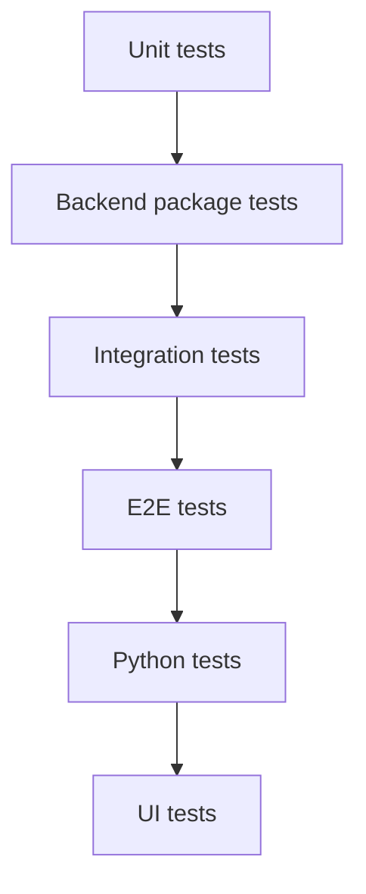

# Testing Manual (v0.4)

## Test Layers


## Core Commands
```bash
# backend-focused
make test
make test-all
make test-race
make test-cover

# full stability workflow
make test-stability

# browser-based UI checks
make test-ui
```

## Recommended Developer Sequence
1. `make fmt-check`
2. `make vet`
3. `make test`
4. If API or UI changed: `make test-stability` and `make test-ui`

## Runtime Sanity Checks After Tests
```bash
curl -sS http://127.0.0.1:8080/healthz
curl -sS http://127.0.0.1:8080/api/v1/ingest/status
curl -sS http://127.0.0.1:8080/api/v1/logs/status
```

## Failure Triage Hints
- transport/spool failures: inspect collector logs for send/retry/ack errors.
- ingest validation failures: inspect `/api/v1/ingest/status` reject counters.
- log query regressions: inspect `/api/v1/logs/status` segment/entry/query counters.
- GPU API regressions: verify `gpu.enabled` and collector GPU metrics availability.
