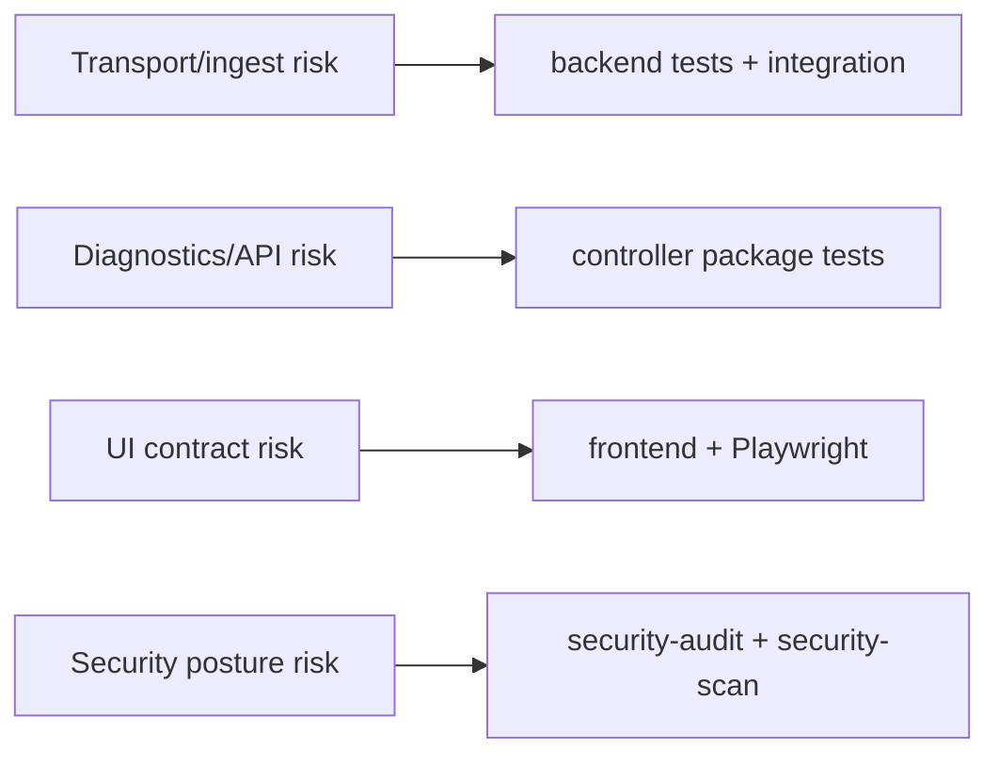

# Testing Strategy (v0.4)

## Objectives
- keep collector-to-controller delivery correct under failure and recovery;
- prevent regressions in diagnostics and API contracts;
- preserve bounded resource behavior in log and GPU subsystems.

## Risk-Oriented Strategy


## Required Coverage by Change Type
| Change Type | Minimum Required Checks |
|---|---|
| collector transport/spool | `make test`, targeted collector package tests |
| ingest/logindex/gpu store | `make test`, controller package tests |
| API contract changes | `make test`, update `docs/reference/api.md`, run relevant integration tests |
| frontend pages consuming APIs | `make test-ui` and frontend tests |
| security-sensitive changes | `make security-audit` (and `make security-scan` in CI) |

## CI-Oriented Command Set
```bash
make fmt-check
make vet
make test-stability
make security-audit
```

## Local Pre-PR Baseline
```bash
make fmt-check
make vet
make test
```
