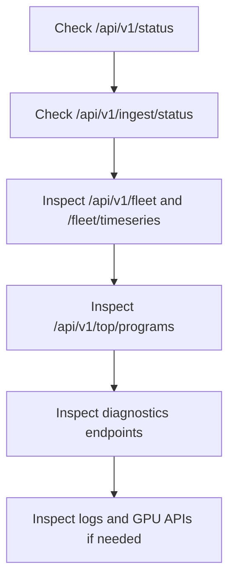

# Operations Usage (v0.4)

## Start and Stop
```bash
# local stack
./scripts/run-local.sh

# local multi-node
./scripts/run-local-multinode.sh --collectors 3

# stop with Ctrl+C (scripts trap and terminate child processes)
```

## Health and Status Checks
```bash
curl -sS http://127.0.0.1:8080/healthz
curl -sS http://127.0.0.1:8080/api/v1/status
curl -sS http://127.0.0.1:8080/api/v1/ingest/status
curl -sS http://127.0.0.1:8080/api/v1/fleet
```

## Daily Triage Flow


## Diagnostics Endpoints Used in Triage
- `GET /api/v1/diagnostics/data-path`
- `GET /api/v1/diagnostics/kernel-path`
- `GET /api/v1/diagnostics/root-cause`
- `GET /api/v1/diagnostics/workload-path`
- `GET /api/v1/diagnostics/rca-packet`
- `GET /api/v1/diagnostics/ai-infra-stack`

## Logs Workflow
```bash
# index status
curl -sS http://127.0.0.1:8080/api/v1/logs/status

# search recent errors
curl -sS "http://127.0.0.1:8080/api/v1/logs/search?level=error&window=30m&limit=100"

# ingest service logs
curl -sS -X POST http://127.0.0.1:8080/api/v1/logs/ingest \
  -H 'Content-Type: application/json' \
  -d '{"service":"checkout","entries":[{"message":"timeout","level":"error"}]}'
```

## GPU Workflow
```bash
curl -sS http://127.0.0.1:8080/api/v1/gpu/nodes
curl -sS "http://127.0.0.1:8080/api/v1/gpu/timeline?collector_id=<id>&gpu_id=0&metric=node_gpu_utilization_sm_percent&window=1h"
curl -sS "http://127.0.0.1:8080/api/v1/gpu/events?collector_id=<id>&gpu_id=0&window=1h"
```

## Optional Module Checks
- analysis: `GET /api/v1/analysis/status`
- agent: `GET /api/v1/agent/status`
- orchestration: `GET /api/v1/orchestration/status`
- inventory: `GET /api/v1/inventory/status`
- k8s: `GET /api/v1/k8s/status`
- checks: `GET /api/v1/checks`
