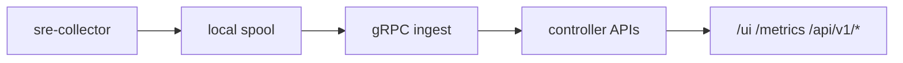
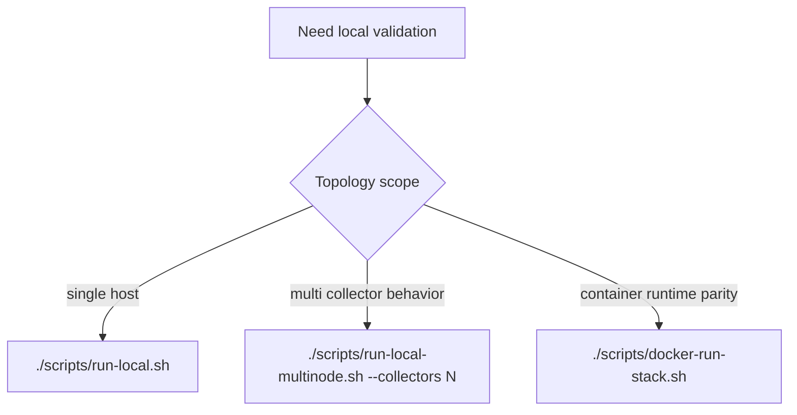

# Quickstart (v0.4)

## Prerequisites
- Go toolchain for backend build (`make build`).
- Node.js for frontend build (optional but recommended for `/ui`).
- Linux environment for full collector signal coverage (`/proc`, `/sys`, GPU paths).

## 1) Local Single-Node Run (Recommended)
```bash
make build
./scripts/run-local.sh
```

Default outputs:
- UI and APIs: `http://127.0.0.1:8080/`
- Fleet snapshot: `http://127.0.0.1:8080/api/v1/fleet`
- Controller metrics: `http://127.0.0.1:8080/metrics`

## 2) Multi-Collector Local Topology
```bash
make build
./scripts/run-local-multinode.sh --collectors 3
```

Useful endpoints:
- inventory probes: `GET /api/v1/inventory/probes`
- top programs: `GET /api/v1/top/programs?limit=20`

## 3) Docker Stack
```bash
./scripts/docker-run-stack.sh
# stop
./scripts/docker-stop-stack.sh
```

## 4) Enable AGENT APIs
```bash
./scripts/run-local.sh --enable-agent --agent-env ./configs/agent.env
```

Query endpoint:
- `POST /api/v1/agent/query`

Execute endpoint:
- `POST /api/v1/agent/execute`

## 5) Optional Probe-Core
Set `probe_core.enabled: true` in `configs/collector.yaml`, build `sre-probe-core`, then run collector.

## 6) Optional Kubernetes Integration
Set `kubernetes.enabled: true` in `configs/controller.yaml` and provide cluster targets.

## Runtime Flow


## Run Mode Selection


## Smoke Validation
```bash
curl -sS http://127.0.0.1:8080/healthz
curl -sS http://127.0.0.1:8080/api/v1/status
curl -sS http://127.0.0.1:8080/api/v1/ingest/status
curl -sS http://127.0.0.1:8080/api/v1/fleet
```
