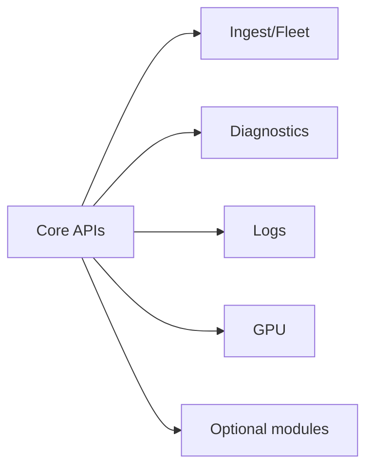
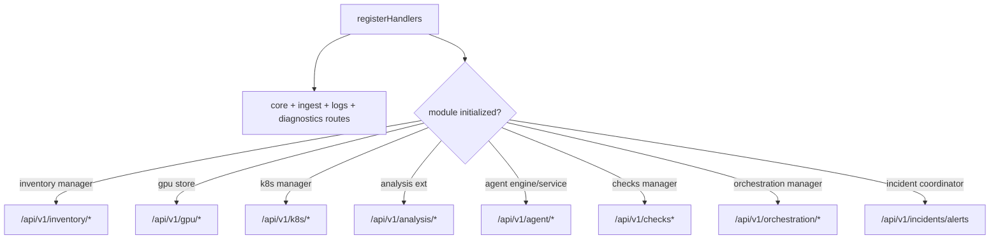
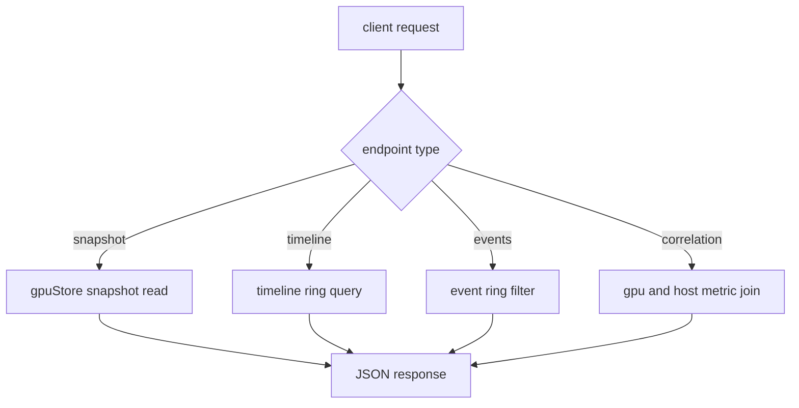

# API Reference (v0.4)

## Conventions
- JSON APIs are under `/api/v1/*` unless noted.
- CORS headers are applied for registered API handlers.
- When controller auth is enabled, send `Authorization: Bearer <key>`.

## Endpoint Topology


## Registration Logic


## Core Endpoints
| Method | Path | Notes |
|---|---|---|
| GET, POST | `/api/v1/nodes` | pull-mode node config/status list and mutation |
| GET, DELETE | `/api/v1/nodes/{id}` | pull-mode node details/removal |
| GET | `/api/v1/metrics` | pull-mode aggregated metrics |
| GET | `/api/v1/metrics/{id}` | pull-mode per-node metrics |
| GET | `/api/v1/metrics/history` | pull-mode history samples (`node`, `limit`) |
| GET | `/api/v1/top/programs` | cross-resource process ranking |
| GET | `/api/v1/topology` | topology snapshot |
| GET | `/api/v1/status` | controller status summary |
| GET | `/health`, `/healthz` | health checks |
| GET | `/metrics` | Prometheus output |

## Ingest and Fleet
| Method | Path | Notes |
|---|---|---|
| GET | `/api/v1/ingest/status` | ingest/log counters and fleet node count |
| GET | `/api/v1/ingest/schema` | batch validation limits |
| GET | `/api/v1/fleet` | push-ingested collector snapshots |
| GET | `/api/v1/fleet/{collector_id}` | one collector snapshot |
| GET | `/api/v1/fleet/timeseries` | trend series (`collector_id`, `window`, `limit`, `metric`) |

## Logs
| Method | Path | Notes |
|---|---|---|
| GET | `/api/v1/logs/status` | log index health |
| GET | `/api/v1/logs/search` | structured search (`q`, `collector_id`, `service`, `level`, `window`, `limit`, ...) |
| POST | `/api/v1/logs/ingest` | service log ingest (body and entry limits enforced) |

## Diagnostics
| Method | Path |
|---|---|
| GET | `/api/v1/diagnostics/data-path` |
| GET | `/api/v1/diagnostics/kernel-path` |
| GET | `/api/v1/diagnostics/root-cause` |
| GET | `/api/v1/diagnostics/workload-path` |
| GET | `/api/v1/diagnostics/rca-packet` |
| GET | `/api/v1/diagnostics/ai-infra-stack` |

## GPU
| Method | Path |
|---|---|
| GET | `/api/v1/gpu/nodes` |
| GET | `/api/v1/gpu/nodes/{collector_id}` |
| GET | `/api/v1/gpu/timeline` |
| GET | `/api/v1/gpu/process-timeline` |
| GET | `/api/v1/gpu/events` |
| GET | `/api/v1/gpu/processes` |
| GET | `/api/v1/gpu/correlation` |
| GET | `/api/v1/k8s/gpu/nodes` |

### GPU Query Flow


### GPU Endpoint Parameters and Defaults
| Endpoint | Required params | Optional params | Defaults and caps |
|---|---|---|---|
| `GET /api/v1/gpu/timeline` | `gpu_id` | `collector_id`, `collector`, `metric`, `window`, `limit` | `metric=node_gpu_utilization_sm_percent`, `limit=240` (cap `2000`), `collector_id` defaults to most recently seen collector |
| `GET /api/v1/gpu/process-timeline` | `gpu_id`, `pid` | `collector_id`, `collector`, `metric`, `window`, `limit` | `metric=node_gpu_process_sm_util_percent`, `limit=240` (cap `2000`) |
| `GET /api/v1/gpu/events` | none | `collector_id`, `collector`, `gpu_id`, `severity`, `window`, `limit` | `limit=200` (cap `2000`), collector defaults to most recently seen collector |
| `GET /api/v1/gpu/processes` | `gpu_id` | `collector_id`, `collector`, `sort_by`, `limit` | `limit=20` (cap `200`) |
| `GET /api/v1/gpu/correlation` | none | `collector_id`, `collector` | collector defaults to most recently seen collector; returns `404` if no matching collector |

### GPU API Response Notes
- `GET /api/v1/gpu/nodes` returns `{nodes, count, timestamp}` where each node includes devices and recent events.
- `GET /api/v1/gpu/nodes/{collector_id}` returns a single node snapshot and `404` if missing.
- Timeline endpoints return compact `{timestamp, value}` arrays, filtered by `window` and trimmed by `limit`.
- `GET /api/v1/gpu/processes` supports sort aliases:
  - SM: `sm`, `sm_util`, `util_sm`, `gpu_util`
  - Memory util: `mem_util`, `gpu_mem_util`
  - Encoder: `enc`, `encoder`, `encoder_util`
  - Decoder: `dec`, `decoder`, `decoder_util`
  - Context: `context`, `context_active`
  - default sort: memory usage (`mem_mib`)
- `GET /api/v1/gpu/correlation` returns:
  - `gpu` aggregate: utilization, memory pressure, PCIe pressure, event totals, context totals
  - `host_pressure`: iowait, disk/network utilization, disk latency p99, TCP retransmit ratio
  - `scores`: starvation, communication, reliability, and weighted overall risk
  - `risks`: threshold-based human-readable risk statements

## Optional Module Endpoints (Registered by Config)
### Analysis
- `GET /api/v1/analysis/alerts`
- `GET /api/v1/analysis/anomalies`
- `GET /api/v1/analysis/rca`
- `GET /api/v1/analysis/status`
- `GET /api/v1/analysis/evidence/{node}`

### Agent
- `POST /api/v1/agent/query`
- `POST /api/v1/agent/execute`
- `GET /api/v1/agent/reports`
- `GET /api/v1/agent/reports/latest`
- `GET /api/v1/agent/reports/{node}`
- `GET /api/v1/agent/reports/{node}/latest`
- `GET /api/v1/agent/status`
- `GET /api/v1/agent/actions`
- `POST,PATCH /api/v1/agent/actions/{id}`
- `GET /api/v1/agent/incidents`
- `GET /api/v1/agent/incidents/{id}`
- `GET /api/v1/agent/incidents/{id}/context`

### Orchestration
- `GET /api/v1/orchestration/status`
- `GET /api/v1/orchestration/policy`
- `GET /api/v1/orchestration/diagnostics`
- `GET /api/v1/orchestration/resources`
- `GET,POST /api/v1/orchestration/workloads`
- `GET,DELETE /api/v1/orchestration/workloads/{id}`
- `POST /api/v1/orchestration/workloads/{id}/complete`
- `GET /api/v1/orchestration/routes`
- `POST /api/v1/orchestration/reconcile`
- `GET /api/v1/orchestration/events`

### Inventory
- `GET /api/v1/inventory/status`
- `GET /api/v1/inventory/probes`
- `GET /api/v1/inventory/probes/{id}`
- `POST /api/v1/inventory/heartbeat`

### Kubernetes (read-only)
- `GET /api/v1/k8s/status`
- `GET /api/v1/k8s/clusters`
- `GET /api/v1/k8s/clusters/{name}`
- `GET /api/v1/k8s/topology`
- `GET /api/v1/k8s/workloads/top`
- `GET /api/v1/k8s/nodes/top`

### Checks
- `GET /api/v1/checks`
- `GET /api/v1/checks/history`

### Incidents
- `POST /api/v1/incidents/alerts`

## Quick Verification
```bash
curl -sS http://127.0.0.1:8080/api/v1/status
curl -sS http://127.0.0.1:8080/api/v1/ingest/schema
curl -sS http://127.0.0.1:8080/api/v1/logs/status
```
