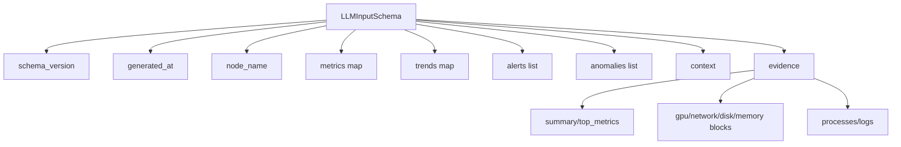

# LLM Schema Reference (v0.7)

## Source Types
- schema root: `analysis.LLMInputSchema` (`backend/internal/controller/analysis/schema.go`)
- compact evidence payload: `analysis.EvidencePack` (`backend/internal/controller/analysis/evidence.go`)

## Schema Graph

## 中文说明

- 这张图表达的核心不是字段越多越好，而是 LLM 输入被故意压缩成“稳定骨架 + 证据块”。系统不希望把 controller 里的原始遥测无限制倾倒给模型。
- `metrics`、`trends`、`alerts`、`anomalies` 提供的是高层摘要；`evidence` 提供的是真正需要被引用、追溯和解释的结构化上下文。这样拆的原因是让模型先理解症状轮廓，再进入证据，而不是被明细噪声淹没。
- `EvidencePack` 单独存在，是为了同时控制 token 成本、提高可解释性，并让输出能回到 controller 侧证据对象进行核对。换句话说，模型看到的是“可审计上下文”，不是原始数据湖。

## `LLMInputSchema`
| Field | Type | Notes |
|---|---|---|
| `schema_version` | string | current value: `v1` |
| `generated_at` | timestamp | UTC timestamp when payload is built |
| `node_name` | string | collector/node identifier |
| `metrics` | map[string]float64 | numeric snapshot used for analysis |
| `trends` | map[string]string | trend labels/descriptors |
| `alerts` | []string | active alert summaries |
| `anomalies` | []string | anomaly summaries |
| `context` | string | compact textual context |
| `evidence` | `EvidencePack` | token-efficient structured evidence |

## `EvidencePack`
| Field | Type |
|---|---|
| `schema_version`, `node_name` | string |
| `summary` | map[string]float64 |
| `top_metrics` | []MetricSummary |
| `gpu`, `network`, `disk`, `memory` | map[string]float64 |
| `processes` | []ProcessSummary |
| `logs` | []LogSummary |
| `alerts`, `anomalies` | []string |
| `context` | string |

## Contract Expectations
- consumers should accept additional fields for forward compatibility.
- `schema_version` must be validated before strict parsing.
- absent optional blocks should be treated as empty, not as errors.
