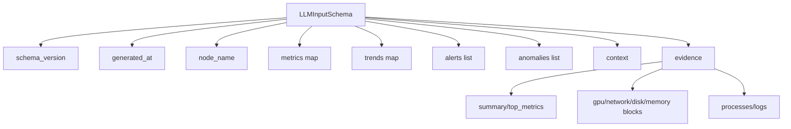

# LLM Schema Reference (v0.6)

## Source Types
- schema root: `analysis.LLMInputSchema` (`backend/internal/controller/analysis/schema.go`)
- compact evidence payload: `analysis.EvidencePack` (`backend/internal/controller/analysis/evidence.go`)

## Schema Graph

## `LLMInputSchema`
| Field | Type | Notes |
|---|---|---|
| `schema_version` | string | current value: `v1` |
| `generated_at` | timestamp | UTC timestamp when payload is built |
| `node_name` | string | collector/node identifier |
| `metrics` | map[string]float64 | numeric snapshot used for analysis |
| `trends` | map[string]string | trend labels/descriptors |
| `alerts` | []string | active alert summaries |
| `anomalies` | []string | anomaly summaries |
| `context` | string | compact textual context |
| `evidence` | `EvidencePack` | token-efficient structured evidence |

## `EvidencePack`
| Field | Type |
|---|---|
| `schema_version`, `node_name` | string |
| `summary` | map[string]float64 |
| `top_metrics` | []MetricSummary |
| `gpu`, `network`, `disk`, `memory` | map[string]float64 |
| `processes` | []ProcessSummary |
| `logs` | []LogSummary |
| `alerts`, `anomalies` | []string |
| `context` | string |

## Contract Expectations
- consumers should accept additional fields for forward compatibility.
- `schema_version` must be validated before strict parsing.
- absent optional blocks should be treated as empty, not as errors.
