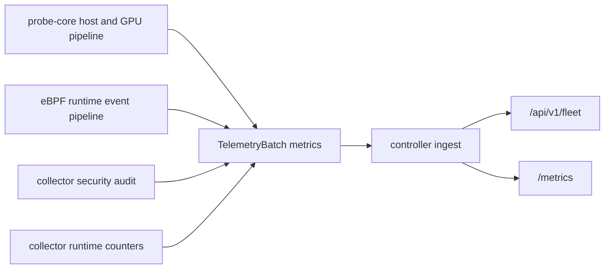

# Metrics Reference (v0.7)

## Producer layers

## 中文说明: 为什么 metrics 要分成这几层

- 图里的前半段在强调“谁生产了数据”，后半段在强调“谁消费了数据”。`probe-core`、eBPF、security audit 和 runtime counters 被拆开，是为了让运维能分清到底是业务信号缺失，还是 collector 自己在退化。
- `TelemetryBatch metrics` 和 `collector runtime counters` 同时进入 controller ingest，是因为系统既要知道“节点发生了什么”，也要知道“采集器有没有把事实完整送出来”。没有后一层，很多异常都会被误判成业务侧归零。
- `"/api/v1/fleet"` 和 `"/metrics"` 并存，不是重复出口。前者服务 UI、agent 和面向产品语义的聚合读取；后者服务 Prometheus/告警系统这类运维观测面。两边消费者不同，所以保留两个接口更清晰。

## Key metric families

| Prefix | Description |
|---|---|
| `node_*` | host/process/network/disk/gpu telemetry |
| `rca_*` | resource attribution signals used in diagnostics |
| `collector_*` | collector runtime state, probe-core primary health, compatibility-fallback state |
| `probe_core_*` | primary probe-core internals and source selection |
| `node_ebpf_*` | primary eBPF runtime event counters and summaries |
| `node_security_*` | collector-side normalized security posture/drift counters and structured findings |

## Controller reasoning metrics

The controller also exports a small set of AGENT-side counters through `/metrics`. These matter when you want to confirm that the control plane is reducing expensive reasoning work instead of repeatedly re-running retrieval and LLM calls.

| Metric | Meaning |
|---|---|
| `agent_llm_bypassed_stale_total` | query-service skipped the LLM because telemetry was already stale |
| `agent_llm_bypassed_empty_total` | query-service skipped the LLM because telemetry was insufficient |
| `agent_rag_skipped_context_total` | query-service skipped RAG because the operator query plus deterministic findings/anomaly hints did not provide enough operational symptom context |
| `agent_fallback_total` | deterministic fallback path answered instead of the LLM |

If `agent_rag_skipped_context_total` is rising while `agent_llm_bypassed_*` stays flat, that usually means the controller is intentionally keeping generic or unchanged queries off the retrieval path rather than suffering an index failure.

## Primary-path source semantics

v0.7 emits explicit source labels and collector runtime markers so operators can verify primary-vs-fallback behavior.

中文原因补充:

- 这些 source/fallback 指标不是装饰字段，而是为了回答一个最常见但最容易被忽略的问题: “当前数值到底来自主路径、兼容路径，还是根本没采到?”
- 如果没有 `collector_probe_source`、`collector_primary_*`、`collector_compatibility_fallback_*` 这类指标，下游很容易把“collector 降级”“batch 延迟”“spool backlog”误看成“节点真实值就是 0”。
- 把退化原因显式编码成 metric/label，也是在为 RCA 服务。故障排查时，先确认信号可信度，再解释业务症状，顺序不能反。

| Metric | Meaning |
|---|---|
| `collector_probe_source{source=probe_core|go}` | host/process telemetry source selected for this batch |
| `collector_primary_ebpf_expected` | eBPF runtime is configured as the primary kernel-event path |
| `collector_primary_ebpf_healthy` | eBPF runtime started and is healthy enough to emit kernel-event telemetry |
| `collector_primary_ebpf_reason{reason=...}` | degraded reason when the primary eBPF runtime is unavailable (`start_failed`, `disabled`, `unavailable`) |
| `collector_primary_probe_core_expected` | probe-core is expected to be the primary host telemetry path |
| `collector_primary_probe_core_healthy` | probe-core is producing fresh frames |
| `collector_compatibility_fallback_active` | the legacy Go host collector is currently active as fallback |
| `collector_compatibility_fallback_reason{reason=...}` | fallback cause (`probe_core_start_failed`, `probe_core_stale`, ...) |
| `collector_runtime_mode{mode=host\|namespace\|limited}` | collector runtime mode actually applied on this node |
| `collector_spool_backlog_bytes` | unread bytes currently buffered in the local spool waiting for replay |
| `collector_spool_evicted_records_total` | unread records evicted because bounded spool capacity was exceeded |
| `collector_spool_corruption_recoveries_total` | unread-tail truncation recoveries after detecting a corrupt/truncated record |
| `collector_spool_last_recovery_reason{reason=...}` | most recent spool recovery reason (`truncated_payload`, `invalid_record_length`, ...) |
| `collector_transport_last_error_kind{kind=...}` | last transport-stage failure classification (`dial`, `send`, `receive`, `retry_exhausted`, ...) |
| `collector_self_cpu_percent` | collector process CPU cost as a first-class telemetry signal |
| `collector_self_rss_bytes` | collector resident memory footprint |
| `collector_protection_mode{mode=normal\|incident\|pressure\|critical}` | current self-protection state chosen to keep business workloads first |
| `collector_protection_mode_severity` | numeric severity for trend/history storage and agent gating |
| `collector_protection_cpu_budget_ratio` | current collector CPU usage relative to configured budget |
| `collector_protection_memory_budget_ratio` | current collector RSS relative to configured soft limit |
| `collector_protection_spool_fill_ratio` | current backlog usage relative to spool cap |
| `collector_protection_load_shed{component=...}` | whether optional work like logs/security/external metrics is being shed |
| `collector_hardware_*_anomaly_score` | normalized CPU/memory/disk/GPU/network anomaly scores that feed the agent reasoning path |
| `collector_hardware_warning_total` | count of active broad hardware warnings derived from already-collected signals |
| `collector_hardware_warning{domain=...,reason=...,signal=...}` | active broad hardware hint such as CPU throttling, disk latency, NUMA imbalance, NIC retransmits, or GPU throttle |
| `collector_hardware_capability_*` | cached hardware-aware cadence profile chosen for probe-core sub-collectors |
| `collector_hardware_threshold_*` | hardware-specific interpretation thresholds currently in use |
| `collector_compat_collection_interval_seconds{component=extended\|hardware\|deep\|kernel_events\|rca\|gpu}` | effective legacy-Go fallback helper cadence when compatibility collection is active |
| `collector_compat_collection_age_seconds{component=extended\|hardware\|deep\|kernel_events\|rca\|gpu}` | age of the last compatibility-tier refresh |
| `collector_compat_collection_cache_hit{component=extended\|hardware\|deep\|kernel_events\|rca\|gpu}` | whether the current compatibility-tier output reused cached state |
| `collector_compat_collection_anomaly_triggered{component=extended\|hardware\|deep\|kernel_events\|rca\|gpu}` | whether a basic fallback anomaly forced an immediate refresh of that compatibility tier |
| `collector_compat_payload_refreshed{component=hardware}` | slow compatibility hardware tier really refreshed and the current batch contains a fresh hardware fallback view |
| `collector_compat_payload_suppressed{component=hardware}` | slow compatibility hardware tier reused cached state and intentionally omitted repeated hardware fallback metrics from this batch |
| `collector_aux_payload_refreshed{component=process_fallback\|logs}` | helper really refreshed this cycle, even if it returned an empty payload |
| `collector_aux_payload_suppressed{component=process_fallback\|logs}` | helper payload was intentionally omitted because the collector reused a cached view |
| `collector_process_payload_refreshed` | a current process payload was attached to this batch |
| `collector_process_payload_suppressed` | the collector recomputed process attribution but omitted the outbound process payload because the coarse process fingerprint was unchanged and still inside the resend interval |
| `collector_metrics_partial_update` | this batch intentionally omitted unchanged low-churn collector/runtime inventory and expects ingest-side carry-forward |
| `collector_metrics_suppressed_count` | number of low-churn collector/runtime metrics suppressed from the current batch |
| `sre_collector_retry_backoff_seconds` | current adaptive retry/backoff interval after repeated transient failures |
| `sre_collector_failure_streak` | consecutive collect/send failure streak used to pace replay |
| `probe_core_host_collection_source{source=kernel|proc}` | host source selected for sample |
| `probe_core_network_collection_source{source=netlink|proc}` | network source selected |
| `probe_core_disk_collection_source{source=sysfs|proc}` | disk source selected |
| `probe_core_host_kernel_primary_available` | kernel path availability signal |
| `probe_core_sampling_effective_interval_ms` | adaptive effective interval |
| `probe_core_sampling_pressure_level` | host-pressure state inside probe-core’s adaptive sampler |
| `probe_core_sampling_host_pressure_events_total` | count of transitions into stronger host-pressure protection |
| `probe_core_sampling_backoff_events_total` | backoff expansion count |
| `probe_core_process_sampling_interval_samples` | process-sampling cadence |
| `probe_core_process_enrichment_lightweight` | expensive PSS/socket enrichment is temporarily reduced to protect the host |
| `probe_core_netlink_refresh_interval_samples` | netlink dump cadence |
| `probe_core_netlink_refresh_age_samples` | age since last netlink refresh |
| `probe_core_cgroup_refresh_interval_samples` | cgroup file refresh cadence |
| `probe_core_cgroup_refresh_age_samples` | age since last cgroup refresh |
| `probe_core_host_proc_refresh_effective_interval_samples` | effective cadence for slow `/proc` host supplements under host pressure |
| `probe_core_pressure_refresh_effective_interval_samples` | effective PSI/cgroup refresh cadence under host pressure |
| `probe_core_gpu_sampling_effective_interval_samples` | effective GPU cadence after host-pressure adaptation |

## Raw-to-aliased metric emission note

In `v0.7`, the collector does not duplicate most raw `probe_core_*` host/resource metrics into outbound batches when equivalent `node_*` or `rca_*` aliases are already emitted by [`backend/internal/collector/probe_core_convert.go`](../../backend/internal/collector/probe_core_convert.go).

Examples of raw metrics usually suppressed from outbound batches by default:

- `probe_core_cpu_usage_percent`
- `probe_core_memory_total_bytes`
- `probe_core_memory_used_bytes`
- `probe_core_disk_await_ms`
- `probe_core_network_rx_bytes_per_sec`
- `probe_core_network_tcp_retransmissions_per_sec`
- `probe_core_gpu_count`

The raw duplicates can be restored with `probe_core.emit_raw_aliased_metrics: true` or `SRE_COLLECTOR_PROBE_CORE_EMIT_RAW_ALIASED_METRICS=true`.

## Domain coverage

- CPU/scheduler: usage, load, runnable/blocked processes.
- Memory: total/used/available plus pressure-related counters.
- Disk/NVMe: throughput, latency, queue depth, utilization.
- Network/TCP/softnet/RDMA: traffic, drops, retransmits, congestion.
- GPU: device inventory, SM/memory utilization, PCIe throughput, BAR1, ECC, and process attribution.
- Logs/eBPF: indexed log signals and primary kernel event summaries.
- Security: `node_security_finding` envelopes plus counters for permission drift, process/port mismatch, sensitive-path access, suspicious outbound, scheduler anomalies, and kernel posture drift.

## GPU primary-path metrics

Probe-core now tries dynamic NVML first and falls back to bounded `nvidia-smi` queries only when NVML is unavailable. That keeps the steady-state path closer to the driver/runtime boundary while still remaining runnable on hosts where NVML cannot be loaded.

| Metric | Source | Purpose | Notes |
|---|---|---|---|
| `probe_core_gpu_collection_source{source=nvml\|nvidia_smi\|unavailable}` | probe-core | shows the actual GPU source path used in the last refresh | value is `1` on success, `0` when GPU sampling could not produce device data |
| `probe_core_gpu_probe_success` | probe-core | coarse GPU sampler health bit | `1` when at least one device sample was collected |
| `node_gpu_count` | probe-core alias | inventory size | feeds controller GPU inventory |
| `node_gpu_info{gpu_id,uuid,name,driver_version,pci_bus_id}` | probe-core alias | stable GPU identity labels | emitted once per device refresh |
| `node_gpu_utilization_sm_percent` | NVML / fallback query | SM busy signal | primary scheduling pressure signal |
| `node_gpu_utilization_memory_percent` | NVML / fallback query | memory-controller pressure | useful for compute-vs-memory bottleneck split |
| `node_gpu_memory_{total,used,free}_mib` | NVML / fallback query | framebuffer pressure | `node_gpu_memory_used_percent` is also emitted |
| `node_gpu_power_{draw,limit}_watts` | NVML / fallback query | power ceiling / saturation context | useful when utilization is low but power throttle is high |
| `node_gpu_pcie_{gen,width,gen_max,width_max}` | NVML / fallback query | current vs max PCIe link state | topology and under-training hints |
| `node_gpu_pcie_{rx,tx}_mb_s` | NVML / fallback query | current PCIe traffic | supports host/network/GPU cross-correlation |
| `node_gpu_pcie_{bandwidth_theoretical,bandwidth_max}_mb_s` | probe-core derived | current/max link capacity estimate | derived from PCIe generation × width |
| `node_gpu_pcie_{rx,tx,link}_utilization_percent` | probe-core derived | PCIe saturation indicator | bounded, easier for Agent/UI consumption than raw MB/s alone |
| `node_gpu_bar1_memory_{total,used,free}_mib` | NVML | BAR1 aperture pressure | useful for driver/runtime memory mapping issues |
| `node_gpu_ecc_{single,double}_bit_errors_total` | NVML | reliability signal | double-bit errors are treated as more severe downstream |
| `node_gpu_{process_count,context_count,kernel_active_contexts}` | NVML | runtime occupancy hints | context counts are currently derived from running compute contexts |
| `node_gpu_process_memory_mib` | NVML / fallback query | per-process GPU memory attribution | keyed by `pid` and GPU labels |
| `node_gpu_process_mem_util_percent` | NVML | process share of device memory | omitted when total memory is unavailable |
| `node_gpu_process_context_active` | NVML / fallback query | active GPU process/context marker | bounded per-process context flag |

## eBPF correlation metrics

The primary Go eBPF runtime no longer exports only raw event envelopes plus a few totals. It now keeps bounded local classifications so the controller and agent can reason about classes of activity without depending on unbounded labels.

| Metric | Purpose | Labels | Why it exists |
|---|---|---|---|
| `node_ebpf_category_events_total` | monotonic event totals by normalized category | `category` | preserves the dominant runtime shape without replaying every raw event |
| `node_ebpf_category_events_rate` | short-window activity rate by category | `category` | useful for burst detection and RCA trend comparisons |
| `node_ebpf_category_bytes_total` | bytes attributed to the category | `category` | lets network/file-heavy behavior stand out from mere event count |
| `node_ebpf_category_bytes_per_second` | byte throughput by category | `category` | easier to correlate with throughput anomalies |
| `node_ebpf_category_latency_seconds_avg` | average observed latency by category | `category` | carries syscall/IO delay shape into the controller |
| `node_ebpf_remote_scope_events_total` | classified remote-endpoint totals | `scope=loopback\|private\|public\|linklocal\|multicast\|unspecified` | keeps outbound behavior bounded and operationally meaningful |
| `node_ebpf_remote_scope_events_rate` | remote-endpoint rate | same as above | makes outbound bursts visible without raw IP cardinality |
| `node_ebpf_sensitive_path_events_total` | sensitive-path access totals | `scope=auth_db\|docker_sock\|ssh\|kubeconfig\|cron\|systemd\|kernel_posture\|kernel_modules\|tmp_exec...` | turns raw file paths into bounded policy-relevant classes |
| `node_ebpf_sensitive_path_events_rate` | sensitive-path access rate | same as above | highlights short-lived spikes |
| `node_ebpf_process_category_events_total` | top per-process category totals | `pid`,`process`,`category` | surfaces which process is dominating a class of behavior |
| `node_ebpf_process_category_events_rate` | top per-process category rate | `pid`,`process`,`category` | supports RCA narrowing without emitting every process/path tuple |

`node_ebpf_runtime_event` still exists for bounded recent-event envelopes. It now also includes `remote_scope` and `path_scope` labels when those classifications are available.
