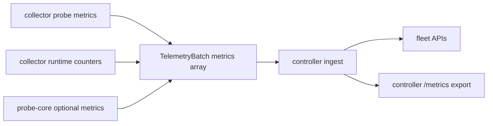
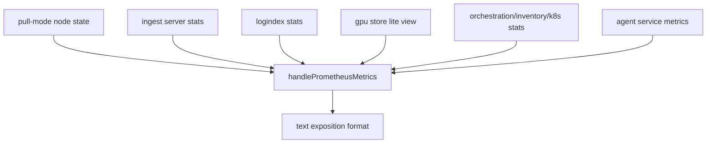
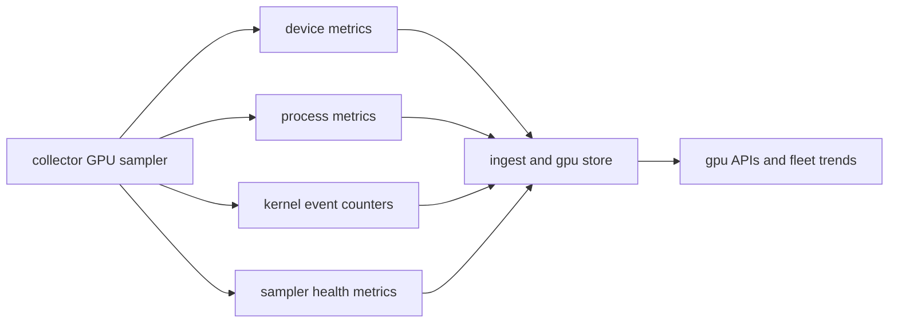

# Metrics Reference (v0.4)

## Metric Producers

## `/metrics` Export Path

## Collector Metric Families (Batch Payload)
| Family Prefix | Source |
|---|---|
| `node_*` | host, process, filesystem, network, GPU telemetry collected by probe layer |
| `rca_*` | per-process resource attribution signals (level 5 paths) |
| `node_ebpf_*` | optional eBPF event summaries |
| `collector_*` | collector runtime state emitted into payload (spool, transport, probe source, probe-core runtime) |
| `probe_core_*` | optional native C++ probe-core families (plus compatibility aliases) |

## Observability Coverage Matrix
| Domain | Representative metric keys | Primary APIs |
|---|---|---|
| CPU and scheduler | `node_cpu_usage_percent`, `node_cpu_iowait_percent`, `node_load1`, `node_procs_running`, `node_procs_blocked` | `/api/v1/fleet`, `/api/v1/fleet/timeseries`, `/api/v1/top/programs` |
| Memory | `node_memory_Used_bytes`, `node_memory_MemTotal_bytes`, `node_memory_MemAvailable_bytes`, `node_memory_Dirty_bytes`, `node_memory_Writeback_bytes` | `/api/v1/fleet`, `/api/v1/fleet/timeseries`, diagnostics APIs |
| Disk and NVMe | `node_disk_total_iops_per_second`, `node_disk_utilization_peak_percent`, `node_disk_request_latency_p99_seconds`, `node_nvme_total_iops_per_second` | `/api/v1/fleet`, `/api/v1/fleet/timeseries`, diagnostics APIs, top programs |
| Network interface | `node_network_total_receive_bytes_per_second`, `node_network_total_transmit_bytes_per_second`, `node_network_total_drop_per_second`, `node_network_utilization_peak_percent` | `/api/v1/fleet`, `/api/v1/fleet/timeseries`, diagnostics APIs |
| TCP and softnet | `node_tcp_retransmits_per_second`, `node_tcp_retransmit_ratio`, `node_softnet_dropped_per_second`, `node_network_interface_tx_queue_fill_percent` | `/api/v1/fleet`, `/api/v1/fleet/timeseries`, kernel/data-path diagnostics |
| RDMA | `node_rdma_port_transmit_bytes_per_second`, `node_rdma_port_receive_bytes_per_second`, `node_rdma_port_errors_per_second`, `node_rdma_port_congestion_events_per_second` | `/api/v1/fleet`, diagnostics APIs |
| GPU device | `node_gpu_utilization_sm_percent`, `node_gpu_memory_used_mib`, `node_gpu_temperature_celsius`, `node_gpu_power_draw_watts`, `node_gpu_pcie_link_utilization_percent` | `/api/v1/gpu/nodes`, `/api/v1/gpu/timeline`, fleet timeseries GPU keys |
| GPU process and runtime events | `node_gpu_process_sm_util_percent`, `node_gpu_process_memory_mib`, `node_gpu_xid_errors_total`, `node_gpu_uvm_faults_total`, `node_gpu_reset_events_total` | `/api/v1/gpu/processes`, `/api/v1/gpu/process-timeline`, `/api/v1/gpu/events`, `/api/v1/gpu/correlation` |
| Logs | log index events and log ingest counters | `/api/v1/logs/status`, `/api/v1/logs/search`, `/api/v1/logs/ingest` |
| eBPF (optional) | `node_ebpf_events_total`, `node_ebpf_events_rate`, `node_ebpf_gpu_events_total`, `node_ebpf_process_events_total` | `/api/v1/fleet`, `/api/v1/top/programs` |
| Collector runtime health | `collector_spool_backlog_bytes`, `collector_spool_size_bytes`, `collector_transport_ack_ms`, `collector_transport_errors_total`, `collector_probe_source` | `/api/v1/fleet`, `/api/v1/ingest/status`, `/metrics` |

### Scope Boundaries
- GPU metrics are emitted only when NVIDIA tooling is available and GPU collection is enabled.
- eBPF metrics are optional and require kernel support and explicit collector enablement.
- Most historical trend depth is bounded by in-memory ring buffers and retention settings.

## Key Collector Runtime Fields in Payload
- `collector_spool_backlog_bytes`
- `collector_spool_size_bytes`
- `collector_transport_send_ms`
- `collector_transport_ack_ms`
- `collector_transport_errors_total`
- `collector_transport_retries_total`
- `collector_probe_source`
- `collector_probe_core_*`

## GPU-Focused Families
- device-level: `node_gpu_utilization_*`, `node_gpu_memory_*`, `node_gpu_pcie_*`, `node_gpu_temperature_*`
- process-level: `node_gpu_process_*`
- runtime events/counters: `node_gpu_event_total`, `node_gpu_xid_errors_total`, `node_gpu_uvm_faults_total`, `node_gpu_reset_events_total`
- sampler health: `node_gpu_sampler_query_*`

## GPU Metric Taxonomy (Implemented)

### Device and Interconnect Metrics
| Family | Representative metrics | Key labels |
|---|---|---|
| Inventory | `node_gpu_info`, `node_gpu_count`, `node_gpu_persistence_mode` | `gpu_id`, `uuid`, `name`, `driver_version`, `cuda_version` |
| Utilization | `node_gpu_utilization_sm_percent`, `node_gpu_utilization_memory_percent`, `node_gpu_utilization_encoder_percent`, `node_gpu_utilization_decoder_percent` | `gpu_id` |
| Memory | `node_gpu_memory_total_mib`, `node_gpu_memory_used_mib`, `node_gpu_memory_reserved_mib`, `node_gpu_bar1_memory_used_mib` | `gpu_id` |
| Power and thermal | `node_gpu_power_draw_watts`, `node_gpu_power_limit_watts`, `node_gpu_temperature_celsius`, `node_gpu_temperature_memory_celsius` | `gpu_id` |
| PCIe and NVLink | `node_gpu_pcie_rx_mb_s`, `node_gpu_pcie_tx_mb_s`, `node_gpu_pcie_link_utilization_percent`, `node_gpu_nvlink_links` | `gpu_id` |

### Process and Context Metrics
| Family | Representative metrics | Key labels |
|---|---|---|
| Process attribution | `node_gpu_process_memory_mib`, `node_gpu_process_sm_util_percent`, `node_gpu_process_mem_util_percent` | `gpu_id`, `pid`, `process`, `context_type` |
| Media contexts | `node_gpu_process_encoder_util_percent`, `node_gpu_process_decoder_util_percent` | `gpu_id`, `pid`, `process` |
| Context counters | `node_gpu_process_count`, `node_gpu_context_count`, `node_gpu_kernel_active_contexts` | `gpu_id` |
| Hotspot process | `node_gpu_kernel_hotspot_sm_util_percent` | `gpu_id`, `pid`, `process` |

### Reliability and Event Metrics
| Family | Representative metrics | Key labels |
|---|---|---|
| Event counters | `node_gpu_event_total` | `event_type`, `severity`, `gpu_id`, `code` |
| Rollups | `node_gpu_xid_errors_total`, `node_gpu_uvm_faults_total`, `node_gpu_reset_events_total`, `node_gpu_reliability_events_total` | `gpu_id`, optional `code` |
| ECC and retirement | `node_gpu_ecc_double_bit_errors_total`, `node_gpu_retired_pages_double_bit_total`, `node_gpu_remapped_rows_uncorrectable_total` | `gpu_id` |
| Reset and MIG | `node_gpu_reset_required`, `node_gpu_reset_recommended`, `node_gpu_mig_enabled`, `node_gpu_mig_pending` | `gpu_id` |

### Sampler Introspection Metrics
| Metric | Meaning |
|---|---|
| `node_gpu_sampler_advanced_interval_samples` | configured advanced interval |
| `node_gpu_sampler_process_detail_interval_samples` | configured process detail interval |
| `node_gpu_sampler_advanced_cycle_active` | whether current cycle executed advanced queries |
| `node_gpu_sampler_process_detail_cycle_active` | whether current cycle executed process detail query |
| `node_gpu_sampler_query_duration_ms{query}` | wall-clock duration per GPU query |
| `node_gpu_sampler_query_errors_total{query}` | cumulative query failures |
| `node_gpu_sampler_query_timeouts_total{query}` | cumulative query timeouts |

## Controller `/metrics` Stable Series
| Metric | Type | Description |
|---|---|---|
| `sre_controller_nodes_total` | gauge | configured pull-mode node count |
| `sre_controller_nodes_healthy` | gauge | healthy pull-mode node count |
| `sre_node_up{node,address}` | gauge | pull-mode node health |
| `sre_ingest_batches_total` | counter | accepted ingest batches |
| `sre_ingest_rejected_total` | counter | rejected batches |
| `sre_ingest_metrics_points_total` | counter | ingested metric points |
| `sre_ingest_process_samples_total` | counter | ingested process samples |
| `sre_ingest_log_fingerprints_total` | counter | ingested log fingerprints |
| `sre_log_index_segments` | gauge | active log index segments |
| `sre_log_index_entries` | gauge | retained log entries |
| `sre_log_index_ingested_events_total` | counter | log events accepted |
| `sre_log_index_dropped_events_total` | counter | log events dropped |
| `sre_log_index_queries_total` | counter | search queries served |
| `sre_inventory_probes_total` | gauge | inventory merged probe count |
| `sre_inventory_probes_healthy` | gauge | healthy probes |
| `sre_k8s_*` | gauge/counter | k8s refresh and discovered object counters |
| `sre_orchestrator_*` | gauge/counter | orchestration runtime counters |
| `agent_*` | counter | AGENT query/action execution counters |

## Collector Local Prometheus Metrics
When `metrics_listen_address` is set, collector exposes:
- `sre_collector_report_attempts_total`
- `sre_collector_report_failures_total{reason}`
- `sre_collector_batches_enqueued_total`
- `sre_collector_batches_sent_total`
- `sre_collector_collection_duration_seconds`
- `sre_collector_collection_errors_total{source}`
- `sre_collector_collection_success_total{source}`
- `sre_collector_config_reloads_total{result}`
- `sre_collector_poll_interval_seconds`

## Trend API Keys
`GET /api/v1/fleet/timeseries` supports named trend keys (for example):
- `cpu_usage_percent`, `memory_used_percent`, `load1`
- `network_rx_bytes_per_second`, `network_tx_bytes_per_second`
- `tcp_retransmits_per_second`, `tcp_retransmit_ratio`
- `disk_total_iops_per_second`, `disk_queue_depth_total`
- `gpu_utilization_percent`, `gpu_memory_used_mib`

Use `metric` query parameters to select one or more keys.
