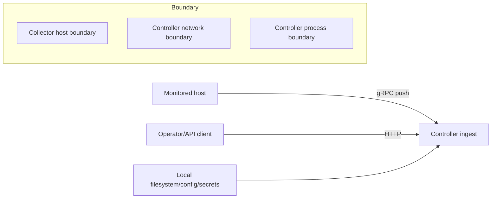

# Threat Model (v0.4)

## Scope
Covered runtime surfaces:
- collector transport to controller ingest
- controller HTTP APIs and module endpoints
- log ingest/search paths
- agent query/execute paths
- runtime config/secret handling

## Trust Boundaries


## Assets
- telemetry payload integrity (`TelemetryBatch`, ACK semantics)
- controller API availability and correctness
- secrets (API keys, TLS material, provider tokens)
- agent action safety controls

## Primary Threats and Mitigations
| Threat | Surface | Mitigation in code |
|---|---|---|
| spoofed or malformed telemetry | gRPC ingest | strict batch validation, bounded cardinality and sizes |
| unauthorized API access | controller HTTP | optional API key middleware |
| transport interception | collector->controller link | optional TLS/mTLS with cert reload support |
| command injection | `external_metrics_cmd` | strict parsing and shell-control rejection |
| abusive log payload | `/api/v1/logs/ingest` | body/entry limits and normalization |
| unsafe action execution | `/api/v1/agent/execute` | approval token checks, idempotency behavior, dry-run defaults |

## Residual Risks
- if auth is disabled on non-loopback listeners, API surfaces are exposed.
- memory-first stores are vulnerable to forced churn under sustained high-cardinality input.
- runtime audit rules are configuration-aware but not equivalent to dynamic penetration testing.

## Validation Workflow
```bash
make security-audit
make security-scan
```
