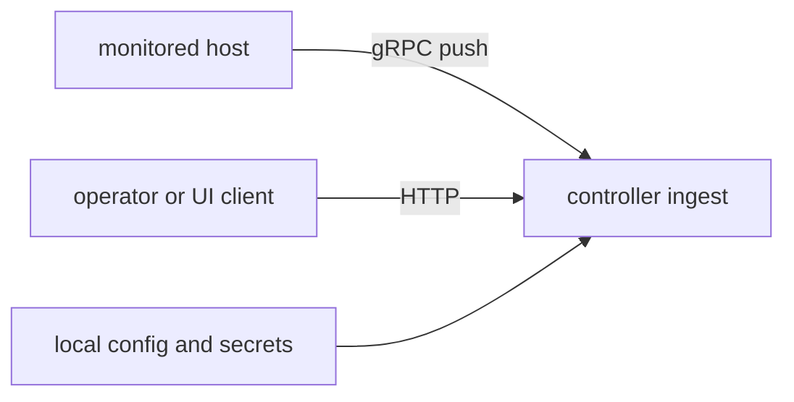

# Threat Model (v0.6)

## Scope

- collector-to-controller transport
- controller HTTP APIs
- logs ingest/search path
- optional agent execute path
- runtime config and secret handling

## Trust boundaries



## Main threats and controls

| Threat | Control |
|---|---|
| malformed/spoofed telemetry | ingest validation and size/cardinality caps |
| unauthorized API access | optional API key middleware |
| transport interception | optional TLS/mTLS |
| command injection in external metrics | shell-control rejection in command parsing |
| log payload abuse | request-size and entry-count limits |
| unsafe agent actions | approval-token and idempotency checks |

## Residual risks

- APIs are exposed if auth is disabled on non-loopback listeners.
- memory-first in-process stores can churn under adversarial high-cardinality input.
- runtime audit is configuration-focused, not equivalent to penetration testing.

## Security validation

```bash
make security-audit
make security-scan
```
