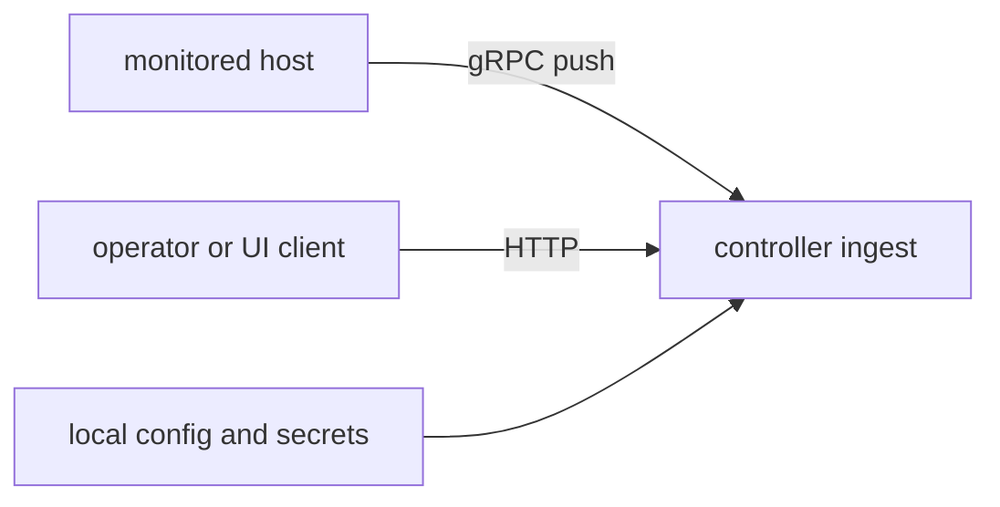

# Threat Model (v0.7)

## Scope

- collector-to-controller transport
- controller HTTP APIs
- logs ingest/search path
- optional agent execute path
- runtime config and secret handling

## Trust boundaries



## 中文说明

- 这份 threat model 的目的不是宣称系统“已经足够安全”，而是明确当前信任边界在哪、主要防线是什么、残余风险还留在哪里。
- 图里只保留三条主边界，是为了聚焦最真实的攻击入口: 被观测主机把事实推给 controller，操作者通过 HTTP/UI 使用控制面，配置和 secret 决定控制面实际行为。
- 这样写的原因很实际: 安全文档如果只是列一堆术语，排障和评审时很难落地。真正有用的 threat model 应该帮助读者快速判断攻击面、已有控制和未覆盖风险。

## Main threats and controls

| Threat | Control |
|---|---|
| malformed/spoofed telemetry | ingest validation and size/cardinality caps |
| unauthorized API access | optional API key middleware |
| transport interception | optional TLS/mTLS |
| command injection in external metrics | shell-control rejection in command parsing |
| log payload abuse | request-size and entry-count limits |
| unsafe agent actions | approval-token and idempotency checks |

## Residual risks

- APIs are exposed if auth is disabled on non-loopback listeners.
- memory-first in-process stores can churn under adversarial high-cardinality input.
- runtime audit is configuration-focused, not equivalent to penetration testing.

## Security validation

```bash
make security-audit
make security-scan
```

中文补充:

- 这些命令只能验证“当前代码和配置满足已定义的静态/规则化检查”，不能自动证明部署环境本身安全。
- 真正的安全边界还依赖于外部控制，例如是否启用 auth、collector 放在哪里、网络入口是否收敛、secret 如何管理、宿主机是否可信。
