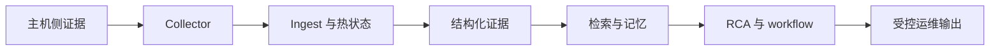

# 概览

English version: [docs/en/01-overview.md](../en/01-overview.md)

AI SRE Agent 是一个面向 Linux、GPU 与 AI 基础设施的 push-first 可观测性与证据驱动 incident agent。

最准确、也最短的一句话是：

> collector 用低 steady-state 成本保住主机侧短时证据；controller 再把这些证据变成规范化状态、有界历史、检索、RCA 与受控 workflow 输出。

这句话之所以重要，是因为它定义了仓库的设计边界。这个项目不是“让 LLM 读 dashboard”，而是一条在 RAG 或 LLM 不可用时仍可运行的 evidence pipeline。

## 术语约定

为了让中文文档和代码、英文文档保持一致，本套文档对几个高频词采用固定用法：

- `collector`：节点侧采集与自保护层，不泛化成“采集平台”或“探针系统”
- `controller`：集中式控制面，负责事实模型、分析、检索和工作流，不等同于单一 API 服务
- `ingest`：controller 接收 batch、校验、去重、续接状态并重建热状态的入口层
- `retrieval`：条件式检索，包括静态知识和 incident memory，不等于任意搜索
- `workflow runtime`：带 durable run、policy、approval、verification 的受治理执行边界
- `evidence`：已经被规范化、可以被审计和复用的证据对象，而不是随手拼接的日志片段
- `bounded history`：为趋势和控制面推理服务的有界历史窗口，不表示“全量原始时序归档”

## 这个仓库在解决什么问题

现代基础设施团队反复遇到三类问题：

1. 第一批有价值的证据往往只在节点本地短暂存在
2. 真正相关的证据跨层分布，不能只看 metrics 或只看 logs
3. 想让输出具备可执行性，就必须解决治理问题，而不是只生成解释

在没有这类设计之前：

- pull scrape 很容易错过短暂故障起点
- GPU、runtime、process、storage、network 信号散落在不同系统里
- retrieval 和 LLM 的边界不清楚
- action suggestion 很难安全审批和事后审计

仓库现在用明确的结构应对这些问题：

- collector 负责低成本本地观察与有界 replay
- ingest 负责重建 controller-owned fact model
- analysis 负责把原始遥测变成结构化中间证据
- retrieval 是显式、可选择的
- workflow runtime 负责 policy、verification、compensation 与 audit

## 一屏心智模型

## 当前代码库包含什么

| 区域 | 主要路径 | 负责什么 |
| --- | --- | --- |
| 主机采集 | [`../../backend/internal/collector/`](../../backend/internal/collector/), [`../../cpp/probe_core/`](../../cpp/probe_core/) | 主机、进程、GPU、runtime 与兼容性遥测采集 |
| ingest 与热状态 | [`../../backend/internal/controller/ingest/`](../../backend/internal/controller/ingest/) | batch 校验、状态重建、有界历史保留 |
| 分析与 workflow | [`../../backend/internal/controller/agentcore/`](../../backend/internal/controller/agentcore/) | 趋势分析、弱信号融合、RCA、recommendation、governed workflow |
| 检索 | [`../../backend/internal/controller/rag/`](../../backend/internal/controller/rag/) | 本地知识入库、索引与检索 |
| incident memory | [`../../backend/internal/controller/incidentmemory/`](../../backend/internal/controller/incidentmemory/) | 事故结果的持久化与重新检索 |
| change 与 causality | [`../../backend/internal/controller/changeintel/`](../../backend/internal/controller/changeintel/), [`../../backend/internal/controller/causalgraph/`](../../backend/internal/controller/causalgraph/) | change 相关性与原因/症状排序 |
| 评估 | [`../../backend/internal/controller/eval/`](../../backend/internal/controller/eval/), [`../../backend/internal/controller/evaluation/`](../../backend/internal/controller/evaluation/) | golden case 评估与 replay stability |

## 为什么必须拆成 collector / controller

这个 split 不是为了好看。

如果采集、存储、推理、UI 和自动化都放在一起：

- 被观测主机会承担更高成本
- transport 故障和 collection 故障更难区分
- 主机侧短时证据更容易丢
- 推理路径更难扩展和审计

当前的 split 就是在显式管理这些权衡：

| 运行时角色 | 主要职责 | 它在管理什么约束 |
| --- | --- | --- |
| collector | 保住 host-local 证据并低成本推送 | 不要让采集器本身变成 incident 的一部分 |
| controller | 规范化、保留、分析、检索、解释与治理 | 把更重的状态和推理从被观测主机移走 |

## 为什么 controller 不直接跳到 LLM

controller 会先生成这些中间证据对象：

- `TrendAssessment[]`
- `InvestigationEvent[]`
- `RetrievalDecision[]`
- RCA hypotheses 与 evidence rows
- change links
- adaptive baseline insights
- causal-path 输出

这样设计的原因是：原始 telemetry 不是一个安全的推理平面。

它的问题包括：

- 噪声大
- 体积常常超过 prompt budget
- transient symptom 与 persistent state 混在一起
- 事后很难审计

先把 telemetry 转成有界、带类型的证据，仓库才能获得：

- 更低推理成本
- 更可读的 UI
- 更选择性的 retrieval
- 在模型路径不可用时仍可退回 deterministic fallback

## 为什么这套设计在实践里能工作

很多可观测性系统的问题不是“缺少模型”，而是缺少一条能把证据逐步收敛的路径。当前实现之所以在工程上成立，原因很具体：

- 主机侧只做便宜、必须靠近机器的事，所以 steady-state 成本可控
- controller 先重建统一事实模型，再做趋势、弱信号、change correlation 和 retrieval，避免每一层都解释自己的“局部真相”
- retrieval 是条件式触发的，所以知识库不会在每一次 incident 上都变成噪声放大器
- workflow runtime 把 approval、verification 和 compensation 变成显式记录，operator 能看见“做了什么”和“为什么没做”

代价也同样明确：

- 代码里会有更多中间对象和阶段边界
- 有些信息必须先被规范化，不能直接把原始 batch 往下透传
- 贡献者需要理解 collector、ingest、analysis、workflow 之间的职责分工

这个代价是值得的，因为它换来的是可调试性、可解释性，以及在模型路径不稳定时仍然可运行的最小控制环。

## v0.8 实际改变了什么

当前仓库状态最重要的变化，是 incident path 终于不再只是“未来方向”，而已经被文档当作真实 workflow runtime 来解释。

这包括：

- durable workflow state
- change intelligence
- causal graph reasoning
- incident-memory write-back 与 retrieval
- governed execution with approval and verification
- replay-oriented evaluation

机制层说明请直接读 [事故 Agent 运行时](17-incident-agent-runtime.md)。

## 三种阅读方式

### 工程叙事

这是一个有边界的证据系统。

它比 naive LLM-based ops tooling 更可靠，因为它：

- 在主机本地保住了故障起点证据
- 在推理前先做数据规范化
- 检索是 gated 的，不是默认永远附加
- 保留 deterministic fallback
- 把 workflow governance 集中在统一层

### 产品叙事

这是一个面向高成本、跨层、重运维环境的基础设施系统。

它的价值不在于“什么都自动化”，而在于降低不确定性，并让自动化具备治理边界。

### 研究叙事

这是一个把 weak-signal analysis、retrieval gating、deterministic fallback 与 governed action 做成可检查代码实现的 AIOps 架构。

## 推荐阅读顺序

1. [架构](04-architecture.md)
2. [Pipeline 深度解析](02-pipeline-deep-dive.md)
3. [控制平面分析](07-control-plane-analysis.md)
4. [事故 Agent 运行时](17-incident-agent-runtime.md)
5. [测试与评估](19-testing-and-evaluation.md)

## 如果你只想先看一个具体 incident

对于一次与 rollout 相关的 GPU slowdown，当前仓库预期路径是：

1. collector 抓到 host、process、GPU 与日志证据
2. ingest 重建热状态与 metric history
3. analysis 生成 trend 与 weak-signal 证据
4. change intelligence 对 rollout/config/runtime 变化做相关性评分
5. RCA 构造 hypothesis、evidence 与 change link
6. causal graph 把更像上游原因的节点与下游症状分开
7. incident memory 与 static knowledge 都可以进入 retrieval
8. workflow runtime 记录 policy、verification 与 evidence artifact

这就是当前仓库架构命题在一个 incident 上的完整体现。
