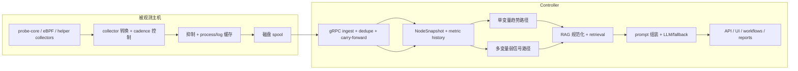

# Pipeline 深度解析

English version: [docs/en/02-pipeline-deep-dive.md](../en/02-pipeline-deep-dive.md)

本指南以代码为依据，解释当前 `v0.8` pipeline 的端到端实现。

它回答的是新 operator、贡献者或评审者在读完首页之后通常会追问的那些问题：

- 主机上到底采了什么？
- 为什么发送前要先排队？
- 什么会被抑制（suppression）、去重（dedupe）或沿用（carry-forward）？
- 在检索（retrieval）或 LLM 推理之前，controller 先做了哪些分析？
- 单指标趋势分析和多变量弱信号检测到底差在哪里？
- 仓库内置 dataset 实际包含什么，retrieval 如何改变最后答案？
- 系统最终对外返回什么结构的响应？

本页刻意只描述当前实现，尤其基于这些代码路径：

- [`backend/internal/collector/collector.go`](../../backend/internal/collector/collector.go)
- [`backend/internal/collector/probe_core_convert.go`](../../backend/internal/collector/probe_core_convert.go)
- [`backend/internal/collector/aux_sampling.go`](../../backend/internal/collector/aux_sampling.go)
- [`backend/internal/collector/process_payload_suppression.go`](../../backend/internal/collector/process_payload_suppression.go)
- [`backend/internal/collector/metric_suppression.go`](../../backend/internal/collector/metric_suppression.go)
- [`backend/internal/collector/spool/spool.go`](../../backend/internal/collector/spool/spool.go)
- [`backend/internal/collector/transport/client.go`](../../backend/internal/collector/transport/client.go)
- [`backend/internal/controller/ingest/server.go`](../../backend/internal/controller/ingest/server.go)
- [`backend/internal/controller/ingest/store.go`](../../backend/internal/controller/ingest/store.go)
- [`backend/internal/controller/timeseries/service.go`](../../backend/internal/controller/timeseries/service.go)
- [`backend/internal/controller/agentcore/agent.go`](../../backend/internal/controller/agentcore/agent.go)
- [`backend/internal/controller/agentcore/workflow_eventization.go`](../../backend/internal/controller/agentcore/workflow_eventization.go)
- [`backend/internal/controller/agentcore/workflow_engine.go`](../../backend/internal/controller/agentcore/workflow_engine.go)
- [`backend/internal/controller/rag/`](../../backend/internal/controller/rag/)

两个范围说明很重要：

- 仓库当前维护的主执行路径是 Go collector + Go controller。`python/sre_agent/` 目录是真实代码，但不是本页描述的 `v0.8` 主 collector-to-controller 路径。
- `service_latency_p95_ms` 和 `service_latency_p99_ms` 不是当前仓库默认内置采集指标。collector 可以通过 external helper 接入这类自定义指标；一旦它们出现在 metric stream 中，controller 现在会把它们纳入 trend retention、风险序列和行为记忆判别路径。

## 本文内容

- 如何阅读本页
- 一屏看懂整条链路
- 跨阶段契约与状态交接
- 阶段总览
- 阶段决策矩阵
- 信号类别与采样层级
- 阶段 1：主机采集与 source 选择
- 阶段 2：collector 节奏控制、规范化与抑制
- 阶段 3：队列、compact、压缩与发送路径
- 阶段 4：controller ingest、去重与热状态重建
- 阶段 5：trend-safe 历史与可选 TSDB
- 阶段 6：单变量时序与趋势分析
- 阶段 7：多变量与弱信号分析
- 阶段 8：dataset 规范化、retrieval planning 与 RAG
- 阶段 9：prompt 组装、模型调用与最终输出
- 端到端示例
- 读者应记住什么

## 如何阅读本页

这页文档同时服务两类读者。

| 如果你主要是…… | 建议重点看…… | 原因 |
| --- | --- | --- |
| 工程师 / SRE | 文件引用、阶段表格，以及每个阶段里的机制说明 | 它们告诉你行为在哪个文件里、改动会影响什么 |
| 产品、运维、业务或评审读者 | “为什么这一阶段存在”和“如果没有它会怎样”的说明，以及文末的端到端示例 | 它们解释了为什么系统不能把原始 telemetry 直接塞给模型 |

最重要的设计思想有两个，而且它们在整条 pipeline 里不断重复出现：

1. 在生产主机上尽量便宜地保住短时效的节点本地证据。
2. 在 controller 上把这些证据变成更小、更可信、更可执行的推理输入。

这就是为什么 pipeline 会被拆成采集、抑制、排队、ingest、趋势分析、弱信号分析、检索和最终输出，而不是一个黑盒大循环。

## 一屏看懂整条链路



## 跨阶段契约与状态交接

当前实现跨越的显式数据契约其实不多。正是这些契约保证了 suppression、replay、carry-forward、retrieval 和 workflow governance 可以保持一致。

```text
ProbeBatch/FrameEnvelope
  -> TelemetryBatch
     -> Ack(batch_id)
        -> NodeSnapshot + MetricHistorySample
           -> TrendAssessment / weak-signal event / SearchHit
              -> QueryResponse / JointRiskAssessment / RCAWorkflowReport
                 -> DurableRun + evidence package + incident memory
```

| 边界 | 当前类型或文件格式 | 主要生产者 | 主要消费者 | 为什么重要 |
| --- | --- | --- | --- | --- |
| native probe IPC | 包裹 `ProbeBatch` 的 `probeipc.v1.FrameEnvelope` | `cpp/probe_core/main.cpp` | `backend/internal/collector/probecore/client.go` | 这里决定 probe-core 如何压缩 frame、带 CRC，以及如何流式输出有界 host 证据窗口 |
| collector 线传输契约 | `telemetry.v1.TelemetryBatch` | `backend/internal/collector/collector.go` | `backend/internal/controller/ingest/server.go` | 这是 controller ingest 的唯一 wire contract；suppression marker 和 `batch_id` 语义都在这里 |
| 交付确认 | `telemetry.v1.Ack{batch_id}` | controller ingest stream | collector transport drain | 只有 ACK 匹配，spool 才会提交 offset，因此不会在 controller 尚未接收时提前推进 |
| controller 事实模型 | `NodeSnapshot` 以及 `ProcessResources`、`SecurityFindings`、`RuntimeSecurityEvents`、`ProcessGraphSnapshot` | `ingest/store.go` | query-service、UI、workflow、API | suppression 和 carry-forward 被解析后，controller 就以这份状态作为事实来源 |
| 热历史 | ring 中的 `MetricHistorySample`，以及可选 TSDB 点 | `ingest/store.go`, `timeseries/service.go` | predictive engine、workflow eventization、timeseries API | 只有白名单指标会进入 trend/forecast 路径 |
| 知识契约 | `SourceDocument`、`Chunk`、`SearchHit` | `rag/ingest.go`, `rag/chunk.go`, `rag/retriever.go` | query-service 和 workflow retrieval tool | retrieval 会先被结构化，再进入 prompt，而不是临时附带任意文本 |
| workflow durability | `DurableRun`、`WorkflowToolCall`、`WorkflowMemoryRecord`、JSON evidence package | `workflow_orchestrator.go`, `workflow_memory.go`, `workflow_evidence.go` | workflow inspection API 与后续 incident-memory retrieval | 这决定 incident path 为什么可恢复、可审计 |

## 阶段总览

| 阶段 | 主要文件 | 输入 | 输出 | 为什么存在 |
| --- | --- | --- | --- | --- |
| 主机采集 | [`cpp/probe_core/main.cpp`](../../cpp/probe_core/main.cpp), [`source_pipeline.go`](../../backend/internal/collector/source_pipeline.go), [`probecore/client.go`](../../backend/internal/collector/probecore/client.go), [`probe/ebpf`](../../backend/internal/collector/probe/ebpf/) | `/proc`、`/sys`、kernel/eBPF 信号、GPU/runtime 状态 | `ProbeBatch` 内容被转换后的 metrics/processes，以及 source health | 在故障现场抓住短时效证据，并决定 probe-core 还是 compatibility collection 更可信 |
| collector 规范化与节奏控制 | [`collector.go`](../../backend/internal/collector/collector.go), [`probe_core_convert.go`](../../backend/internal/collector/probe_core_convert.go), [`aux_sampling.go`](../../backend/internal/collector/aux_sampling.go), [`protection.go`](../../backend/internal/collector/protection.go) | 原始 probe 数据和 helper 输出 | `TelemetryBatch` 的各字段，以及 cadence / shed marker | 让 steady-state collector 足够便宜，能够长期跑在生产主机上 |
| 抑制与 compact | [`metric_suppression.go`](../../backend/internal/collector/metric_suppression.go), [`process_payload_suppression.go`](../../backend/internal/collector/process_payload_suppression.go) | 重复的 collector/runtime/process payload | 更小的 protobuf payload 和显式 suppression marker | 降低重复字节，但不隐藏“发生了什么变化”或“哪些内容被有意省略” |
| 队列与发送路径 | [`spool/spool.go`](../../backend/internal/collector/spool/spool.go), [`transport/client.go`](../../backend/internal/collector/transport/client.go) | 序列化后的 batch | 带缓冲、带 ACK 的投递 | 把采集与 controller/network 卡顿解耦，并提供有界 replay |
| ingest 与热状态 | [`ingest/server.go`](../../backend/internal/controller/ingest/server.go), [`ingest/store.go`](../../backend/internal/controller/ingest/store.go) | `TelemetryBatch` | `NodeSnapshot`、process/log 热状态、结构化 runtime 状态、热历史 | 重建统一的 controller 视图，并解析 suppression 语义 |
| trend-safe 历史与 TSDB | [`store.go`](../../backend/internal/controller/ingest/store.go), [`timeseries/service.go`](../../backend/internal/controller/timeseries/service.go) | 选中的指标 | 内存历史和可选 TSDB 点 | 让趋势分析便宜且有界，而不是永久保存所有指标 |
| 单变量分析 | [`workflow_eventization.go`](../../backend/internal/controller/agentcore/workflow_eventization.go), [`behavioral_memory.go`](../../backend/internal/controller/agentcore/behavioral_memory.go), [`predictive`](../../backend/internal/controller/predictive/) | 单节点的 metric history 与 workload 身份 | `TrendAssessment[]`、`BehavioralSignalAssessment[]` 与 predictive finding | 捕捉“一条指标正在悄悄恶化”，并区分它是新异常还是历史上健康的 recurring burst |
| 多变量分析 | [`workflow_engine.go`](../../backend/internal/controller/agentcore/workflow_engine.go), [`workflow_eventization.go`](../../backend/internal/controller/agentcore/workflow_eventization.go), [`changeintel`](../../backend/internal/controller/changeintel/), [`causalgraph`](../../backend/internal/controller/causalgraph/) | 趋势、日志、安全、eBPF、topology、变更上下文 | `InvestigationEvent[]`、scope risk、change link、cause path | 捕捉只有组合起来才有意义的弱信号，并把可能原因排在症状之前 |
| 检索 | [`rag/ingest.go`](../../backend/internal/controller/rag/ingest.go), [`rag/knowledge.go`](../../backend/internal/controller/rag/knowledge.go), [`rag/retriever.go`](../../backend/internal/controller/rag/retriever.go), [`incidentmemory/store.go`](../../backend/internal/controller/incidentmemory/store.go) | dataset 文件和 query/operator 上下文 | `SearchHit[]`、retrieval summary、confidence、历史 incident 匹配 | 只有上下文足够强时，才引入环境知识和历史案例 |
| prompt 与输出 | [`agent.go`](../../backend/internal/controller/agentcore/agent.go), [`workflow_engine.go`](../../backend/internal/controller/agentcore/workflow_engine.go), [`workflow_orchestrator.go`](../../backend/internal/controller/agentcore/workflow_orchestrator.go) | telemetry、findings、retrieved knowledge、workflow state | `QueryResponse`、workflow report、durable run、evidence package | 把证据变成 operator-facing 输出，同时显式保留 fallback、policy 和 audit 行为 |

## 阶段决策矩阵

下表专门回答“为什么这个阶段必须存在”，而不是逼读者自己从代码里猜。

| 阶段 | 在引入它之前的问题 | 为什么这里选择这个机制 | 如果它消失会变差什么 | 主要取舍 |
| --- | --- | --- | --- | --- |
| 主机采集 | 只靠 controller 端分析无法重建短时的 host/process/device 证据 | node-local collector 是观察 `/proc`、`/sys`、GPU 和 eBPF 状态的最低成本位置 | RCA 会更晚、更平、更难归因 | 主机侧代码必须长期低成本并考虑权限边界 |
| collector 规范化与节奏控制 | 原始 probe 输出太噪、太重复，不适合每轮直接发送 | alias 转换和分层 cadence 比把所有原始数据交给中心端重新解释更简单 | calm host 上 payload 和 collector 开销会迅速增大 | suppression 需要稳定而清晰的 marker 语义 |
| 抑制与 compact | 不变的 runtime、hardware、process 和 helper payload 每轮都在浪费字节 | 显式 marker 让 ingest 能安全重建状态 | 网络、spool 和序列化成本升高，但信息增量很小 | 有些读者必须学会区分“suppressed”和“missing” |
| 队列与 replay | direct send 会把采集质量直接绑死在 controller/network 健康上 | 小型磁盘 spool 比 RAM-only 缓冲更适合生产主机 | 短时故障会立刻变成漏采样或 collector 自身承压 | 长故障会淘汰旧 unread 记录 |
| ingest 与热状态重建 | 更小的 batch 会被误解成“不完整”或“互相矛盾” | 统一 `NodeSnapshot` 契约让后续消费者保持一致 | UI、workflow、prompt 和 report 可能对同一节点给出不同解释 | ingest 变成控制面语义中心 |
| trend-safe 历史与 TSDB | 只有 current state 时，难以区分持续恶化和一次性尖峰 | 有界 trend 白名单比“把所有指标都永久存下来”便宜得多 | controller 会更难发现早期恶化 | 白名单外指标不会自动进入 forecast 路径 |
| 单变量趋势路径 | 硬阈值常常发现得太晚 | slope、persistence、forecast hint 透明且便于审计 | 慢性 memory、disk、network 恶化会被更晚注意到 | 启发式窗口不如完整预测系统强大 |
| 弱信号融合 | 多个中等症状单独看时很容易被忽略 | 可读的确定性加权相关性更容易被运维接受和质疑 | 复合型隐性故障要等到硬阈值触发后才明显 | 阈值调得不好时仍可能放大噪声 |
| 检索 | telemetry 本身不会提供 runbook 步骤或历史案例语言 | 先规范化、再做 local-first hybrid retrieval 能保持仓库自包含 | 建议会更泛化，也更难贴近环境 | dataset 弱，retrieval 就弱 |
| prompt 与受控输出 | 原始 telemetry 加原始 search hit，不等于 operator-facing 诊断 | 紧凑证据、严格 JSON 和 deterministic fallback 让输出更稳定 | 系统会停在“收集证据”，而不是“帮助下一步行动” | stale/partial telemetry 会合理压制最强的推理路径 |

## 信号类别与采样层级

collector 不会以同样频率采样所有 signal family，因为它们的成本模型完全不同。

| 信号类别 | 代表数据 | 默认层级 | 为什么这个层级合适 | 为什么不更快 | 为什么不更慢 | 如果没有会漏掉什么 |
| --- | --- | --- | --- | --- | --- | --- |
| 快速主机压力 | `node_cpu_usage_percent`, `node_memory_Used_bytes`, `node_pressure_memory_some_avg10` | 每个 collector 周期 | 这些是一线 incident 信号 | 会增加 `/proc` 扫描成本，但收益有限 | 会错过早期漂移与饱和 | 基本 node 健康都讲不清 |
| 快速存储/网络摘要 | `node_disk_request_latency_p99_seconds`, `node_disk_queue_depth_total`, `node_tcp_retransmits_per_second` | 每个 collector 周期 | 用来区分 CPU、存储和网络瓶颈 | 轮询设备/接口更贵 | 会错过短时恶化窗口 | 延迟 incident 会坍缩成模糊的“主机变慢” |
| 快速 GPU 摘要 | `node_gpu_utilization_sm_avg_percent`, `node_gpu_memory_used_total_mib`, `node_gpu_temperature_peak_celsius` | GPU 路径活跃时每周期 | GPU 节点必须保留加速器上下文 | GPU runtime probing 不是零成本 | 会更晚发现热漂移和显存压力 | GPU incident 容易被误判成普通主机问题 |
| 中速 process fallback | 当 primary process context 缺失或被 cadence 降速时的兼容进程扫描 | 较慢的缓存节奏 | process attribution 很有价值，但不值得每轮都重发 | steady-state payload 会被拉大 | process 热榜会过旧 | controller 会丢失“到底谁在热” |
| 慢速 log fingerprint | `LogFingerprint` payload 与 helper cadence 指标 | `max(15s, 3 * collection_interval)` | logs 是辅助证据，不是一线健康信号 | 每轮 tail/hash 成本太高 | 错误突发会更晚被看到 | RCA 缺少旁证 |
| 慢速 external metric | 自定义 helper 输出 | `max(30s, 6 * collection_interval)` | 外部命令成本最不可预测 | 可能阻塞或抬高 collector CPU | 应用层上下文会来得太晚 | node-only RCA 可能漏掉服务局部上下文 |
| 低频 hardware profile 与阈值 | `collector_hardware_*`、自适应阈值 | 分钟到小时级 | hardware topology 改变很慢 | 重复扫描没有意义 | 阈值会对硬件变化反应过慢 | protection 逻辑可信度下降 |
| 可观测性自身状态 | `collector_spool_backlog_bytes`, `collector_probe_core_fresh`, `collector_protection_mode_*` | 每个 collector 周期 | controller 必须知道 telemetry 自身是否可信 | 这组指标本来就轻量 | 过期的完整性状态很危险 | 系统会把盲区误判成健康 |

三个当前最关键的 cadence 控制点：

- [`aux_sampling.go`](../../backend/internal/collector/aux_sampling.go) 会缓存慢 helper 输出，并标记本轮是真刷新还是只复用缓存。
- [`probe/cadence.go`](../../backend/internal/collector/probe/cadence.go) 给 Go compatibility probe 划分了快、中、慢和异常触发层级。
- [`protection.go`](../../backend/internal/collector/protection.go) 会在 collector 自身承压时收紧 cadence 或先 shed 可选工作。

## 阶段 1：主机采集与 source 选择

**实现位置**

- [`cpp/probe_core/main.cpp`](../../cpp/probe_core/main.cpp)
- [`backend/internal/collector/source_pipeline.go`](../../backend/internal/collector/source_pipeline.go)
- [`backend/internal/collector/collector.go`](../../backend/internal/collector/collector.go)
- [`backend/internal/collector/probe/ebpf`](../../backend/internal/collector/probe/ebpf/)

**采集内容**

- CPU、memory、PSI、load、disk、filesystem、network、NUMA 和 GPU 指标
- per-process sample
- runtime/eBPF 安全事件与摘要
- collector 自身指标和硬件 profile 上下文

**主要内部表示**

- probe-core 输出的原生 frame
- `[]*telemetryv1.Metric`
- `[]*telemetryv1.ProcessSample`
- `[]*telemetryv1.LogFingerprint`

### 阶段契约

| 维度 | 当前实现 |
| --- | --- |
| 这一步之前的问题 | 纯 controller 设计无法在事后低成本重建短暂的 `/proc`、GPU、eBPF 或 process 证据 |
| 精确输入 | 原始 host state、probe-core 模块、可选 eBPF runtime summary/event、compatibility probe 输出 |
| 精确输出 | `sourceCollection{metrics, processes, source, compatibilityFallback, fallbackReason, primaryExpected, primaryHealthy}`，以及更上游的 probe-core `FrameEnvelope` / `ProbeBatch` |
| 内部逻辑 | `sourcePipeline.Collect` 优先选择 `probe_core`，条件是 `primary.Latest(cfg.ProbeCore.StaleAfter)` 返回的新鲜 batch；否则按配置切到 compatibility fallback，并记录 fallback reason |
| 触达状态 | probe-core client 只保留最新 `ProbeBatch` 快照以及 freshness / error counter；source pipeline 记住 primary 是否启动和最近一次 fallback reason |
| 主要取舍 | native collection 保真度更高、controller 工作量更低，但引入了本地子进程、source-health 边界和能力依赖行为 |
| 仍然存在的故障模式 | probe-core 可能 stale，启动可能失败，eBPF 可能不可用，compatibility fallback 收集到的上下文可能比 native path 少 |
| 生产边界 | 这一层故意限制在 host-local 和有界内存，不做长期历史存储，也不在主机上运行 controller 逻辑 |

**强制解释**

- 它做什么：在最接近症状发生机器的位置抓住 host-local 证据。
- 为什么必须有：很多信号是短时效或 kernel-local 的，等中心端再推断已经太晚。
- 这一步之前的问题：controller-only 只能看到延迟后的摘要，看不到最便宜、最高保真的主机视角。
- 它解决了什么：在 transport 延迟、controller 延迟和更上层汇总发生之前先把原始证据抓住。
- 它怎么做：collector 在本地运行 probe-core、可选 eBPF 路径和 helper collector，每轮把它们汇成一批。
- 为什么选这条技术路线：host collection 保住节点证据，但把重推理逻辑留在 controller，不和业务负载抢资源。
- 替代方案为什么没用：pull-based scraping 或 controller-side agent 不是做不到，但会更依赖远端可用性，也更难做 node-local 保护。
- 如果没有它会怎样：后续 RCA 只能依赖更弱、更泛化的信号，device/process 级归因显著下降。
- 风险、限制与取舍：主机侧代码必须长期低开销且稳健，部分能力还依赖 probe-core / eBPF 运行时条件。

## 阶段 2：collector 节奏控制、规范化与抑制

**实现位置**

- [`backend/internal/collector/collector.go`](../../backend/internal/collector/collector.go)
- [`backend/internal/collector/probe_core_convert.go`](../../backend/internal/collector/probe_core_convert.go)
- [`backend/internal/collector/aux_sampling.go`](../../backend/internal/collector/aux_sampling.go)
- [`backend/internal/collector/probe/cadence.go`](../../backend/internal/collector/probe/cadence.go)
- [`backend/internal/collector/metric_suppression.go`](../../backend/internal/collector/metric_suppression.go)
- [`backend/internal/collector/process_payload_suppression.go`](../../backend/internal/collector/process_payload_suppression.go)

**这里会发生什么**

- 将 raw probe-core 名称转换成 controller 使用的 `node_*`、`rca_*`、`collector_*` alias
- 从带 label 的 device/interface 指标上合成 node 级汇总指标
- 慢 helper 走缓存和独立 cadence，而不是每轮都刷新
- 不变的 low-churn collector/runtime/hardware 指标会被抑制
- 近似不变的 process payload 会在有上界的刷新间隔内被抑制

**为什么要在发送前规范化**

- controller 后续逻辑依赖稳定的 `node_*` 名称，而不是每种 probe 的原始名字
- collector 是判断“这轮 runtime inventory 不值得重发”的最低成本位置

**代表性机制**

- [`convertProbeCoreBatch`](../../backend/internal/collector/probe_core_convert.go) 会保留 controller-facing alias，并默认不再重复发同义的 `probe_core_*`
- [`suppressUnchangedLowChurnMetrics`](../../backend/internal/collector/metric_suppression.go) 会追加 `collector_metrics_partial_update` 和 `collector_metrics_suppressed_count`
- [`suppressUnchangedProcessPayload`](../../backend/internal/collector/process_payload_suppression.go) 用 PID、标准化进程名、量化 CPU、RSS bucket、IO bucket 做 fingerprint
- [`collectLogsWithCadence`](../../backend/internal/collector/aux_sampling.go) 及同类 helper 会发出 `collector_aux_payload_refreshed` 或 `collector_aux_payload_suppressed`

### 阶段契约

| 维度 | 当前实现 |
| --- | --- |
| 这一步之前的问题 | raw probe 输出过于重复、来源特异，不能每轮原样发送 |
| 精确输入 | Stage 1 产生的 `sourceCollection`，再加上慢 helper 输出、collector 自采样、spool snapshot、transport snapshot、hardware profile、安全审计结果 |
| 精确输出 | 一份完整 `TelemetryBatch` 所需的 metrics、processes、logs、marker metric，以及类似 `<collector_id>-<seq>` 的单调 `batch_id` |
| 内部逻辑 | `collectBatch` 按固定顺序执行：收集 probe 数据、可选加入 primary eBPF metric、采样 protection 状态、按 cadence 收集 aux payload、追加 collector/runtime/source/spool/transport/hardware/protection metric、附加 shed marker、抑制 process payload、清洗 metric，然后再抑制 low-churn metric |
| 调度、抑制与 carry-forward hook | `collectProcessFallbackWithCadence`、`collectLogsWithCadence`、`collectExternalMetricsWithCadence` 会发出 `collector_aux_collection_*`、`collector_aux_payload_refreshed`、`collector_aux_payload_suppressed`；process suppression 会发 `collector_process_payload_refreshed` 或 `collector_process_payload_suppressed`；low-churn suppression 会发 `collector_metrics_partial_update` 与 `collector_metrics_suppressed_count` |
| 触达状态 | aux cache、low-churn metric cache、process fingerprint state、protection governor 样本基础、batch sequence counter |
| 主要取舍 | collector 多付一些 pacing 和 marker 代码复杂度，换取更小且语义可恢复的 wire payload |
| 仍然存在的故障模式 | optional data 在压力下会被 shed，aux payload 按设计可能过期，读者必须正确理解 marker 语义 |
| 生产边界 | 这一层可以为传输成本优化，但不能擅自发明 controller 结论，也不能持有长期 controller state |

**强制解释**

- 它做什么：把高保真但高噪声的主机视图变成一个体积有上界、controller 能稳定解释的 telemetry batch。
- 为什么必须有：raw probe 名、重复 hardware inventory 和几乎不变的 process/log payload 会快速吞掉 batch 大小与 operator 注意力。
- 这一步之前的问题：steady-state 下会反复发送同一套 runtime 细节和近似相同的 process 列表。
- 它解决了什么：保留变化，移除成本高但信息增量小的重复内容。
- 它怎么做：alias 统一命名、helper cadence 降低刷新频率、显式 suppression marker 告诉 ingest“这是有意省略”而不是“采集丢了”。
- 为什么选这个技术：带 marker 的 suppression 比“静默不发”更安全，因为 controller 能重建旧状态，还能把这一行为暴露出来。
- 替代方案为什么没用：full delta encoding 或中心端 dedupe 当然可以，但复杂度更高，而且会把更多成本转移到 controller。
- 如果没有它会怎样：spool 体积、网络字节数和 collector 开销会在平静期快速上升。
- 风险、限制与取舍：suppressed payload 需要理解 marker 语义，process attribution 在强制刷新间隔内也会稍微粗一些。

## 阶段 3：队列、compact、压缩与发送路径

**实现位置**

- [`backend/internal/collector/spool/spool.go`](../../backend/internal/collector/spool/spool.go)
- [`backend/internal/collector/transport/client.go`](../../backend/internal/collector/transport/client.go)
- [`backend/internal/collector/protection.go`](../../backend/internal/collector/protection.go)

**这里会发生什么**

- 每个 batch 都会先序列化并写入 spool，再尝试发送
- spool 有上界，并在需要 compact 时尽量保留最新 unread 数据
- transport drain backlog 时会遵守每周期上限
- gRPC 交付可以使用 failover 或 mirror，也可以选择 gzip 压缩

**队列如何实现**

- `spool.log`：append-only 记录文件
- `spool.offset`：已提交读偏移
- `Next()`：读取但不推进
- `Commit(nextOffset)`：仅在发送成功后推进
- `compactLocked(...)`：当有界文件必须腾出空间时裁剪旧 unread 记录

**为什么 direct send 更差**

- 采集会被 controller/network 卡顿阻塞
- retry 会直接进入 collector 热路径
- 纯内存缓冲更容易出现无界增长或 crash 后丢失

**本仓库里“压缩”的含义**

- payload 缩减主要靠发送前的 suppression 与 compact
- 线上的 gRPC 压缩是 transport client 的可选行为
- spool 本身保存的是序列化 protobuf payload，而不是单独的压缩归档格式

### 阶段契约

| 维度 | 当前实现 |
| --- | --- |
| 这一步之前的问题 | direct send 会让采集质量直接依赖 controller 和网络健康 |
| 精确输入 | `marshalBatch` 产生的序列化 `TelemetryBatch` 字节 |
| 精确输出 | unread spool record、ACK 确认后的 commit，以及有界 drain 尝试 |
| 内部逻辑 | `collectAndSend` 总是在 transport 前先 `Enqueue`；`DrainWithOptions` 读取 `spool.Next()` 的记录发送，校验 ACK batch ID，并只在成功确认后 commit offset |
| 触达的数据结构和文件 | `spool.log`、`spool.offset`、transport connection cache、endpoint health snapshot、来自 `protectionDecision` 的 drain budget |
| replay 与 suppression 语义 | compact 时优先保留最新 unread 数据；无效 payload 可以永久丢弃，而不是无限重试；在 pressure 或 critical 模式下 drain budget 会收紧 |
| 主要取舍 | 磁盘 replay 增加本地 IO 和 compact 逻辑，但相比 RAM-only buffering 更能保住最近证据 |
| 仍然存在的故障模式 | 长故障会淘汰旧 unread batch；corruption recovery 可能截断 unread tail；ACK mismatch 仍会让这一轮失败 |
| 生产边界 | spool 是一个有界、node-local 的 replay 机制，不是全局协调队列 |

**强制解释**

- 它做什么：把采样和投递解耦，并限制每个 collector 周期愿意为 replay 支付多少工作量。
- 为什么必须有：即便 controller 慢或短时不可达，collector 也必须继续观察主机。
- 这一步之前的问题：同步发送路径会把 transport 故障直接变成漏采样窗口。
- 它解决了什么：最近的 telemetry 先本地保留，等连接恢复后再渐进重放。
- 它怎么做：磁盘 append、ACK commit、有界 replay 和 protection-aware drain limit 让 delivery 不进入 collector 热路径。
- 为什么选这个技术：在生产主机上，一个小型持久队列比 RAM-only buffering 安全得多。
- 替代方案为什么没用：外部消息总线可以做，但会引入额外依赖，也失去这个项目想保留的 node-local isolation。
- 如果没有它会怎样：短时 controller 故障会立即变成 telemetry 丢失或 collector 自身承压。
- 风险、限制与取舍：长故障仍会淘汰旧 unread 记录，这个设计明确偏向保留“最近证据”，而不是追求完美历史回放。

## 阶段 4：controller ingest、去重与热状态重建

**实现位置**

- [`backend/internal/controller/ingest/server.go`](../../backend/internal/controller/ingest/server.go)
- [`backend/internal/controller/ingest/store.go`](../../backend/internal/controller/ingest/store.go)

**这里会发生什么**

- controller 校验 batch 大小和字段上限
- 按 `collector_id + batch_id` 去重
- upsert collector metadata
- 将 metrics、processes、logs 和结构化 runtime 上下文写入 `NodeSnapshot`
- 对被 suppress 的 low-churn collector/runtime/hardware 字段做 carry-forward
- 仅在显式 refreshed-empty helper cycle 时清除 process/log 状态

**重要数据形态**

[`NodeSnapshot`](../../backend/internal/controller/ingest/store.go) 是 controller 的 hot-state 对象。它包含：

- `Metrics map[string]float64`
- `Processes []*telemetryv1.ProcessSample`
- `Logs []*telemetryv1.LogFingerprint`
- process-resource 与 process-network 聚合
- storage device、partition、filesystem
- runtime mode、capability、probe-core module
- security finding、runtime event、process graph、syscall statistic

**为什么这不是“把 raw telemetry 直接丢给模型”**

LLM 路径不会直接读取 wire payload，它读取的是由 `NodeSnapshot`、history、finding 和 retrieval result 组成的 controller 状态。

### 阶段契约

| 维度 | 当前实现 |
| --- | --- |
| 这一步之前的问题 | suppression marker 和 refreshed-empty aux cycle 如果没有集中解释，就会产生歧义 |
| 精确输入 | 校验通过的 `TelemetryBatch`，以及 collector metadata 和 `batch_id` |
| 精确输出 | 更新后的 `NodeSnapshot`、热 process/log 状态、结构化 runtime/security/storage 视图，以及追加到热历史里的指标 |
| 内部逻辑 | `Server.Push` 负责校验、去重、保存 batch metadata、存 metric、按条件存 process/log、运行 processor，然后返回 `Ack{batch_id}` |
| 触达数据结构 | `NodeSnapshot.Metrics`、`Processes`、`Logs`、`ProcessResources`、`ProcessNetwork`、`StorageDevices`、`StoragePartitions`、`Filesystems`、`SecurityFindings`、`RuntimeSecurityEvents`、`NetworkBehavior`、`ProcessGraphSnapshot`、`SyscallStatistics`、`ProbeCoreModules` |
| carry-forward 与 clear 行为 | `collector_metrics_partial_update` 会沿用选中的 collector/runtime/hardware metric 与结构化 runtime 字段；`collector_aux_payload_refreshed` 且 process/log payload 为空时，会清掉旧状态；suppressed aux cycle 会明确保留旧状态 |
| 主要取舍 | 统一事实模型让所有下游消费者保持一致，但 ingest 也因此成为控制面的语义中心 |
| 仍然存在的故障模式 | 错误的 marker 语义或名字不匹配会扭曲所有下游推理；缺少 label 的 metric 仍可能失去结构化信息 |
| 生产边界 | ingest 负责重建 controller 事实，但此时还不做 retrieval、假设生成或 workflow 治理 |

**强制解释**

- 它做什么：把 transport batch 变成一个 controller-owned 状态模型，供后续 API、workflow 和 prompt 共享。
- 为什么必须有：collector 侧 suppression 只有在 ingest 知道何时沿用旧状态、何时清空旧状态时才安全。
- 这一步之前的问题：更小的 collector payload 很容易被误读成“遥测缺失”。
- 它解决了什么：即使 collector 只发 partial update，热状态仍然保持一致。
- 它怎么做：通过 `collector_metrics_partial_update`、`collector_aux_payload_refreshed` 等 marker 驱动 carry-forward 和 refreshed-empty 语义。
- 为什么选这个技术：把 reconstruction 固定在 ingest，可以让后续 controller 逻辑更简单，也让 wire contract 更显式。
- 替代方案为什么没用：让每个下游消费者自己 carry-forward 会导致逻辑重复和语义不一致。
- 如果没有它会怎样：prompt、UI 和 risk workflow 会对“unchanged / missing / cleared”产生不同解释。
- 风险、限制与取舍：store 变成关键语义边界，因此 marker 语义必须长期稳定且文档化。

## 阶段 5：trend-safe 历史与可选 TSDB

**实现位置**

- [`backend/internal/controller/ingest/store.go`](../../backend/internal/controller/ingest/store.go)
- [`backend/internal/controller/ingest/history_provider.go`](../../backend/internal/controller/ingest/history_provider.go)
- [`backend/internal/controller/timeseries/service.go`](../../backend/internal/controller/timeseries/service.go)
- [`backend/internal/controller/timeseries/influx.go`](../../backend/internal/controller/timeseries/influx.go)

**存什么**

- 内存历史始终保留有界 `MetricHistorySample` ring
- 只有通过 `shouldStoreTrendMetric(...)` 的指标才会进入这条历史路径
- 可选 TSDB 只写入聚合后的 trend-safe metric

**明确不进入 TSDB 路径的内容**

- 完整 process payload
- 原始 log fingerprint 文档
- collector 发来的所有 per-label metric 爆炸
- 大部分 low-churn runtime inventory

**为什么**

- 趋势分析需要稳定、重复出现的数值序列
- process 列表和 log payload 更适合留在热状态、log index 或 workflow evidence bundle
- 如果把所有 labeled metric 都写进历史，会让历史更吵、更贵，却不能提升大多数 RCA 路径

### 阶段契约

| 维度 | 当前实现 |
| --- | --- |
| 这一步之前的问题 | 只看 current state 无法判断症状是在稳定、恶化还是恢复 |
| 精确输入 | ingest 重建后的最新 controller metric map |
| 精确输出 | 有界 `MetricHistorySample` ring，以及只包含 trend-safe 聚合指标的可选 TSDB 写入 |
| 内部逻辑 | `recordMetricHistory` 调用 `selectTrendMetrics`，后者通过 `shouldStoreTrendMetric` 做筛选；`timeseries.Service` 只写 trend-safe 聚合 metric，并在 TSDB 不可用时退回到内存 |
| 触达状态 | per-collector ring、可选 TSDB write queue、service health 与 fallback 状态 |
| 调度与边界 | sample timestamp 优先采用 `LastCollectionAt` 而不是 ingest 时间；TSDB 写入会批量 flush；fallback-to-memory 是显式行为 |
| 主要取舍 | 白名单让历史成本便宜且可预测，但添加新 metric 并不会自动让它变得 trendable |
| 仍然存在的故障模式 | 白名单外 metric 完全不会进入长窗口分析；外部 TSDB 故障会降低 retention 深度；队列过载时可能丢写 |
| 生产边界 | 这一层优化的是趋势推理，不是完整 raw archive |

**强制解释**

- 它做什么：保留足够的 metric history 来支持趋势和预测，但不把 controller 变成无界原始指标仓库。
- 为什么必须有：单变量分析和 forecast hint 需要历史，而不仅仅是最新一点。
- 这一步之前的问题：只有 current state 的 RCA 无法区分一次尖峰和持续恶化。
- 它解决了什么：给 controller 一个有界历史窗口，覆盖真正影响 trend reasoning 的指标。
- 它怎么做：`selectTrendMetrics(...)` 把一小组 metric 筛进内存 ring；`timeseries.Service` 通过有界写队列选择性持久化这部分数据。
- 为什么选这个技术：trend whitelist 让 retention 路径便宜且可预测。
- 替代方案为什么没用：对每个 metric 建完整 TSDB 当然可能，但成本更高，也超出了当前推理模型需要。
- 如果没有它会怎样：controller 仍能回答“现在哪里热”，但更难回答“什么正在变坏”。
- 风险、限制与取舍：白名单外指标不会自动变成可预测或可长时查询的序列。

## 阶段 6：单变量时序与趋势分析

**实现位置**

- [`backend/internal/controller/agentcore/workflow_eventization.go`](../../backend/internal/controller/agentcore/workflow_eventization.go)
- [`backend/internal/controller/predictive/engine.go`](../../backend/internal/controller/predictive/engine.go)
- query-service 在 [`agent.go`](../../backend/internal/controller/agentcore/agent.go) 中也会复用部分逻辑

**这一条路径分析什么**

- CPU pressure
- memory pressure
- IO latency
- service latency
- IO pressure
- retransmit ratio
- softnet drop
- GPU utilization、temperature 和 memory pressure
- CPU throttling
- log burst
- 派生 `memory_leak_rate`

**它如何工作**

1. `buildRiskSeries(...)` 从最近历史中抽出每个信号的一条序列。
2. 对每条序列计算 baseline、latest、slope、acceleration、threshold breach 和 persistence。
3. `BehavioralMemoryStore.Evaluate(...)` 把同一批序列与持久化 workload 行为记忆做比较，使用 short-term、long-term 与 hour-of-week 统计来判断这次 burst 是否更像历史上健康的重复行为。
4. `classifySeriesTrend(...)` 把模式标记为 `rising`、`worsening`、`stable`、`recovering` 或 `volatile`。
5. `buildTrendAssessments(...)` 把这些数值连同行为记忆分类一起变成 operator-facing 的 `TrendAssessment`。
6. predictive engine 可以补充短窗口 forecast hint，例如“预计 18 分钟内越过阈值”。

**为什么这条路径存在**

硬阈值对很多 incident 都太晚。一个每分钟都在上涨的 memory curve，在节点 OOM 之前就已经是运维问题。

### 阶段契约

| 维度 | 当前实现 |
| --- | --- |
| 这一步之前的问题 | 只靠阈值会让许多问题发现得太晚 |
| 精确输入 | 针对 `cpu_pressure`、`memory_pressure`、`io_latency`、`service_latency`、`retransmit_ratio`、`gpu_temperature`、`gpu_memory_pressure` 等选中风险序列的 `MetricHistorySample` 窗口 |
| 精确输出 | operator-facing 的 `TrendAssessment`、`BehavioralSignalAssessment`，以及在 forecast engine 触发时产生 predictive `Finding` |
| 内部逻辑 | `buildRiskSeries` 计算 baseline、latest、delta、slope、acceleration、threshold breach 和 persistence；`BehavioralMemoryStore.Evaluate` 通过现有 metric-history provider 读取更长窗口历史，再把当前 workload 与 long-window 行为和小时级 recurrence 做比较；`buildTrendAssessments` 生成趋势标签；`predictive.Evaluate` 使用 EWMA、z-score、adaptive threshold 和短窗口线性预测逻辑 |
| 触达状态 | 已保留的 metric history、通过 metric-history provider 访问的可选 TSDB 长窗口查询、一个有界的短期内存 cache，以及后续 query 和 workflow 会消费的派生 assessment struct |
| 主要取舍 | 确定性趋势特征便于审计且成本低，但表达能力不如完整 forecasting / anomaly 平台 |
| 仍然存在的故障模式 | 短窗口会错过长周期季节性；workload identity 不稳定会打碎行为记忆；点数太少的序列会被故意保持不抑制 |
| 生产边界 | 这一层一次主要解释一个 signal family 的恶化，并能抑制已知 recurring burst；它还不负责 fleet-level peer comparison 或完整 trace seasonality |

**强制解释**

- 它做什么：解释某个指标是否在持续变坏，以及 controller 对这个趋势有多大把握。
- 为什么必须有：很多生产 incident 起点是 drift，不是一次灾难性阈值越界。
- 这一步之前的问题：系统只能说“内存 87%”，却不能说“内存已经连续 30 分钟稳定上涨”。
- 它解决了什么：把方向性、持续性、早期风险，以及“这次 burst 是否更像历史上健康的 workload 行为”显式化。
- 它怎么做：把有界历史变成正式的 series feature，再和现有 metric-history 路径提供的长窗口历史做比较，并附带可选 predictive forecast。
- 为什么选这个技术：slope、persistence 和基于历史的启发式足够透明，operator 能看懂也能质疑，而且不需要再造第二套持久化子系统。
- 替代方案为什么没用：更复杂的 anomaly model、独立的行为 profile 数据库、外部 forecasting 服务或完整 trace seasonality 平台都可以做，但当前确定性加历史推导的方案更容易审计、测试和随仓库交付。
- 如果没有它会怎样：controller 会错过很多缓慢恶化，直到症状已经显而易见。
- 风险、限制与取舍：短历史窗口会低估长周期模式，简单 forecast 也不是 capacity planning 的替代品，行为记忆对 workload 身份质量也更敏感。

## 阶段 7：多变量与弱信号分析

**实现位置**

- [`backend/internal/controller/agentcore/workflow_engine.go`](../../backend/internal/controller/agentcore/workflow_engine.go)
- [`backend/internal/controller/agentcore/workflow_eventization.go`](../../backend/internal/controller/agentcore/workflow_eventization.go)
- [`backend/internal/controller/agentcore/workflow_recommendations.go`](../../backend/internal/controller/agentcore/workflow_recommendations.go)

**这一条路径分析什么**

- 指向同一潜在原因的多种中等强度信号组合
- 风险序列之间的相关性和共变
- security 与 eBPF 行为分数
- node、process、pod、service、fleet 范围归因

**它如何工作**

1. `buildRiskSeries(...)` 先产出每个信号的序列。
2. `buildRiskSignals(...)` 按 medium/high threshold 与权重为每个序列打分。
3. `buildCooccurrences(...)` 关联最强触发信号。
4. `buildScopeRisks(...)` 将压力映射到 node/process/pod/service/cluster 作用域。
5. `buildInvestigationEvents(...)` 把最强组合提升为 operator-facing 事件，例如 `weak_signal_cluster`。

**为什么要和阶段 6 分开**

单变量路径回答的是：

> 这一条指标是不是在变坏？

弱信号路径回答的是：

> 多个单独看不算严重的信号，是否组合成了更可信的解释？

这两个问题的数学结构和运维问题都不一样，所以要分开。

### 阶段契约

| 维度 | 当前实现 |
| --- | --- |
| 这一步之前的问题 | 如果系统一次只看一个指标，多个中等症状可能长期不可见 |
| 精确输入 | trend series、log-burst 摘要、security finding、eBPF 摘要、process resource、scope 上下文 |
| 精确输出 | `RiskSignal` 分数、`Cooccurrence` 对、`ScopeRisk` 行、`InvestigationEvent` 项，以及 workflow-ready 的 incident context |
| 内部逻辑 | `buildRiskSignals` 会结合 threshold、delta、acceleration 和 persistence 加权，并根据历史分类如 `expected_recurring_burst`、`suspicious_deviation`、`correlated_anomaly`、`confirmed_anomaly` 做降权或增权；`buildCooccurrences` 关联 top triggered signal，必要时回退到 heuristic co-occurrence；`buildScopeRisks` 将压力投射到 node/process/pod/service/cluster 范围 |
| 触达数据结构 | workflow state 里的 `riskSignals`、`scopeRisks`、`cooccurrences`、`investigationEvents`，以及后续 `JointRiskAssessment` / `RCAWorkflowReport` |
| 主要取舍 | 确定性的多信号融合可读、可审计，但本质上仍是 heuristic，且依赖窗口质量 |
| 仍然存在的故障模式 | 短窗口会漏掉慢速复合 incident；阈值调得不好时噪声输入仍可能形成弱 cluster |
| 生产边界 | 这一层负责识别和打分相关风险，但还不决定检索什么知识，也不决定执行什么动作 |

### 建立在同一证据上的 workflow 专属关联层

RCA workflow 在同一份热状态之上还会叠加三层 controller-side 关联：

| 关联层 | 当前机制 | 为什么存在 | 生产边界 |
| --- | --- | --- | --- |
| change intelligence | `changeintel.Store` 持久化 `ChangeEvent` JSON，并对 incident window 做时间邻近、scope 重叠和语义重叠评分 | 很多 incident 跟 deployment、config、driver、feature flag 或基础设施变更直接相关 | 这是 heuristic 的本地关联，不是 CMDB 真相 |
| causal graph | `causalgraph.Analyze` 构建 typed graph，提升更像上游原因的节点，并计算 cause / impact path | operator 需要原因排序，不只是 symptom 列表 | 它是显式 ranking layer，不是 learned causal model |
| incident memory query | workflow tool 可以通过 `workflow_memory.go` 从 `incidentmemory.Store` 检索历史 incident | 过去被验证过的 action 能变成 workflow 证据，而不仅是静态文本 | 排序是确定性 heuristic，不是语义全知 |

**强制解释**

- 它做什么：在单个指标都不够严重时，识别由组合而成的 compound risk。
- 为什么必须有：很多 incident 起点是中等 IO、中等 retransmit 和中等 log burst 的组合，而不是一条特别红的线。
- 这一步之前的问题：逐卡片看仪表盘时可能很平静，但组合症状已经是真问题。
- 它解决了什么：把相关证据压缩成高信号的 investigation event。
- 它怎么做：通过加权 risk signal、pair correlation、fallback cooccurrence 和 scope attribution 生成 compact 的 joint-risk 证据。
- 为什么选这个技术：确定性、可检查，而且很容易暴露给 UI。
- 替代方案为什么没用：更强的 graph ML 或 anomaly ensemble 当然可以，但仓库当前更偏好 operator 能直接阅读和质疑的证据。
- 如果没有它会怎样：那些直到出现明显 outage 症状才显露的 subtle incident，会更晚被发现。
- 风险、限制与取舍：弱信号融合在阈值失调时仍会放大噪声，短窗口也会漏掉慢速跨信号关系。

## 阶段 8：dataset 规范化、retrieval planning 与 RAG

**实现位置**

- [`dataset/`](../../dataset/) 下的语料内容
- [`backend/internal/controller/rag/ingest.go`](../../backend/internal/controller/rag/ingest.go)
- [`backend/internal/controller/rag/knowledge.go`](../../backend/internal/controller/rag/knowledge.go)
- [`backend/internal/controller/rag/chunk.go`](../../backend/internal/controller/rag/chunk.go)
- [`backend/internal/controller/rag/retriever.go`](../../backend/internal/controller/rag/retriever.go)
- query-service 在 [`agent.go`](../../backend/internal/controller/agentcore/agent.go) 中的挂接逻辑

**仓库 dataset 实际包含什么**

- [`dataset/raw/structured/aiops2024-challenge-dataset.json`](../../dataset/raw/structured/aiops2024-challenge-dataset.json)
- [`dataset/raw/structured/question.jsonl`](../../dataset/raw/structured/question.jsonl)
- [`dataset/raw/structured/helpdesk_dataset.csv`](../../dataset/raw/structured/helpdesk_dataset.csv)
- [`dataset/raw/archives/data.zip`](../../dataset/raw/archives/data.zip)
- [`dataset/raw/archives/ZTE_eReader_V4.11_20230525_lite.zip`](../../dataset/raw/archives/ZTE_eReader_V4.11_20230525_lite.zip)
- [`dataset/raw/archives/manifest.json`](../../dataset/raw/archives/manifest.json)

**controller 会把它们变成什么**

- 规范化后的 `SourceDocument`
- 分类后的 `knowledge_type`，例如 `runbook`、`historical_incident`、`question_pattern`、`security_reference`、`dataset_meta`
- 当结构化知识存在时，切成带 `summary`、`evidence`、`remediation`、`body` 段落的 `Chunk`

**retrieval 如何被触发**

- query-service 只有在 query 或 finding 带有足够具体的运维上下文时，才会挂上 RAG
- 低于 `rag_min_confidence` 的 retrieval 结果，即使 technically hit，也会被抑制
- workflow tool 也可以显式请求相似案例或 runbook retrieval

**为什么这一层存在**

telemetry 负责回答“这个节点上发生了什么”。RAG 负责补上 prior incident、runbook 步骤和环境相关 procedure。

**重要限制**

仓库自带 dataset 只是种子/demo 语料，不是天然强大的生产 SRE 知识库。想要高质量生产 retrieval，仍要加入自己的 runbook、postmortem 和 incident note。

### 阶段契约

| 维度 | 当前实现 |
| --- | --- |
| 这一步之前的问题 | telemetry 可以描述症状，但无法提供本地 runbook 步骤或历史案例语言 |
| 精确输入 | 仓库本地 dataset 文件、可选额外 source path、当前 query 文本、finding、anomaly、workflow retrieval intent |
| 精确输出 | 规范化 `SourceDocument`、切块后的 `Chunk`、检索命中的 `SearchHit`、retrieval summary、confidence score、evidence ID，以及在需要时附带的 incident-memory match |
| 内部逻辑 | ingest 会把文件归一化成 typed document，`finalizeDocument` 提取结构化字段，chunking 根据 `case`、`markdown`、`record` 或段落策略切块，retrieval 在 hybrid 模式下组合 lexical + vector score、rerank 并限制每文档返回量 |
| gating 与 suppression 行为 | `shouldAttachQueryServiceRAG` 要求 query 中存在有意义的 finding 或操作关键字；query-service 会抑制低于 `RAGMinConfidence` 的结果；workflow tool 可以显式请求聚焦的 runbook 或 historical-incident retrieval |
| 主要取舍 | retrieval 因为先被规范化、再被 gating，所以返回更小、更相关，但弱 dataset 仍然只能产生弱 retrieval |
| 仍然存在的故障模式 | 不同措辞的类比可能被漏掉；stale 或 generic 上下文会合理地抑制 retrieval；低置信命中会被有意丢弃 |
| 生产边界 | 检索文本只是支持性证据，不是执行指令；action 仍必须走 workflow 的 policy 和 approval |

**强制解释**

- 它做什么：把仓库内文件转成可检索的运维知识，并在需要时把它们条件性注入推理路径。
- 为什么必须有：telemetry 也许能提示可能原因，但不会告诉你环境特定 procedure 或历史案例语言。
- 这一步之前的问题：没有 retrieval 的 LLM 只能依赖模型自己的泛化记忆来写 runbook。
- 它解决了什么：让建议与解释能够被项目本地知识锚定。
- 它怎么做：先分类原始文件、抽结构化字段、切成可检索单元、做 lexical/vector 混合打分，然后只有在上下文足够强时才附带。
- 为什么选这个技术：先规范化再 chunk，比把所有文件都当匿名文本做检索更容易得到高质量单元。
- 替代方案为什么没用：外部托管搜索或纯向量搜索当然可行，但当前 local-first hybrid 路线更符合仓库自包含原则。
- 如果没有它会怎样：系统仍然有 deterministic finding，但建议会更泛化、更难审计。
- 风险、限制与取舍：弱 dataset 会产生弱 retrieval；stale telemetry 也会合理地让 retrieval 不触发，即使 operator 主观上希望它触发。

## 阶段 9：prompt 组装、模型调用与最终输出

**实现位置**

- [`backend/internal/controller/agentcore/agent.go`](../../backend/internal/controller/agentcore/agent.go)
- [`backend/internal/controller/agentcore/prompts.go`](../../backend/internal/controller/agentcore/prompts.go)
- [`backend/internal/controller/agentcore/llm_analysis.go`](../../backend/internal/controller/agentcore/llm_analysis.go)
- [`backend/internal/controller/agentcore/llm_safety.go`](../../backend/internal/controller/agentcore/llm_safety.go)
- guarded action wiring 位于 [`backend/internal/controller/agentcore/workflow_recommendations.go`](../../backend/internal/controller/agentcore/workflow_recommendations.go)

**prompt 构造中会带上什么**

- `NodeSnapshot` 中的最新 node metric
- 通过 `metricTrends(...)` 和 `trendHints(...)` 摘要的近期历史
- CPU、memory、storage、network、GPU 与 telemetry-quality finding 等 deterministic finding
- process 与 log fingerprint 摘要
- 可选的 retrieved knowledge snippet、metadata 和 confidence
- telemetry quality 事实，例如 freshness、ingest delay、missing critical signal 和 blind spot

**query-service prompt 如何组装**

1. `buildPromptInput(...)` 收集 node metric、history、process、log 和 GPU 上下文。
2. `assessPromptTelemetryQuality(...)` 判断证据是 fresh、partial、degraded 还是 stale。
3. `attachRAGContext(...)` 决定是否附带 retrieval。
4. [`BuildSystemPrompt`](../../backend/internal/controller/agentcore/prompts.go) 定义严格行为与 JSON 输出要求。
5. [`BuildUserPrompt`](../../backend/internal/controller/agentcore/prompts.go) 注入 telemetry quality、RAG snippet 和紧凑 `LLMSchema`。
6. LLM client 在 timeout、retry 和 circuit-breaker 保护下运行。
7. 如果模型路径失败，controller 会回落到 deterministic output。

**最终输出长什么样**

对于 `/api/v1/agent/query`，主要输出是 [`QueryResponse`](../../backend/internal/controller/agentcore/agent.go)，包含：

- `summary`
- `root_cause`
- `confidence`
- `findings`
- `recommendations`
- `actions`
- `explainability`
- `telemetry_context`
- `retrieved_docs`

对于 workflow engine，LLM 路径会使用更严格的 evidence bundle，并返回：

- `issues`
- `joint_risk_reason`
- `rca_hypotheses`
- `next_steps`
- `tool_requests`
- `limitations`

### 阶段契约

| 维度 | 当前实现 |
| --- | --- |
| 这一步之前的问题 | 原始 telemetry、trend score 和 retrieval hit 仍然要求 operator 自己做最终综合判断 |
| 精确输入 | `NodeSnapshot`、trend history、finding、anomaly summary、telemetry quality、可选 retrieval，以及 change link、incident memory 等 workflow context |
| 精确输出 | `QueryResponse`、`JointRiskAssessment`、`RCAWorkflowReport`、可选 `DurableRun`、evidence package 路径，以及后续 incident-memory write-back |
| 内部逻辑 | query-service 会构建紧凑 prompt input，先评估 telemetry quality，再条件性附带 retrieval，在 timeout 与 fallback 保护下调用模型，并暴露 retrieved doc；workflow 路径则持久化 durable run，执行 plan/tool 阶段，挂接 evidence package，并写入 incident memory record |
| 信任与 gating 行为 | telemetry quality 可以压低 confidence；低置信 retrieval 会被抑制；workflow tool 仍然必须经过 policy、approval、idempotency、verification 和 compensation，而不是因为 prompt 建议就执行 |
| 主要取舍 | 系统能给 operator 一个紧凑的诊断和下一步建议，但代价是前面必须先维护一条较丰富的 controller-side 证据流水线 |
| 仍然存在的故障模式 | stale telemetry 会限制最强推理路径；弱 retrieval 会降低建议具体性；模型输出质量仍然取决于上游证据质量 |
| 生产边界 | 最终输出是有界、可检查的，但它不是无所不知的根因预言机，也不是无约束自治 agent |

**强制解释**

- 它做什么：把 controller 自有证据转成 operator-facing 诊断、建议，以及可选的受治理 action。
- 为什么必须有：operator 需要的是有边界的答案，而不是原始 metric 和检索命中。
- 这一步之前的问题：raw telemetry + search hit 仍然要求 operator 在脑中手工完成最终综合。
- 它解决了什么：把证据压缩成一个结构化响应，供 UI 和 API 一致消费。
- 它怎么做：用紧凑 telemetry 构建 prompt input，先检查 telemetry quality，再条件性附带 retrieval，要求严格 JSON，并用 fallback 保持 API 稳定。
- 为什么选这个技术：严格 prompt + deterministic fallback 比自由文本生成安全得多。
- 替代方案为什么没用：纯 deterministic 系统更简单但表达力更弱；无约束 agent loop 更灵活但风险更高。
- 如果没有它会怎样：项目会停在 telemetry 和 search 层，没有可用的 operator-facing 诊断层。
- 风险、限制与取舍：stale 或 partial telemetry 会合理压制最强推理路径，LLM 质量仍然依赖上游 evidence bundle 的质量。

## 代码到文档的映射

| 关注点 | 主要代码 | 依赖什么 | 被谁使用 |
| --- | --- | --- | --- |
| 数据采集 | [`cpp/probe_core/`](../../cpp/probe_core/), [`collector.go`](../../backend/internal/collector/collector.go), [`source_pipeline.go`](../../backend/internal/collector/source_pipeline.go) | kernel、`/proc`、`/sys`、GPU/runtime、eBPF | 规范化、抑制、transport |
| 采样逻辑 | [`aux_sampling.go`](../../backend/internal/collector/aux_sampling.go), [`probe/cadence.go`](../../backend/internal/collector/probe/cadence.go), [`protection.go`](../../backend/internal/collector/protection.go) | collector config、hardware profile、当前压力 | collector batching |
| 去重与 compact | [`probe_core_convert.go`](../../backend/internal/collector/probe_core_convert.go), [`metric_suppression.go`](../../backend/internal/collector/metric_suppression.go), [`process_payload_suppression.go`](../../backend/internal/collector/process_payload_suppression.go) | probe 数据、helper cache、collector 先前状态 | spool / network 效率 |
| 排队 | [`spool/spool.go`](../../backend/internal/collector/spool/spool.go) | 序列化 protobuf batch | transport drain |
| 发送 / 导出 | [`transport/client.go`](../../backend/internal/collector/transport/client.go) | spool、controller endpoint、TLS/gRPC config | controller ingest |
| 接收 / 控制面 ingest | [`ingest/server.go`](../../backend/internal/controller/ingest/server.go), [`ingest/store.go`](../../backend/internal/controller/ingest/store.go) | telemetry batch 与 marker metric | 热状态、history、UI、query-service |
| 预处理 | [`store.go`](../../backend/internal/controller/ingest/store.go), [`agent.go`](../../backend/internal/controller/agentcore/agent.go) | 热状态和 history | trend hint、finding、prompt |
| 单变量分析 | [`workflow_eventization.go`](../../backend/internal/controller/agentcore/workflow_eventization.go), [`predictive/engine.go`](../../backend/internal/controller/predictive/engine.go) | 选中的 metric history | trend assessment、workflow evidence |
| 多变量分析 | [`workflow_engine.go`](../../backend/internal/controller/agentcore/workflow_engine.go), [`workflow_eventization.go`](../../backend/internal/controller/agentcore/workflow_eventization.go) | 风险序列、log、安全、eBPF | investigation event、recommendation、RCA |
| 变更关联 | [`changeintel/changeintel.go`](../../backend/internal/controller/changeintel/changeintel.go) | node label、log message、已存 change record | RCA context、rollback hint、causal ranking |
| 因果排序 | [`causalgraph/causalgraph.go`](../../backend/internal/controller/causalgraph/causalgraph.go) | topology、symptom、change link、runtime/security/process 节点 | RCA 中的 cause path 和 impact path |
| TSDB 写路径 | [`timeseries/service.go`](../../backend/internal/controller/timeseries/service.go), [`timeseries/influx.go`](../../backend/internal/controller/timeseries/influx.go) | trend-safe metric 子集 | 更长窗口的 history 查询 |
| dataset 与 retrieval | [`rag/ingest.go`](../../backend/internal/controller/rag/ingest.go), [`rag/knowledge.go`](../../backend/internal/controller/rag/knowledge.go), [`rag/chunk.go`](../../backend/internal/controller/rag/chunk.go), [`rag/retriever.go`](../../backend/internal/controller/rag/retriever.go), [`dataset/`](../../dataset/) | dataset 文件和 retrieval config | query-service 与 workflow retrieval |
| incident memory | [`incidentmemory/store.go`](../../backend/internal/controller/incidentmemory/store.go), [`workflow_memory.go`](../../backend/internal/controller/agentcore/workflow_memory.go) | 已完成 incident、action outcome、operator feedback | 历史 incident retrieval 与 workflow memory write-back |
| prompt 组装 | [`prompts.go`](../../backend/internal/controller/agentcore/prompts.go), [`llm_analysis.go`](../../backend/internal/controller/agentcore/llm_analysis.go) | telemetry、finding、retrieval、quality metadata | model client |
| 模型调用 | [`agent.go`](../../backend/internal/controller/agentcore/agent.go), [`llm_analysis.go`](../../backend/internal/controller/agentcore/llm_analysis.go) 中的 workflow LLM 路径 | prompt、provider config、安全检查 | response 与 report |
| workflow durability | [`workflow_orchestrator.go`](../../backend/internal/controller/agentcore/workflow_orchestrator.go), [`workflow_evidence.go`](../../backend/internal/controller/agentcore/workflow_evidence.go) | workflow state、tool call、audit record | run inspection API、evidence package、replay coverage |
| response / report 生成 | [`agent.go`](../../backend/internal/controller/agentcore/agent.go), [`workflow_engine.go`](../../backend/internal/controller/agentcore/workflow_engine.go), [`agent/report_dedupe.go`](../../backend/internal/controller/agent/report_dedupe.go) | 解析后的模型输出 + deterministic evidence | API、UI、report engine |

## 端到端示例 A：steady-state partial update 与 carry-forward

这是仓库里最重要的“什么大事都没发生”路径，因为它解释了为什么 wire payload 可以变小，却不破坏 controller state。

1. probe-core 或 compatibility source 采样稳定的 host metric，例如 `node_cpu_usage_percent`、`node_memory_Used_bytes`、`node_disk_request_latency_p99_seconds` 和 `node_tcp_retransmits_per_second`。
2. `collectBatch` 追加 runtime mode、probe source、spool、transport、hardware 和 protection metric。它们大多属于 low-churn。
3. `suppressUnchangedLowChurnMetrics` 发现 runtime 与 hardware marker 的 name、label 和数值位模式和上次发送完全一致，于是把它们从本批移除，并追加：
   - `collector_metrics_partial_update=1`
   - `collector_metrics_suppressed_count=<n>`
4. `suppressUnchangedProcessPayload` 发现 process fingerprint 与上次强制刷新时相同，于是返回：
   - 不带 `Processes` payload
   - `collector_process_payload_refreshed=0`
   - `collector_process_payload_suppressed=1`
5. `collectLogsWithCadence` 仍处于缓存窗口，于是发出：
   - `collector_aux_collection_cache_hit{component="logs"}=1`
   - `collector_aux_payload_refreshed{component="logs"}=0`
   - `collector_aux_payload_suppressed{component="logs"}=1`
6. 序列化后的 `TelemetryBatch` 被写入 `spool.log`。由于 controller 当前健康，`DrainWithOptions` 会立即发送，并且只有在收到相同 batch ID 的 `Ack{batch_id}` 后才提交读偏移。
7. ingest 校验 payload，保存 batch metadata，并看到 `collector_metrics_partial_update=1`，于是 `StoreMetrics` 会 carry-forward 先前的 collector/runtime/hardware metric 与结构化字段，而不是清空它们。
8. ingest 不会清空 process 或 log，因为没有显式 refreshed-empty aux cycle。suppressed payload 的意思是“没变”，不是“请删除”。
9. `recordMetricHistory` 只保留 trend-safe metric。被 suppress 的 runtime inventory 根本不会进入长窗口历史。
10. 趋势分析会看到稳定序列，弱信号分析不会产出有意义 co-occurrence，query-service 也会因为缺少有意义 finding 或操作关键字而跳过 retrieval。
11. 最终 operator 可见输出是一个简短 `QueryResponse` 或健康 UI 状态，它来自 `NodeSnapshot`，而不是 raw batch。

如果缺少这些中间阶段，会丢失什么：

- 没有 suppression marker，ingest 就无法区分“unchanged”和“missing”
- 没有 ACK-based commit，一个短暂 controller outage 就会把本来健康的一轮采集变成数据丢失
- 没有 ingest carry-forward，UI 与 prompt path 会暂时忘记 runtime mode、probe source 和 hardware capability 上下文

## 端到端示例 B：GPU 压力 + 变更上下文 -> RCA 输出

这条路径展示一个具体 signal family 如何进入热历史，变成趋势证据，然后再吸收 change correlation 和 retrieval。

示例证据：

- `node_gpu_temperature_peak_celsius`
- `node_gpu_memory_used_percent`
- `node_gpu_power_draw_watts` 与 `node_gpu_power_limit_watts`
- `node_gpu_pcie_link_utilization_percent`
- 同一时间窗口里提到 driver reload、rollout 或 timeout 的 log fingerprint

逐步看：

1. probe-core 在主机上采样 GPU、PCIe、host 和 process 上下文。如果 GPU module 启用且健康，collector 会把这些 probe-core 字段转换成 controller-facing 的 `node_gpu_*` 指标。
2. `collectBatch` 可能仍会 suppress 不变的 hardware inventory，但当前 GPU 压力指标会正常发出，因为它们变化频繁，不属于 low-churn collector metadata。
3. 如果主机 top process mix 发生实质变化，process payload suppression 会返回 `collector_process_payload_refreshed=1` 并附带 `ProcessSample` 行；否则 controller 会继续沿用之前的 hot-process 上下文。
4. 提到 rollout 或 driver change 的 log fingerprint / helper log 会按较慢 cadence 收集，并作为 refreshed payload 或 cached aux state 发送。
5. ingest 会把 GPU metric 写入 `NodeSnapshot.Metrics`，根据 process 或 per-process GPU label 更新 `ProcessResources`，并记录热 log fingerprint。
6. `recordMetricHistory` 会保留 `node_gpu_temperature_peak_celsius`、`node_gpu_memory_used_percent`、`node_gpu_power_draw_watts`、`node_gpu_power_limit_watts` 和 `node_gpu_pcie_link_utilization_percent`，因为 `shouldStoreTrendMetric` 白名单允许这些指标进入历史。
7. `buildRiskSeries` 和 `buildTrendAssessments` 会将这些历史样本转成 GPU 相关趋势证据。随后 `predictive.Evaluate` 可以在 GPU 温度、功耗比例或显存压力看起来会越过阈值时，给出 forecast finding。
8. 如果 operator 或 API 请求的是 RCA 而不是普通 query，workflow 路径还会运行 `ToolChangeQuery`。这个 tool 使用 `changeintel` 把 label 和 log message 中的 rollout、config 或 driver 线索与 incident window 做关联。
9. 如果 retrieval 有充分理由触发，`ToolRunbookRetrieval` 或 query-service RAG 会根据实际 signal mix 构建紧凑 query，并检索规范化后的 `Chunk`，而不是直接搜 raw file。
10. 最终 `RCAWorkflowReport` 或 `QueryResponse` 可以不只说“GPU 很热”，还会组合：
    - 实际观测到的 GPU 恶化
    - 最近相关变更是否存在
    - 检索到的 runbook 或相似案例证据
    - 如果数据路径退化，则附带 telemetry-quality 限制
11. RCA 路径还会暴露 `RetrievalEvidenceIDs`、`ChangeLinks`、`EvidencePackagePath` 等 controller-owned provenance 字段，而不是把所有来源都埋进 prose。

如果缺少这些中间阶段，会丢失什么：

- 没有 trend whitelist，GPU 温度与压力就不会变成可预测序列
- 没有 change intelligence，rollout 或 driver 上下文会一直埋在 log 里
- 没有 retrieval normalization 与 gating，runbook 上下文就只能“很吵”或“根本没有”

## 端到端示例 C：runtime security event -> governed workflow memory

这条路径展示一个具体 security/runtime 证据项如何穿过规范化层，最后变成可复用 incident memory。

示例证据：

- collector 侧 `node_security_finding`
- 来自 eBPF 的 `node_ebpf_runtime_event`
- 可选计数指标，例如 `node_security_findings_total`

逐步看：

1. 在主机上，collector security auditor 或 eBPF runtime 发出带有真实安全上下文的 metric，其 label 中含 finding ID、severity、scope、PID、process、path、remote IP、port、timestamp 和 evidence text。
2. 这些 metric 和普通 host metric 一起进入同一个 `TelemetryBatch`，而不是走单独 side channel。
3. spool 与 ACK 路径对待它们的方式与普通 batch 完全相同，因此短暂 controller 不可达不会立刻丢掉这些证据。
4. 在 ingest 中，`captureRuntimeEBPFMetric` 会在 flat aggregation 之前截获这些 metric，并将它们转成结构化 controller 字段：
   - `SecurityFinding`
   - `RuntimeSecurityEvent`
   - `NetworkBehaviorSummary`
   - `SyscallStatistics`
5. 如果同批还带了 `node_security_findings_total` 这类计数，它仍可以进入 `MetricHistorySample`，让 controller 对 security pressure 做时间维度推理。
6. 现在弱信号与 workflow 逻辑拥有的不再只是扁平数字，还包括：
   - 结构化 security finding
   - runtime event metadata
   - network behavior summary
   - process graph 与 lineage 投影
7. 在 RCA workflow 中，初始 plan 可能包含 `ToolSecurity`、`ToolEBPFQuery`、`ToolSecurityGraph` 和 `ToolProcessLineage`。这些 tool 直接读取 ingest 中已经结构化好的状态，而不是重新解析 raw wire metric。
8. 如果 workflow 后续提出 profiling 或 remediation action，该 action 也不会因为 prompt 建议了就执行。它仍要经过 governed tool gateway 的 policy、approval、idempotency、verification 和可能的 compensation。
9. 当 RCA run 完成时，`persistRCAArtifacts` 会把 `WorkflowMemoryRecord` 写入 `incident_memory/`，并把路径挂回 durable run。如果 remediation 已成功且通过验证，`recordSuccessfulRemediation` 还会额外写入 remediation memory。
10. 未来相似 incident 可以通过 incident-memory search 找回这条历史案例，而且排序会优先同类 signal、同类 change family、同一 collector，以及 verified-success 记录，而不是只按词面匹配。
11. operator-visible 输出此时存在多个层级：
    - `GET /api/v1/agent/rca`
    - `GET /api/v1/agent/workflow/runs/{run_id}`
    - `GET /api/v1/agent/workflow/evidence/{run_id}`
    - 以及后续 workflow retrieval result 中的 `incident_memory` 命中

如果缺少这些中间阶段，会丢失什么：

- 没有 ingest 的结构化捕获，PID/path/remote-IP/port 元数据会退化成更难用的平面 metric
- 没有 governed workflow runtime，approval 与 verification 状态很难重建
- 没有 incident-memory write-back，未来 workflow 最多只能读到 postmortem 或 runbook，读不到本地真实验证过的 incident outcome

## 读者应记住什么

- collector 优化的是廉价 steady state，而不是每轮重发全部事实。
- controller 在 retrieval 或 LLM 之前已经做了大量预处理，而且这些工作大多发生在 `ingest/store.go`，不是 prompt 层。
- suppression 之所以安全，是因为 collector 会发 marker metric，而 ingest 会显式重建 carry-forward 或 refreshed-empty 语义。
- 单变量趋势和多变量弱信号融合故意是两条分析路径；RCA 还会在其上继续叠加 change correlation 与 causal ranking。
- RAG 只有在 dataset 好、query / telemetry 上下文足够强时才真正提升具体性；低置信 retrieval 是被刻意丢弃的。
- 最终输出路径是端到端受治理的：stale telemetry 会压低 confidence，低置信 retrieval 会被抑制，而 workflow 执行仍必须穿过 durable 的 policy、approval、verification 和 compensation 边界。

## 下一步阅读

- [架构](04-architecture.md)：主机与 controller 的状态归属、热状态与持久状态边界，以及信任边界
- [事故 Agent 运行时](17-incident-agent-runtime.md)：建立在这条证据路径之上的 durable workflow loop
- [架构决策记录](18-architecture-decisions.md)：为什么这条 pipeline 选择 suppression、spool replay、有界历史和 gated retrieval 的 ADR 风格说明
