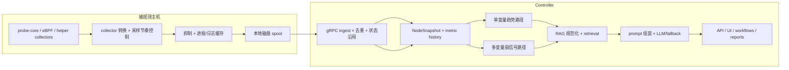

# Pipeline 深度解析

English version: [docs/en/02-pipeline-deep-dive.md](../en/02-pipeline-deep-dive.md)

本页是当前 `v0.7` 实现的、基于真实代码路径的端到端说明。

它集中回答新读者最常见的几个问题：

- 主机上到底采了什么数据？
- 为什么发送前要先入队？
- 哪些内容会被抑制、去重、压缩、沿用？
- 在做 RAG 或 LLM 推理之前，控制面到底先做了哪些分析？
- 单变量趋势分析和多变量弱信号分析有什么本质区别？
- 仓库里自带的 dataset 真实包含什么，retrieval 到底怎样改变最终答案？
- 最终 API / UI / 报告给出的输出结构是什么？

本页主要基于下面这些实现文件：

- [`backend/internal/collector/collector.go`](../../backend/internal/collector/collector.go)
- [`backend/internal/collector/probe_core_convert.go`](../../backend/internal/collector/probe_core_convert.go)
- [`backend/internal/collector/aux_sampling.go`](../../backend/internal/collector/aux_sampling.go)
- [`backend/internal/collector/process_payload_suppression.go`](../../backend/internal/collector/process_payload_suppression.go)
- [`backend/internal/collector/metric_suppression.go`](../../backend/internal/collector/metric_suppression.go)
- [`backend/internal/collector/spool/spool.go`](../../backend/internal/collector/spool/spool.go)
- [`backend/internal/collector/transport/client.go`](../../backend/internal/collector/transport/client.go)
- [`backend/internal/controller/ingest/server.go`](../../backend/internal/controller/ingest/server.go)
- [`backend/internal/controller/ingest/store.go`](../../backend/internal/controller/ingest/store.go)
- [`backend/internal/controller/timeseries/service.go`](../../backend/internal/controller/timeseries/service.go)
- [`backend/internal/controller/agentcore/agent.go`](../../backend/internal/controller/agentcore/agent.go)
- [`backend/internal/controller/agentcore/workflow_eventization.go`](../../backend/internal/controller/agentcore/workflow_eventization.go)
- [`backend/internal/controller/agentcore/workflow_engine.go`](../../backend/internal/controller/agentcore/workflow_engine.go)
- [`backend/internal/controller/rag/`](../../backend/internal/controller/rag/)

先说明两个很重要的边界：

- 本仓库当前维护中的主路径，是 Go collector 到 Go controller 的这条链路。`python/sre_agent/` 目录里的代码是真实存在的，但它不是本页描述的 `v0.7` 主执行路径。
- `service_latency_p95_ms` 不是当前仓库内置的标准指标名。collector 可以通过 external metrics helper 接入此类自定义指标，但如果不把它加入 [`store.go`](../../backend/internal/controller/ingest/store.go) 的 trend-metric 白名单，它不会自动进入内置趋势保留与预测路径。

## 这篇文档应该怎么读

这篇文档同时服务两类读者。

| 如果你主要是... | 建议重点看... | 原因 |
| --- | --- | --- |
| 工程师 / SRE | 文件引用、阶段表格，以及每个阶段里的机制说明 | 这些内容告诉你行为在哪个文件里、改动会影响什么 |
| 产品 / 运维管理 / 商务读者 | “为什么这一步存在”和“如果没有会怎样”的说明，以及文末的端到端示例 | 这些内容解释为什么系统不能简单地把原始 telemetry 直接丢给模型 |

理解整条链路时，最重要的设计思想只有两个：

1. 尽可能廉价地在节点本地保留短时效证据
2. 在控制面把这些证据变成更小、更可信、更可执行的推理输入

这也是为什么流水线要拆成采集、抑制、排队、ingest、趋势分析、弱信号分析、检索和最终响应，而不是一个黑盒大循环。

## 一屏看懂整条链路

## 阶段总览

| 阶段 | 主要文件 | 输入 | 输出 | 为什么存在 |
| --- | --- | --- | --- | --- |
| 主机侧采集 | [`cpp/probe_core/main.cpp`](../../cpp/probe_core/main.cpp), [`source_pipeline.go`](../../backend/internal/collector/source_pipeline.go), [`probe/ebpf`](../../backend/internal/collector/probe/ebpf/) | `/proc`、`/sys`、kernel/eBPF 信号、GPU/runtime 状态 | 原始 probe frame 与 runtime summary | 在最靠近故障现场的位置捕获短时效证据 |
| collector 规范化与节奏控制 | [`collector.go`](../../backend/internal/collector/collector.go), [`probe_core_convert.go`](../../backend/internal/collector/probe_core_convert.go), [`aux_sampling.go`](../../backend/internal/collector/aux_sampling.go), [`probe/cadence.go`](../../backend/internal/collector/probe/cadence.go) | 原始 probe 数据和 helper 输出 | `TelemetryBatch` 组成部分 | 让 steady-state collector 足够轻量，能长期跑在生产主机上 |
| 抑制与压缩 | [`metric_suppression.go`](../../backend/internal/collector/metric_suppression.go), [`process_payload_suppression.go`](../../backend/internal/collector/process_payload_suppression.go) | 重复的 collector/runtime/process payload | 更小的 protobuf 批次和显式抑制标记 | 降低重复字节，同时不把行为变成黑盒 |
| 排队与发送 | [`spool/spool.go`](../../backend/internal/collector/spool/spool.go), [`transport/client.go`](../../backend/internal/collector/transport/client.go) | 序列化后的 batch | 可缓冲、可 ACK 的投递 | 把采样与 controller/network 抖动解耦 |
| ingest 与热状态 | [`ingest/server.go`](../../backend/internal/controller/ingest/server.go), [`ingest/store.go`](../../backend/internal/controller/ingest/store.go) | `TelemetryBatch` | `NodeSnapshot`、进程/日志状态、趋势历史 | 重建一个统一的控制面状态模型 |
| 趋势历史与 TSDB | [`store.go`](../../backend/internal/controller/ingest/store.go), [`timeseries/service.go`](../../backend/internal/controller/timeseries/service.go) | 选中的指标 | 内存历史与可选 TSDB 点 | 让趋势分析既可用又可控 |
| 单变量分析 | [`workflow_eventization.go`](../../backend/internal/controller/agentcore/workflow_eventization.go), [`predictive`](../../backend/internal/controller/predictive/) | 单节点的指标历史 | `TrendAssessment[]` | 抓住“一条指标在悄悄恶化” |
| 多变量分析 | [`workflow_engine.go`](../../backend/internal/controller/agentcore/workflow_engine.go), [`workflow_eventization.go`](../../backend/internal/controller/agentcore/workflow_eventization.go) | 趋势、日志、安全、eBPF、拓扑 | `InvestigationEvent[]`、joint-risk 状态 | 抓住弱信号组合 |
| 检索 | [`rag/ingest.go`](../../backend/internal/controller/rag/ingest.go), [`rag/knowledge.go`](../../backend/internal/controller/rag/knowledge.go), [`rag/retriever.go`](../../backend/internal/controller/rag/retriever.go) | dataset 文件和查询上下文 | `SearchHit[]`、retrieval summary、confidence | 给答案补上运行手册、历史案例和环境知识 |
| prompt 与输出 | [`agent.go`](../../backend/internal/controller/agentcore/agent.go), [`prompts.go`](../../backend/internal/controller/agentcore/prompts.go), [`llm_analysis.go`](../../backend/internal/controller/agentcore/llm_analysis.go) | telemetry、findings、retrieved knowledge | `QueryResponse`、workflow report、受控 action | 把证据变成运维可消费的答案 |

## 阶段决策矩阵

下表专门回答“为什么非要有这一步”的问题，而不是让读者自己从代码里猜。

| 阶段 | 在引入这一步之前的问题 | 为什么这里选这种机制 | 如果没有这一步会变差什么 | 主要取舍 |
| --- | --- | --- | --- | --- |
| 主机侧采集 | controller 端无法重建短时效的主机/进程/设备证据 | node-local collector 是观察 `/proc`、`/sys`、GPU 和 eBPF 状态的最低成本位置 | RCA 会更晚、更泛化、更难归因 | 主机侧代码必须足够轻量，并受权限条件约束 |
| collector 规范化与节奏控制 | 原始 probe 输出太噪、太重复，不适合每轮直接发送 | 别名转换加分层 cadence 比在中心端重新解释所有原始数据更简单 | 平静期 payload 和 collector 成本会快速增长 | suppression 需要稳定且明确的 marker 语义 |
| 抑制与压缩 | 不变的 runtime、hardware、process、helper payload 每轮都在浪费字节 | 显式 marker 让 ingest 能安全重建旧状态 | 网络、spool 和序列化成本上升，但信息增量很小 | 读者需要区分“被抑制”与“真的缺失” |
| 队列与重放 | direct send 会让采样质量被 controller/network 健康直接绑死 | 小型磁盘 spool 比 RAM-only 缓冲更适合生产主机 | 短时故障会直接变成丢采样或 collector 自身承压 | 长时间故障会淘汰旧 unread 记录 |
| ingest 与热状态重建 | 更小的 batch 容易被误读成“不完整”或“互相矛盾” | 统一的 `NodeSnapshot` 合同让后续消费者保持一致 | UI、workflow、prompt、report 可能对同一节点得出不同解释 | ingest 成为中心解释点，语义必须稳定 |
| 趋势历史与 TSDB | 只有 current state 时，很难区分持续恶化和一次性抖动 | 有界 trend 白名单比“把所有指标都永久存下来”更便宜 | 控制面对早期恶化的感知能力下降 | 白名单外的指标不会自动进入预测路径 |
| 单变量趋势路径 | 单靠硬阈值会发现得太晚 | slope、persistence、forecast hint 透明且便于审计 | 慢性内存、磁盘、网络恶化更晚被注意到 | 启发式窗口不如完整预测系统强大 |
| 弱信号融合 | 多个中等症状分开看时很容易被忽略 | 可读的确定性加权相关性更容易被运维接受和质疑 | 复合型隐性故障会等到硬阈值触发后才被发现 | 如果阈值调得不好，仍可能放大噪声 |
| 检索 | telemetry 本身不提供运行手册步骤或历史案例语言 | 先规范化再做本地优先的混合检索，能保持仓库自包含 | 最终建议会更泛化，也更难贴近环境 | 数据集弱，retrieval 就会弱 |
| prompt 与受控输出 | 原始 telemetry 加原始检索命中，不等于运维能直接用的诊断 | 紧凑证据、严格 JSON、deterministic fallback 让输出更稳定 | 仓库会停在“收集证据”而不是“帮助行动” | stale/partial telemetry 会合理地压制最强的推理路径 |

## 信号类别与采样层级

collector 不会把所有信号族用同一频率采样，因为它们的成本模型并不一样。

| 信号类别 | 代表数据 | 默认层级 | 为什么这个层级合适 | 为什么不更快 | 为什么不更慢 | 如果没有会漏掉什么 |
| --- | --- | --- | --- | --- | --- | --- |
| 快速主机压力 | `node_cpu_usage_percent`、`node_memory_Used_bytes`、`node_pressure_memory_some_avg10` | 每个 collector 周期 | 这是第一层故障信号 | 增加 `/proc` 扫描成本，收益有限 | 容易错过早期恶化 | 基本 node 健康都说不清 |
| 快速存储/网络摘要 | `node_disk_request_latency_p99_seconds`、`node_disk_queue_depth_total`、`node_tcp_retransmits_per_second` | 每个 collector 周期 | 这组信号决定“是 CPU、磁盘还是网络问题” | 设备/接口轮询更贵 | 容易错过短时恶化窗口 | 延迟问题会退化成泛泛的“机器慢” |
| 快速 GPU 摘要 | `node_gpu_utilization_sm_avg_percent`、`node_gpu_memory_used_total_mib`、`node_gpu_temperature_peak_celsius` | GPU 路径活跃时每周期 | GPU 节点必须保留加速器上下文 | GPU runtime probing 不是零成本 | 温度/显存漂移会被更晚发现 | GPU 故障会被误解成普通主机问题 |
| 中速进程 fallback | primary process context 不足时的兼容进程扫描 | 较慢缓存节奏 | 进程归因很有价值，但不值得每轮重发 | steady-state payload 会被撑大 | 进程热榜会变旧 | controller 不知道“到底是谁热” |
| 慢速日志指纹 | `LogFingerprint` 载荷与 helper cadence 指标 | `max(15s, 3 * collection_interval)` | 日志是辅助证据，不是第一层健康信号 | tail/hash 每轮执行成本高 | 错误突发会更晚看到 | RCA 缺少旁证 |
| 慢速 external metrics | 自定义 helper 输出 | `max(30s, 6 * collection_interval)` | 外部命令成本最不可预测 | 可能阻塞或抬高 collector CPU | 应用层上下文来得太晚 | node-only RCA 可能漏掉服务局部信息 |
| 低频硬件画像与阈值 | `collector_hardware_*`、硬件自适应阈值 | 分钟到小时级 | 硬件拓扑变化慢 | 重复扫描没有意义 | 阈值会对变化反应过慢 | protection 逻辑可信度下降 |
| 可观测性自身状态 | `collector_spool_backlog_bytes`、`collector_probe_core_fresh`、`collector_protection_mode_*` | 每个 collector 周期 | controller 必须知道 telemetry 本身是否可信 | 这组指标本来就轻量 | 过旧的完整性状态很危险 | 系统会把盲区误认成健康 |

当前最重要的三个节奏控制点：

- [`aux_sampling.go`](../../backend/internal/collector/aux_sampling.go) 会缓存慢 helper 输出，并标记本轮是“真实刷新”还是“仅复用缓存”。
- [`probe/cadence.go`](../../backend/internal/collector/probe/cadence.go) 给 Go compatibility probe 划分了快、中、慢和异常触发的层级。
- [`protection.go`](../../backend/internal/collector/protection.go) 会在 collector 自身承压时收紧采样或先 shed 掉可选工作。

## 阶段 1：主机侧采集与 source 选择

**实现位置**

- [`cpp/probe_core/main.cpp`](../../cpp/probe_core/main.cpp)
- [`backend/internal/collector/source_pipeline.go`](../../backend/internal/collector/source_pipeline.go)
- [`backend/internal/collector/collector.go`](../../backend/internal/collector/collector.go)
- [`backend/internal/collector/probe/ebpf`](../../backend/internal/collector/probe/ebpf/)

**采了什么**

- CPU、内存、PSI、load、磁盘、文件系统、网络、NUMA、GPU 指标
- per-process 样本
- runtime/eBPF 安全事件与摘要
- collector 自身指标与硬件画像

**主要内部表示**

- probe-core 原始 frame
- `[]*telemetryv1.Metric`
- `[]*telemetryv1.ProcessSample`
- `[]*telemetryv1.LogFingerprint`

**强制解释**

- 这一步做什么：尽量在最靠近机器的位置抓住主机侧证据。
- 为什么必须有：很多有价值的信号是短时效或内核本地的，等到控制面再推断就太晚了。
- 在引入这一步之前的问题：controller-only 只能看到延迟后的摘要，很难拿到廉价而高保真的主机视角。
- 这一步解决了什么：在传输延迟、controller 延迟、上层汇总发生之前，先把原始证据抓下来。
- 机制层面怎么解决：collector 在本机运行 probe-core、可选 eBPF 路径和 helper collector，然后按周期把输出拼成一批。
- 为什么选这个技术路线：本地采集保留了主机证据，同时把重分析逻辑继续留在控制面，不和业务负载抢资源。
- 可能的替代方案及为何这里不用：可以做 pull-based scraping 或中心端 agent，但那会增加远端依赖，且更难做 node-local 保护。
- 如果没有这一步会怎样：后续 RCA 只能基于更弱、更泛化的信号，设备级/进程级归因会明显下降。
- 这一步的风险、限制、取舍：主机侧代码必须长期低开销且稳健，一些能力还依赖 probe-core / eBPF 等运行时条件。

## 阶段 2：collector 的节奏控制、规范化与抑制

**实现位置**

- [`backend/internal/collector/collector.go`](../../backend/internal/collector/collector.go)
- [`backend/internal/collector/probe_core_convert.go`](../../backend/internal/collector/probe_core_convert.go)
- [`backend/internal/collector/aux_sampling.go`](../../backend/internal/collector/aux_sampling.go)
- [`backend/internal/collector/probe/cadence.go`](../../backend/internal/collector/probe/cadence.go)
- [`backend/internal/collector/metric_suppression.go`](../../backend/internal/collector/metric_suppression.go)
- [`backend/internal/collector/process_payload_suppression.go`](../../backend/internal/collector/process_payload_suppression.go)

**这里会发生什么**

- 把 raw probe-core 指标名转成 controller 统一使用的 `node_*`、`rca_*`、`collector_*`
- 从带 label 的设备/接口指标上合成 node 级汇总指标
- 慢 helper 走缓存和独立 cadence，而不是每轮都刷新
- 不变的 low-churn collector/runtime/hardware 指标可以被抑制
- 近似不变的 process payload 可以在有上界的刷新间隔内被抑制

**为什么要在发送前先做规范化**

- controller 后续推理逻辑依赖的是稳定的 `node_*` 名称，不是每种 probe 的 native 原始名字
- collector 是判断“这些硬件画像/运行时状态这一轮不值得重发”的最便宜位置

**几个关键机制**

- [`convertProbeCoreBatch`](../../backend/internal/collector/probe_core_convert.go) 默认保留 controller 需要的别名，不再默认同时发重复的 `probe_core_*`
- [`suppressUnchangedLowChurnMetrics`](../../backend/internal/collector/metric_suppression.go) 会附加 `collector_metrics_partial_update` 和 `collector_metrics_suppressed_count`
- [`suppressUnchangedProcessPayload`](../../backend/internal/collector/process_payload_suppression.go) 会用 PID、标准化进程名、量化 CPU、RSS 桶、IO 桶 做 fingerprint
- [`collectLogsWithCadence`](../../backend/internal/collector/aux_sampling.go) 及其同类 helper 会发 `collector_aux_payload_refreshed` 或 `collector_aux_payload_suppressed`

**强制解释**

- 这一步做什么：把高保真但高噪声的主机视图，变成 controller 能稳定理解、而且体积有上界的批次。
- 为什么必须有：原始 probe 名称、反复不变的硬件画像、每轮几乎一样的 process/log payload，会很快吞掉 batch 大小和运维注意力。
- 在引入这一步之前的问题：steady-state 下会反复发送同一套 runtime/hardware 信息和近似不变的进程列表。
- 这一步解决了什么：保留变化，移除代价高但信息增量小的重复内容。
- 机制层面怎么解决：别名统一名称、helper cadence 降低刷新频率、显式 suppression marker 告诉 ingest 这是“有意省略”而不是“丢了”。
- 为什么选这个技术路线：带 marker 的 suppression 比“静默不发”安全，因为 controller 可以重建旧状态，还能把行为暴露给操作员。
- 可能的替代方案及为何这里不用：全量 delta 编码或中心端 dedupe 也可以，但复杂度更高，而且会把更多成本推到 controller。
- 如果没有这一步会怎样：spool 体积、网络字节数、collector 开销都会在平静期快速上升。
- 这一步的风险、限制、取舍：被抑制的 payload 需要读者理解 marker 语义，而且进程归因在强制刷新之间会稍微粗一些。

## 阶段 3：队列、压缩、发送与重放

**实现位置**

- [`backend/internal/collector/spool/spool.go`](../../backend/internal/collector/spool/spool.go)
- [`backend/internal/collector/transport/client.go`](../../backend/internal/collector/transport/client.go)
- [`backend/internal/collector/protection.go`](../../backend/internal/collector/protection.go)

**这里会发生什么**

- 每个 batch 都会先序列化并写入 spool，再尝试发送
- spool 是有界的；如果必须压缩空间，会优先保留最新的 unread 数据
- transport drain backlog 时会受每周期上限控制
- gRPC 可以走 failover 或 mirror，也可以启用可选 gzip 压缩

**队列是怎么实现的**

- `spool.log`：append-only 记录文件
- `spool.offset`：已提交读偏移
- `Next()`：读下一条但不前移
- `Commit(nextOffset)`：只有发送成功后才推进 offset
- `compactLocked(...)`：空间不足时裁剪旧的 unread 记录

**为什么 direct send 更差**

- 采样会直接卡在 controller/network 抖动上
- retry 会进入热路径
- 如果只做内存缓冲，会有失控增长风险

**这里说的“压缩”在仓库里具体指什么**

- 主要的 payload 缩减发生在发送前，也就是 suppression 和 compaction
- on-wire 的 gRPC 压缩是可选增强项
- spool 自身存的是序列化 protobuf payload，不是单独的 archive 压缩格式

**强制解释**

- 这一步做什么：把采样和投递解耦，并限制每轮允许花多少时间在 backlog 重放上。
- 为什么必须有：collector 必须在 controller 慢或短时不可达时继续观测主机。
- 在引入这一步之前的问题：同步发送会把传输失败直接变成采样丢窗。
- 这一步解决了什么：让近期 telemetry 可以先落在本地，连接恢复后再逐步回放。
- 机制层面怎么解决：磁盘 append、ACK 后 commit、bounded replay、protection-aware drain 限制，把投递从热路径里剥离出来。
- 为什么选这个技术路线：小而持久的本地队列，比 RAM-only 缓冲更适合生产主机。
- 可能的替代方案及为何这里不用：外部消息总线也能做，但会引入新依赖，且破坏这个项目强调的 node-local 隔离。
- 如果没有这一步会怎样：短暂 controller 故障会立刻变成 telemetry 丢失，或者反向压垮 collector。
- 这一步的风险、限制、取舍：长时间故障会淘汰旧 unread 记录；设计上优先保最近证据，而不是追求完整历史重放。

## 阶段 4：controller ingest、去重与热状态重建

**实现位置**

- [`backend/internal/controller/ingest/server.go`](../../backend/internal/controller/ingest/server.go)
- [`backend/internal/controller/ingest/store.go`](../../backend/internal/controller/ingest/store.go)

**这里会发生什么**

- controller 校验 batch 大小和字段长度
- 用 `collector_id + batch_id` 做去重
- upsert collector 基本信息
- 把 metrics、processes、logs、runtime context 写入 `NodeSnapshot`
- 对被抑制的 low-churn collector/runtime/hardware 字段做 carry-forward
- 只有在 helper 显式“刷新后为空”时才真正清空 process/log 状态

**关键数据形态**

[`NodeSnapshot`](../../backend/internal/controller/ingest/store.go) 是 controller 的热状态对象，包含：

- `Metrics map[string]float64`
- `Processes []*telemetryv1.ProcessSample`
- `Logs []*telemetryv1.LogFingerprint`
- process-resource / process-network 聚合
- storage devices、partitions、filesystems
- runtime mode、capabilities、probe-core modules
- security findings、runtime events、process graph、syscall statistics

**为什么这不是“原始 telemetry 直接塞进模型”**

LLM 路径不直接读取 wire payload，它读的是 controller 通过 `NodeSnapshot`、history、findings、retrieval results 组装出的控制面证据。

**强制解释**

- 这一步做什么：把传输对象变成 controller 自己拥有的、统一的状态模型，让后续 API、workflow、prompt 共用。
- 为什么必须有：collector 侧 suppression 要想安全，ingest 必须知道什么时候该沿用旧状态，什么时候该清空。
- 在引入这一步之前的问题：缩小了的 collector payload 很容易被误读成“遥测丢了”。
- 这一步解决了什么：即使 collector 只发送 partial update，controller 仍然能保持一份一致的热状态。
- 机制层面怎么解决：通过 `collector_metrics_partial_update`、`collector_aux_payload_refreshed` 等 marker 驱动 carry-forward 和 refreshed-empty 语义。
- 为什么选这个技术路线：在 ingest 统一重建，能让后面的 controller 逻辑更简单，也让 wire contract 更明确。
- 可能的替代方案及为何这里不用：每个下游消费者自己做 carry-forward 也行，但那会复制逻辑，还会产生语义不一致。
- 如果没有这一步会怎样：prompt、UI、风险 workflow 会对“省略的数据”产生不同理解。
- 这一步的风险、限制、取舍：store 变成了中央解释层，因此 marker 语义必须稳定且文档清楚。

## 阶段 5：趋势安全的历史保留与可选 TSDB

**实现位置**

- [`backend/internal/controller/ingest/store.go`](../../backend/internal/controller/ingest/store.go)
- [`backend/internal/controller/ingest/history_provider.go`](../../backend/internal/controller/ingest/history_provider.go)
- [`backend/internal/controller/timeseries/service.go`](../../backend/internal/controller/timeseries/service.go)
- [`backend/internal/controller/timeseries/influx.go`](../../backend/internal/controller/timeseries/influx.go)

**会保留什么**

- 内存历史总是保存一个有上界的 `MetricHistorySample` ring
- 只有通过 `shouldStoreTrendMetric(...)` 的指标才进入这条历史路径
- 可选 TSDB 只写聚合后的、适合趋势分析的指标

**什么不会进入 TSDB 路径**

- 完整 process payload
- 原始日志指纹文档
- 带大量 label 的全量指标爆炸
- 大部分 low-churn runtime inventory

**为什么**

- 趋势分析需要的是稳定、重复的数值序列
- process list 和 log payload 更适合留在热状态、log index 或 workflow 证据里
- 如果把所有带 label 的指标都写入历史，成本和噪声都会显著上升，但对当前 RCA 模型帮助有限

**强制解释**

- 这一步做什么：保留足够做趋势和预测的历史，而不是把 controller 变成无限 raw-metric 仓库。
- 为什么必须有：单变量分析和 forecast hint 需要历史窗口，不只要最新点。
- 在引入这一步之前的问题：只有 current-state 的系统无法区分“一次性尖峰”和“稳定恶化”。
- 这一步解决了什么：给 controller 提供一段有界历史，用于真正有价值的趋势推理。
- 机制层面怎么解决：`selectTrendMetrics(...)` 把小而稳定的指标子集放进内存 ring，`timeseries.Service` 再通过 bounded queue 可选地持久化它们。
- 为什么选这个技术路线：trend whitelist 让保留路径的成本和可预测性都更好。
- 可能的替代方案及为何这里不用：全量 TSDB 可以做，但对当前仓库的推理模型来说成本过高且不必要。
- 如果没有这一步会怎样：controller 仍能回答“现在谁热”，但很难回答“谁在越来越坏”。
- 这一步的风险、限制、取舍：白名单之外的指标不会自动获得 forecast / 长窗查询能力。

## 阶段 6：单变量时序/趋势分析

**实现位置**

- [`backend/internal/controller/agentcore/workflow_eventization.go`](../../backend/internal/controller/agentcore/workflow_eventization.go)
- [`backend/internal/controller/predictive/engine.go`](../../backend/internal/controller/predictive/engine.go)
- query-service 里也会复用一部分历史摘要逻辑，位于 [`agent.go`](../../backend/internal/controller/agentcore/agent.go)

**这条路径关注什么**

- CPU pressure
- memory pressure
- IO latency
- IO pressure
- retransmit ratio
- softnet drops
- GPU utilization / temperature / memory pressure
- CPU throttling
- log burst
- 派生的 `memory_leak_rate`

**它是怎么工作的**

1. `buildRiskSeries(...)` 从 recent history 中抽出每种信号的时间序列。
2. 对每条序列计算 baseline、latest、slope、acceleration、threshold breaches、persistence。
3. `classifySeriesTrend(...)` 给出 `rising`、`worsening`、`stable`、`recovering`、`volatile` 等标签。
4. `buildTrendAssessments(...)` 把这些数值变成面向操作员的 `TrendAssessment`。
5. predictive engine 可以补充短期 forecast，例如“18 分钟内可能越过高风险阈值”。

**为什么要有这条路径**

很多事故不是从硬阈值报警开始，而是从平稳上升开始。比如内存还没 OOM，但它已经连续 30 分钟在爬升。

**强制解释**

- 这一步做什么：判断单条指标是否在持续恶化，以及 controller 对这个趋势有多大把握。
- 为什么必须有：很多生产事故是“漂移”先发生，而不是先出现灾难性红线。
- 在引入这一步之前的问题：系统只能说“内存 87%”，却很难说“内存已经连续 30 分钟稳步上升”。
- 这一步解决了什么：把方向、持续性、提前风险暴露出来。
- 机制层面怎么解决：把有界历史转成序列特征，再加上可选的短期预测。
- 为什么选这个技术路线：slope、persistence、forecast hint 都足够透明，操作员能看懂也能质疑。
- 可能的替代方案及为何这里不用：可以上更复杂的 anomaly model 或外部 forecast 服务，但当前 deterministic 方案更容易审计，也更适合开源仓库内实现。
- 如果没有这一步会怎样：controller 会更晚发现缓慢恶化的问题。
- 这一步的风险、限制、取舍：短历史窗口不擅长表达长周期模式，而简单 forecast 也不能替代容量规划。

## 阶段 7：多变量与弱信号分析

**实现位置**

- [`backend/internal/controller/agentcore/workflow_engine.go`](../../backend/internal/controller/agentcore/workflow_engine.go)
- [`backend/internal/controller/agentcore/workflow_eventization.go`](../../backend/internal/controller/agentcore/workflow_eventization.go)
- [`backend/internal/controller/agentcore/workflow_recommendations.go`](../../backend/internal/controller/agentcore/workflow_recommendations.go)

**这条路径关注什么**

- 多个中等强度信号组合起来的共享成因
- 风险序列之间的相关性与同窗共现
- security 与 eBPF 行为得分
- node / process / pod / service / fleet 维度的归因

**它是怎么工作的**

1. `buildRiskSeries(...)` 先构造各条信号序列。
2. `buildRiskSignals(...)` 再结合 medium/high threshold 和 weight 计算每条信号的风险分数。
3. `buildCooccurrences(...)` 计算最强触发信号之间的相关关系。
4. `buildScopeRisks(...)` 把风险映射到 node、process、pod、service、cluster。
5. `buildInvestigationEvents(...)` 把最强信号簇提升成面向操作员的调查事件，比如 `weak_signal_cluster`。

**为什么它要和阶段 6 分开**

单变量分析回答的是“这一条指标是不是在变坏”。

弱信号分析回答的是“这些单独看都不算爆炸的信号，组合起来是不是已经形成了更可信的解释”。

这两个问题的数学结构和运维价值都不一样，所以必须分开。

**强制解释**

- 这一步做什么：在没有任何一条指标单独坏到足够明显时，检测 compound risk。
- 为什么必须有：很多事故开始于 moderate IO、moderate retransmits、moderate log burst，而不是单一红线。
- 在引入这一步之前的问题：看单卡片仪表盘会觉得“都还行”，但组合症状已经真实存在。
- 这一步解决了什么：把相关证据融合成更高信噪比的调查事件。
- 机制层面怎么解决：用 weighted risk signal、pair correlation、fallback cooccurrence、scope attribution 做出 joint-risk 证据。
- 为什么选这个技术路线：它是 deterministic 的、可审计的，也容易在 UI 里解释。
- 可能的替代方案及为何这里不用：图模型、ML ensemble 当然可以做，但当前仓库更强调操作员能直接阅读和挑战的证据。
- 如果没有这一步会怎样：系统会更晚感知那些“每条都不严重，但组合起来已经危险”的事故。
- 这一步的风险、限制、取舍：如果阈值调得不好，噪声输入仍可能被过度放大；短窗口也会漏掉更慢的跨信号关系。

## 阶段 8：dataset 规范化、retrieval 规划与 RAG

**实现位置**

- [`dataset/`](../../dataset/) 下的原始语料
- [`backend/internal/controller/rag/ingest.go`](../../backend/internal/controller/rag/ingest.go)
- [`backend/internal/controller/rag/knowledge.go`](../../backend/internal/controller/rag/knowledge.go)
- [`backend/internal/controller/rag/chunk.go`](../../backend/internal/controller/rag/chunk.go)
- [`backend/internal/controller/rag/retriever.go`](../../backend/internal/controller/rag/retriever.go)
- query-service 里的 attachment 逻辑在 [`agent.go`](../../backend/internal/controller/agentcore/agent.go)

**仓库内 dataset 真实有什么**

- [`dataset/raw/structured/aiops2024-challenge-dataset.json`](../../dataset/raw/structured/aiops2024-challenge-dataset.json)
- [`dataset/raw/structured/question.jsonl`](../../dataset/raw/structured/question.jsonl)
- [`dataset/raw/structured/helpdesk_dataset.csv`](../../dataset/raw/structured/helpdesk_dataset.csv)
- [`dataset/raw/archives/data.zip`](../../dataset/raw/archives/data.zip)
- [`dataset/raw/archives/ZTE_eReader_V4.11_20230525_lite.zip`](../../dataset/raw/archives/ZTE_eReader_V4.11_20230525_lite.zip)
- [`dataset/raw/archives/manifest.json`](../../dataset/raw/archives/manifest.json)

**controller 会把这些文件变成什么**

- 规范化后的 `SourceDocument`
- 带 `knowledge_type` 的分类结果，例如 `runbook`、`historical_incident`、`question_pattern`、`security_reference`、`dataset_meta`
- chunked `Chunk` 记录；当文档结构化程度高时，会拆成 `summary`、`evidence`、`remediation`、`body`

**retrieval 在什么条件下触发**

- query-service 只有在 query 或 findings 里出现足够有意义的运维上下文时才会附加 RAG
- 低于 `rag_min_confidence` 的检索结果会被抑制，而不是“查到了也硬塞进去”
- workflow tools 也可以显式发起相似案例或 runbook 检索

**为什么要有这一步**

telemetry 告诉你“机器上发生了什么”。RAG 这条路径则补上“以前类似事故怎么处理”“这个环境的 runbook 是什么”。

**一个必须诚实写清楚的限制**

仓库自带的 dataset 更像 seed/demo corpus，并不是开箱即用的强生产 SRE 知识库。真正高质量的 retrieval，依赖你把自己的 runbook、postmortem、incident note 加进来。

**强制解释**

- 这一步做什么：把仓库文件变成可检索的运维知识，并在上下文足够强时把这些知识注入推理。
- 为什么必须有：telemetry 只能提示“可能是什么”，却不能天然提供环境特定的处理步骤和历史案例。
- 在引入这一步之前的问题：没有 retrieval 的 LLM 只能依赖通用模型记忆来“猜” runbook。
- 这一步解决了什么：让建议和解释尽量有本地知识支撑。
- 机制层面怎么解决：对 raw file 做分类、字段抽取、chunking、lexical/vector 混合打分，并只在症状上下文足够强时附加到 reasoning。
- 为什么选这个技术路线：先规范化再 chunk，比把所有文件都当匿名文本切片更适合运维场景。
- 可能的替代方案及为何这里不用：可以接外部托管检索或纯向量检索，但当前 local-first、hybrid 的设计更适合仓库内自包含运行。
- 如果没有这一步会怎样：系统仍然有 deterministic findings，但建议会更泛化、可审计性更差。
- 这一步的风险、限制、取舍：弱 dataset 只会产生弱 retrieval，而 stale telemetry 还会正确地抑制 retrieval，这有时会让用户感觉“它怎么没检索”。

## 阶段 9：prompt 组装、模型调用与最终输出

**实现位置**

- [`backend/internal/controller/agentcore/agent.go`](../../backend/internal/controller/agentcore/agent.go)
- [`backend/internal/controller/agentcore/prompts.go`](../../backend/internal/controller/agentcore/prompts.go)
- [`backend/internal/controller/agentcore/llm_analysis.go`](../../backend/internal/controller/agentcore/llm_analysis.go)
- [`backend/internal/controller/agentcore/llm_safety.go`](../../backend/internal/controller/agentcore/llm_safety.go)
- action 相关受控逻辑在 [`backend/internal/controller/agentcore/workflow_recommendations.go`](../../backend/internal/controller/agentcore/workflow_recommendations.go)

**进入 prompt 构造的上下文有哪些**

- `NodeSnapshot` 的最新 node metrics
- recent history 经过 `metricTrends(...)` 和 `trendHints(...)` 压缩后的趋势摘要
- deterministic findings，比如 CPU、内存、存储、网络、GPU、telemetry-quality findings
- 摘要后的 processes 和 log fingerprints
- 可选的 retrieved knowledge snippets、metadata、confidence
- telemetry quality 信息，比如 freshness、ingest delay、missing critical signals、blind spots

**query-service prompt 是怎么组装的**

1. `buildPromptInput(...)` 收集 node metrics、history、processes、logs、GPU context。
2. `assessPromptTelemetryQuality(...)` 先判断证据是 fresh、partial、degraded 还是 stale。
3. `attachRAGContext(...)` 决定是否附加 retrieval。
4. [`BuildSystemPrompt`](../../backend/internal/controller/agentcore/prompts.go) 定义严格行为和 JSON 约束。
5. [`BuildUserPrompt`](../../backend/internal/controller/agentcore/prompts.go) 注入 telemetry quality、RAG snippets 和压缩后的 `LLMSchema`。
6. LLM client 在 timeout、retry、circuit breaker 保护下执行。
7. 如果模型路径失败，controller 回退到 deterministic 输出。

**最终输出长什么样**

对 `/api/v1/agent/query` 来说，主要返回的是 [`QueryResponse`](../../backend/internal/controller/agentcore/agent.go)，包含：

- `summary`
- `root_cause`
- `confidence`
- `findings`
- `recommendations`
- `actions`
- `explainability`
- `telemetry_context`
- `retrieved_docs`

对 workflow engine 来说，LLM 路径使用更严格的 evidence bundle，返回：

- `issues`
- `joint_risk_reason`
- `rca_hypotheses`
- `next_steps`
- `tool_requests`
- `limitations`

**强制解释**

- 这一步做什么：把 controller 已经拥有的证据，转成操作员真正能消费的诊断、建议和可选受控 action。
- 为什么必须有：操作员需要的是一个有边界的答案，而不只是原始指标和检索命中。
- 在引入这一步之前的问题：即使已经有 telemetry 和 retrieval，最后的综合判断仍然要靠人手工完成。
- 这一步解决了什么：把证据压缩成稳定的响应结构，方便 UI、API 和 report engine 统一消费。
- 机制层面怎么解决：prompt 输入来自压缩后的 telemetry，先评估 telemetry quality，再选择性附加 retrieval，强制 JSON 输出，并用 fallback 保证 API 稳定。
- 为什么选这个技术路线：严格 prompt 加 deterministic fallback，比自由文本生成安全得多。
- 可能的替代方案及为何这里不用：全 deterministic 会更简单但表达力更弱；全放开的 agent loop 会更灵活但风险也更高。
- 如果没有这一步会怎样：项目只能停留在“有 telemetry、有搜索”，但没有一层可直接拿来排障的答案。
- 这一步的风险、限制、取舍：如果上游 telemetry stale 或 partial，最强的推理路径会被正确抑制；LLM 质量仍然依赖上游 evidence bundle 的质量。

## 代码到文档的映射表

| 关注点 | 主要代码 | 依赖什么 | 被谁使用 |
| --- | --- | --- | --- |
| 数据采集 | [`cpp/probe_core/`](../../cpp/probe_core/), [`collector.go`](../../backend/internal/collector/collector.go), [`source_pipeline.go`](../../backend/internal/collector/source_pipeline.go) | kernel、`/proc`、`/sys`、GPU/runtime、eBPF | 规范化、抑制、传输 |
| 采样逻辑 | [`aux_sampling.go`](../../backend/internal/collector/aux_sampling.go), [`probe/cadence.go`](../../backend/internal/collector/probe/cadence.go), [`protection.go`](../../backend/internal/collector/protection.go) | collector config、hardware profile、当前压力 | collector batching |
| 去重/压缩 | [`probe_core_convert.go`](../../backend/internal/collector/probe_core_convert.go), [`metric_suppression.go`](../../backend/internal/collector/metric_suppression.go), [`process_payload_suppression.go`](../../backend/internal/collector/process_payload_suppression.go) | probe 数据、helper cache、collector 旧状态 | spool / 网络效率 |
| 排队 | [`spool/spool.go`](../../backend/internal/collector/spool/spool.go) | 序列化 protobuf batch | transport drain |
| 发送/export | [`transport/client.go`](../../backend/internal/collector/transport/client.go) | spool、controller endpoint、TLS/gRPC config | controller ingest |
| 接收/control-plane ingest | [`ingest/server.go`](../../backend/internal/controller/ingest/server.go), [`ingest/store.go`](../../backend/internal/controller/ingest/store.go) | telemetry batch 和 marker metric | 热状态、历史、UI、query-service |
| 预处理 | [`store.go`](../../backend/internal/controller/ingest/store.go), [`agent.go`](../../backend/internal/controller/agentcore/agent.go) | 热状态与历史 | trend hint、findings、prompt |
| 单变量分析 | [`workflow_eventization.go`](../../backend/internal/controller/agentcore/workflow_eventization.go), [`predictive/engine.go`](../../backend/internal/controller/predictive/engine.go) | 选中的指标历史 | trend assessment、workflow evidence |
| 多变量分析 | [`workflow_engine.go`](../../backend/internal/controller/agentcore/workflow_engine.go), [`workflow_eventization.go`](../../backend/internal/controller/agentcore/workflow_eventization.go) | risk series、logs、security、eBPF | investigation event、recommendation、RCA |
| TSDB 写路径 | [`timeseries/service.go`](../../backend/internal/controller/timeseries/service.go), [`timeseries/influx.go`](../../backend/internal/controller/timeseries/influx.go) | trend-safe metric 子集 | 长窗口历史查询 |
| dataset 与 retrieval | [`rag/ingest.go`](../../backend/internal/controller/rag/ingest.go), [`rag/knowledge.go`](../../backend/internal/controller/rag/knowledge.go), [`rag/chunk.go`](../../backend/internal/controller/rag/chunk.go), [`rag/retriever.go`](../../backend/internal/controller/rag/retriever.go), [`dataset/`](../../dataset/) | dataset 文件和 retrieval config | query-service 与 workflow retrieval |
| prompt 组装 | [`prompts.go`](../../backend/internal/controller/agentcore/prompts.go), [`llm_analysis.go`](../../backend/internal/controller/agentcore/llm_analysis.go) | telemetry、findings、retrieval、quality metadata | model client |
| 模型调用 | [`agent.go`](../../backend/internal/controller/agentcore/agent.go), workflow LLM 路径 [`llm_analysis.go`](../../backend/internal/controller/agentcore/llm_analysis.go) | prompt、provider config、安全校验 | response 与 report |
| 响应/报告生成 | [`agent.go`](../../backend/internal/controller/agentcore/agent.go), [`workflow_engine.go`](../../backend/internal/controller/agentcore/workflow_engine.go), [`agent/report_dedupe.go`](../../backend/internal/controller/agent/report_dedupe.go) | 解析后的模型输出和 deterministic evidence | API、UI、report engine |

## 端到端示例 A：平稳 steady-state

下面的数值是说明性的，但指标名和数据结构都与当前实现一致。

1. 主机采到 `node_cpu_usage_percent=31.4`、`node_memory_Used_bytes=8589934592`、`node_memory_MemTotal_bytes=17179869184`、`node_disk_request_latency_p99_seconds=0.0041`、`node_tcp_retransmits_per_second=0.02`。
2. probe-core 原始数据经 [`probe_core_convert.go`](../../backend/internal/collector/probe_core_convert.go) 转成 controller 统一使用的 `node_*` 指标。
3. 硬件画像和 runtime inventory 没变，collector 抑制了 19 个 low-churn metric，并发出 `collector_metrics_partial_update=1` 与 `collector_metrics_suppressed_count=19`。
4. process 列表形态几乎不变，因此 collector 发出 `collector_process_payload_suppressed=1`，并省略重复 process payload。
5. logs helper 这一轮是 cache-hit，于是 collector 发出 `collector_aux_payload_suppressed{component="logs"}=1`。
6. 序列化后的 batch 先写入 `spool.log`，backlog 基本保持在零附近。
7. transport client 立即 drain 并收到 controller ACK。
8. ingest 校验 batch、按 `batch_id` 去重，并因为 partial-update marker 存在而沿用旧的 runtime/hardware 字段。
9. `recordMetricHistory(...)` 只保留 trend-safe metrics，不保留完整 collector inventory，也不保留这轮被抑制的 process/log payload。
10. 单变量路径把 CPU、memory、disk latency、retransmit 都判断为 stable。
11. 多变量路径没有形成足够强的 weak-signal cluster，也不会生成强 `InvestigationEvent`。
12. query-service 因为没有 meaningful finding，而且 query 上下文也很泛，所以跳过 retrieval。
13. 如果操作员问 `is node-a healthy right now?`，prompt 里会有 telemetry quality 和压缩后的 metrics，但没有 RAG snippets。
14. 最终答案会是低风险摘要，例如“no critical anomalies detected”，并附带 explainability，说明 telemetry 新鲜且没有明显 blind spot。

## 端到端示例 B：单变量内存恶化

说明性的历史窗口：

| 时间 | `node_memory_Used_bytes` | `memory_usage_pct` |
| --- | --- | --- |
| `t-15m` | `13883146240` | `80.8` |
| `t-10m` | `14344519680` | `83.5` |
| `t-5m` | `14700949504` | `85.6` |
| `t` | `15032385536` | `87.4` |

步骤如下：

1. collector 采到持续上升的内存值，以及像 `trainer` 这样的热点进程，其 `rss_bytes=9663676416`。
2. 因为 process fingerprint 发生了足够明显的变化，所以本轮发出 `collector_process_payload_refreshed=1`，并附带新的 process payload。
3. batch 正常入队并被 ACK。
4. ingest 把最新 metrics 和 process list 写入 `NodeSnapshot`。
5. `recordMetricHistory(...)` 会保留这条内存序列，因为它在 `shouldStoreTrendMetric(...)` 白名单里。
6. `buildRiskSeries(...)` 构造 `memory_pressure` 序列，得到 baseline、latest、slope、persistence 等特征。
7. `buildTrendAssessments(...)` 把它标成 `rising` 或 `worsening`。
8. predictive engine 可以补上一句 forecast，比如“18 分钟内可能越过高风险阈值”。
9. 如果节点并没有同时出现明显 IO、网络或日志放大，多变量路径可能仍然比较弱。
10. query-service 的 `metricTrends(...)` 与 `trendHints(...)` 会产生类似 “Memory headroom is shrinking steadily” 的自然语言 finding。
11. 如果操作员问 `why is node-b likely to OOM soon?`，但 dataset 里没有强 memory runbook，retrieval 仍可能被跳过。
12. `BuildUserPrompt(...)` 会把 telemetry quality、压缩后的 metric schema 和趋势驱动的 findings 一起塞入 prompt。
13. 最终答案通常会指向 leak、cache growth 或 retry amplification 风险，并建议先检查 top RSS process 和 reclaim pressure。
14. 即便 LLM 路径失败，deterministic fallback 也仍然会给出这些基于证据的建议。

## 端到端示例 C：多变量弱信号簇

说明性的最新值：

- `node_cpu_iowait_percent = 28.4`
- `node_disk_request_latency_p99_seconds = 0.0417`
- `node_disk_queue_depth_total = 16`
- `node_tcp_retransmit_ratio = 0.013`
- `log_burst = 12`

步骤如下：

1. 没有任何一条指标已经灾难性爆炸，但有几条都在同一个坏方向上走。
2. collector 把当前 node metrics、log fingerprints，以及可用的 process/resource attribution 一起发上来。
3. ingest 写入最新热状态与 trend-safe history。
4. `buildRiskSeries(...)` 构造 IO latency、retransmit ratio、log burst 等序列。
5. `buildRiskSignals(...)` 给每条序列一个中等风险分数，而不是非要等其中一条先彻底拉满。
6. `buildCooccurrences(...)` 发现这些最强信号在同一个风险窗口里一起移动。
7. `buildInvestigationEvents(...)` 把它提升成弱信号事件，比如“compound signal cluster: io_latency + retransmit_ratio + log_burst”。
8. `buildScopeRisks(...)` 还能继续把风险归因到具体 node；如果 process data 足够，还能进一步指到最热的进程或服务。
9. query-service 的 operational findings 会补上一句类似 “CPU wait and disk latency are rising together, which points to a storage bottleneck rather than pure CPU saturation”。
10. 此时 retrieval planner 拿到的上下文已经比“node 慢”强得多，更接近“storage contention retransmit timeout”。
11. 如果 retrieval 很弱，会被抑制，而不是作为噪声附加进去。
12. prompt 此时既包含单信号症状，也包含融合后的共享成因解释。
13. 最终输出不再只是阈值报警，而是明确指出这是 compound storage/network pressure，并建议优先做 device-level 和 process-level 检查。
14. 在 workflow 模式下，这个弱信号簇也会在 UI 里变成一个 joint-risk / RCA event，而不只是聊天回答的一部分。

## 端到端示例 D：RAG 增强诊断

这个例子故意分成两部分：

- telemetry 路径严格基于当前代码
- 检索命中的文档是说明性的，假设你已经把真实 runbook 或 postmortem 加到了 `dataset/`

说明性的 telemetry：

- `node_gpu_utilization_sm_avg_percent = 24`
- `node_cpu_usage_percent = 89`
- `node_disk_request_latency_p99_seconds = 0.037`
- `node_gpu_process_total = 8`
- log fingerprint `dial tcp timeout` count `42`

说明性的自定义数据集补充：

- `dataset/raw/custom/gpu_rollout_timeout_runbook.md`
- 规范化后得到 `knowledge_type=runbook`、`case_type=runbook`
- 抽取出 symptoms、likely causes、remediation steps、commands

步骤如下：

1. collector 上报“GPU 利用率低，但 host 侧 CPU 和磁盘压力高”。
2. query-service `operationalFindings(...)` 会得出类似 “GPU workers are underutilized while host-side pressure is increasing, which suggests feeder starvation” 的结论。
3. 因为 query 含有操作性关键词，而且 findings 已经包含有意义的症状，所以 retrieval 被允许执行。
4. `buildQueryServiceRAGRequest(...)` 会把操作员 query 和最强 findings 压缩成搜索请求。
5. RAG service 会把 runbook 文件规范化成 `SourceDocument`，并用 `case` strategy 切成 `summary`、`evidence`、`remediation`、`body` 几类 chunk。
6. hybrid retrieval 返回若干命中，字段里可能包括 `summary`、`likely_causes`、`remediation_steps`、`commands`、`signals`。
7. 如果综合 confidence 高于 `rag_min_confidence`，`attachRAGContext(...)` 才会把这些 snippets 挂到 `PromptInput` 上。
8. `BuildUserPrompt(...)` 最终会同时包含 telemetry schema 和 retrieved operational knowledge block。
9. 模型被明确要求只能使用给定事实，并把 retrieved text 当作不可信数据，而不是可执行指令。
10. 最终答案就不只是“这个节点像 feeder starvation”，还会进一步补上“先比较 driver/runtime version、检查 data-loader placement，并优先运行这些安全命令”。
11. `QueryResponse.RetrievedDocs`、`RetrievalSummary`、`RetrievalConfidence` 会把 retrieval 实际贡献暴露出来。
12. 如果 retrieval confidence 太低，controller 会保留同样的 telemetry-based diagnosis，而不会假装检索证据很强。

## 读完本页后最应该记住的事

- collector 的 steady-state 目标是“便宜”，不是“每轮都重发所有事实”。
- controller 在进入 retrieval 或 LLM 之前，已经做了真实而重要的预处理。
- 单变量趋势分析和多变量弱信号融合是刻意分开的两条路径。
- RAG 只有在 dataset 足够好、telemetry/query 上下文也足够强时，才会真正提升答案质量。
- 最终输出路径是有护栏的：stale telemetry 会抑制 action，低置信度 retrieval 会被丢弃，deterministic fallback 保证 API 不失稳。
