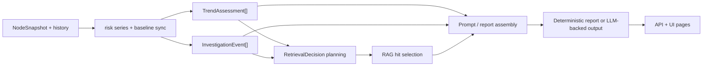

# 架构

English version: [docs/en/04-architecture.md](../en/04-architecture.md)

## 运行时角色

| 角色 | 主要职责 | 关键文件 |
| --- | --- | --- |
| `collector` | 主机侧遥测采集、批处理、spool、推送到 controller | [`backend/cmd/collector`](../../backend/cmd/collector)、[`configs/collector.yaml`](../../configs/collector.yaml) |
| `controller` | ingest、存储、HTTP API、UI、RAG、workflow | [`backend/cmd/controller`](../../backend/cmd/controller)、[`configs/controller.yaml`](../../configs/controller.yaml) |

## 数据面与控制面

| 平面 | 组件 | 为什么要分开 |
| --- | --- | --- |
| 数据面 | collector、probe-core、eBPF、本地 spool | 把主机访问、重试和背压逻辑留在每个节点本地 |
| 控制面 | controller ingest、API、UI、workflow、RAG、可选 TSDB | 把存储和更重的 RCA 工作从业务节点移开 |

这个 split 现在已经直接体现在部署感知代码里：

- [`../../backend/internal/collector/deployment.go`](../../backend/internal/collector/deployment.go)
- [`../../backend/internal/controller/deployment.go`](../../backend/internal/controller/deployment.go)

## 部署模式

| 模式 | 预期拓扑 | 自动变化的内容 |
| --- | --- | --- |
| `local-dev` | 源码 checkout 或本地单机栈 | 保留仓库相对路径默认值 |
| `standalone` | 一套 controller 服务加若干外部 collector | 默认式路径迁移到 `/var/lib/ai-sre-agent/...` |
| `cluster-lite` | 一个 controller `Deployment` 加 collector `DaemonSet` | 集群友好的路径和 ready probe 成为默认打包形态 |
| `distributed` | 多副本 controller 加 HA 与可选外部向量后端 | 同样做路径迁移，但共享后端假设更重要 |

## 遥测路径

当前维护中的 collector 路径是：

- 主机/进程主路径来自 [`cpp/probe_core/`](../../cpp/probe_core/) 里的原生 probe-core
- 内核/运行时事件主路径来自 [`configs/collector.yaml`](../../configs/collector.yaml) 中的 `ebpf`
- 当主机主路径不可用时，兼容性 fallback 会退回 `/proc` 和 sysfs
- 在发往 controller 之前，collector 会先落到本地 spool 并做有界重放

controller 通过 gRPC 接收遥测，随后分发到：

- 热内存当前态
- ingest 的内嵌持久化
- 可选的 controller 侧 TSDB
- 日志、GPU、安全和 RAG 服务
- agent 和 RCA 工作流

## 控制面调查阶段

现在的控制面已经更容易按“显式阶段”来理解，而不是把所有分析都看成一个黑盒 `AI analysis`。

主要实现文件：

- [`backend/internal/controller/agentcore/workflow_eventization.go`](../../backend/internal/controller/agentcore/workflow_eventization.go)
- [`backend/internal/controller/agentcore/workflow_engine.go`](../../backend/internal/controller/agentcore/workflow_engine.go)
- [`backend/internal/controller/agentcore/workflow_recommendations.go`](../../backend/internal/controller/agentcore/workflow_recommendations.go)
- [`backend/internal/controller/agentcore/incident_decision.go`](../../backend/internal/controller/agentcore/incident_decision.go)
- [`backend/internal/controller/agentcore/agent.go`](../../backend/internal/controller/agentcore/agent.go)

为什么这层拆分重要：

- trend 逻辑可以在硬阈值真正打爆之前发现恶化
- weak-signal fusion 可以提升“单个信号都不严重，但组合起来已经危险”的情况
- retrieval 现在有显式 decision object，而不是隐藏分支
- UI 可以直接展示中间证据，而不是只展示最终一句诊断

`/api/v1/agent/status` 里的 `control_plane` 摘要现在也直接暴露了这种拆分：

- `triggered_trends`
- `weak_signal_clusters`
- `investigation_events`
- `recommendation_count`
- `top_recommendation`

完整的控制平面解释请看 [控制平面分析](07-control-plane-analysis.md)，主机侧抑制、压缩、发送队列的细节请看 [采集队列与压缩](06-collector-queue-and-compaction.md)。

## 采样分层与主机优先降级

运行时已经不再把所有信号都当成同一种轮询任务。

快路径：

- [`backend/internal/collector/collector.go`](../../backend/internal/collector/collector.go) 里的 probe-core 主路径指标与 eBPF 摘要
- [`configs/collector.yaml`](../../configs/collector.yaml) 里的 `probe_core.interval` 与各模块 sample multiplier

中路径：

- [`backend/internal/collector/aux_sampling.go`](../../backend/internal/collector/aux_sampling.go) 里的兼容 `/proc` 进程 fallback
- 实际节奏是 `max(collection_interval, probe_core.interval * host_proc_fallback_interval_samples)`
- [`backend/internal/collector/probe/cadence.go`](../../backend/internal/collector/probe/cadence.go) 里的 legacy Go compatibility 分层：
  - 运行时导向的 extended 指标（PSI、TCP state、softnet、sockstat）：`max(2 * collection_interval, 10s)`
  - deep `/proc` 扫描、kernel-event 摘要、GPU fallback helper：`max(3 * collection_interval, 15s)`
  - RCA 类 helper：`max(6 * collection_interval, 30s)`

慢路径：

- legacy Go fallback 里的硬件类扫描（thermal zone、NIC sysfs、IRQ、RDMA）现在独立成 `max(6 * collection_interval, 30s)` 的慢层
- [`backend/internal/collector/hardware_profile.go`](../../backend/internal/collector/hardware_profile.go) 的硬件缓存发现
- `security.audit_interval`
- [`backend/internal/collector/aux_sampling.go`](../../backend/internal/collector/aux_sampling.go) 里的日志指纹和 external metrics
  - 日志：`max(15s, 3 * collection_interval)`
  - external metrics：`max(30s, 6 * collection_interval)`

异常触发的加深采样：

- 当 protection mode 进入 `incident`，这些昂贵辅助路径会临时收紧到接近当前 collector cadence
- 当 legacy Go compatibility 路径自己的基础指标出现异常，例如 `node_cpu_usage_percent >= 85`、内存使用率超过 `85%`、磁盘延迟超过 `30ms`、retransmit 超过 `0.5/s`，[`backend/internal/collector/probe/cadence.go`](../../backend/internal/collector/probe/cadence.go) 会立刻刷新更深层的 compatibility tier，而不是继续等下一个慢速刷新点
- 当 protection mode 进入 `pressure` 或 `critical`，日志、external metrics、compatibility fallback 会优先被 shed

这样拆分的目的，是让主机继续保留短时关键 workload 信号，而低价值辅助采集先退让。

## Collector 内部的负载缩减

collector 现在还会用两种方式显式减少 steady-state payload：

- [`backend/internal/collector/probe_core_convert.go`](../../backend/internal/collector/probe_core_convert.go) 默认不再重复发送大部分已经有 `node_*` 或 `rca_*` alias 的原始 `probe_core_*` 主机/资源指标。例如：
  - `probe_core_cpu_usage_percent` -> 只保留 `node_cpu_usage_percent`
  - `probe_core_memory_used_bytes` -> 只保留 `node_memory_Used_bytes`
  - `probe_core_disk_await_ms` -> 只保留 `node_disk_avg_request_latency_seconds` 以及聚合后的 `node_disk_request_latency_p99_seconds`
  - `probe_core_network_rx_bytes_per_sec` -> 只保留 `node_network_receive_bytes_per_second`
- [`backend/internal/collector/metric_suppression.go`](../../backend/internal/collector/metric_suppression.go) 会在周期性 full refresh 之间，抑制不变的低频 collector/runtime inventory。覆盖的典型家族包括：
  - `collector_probe_source`
  - `collector_runtime_*` 的 mode/capability/signal-coverage 指标
  - `collector_primary_*` / `collector_compatibility_fallback_active`
  - `collector_probe_core_collector_module_*`
  - `collector_hardware_*` 下的 inventory/capability/threshold/profile 指标
- [`backend/internal/collector/aux_sampling.go`](../../backend/internal/collector/aux_sampling.go) 现在还会在 `suppress_cached_aux_payloads: true` 时省略缓存命中的 compatibility process 列表和日志指纹，不再每个 batch 都重发同一份 helper payload
- [`backend/internal/collector/process_payload_suppression.go`](../../backend/internal/collector/process_payload_suppression.go) 现在还会在 `suppress_unchanged_process_payloads: true` 时抑制近似不变的热点进程列表；只有粗粒度进程指纹实质变化，或者达到 `process_payload_refresh_interval` 强制刷新点时，才重新带上 `TelemetryBatch.Processes`
- [`backend/internal/collector/probe/cadence.go`](../../backend/internal/collector/probe/cadence.go) 现在还可以在 `suppress_cached_compat_hardware_metrics: true` 时省略缓存命中的 compatibility 硬件层 payload。[`backend/internal/controller/ingest/store.go`](../../backend/internal/controller/ingest/store.go) 会把上一轮 thermal / NIC / RDMA 视图续接到下一轮真实硬件刷新到来之前

这样做的权衡很直接：

- steady state 下更低的 CPU、protobuf、spool 和网络开销
- batch 内容冗余更少
- 兼容性通过两个控制保留：
  - `probe_core.emit_raw_aliased_metrics: true` 可以显式恢复原始重复指标
  - `low_churn_metrics_refresh_interval` 会强制定期 full refresh，避免 controller 只依赖某一个幸运 batch

controller 侧配套了两层续接语义：

- [`backend/internal/controller/ingest/store.go`](../../backend/internal/controller/ingest/store.go) 会在 `collector_metrics_partial_update = 1` 时 carry forward 低频 collector 状态
- [`backend/internal/controller/ingest/server.go`](../../backend/internal/controller/ingest/server.go) 只会在 batch 明确打出 `collector_aux_payload_refreshed{component=...} = 1` 时，才把空的 process/log helper 结果当成“真实清空”；cache-hit 抑制不会擦掉之前的视图

## 不增加新重探针的广义硬件诊断

collector 现在还会输出一层“广义硬件 warning”，但它并不是新加一个高成本硬件扫描器，而是重用已有信号和缓存阈值：

- `collector_hardware_warning_total`
- `collector_hardware_warning{domain="cpu|memory|disk|network|gpu",reason=...,signal=...}`

这层逻辑位于 [`backend/internal/collector/hardware_warnings.go`](../../backend/internal/collector/hardware_warnings.go)，会把已有指标压缩成更容易消费的 broad hint，例如：

- CPU throttling 或重 iowait
- NUMA imbalance 或 memory pressure
- 磁盘 latency / queue congestion
- NIC retransmit、softnet drop、RDMA congestion
- GPU throttle 或显存压力

这样做的目标是：增加硬件相关解释力，但不引入新的常驻高权限探针。

## 降级边界

当前实现里，系统按下面这些层次降级：

- 缺少 eBPF 能力：collector 继续运行，但会记录降级 runtime 指标，并在可能时退回非 eBPF 来源
- probe-core 不可用或 stale：如果 `probe_core.fallback_to_go` 仍开启，source pipeline 会退回 compatibility collection
- controller 不可达：collector 先写本地 spool，之后再 drain
- controller 侧 telemetry stale 或不足：[`backend/internal/controller/agentcore/agent.go`](../../backend/internal/controller/agentcore/agent.go) 可以直接跳过 RAG 和 LLM，返回 deterministic fallback
- query-service 里的症状上下文太弱：[`backend/internal/controller/agentcore/agent.go`](../../backend/internal/controller/agentcore/agent.go) 现在会直接跳过 retrieval，而不是为泛化查询支付额外 RAG 成本
- query-service 或定时 agent 的 retrieval 置信度过低：[`backend/internal/controller/agentcore/agent.go`](../../backend/internal/controller/agentcore/agent.go) 和 [`backend/internal/controller/agent/engine.go`](../../backend/internal/controller/agent/engine.go) 会在 `rag_min_confidence` 以下直接抑制 RAG snippets，即使本地索引本身是健康的
- 本地 RAG 索引损坏：[`backend/internal/controller/rag/service.go`](../../backend/internal/controller/rag/service.go) 会先 quarantine，再按 `rag_rebuild_policy` 决定重建或保持检索关闭
- 相同查询命中未变化的 prompt 证据：[`backend/internal/controller/agentcore/agent.go`](../../backend/internal/controller/agentcore/agent.go) 可以在一个有界短窗口内复用最近一次成功分析，直接跳过重复 retrieval 和 LLM；stale、空数据和 fallback 回答不会被复用

这是一种 fail-soft 行为，不等于完全容错。仓库仍然要求操作员在 rollout 前自己验证 capability、privilege 和存储路径。

## Legacy Agent 报告抑制

老的定时 agent 报告引擎位于 [`backend/internal/controller/agent/engine.go`](../../backend/internal/controller/agent/engine.go)，现在它前面多了一层很小但很关键的去重阶段，位于 [`backend/internal/controller/agent/report_dedupe.go`](../../backend/internal/controller/agent/report_dedupe.go)。

它现在会做什么：

- 不再在每个 `agent.interval` 都追加一条语义没变化的报告
- 只要语义指纹没变，而且还在 `agent.report_refresh_interval` 窗口内，就原地刷新最新那条内存报告
- 对语义相同的 predictive warning，按 `agent.predictive_log_cooldown` 做日志限速
- `/api/v1/agent/status` 通过 `report_engine.report_suppressed_total`、`report_engine.report_refreshed_total`、`report_engine.predictive_log_suppressed_total` 暴露这层行为

为什么要加这层：

- 减少 UI 里重复的定时报告噪声
- 在平稳期减缓 `reports.jsonl` 的增长
- 防止相同 predictive warning 每个周期都刷一遍日志

权衡：

- 稳定节点上，legacy report 的追加条数会更少
- 操作员应该把这些 suppression counter 理解成“正在原地刷新”，而不是“分析没跑”

## 控制面服务

controller 侧的关键模块包括：

- HTTP API 和 Web UI
- fleet 与历史视图
- [`backend/internal/controller/rag/`](../../backend/internal/controller/rag/) 下的本地优先 RAG 服务
- [`backend/internal/controller/agent/`](../../backend/internal/controller/agent/) 和 [`backend/internal/controller/agentcore/`](../../backend/internal/controller/agentcore/) 下的 agent 与 workflow 逻辑

## 存储和数据路径

在源码模式默认值下：

- collector spool：`./data/collector/spool`
- controller ingest 持久化：`./data/controller/ingest/store.db`
- controller RAG 索引：`./data/agent/rag/index.json`

在容器模式下，这些路径会通过 [`configs/container/`](../../configs/container/) 下的配置迁移到 `/var/lib/ai-sre-agent/...`。

在非本地部署模式下，加载器现在只会改写内置默认式路径：

- collector spool -> `/var/lib/ai-sre-agent/collector/data/spool`
- collector eBPF socket -> `/var/lib/ai-sre-agent/collector/data/run/sre_collector_ebpf.sock`
- controller web path -> `/var/lib/ai-sre-agent/controller/web`
- controller ingest DB -> `/var/lib/ai-sre-agent/controller/data/ingest/store.db`
- controller agent/RAG 状态 -> `/var/lib/ai-sre-agent/controller/data/...`

## 一个更具体的运行时拆分例子

可以用下面这张表理解架构边界：

| 关注点 | 主机侧 | Controller 侧 |
| --- | --- | --- |
| 采集 CPU、内存、进程、磁盘、GPU 证据 | [`../../cpp/probe_core/`](../../cpp/probe_core/) 和 [`../../backend/internal/collector/`](../../backend/internal/collector/) | 不在这里做 |
| 承受短时 controller 中断 | [`../../backend/internal/collector/spool/spool.go`](../../backend/internal/collector/spool/spool.go) | 不在这里做 |
| 校验并存储 batch | 只负责发送 | [`../../backend/internal/controller/ingest/`](../../backend/internal/controller/ingest/) |
| 检索 runbook 和历史故障 | 不在这里做 | [`../../backend/internal/controller/rag/`](../../backend/internal/controller/rag/) |
| 对外提供 API 和 UI | 不在这里做 | controller HTTP handler 和 [`../../frontend/src/`](../../frontend/src/) |

这种拆分的目的，就是让被观测主机专注于采集和自我保护，把更重的存储和推理工作留在 controller。

## 深入参考

- [数据流](05-data-flow.md)
- [代码库地图](09-codebase-map.md)
- [核心文件](10-core-files.md)
- [硬件注意事项](14-hardware-considerations.md)
- [详细架构说明](../design/architecture.md)
- [配置说明](../operations/configuration.md)
- [API 参考](../reference/api.md)
- [指标参考](../reference/metrics.md)
