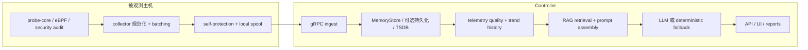

# 数据流

English version: [docs/en/05-data-flow.md](../en/05-data-flow.md)

本页用真实代码路径和可追踪示例解释 `v0.7` 的数据流。目标不是只讲概念，而是把下面这些问题讲清楚：

- collector 到底采了什么
- 这些值在代码里如何表示
- 哪些数据会被筛掉，哪些会被提升进 prompt
- RAG 查询是怎么构造的
- 最终发给模型的 prompt 长什么样
- 模型输出如何被接受、降级或替换成 deterministic fallback

> 下文中的数值是说明性的示例值，但指标名、结构、转换步骤都严格对应当前仓库里的实现。

如果你想看一篇更长的文档，里面不仅讲运行路径，还逐阶段解释“为什么有这一层、它解决了什么、为什么选这个方案、去掉会怎样、steady-state / 趋势恶化 / 弱信号 / RAG 增强场景分别有什么不同”，请先读 [Pipeline 深度解析](02-pipeline-deep-dive.md)。

如果你希望把两个关键阶段看得更细，请同时阅读：

- [采集队列与压缩](06-collector-queue-and-compaction.md)：讲清楚抑制、spool、drain、慢接收端行为
- [控制平面分析](07-control-plane-analysis.md)：讲清楚趋势分析、弱信号融合、TSDB 写入、检索门控、建议生成

## 为什么要拆成这条流水线

仓库把主机侧采集和 controller 侧推理解耦，主要是为了三个现实约束：

1. 很多短时效主机信号只能在本机附近稳定捕获
2. controller 短时不可达时，不应该立刻失去观测
3. 检索、prompt 组装、LLM、UI 这些相对重的工作不应该和业务负载抢主机资源

如果不这么拆，要么 collector 太重，不适合生产节点；要么 controller 只能靠反向轮询，丢掉很多本地上下文。

## 端到端总览



## 阶段地图

| 阶段 | 主要文件 | 输入形态 | 输出形态 | 这一层为什么存在 |
| --- | --- | --- | --- | --- |
| 主机采样 | [`cpp/probe_core/main.cpp`](../../cpp/probe_core/main.cpp), [`backend/internal/collector/probe/ebpf/collector.go`](../../backend/internal/collector/probe/ebpf/collector.go) | 内核状态、`/proc`、`/sys`、GPU runtime、eBPF 事件 | 原始 `probeipc` batch 和运行时事件 | 在主机附近抓到高时效信号 |
| collector 转换 | [`backend/internal/collector/probe_core_convert.go`](../../backend/internal/collector/probe_core_convert.go) | `probeipcv1.ProbeBatch` | 压缩后的 `[]*telemetryv1.Metric`、`[]*telemetryv1.ProcessSample` | 把原生计数器翻译成 controller 侧能理解的指标名，并避免默认 raw/alias 双份发送 |
| collector 传输 | [`backend/internal/collector/collector.go`](../../backend/internal/collector/collector.go), [`backend/internal/collector/spool/spool.go`](../../backend/internal/collector/spool/spool.go), [`backend/internal/collector/transport/client.go`](../../backend/internal/collector/transport/client.go) | 规范化后的 metrics / process / logs / events | 推送或缓存的 `TelemetryBatch` | 让采集和 controller 可达性解耦，并在 helper 视图没真正刷新时省略重复的 process/log payload |
| controller ingest | [`backend/internal/controller/ingest/server.go`](../../backend/internal/controller/ingest/server.go), [`backend/internal/controller/ingest/store.go`](../../backend/internal/controller/ingest/store.go) | `TelemetryBatch` | [`NodeSnapshot`](../../backend/internal/controller/ingest/store.go) 和 history | 验证、去重、规范化热状态，重建被 collector 省略的低频状态，并只在 helper 明确“刷新过且为空”时清理旧的 process/log 视图 |
| 筛选与推理准备 | [`backend/internal/controller/agentcore/agent.go`](../../backend/internal/controller/agentcore/agent.go) | `NodeSnapshot`、GPU snapshot、history、logs | `PromptInput` | 在进入 LLM 之前先降噪并补充可信度信息 |
| 控制面事件化 | [`backend/internal/controller/agentcore/workflow_eventization.go`](../../backend/internal/controller/agentcore/workflow_eventization.go), [`backend/internal/controller/agentcore/workflow_engine.go`](../../backend/internal/controller/agentcore/workflow_engine.go) | `NodeSnapshot`、history、risk series、baseline sample | `TrendAssessment[]`、`InvestigationEvent[]`、`RetrievalDecision[]` | 在更深层分析前，把原始状态压缩成趋势、弱信号和检索规划对象 |
| 控制面状态导出 | [`backend/internal/controller/agent_integration.go`](../../backend/internal/controller/agent_integration.go), [`backend/internal/controller/agentcore/workflow_engine.go`](../../backend/internal/controller/agentcore/workflow_engine.go), [`backend/internal/controller/agent/report_dedupe.go`](../../backend/internal/controller/agent/report_dedupe.go) | 最新 joint-risk / RCA 报告，以及 legacy 定时报告状态 | `/api/v1/agent/status` 的 `control_plane` 与 `report_engine` 摘要 | 让 UI 和操作员在不加载整份报告前，也能看到趋势 / 事件 / retrieval 活动，以及 legacy 报告是否正在原地刷新而不是重复追加 |
| 检索 | [`backend/internal/controller/rag/service.go`](../../backend/internal/controller/rag/service.go), [`backend/internal/controller/rag/ingest.go`](../../backend/internal/controller/rag/ingest.go), [`backend/internal/controller/rag/index.go`](../../backend/internal/controller/rag/index.go) | 操作员 query + findings | `rag.QueryResult` 和 `[]SearchHit` | 为分析加上有边界的运维知识 |
| prompt 组装 | [`backend/internal/controller/agentcore/prompts.go`](../../backend/internal/controller/agentcore/prompts.go) | `PromptInput` | system prompt、user prompt、`LLMSchema` | 让证据既可审计又可被模型稳定消费 |
| 模型调用与回退 | [`backend/internal/controller/agentcore/agent.go`](../../backend/internal/controller/agentcore/agent.go) | prompts | 解析后的 JSON 结果或 deterministic fallback | 让 API 在 LLM 不可用时仍然稳定 |

## ingest 之前的 collector 分层节奏

collector 现在会把不同类型的辅助采集拆成不同 cadence，而不是和主循环完全同频。

| 信号类别 | 真实实现位置 | 实际节奏 |
| --- | --- | --- |
| 快路径 | [`backend/internal/collector/collector.go`](../../backend/internal/collector/collector.go) 里的 probe-core 主路径与 eBPF 摘要 | 每个 active collector cycle |
| 中路径 | [`backend/internal/collector/aux_sampling.go`](../../backend/internal/collector/aux_sampling.go) 里的兼容 `/proc` 进程 fallback | `max(collection_interval, probe_core.interval * host_proc_fallback_interval_samples)` |
| 中路径 | [`backend/internal/collector/probe/cadence.go`](../../backend/internal/collector/probe/cadence.go) 里的 compatibility extended host metrics | `max(2 * collection_interval, 10s)` |
| 慢路径 | [`backend/internal/collector/probe/cadence.go`](../../backend/internal/collector/probe/cadence.go) 里的 compatibility 硬件扫描 | `max(6 * collection_interval, 30s)` |
| 慢路径 | [`backend/internal/collector/probe/cadence.go`](../../backend/internal/collector/probe/cadence.go) 里的 compatibility deep scan、kernel 摘要、GPU fallback helper | `max(3 * collection_interval, 15s)` |
| 慢路径 | [`backend/internal/collector/probe/cadence.go`](../../backend/internal/collector/probe/cadence.go) 里的 compatibility RCA helper | `max(6 * collection_interval, 30s)` |
| 慢路径 | [`backend/internal/collector/aux_sampling.go`](../../backend/internal/collector/aux_sampling.go) 里的日志指纹 | `max(15s, 3 * collection_interval)` |
| 慢路径 | [`backend/internal/collector/aux_sampling.go`](../../backend/internal/collector/aux_sampling.go) 里的 external metrics command | `max(30s, 6 * collection_interval)` |
| 异常触发加深 | 同一组 helper 在 incident mode 或 compatibility fallback 自身检测到异常时 | 收紧回接近当前 collector cadence |

collector 现在会输出三组节奏/缩减指标，方便操作员确认这些昂贵路径到底是在重采、复用缓存，还是刻意不发 payload：

- `collector_aux_collection_interval_seconds`、`collector_aux_collection_age_seconds`、`collector_aux_collection_cache_hit`：来自 [`aux_sampling.go`](../../backend/internal/collector/aux_sampling.go)，覆盖日志、external metrics、compatibility process fallback
- `collector_aux_payload_refreshed`、`collector_aux_payload_suppressed`：来自 [`aux_sampling.go`](../../backend/internal/collector/aux_sampling.go)，说明日志和 compatibility process helper 这轮是否真的刷新，还是只是复用了缓存视图
- `collector_compat_collection_interval_seconds`、`collector_compat_collection_age_seconds`、`collector_compat_collection_cache_hit`、`collector_compat_collection_anomaly_triggered`：来自 [`probe/cadence.go`](../../backend/internal/collector/probe/cadence.go)，覆盖 legacy Go compatibility 的 runtime/hardware/deep/kernel/RCA/GPU tiers

collector 现在还会输出 payload 缩减状态：

- `collector_metrics_partial_update`
- `collector_metrics_suppressed_count`

这两个指标表示“这个 batch 故意省略了不变的低频 collector/runtime inventory”，而不是“collector 忘了填状态”。

## 示例 1：内存压力 + 存储瓶颈是如何一路走到最终回答的

下面这条示例链路追踪一个典型慢节点案例：从原始采样，到转换、存储、筛选、RAG，再到最终 prompt。

### 第 1 步：主机侧原始采样值

下面这些名字都是真实由 [`convertProbeCoreBatch`](../../backend/internal/collector/probe_core_convert.go) 处理的 probe-core 指标名：

```text
probe_core_cpu_usage_percent = 92.1
probe_core_cpu_iowait_percent = 12.4
probe_core_memory_total_bytes = 17179869184
probe_core_memory_used_bytes = 15032385536
probe_core_memory_used_percent = 87.5
probe_core_disk_await_ms{device="nvme0n1"} = 38.5
probe_core_disk_queue_depth{device="nvme0n1"} = 11
probe_core_network_tcp_retransmissions_per_sec = 0.8
probe_core_network_rx_bytes_per_sec{iface="eth0"} = 52428800
probe_core_network_tx_bytes_per_sec{iface="eth0"} = 18874368
```

这一层存在的原因：

- 保留 `device="nvme0n1"`、`iface="eth0"` 这样的设备标签
- 在任何聚合发生之前拿到最细粒度主机视图
- 让后续系统能区分 CPU 饱和、存储等待、网络丢包等不同问题

如果这一层退化或缺失：

- controller 只能依赖兼容 fallback
- 设备级归因和 freshness 都会变弱
- RCA 更容易退化成“节点有点慢”的泛化回答

### 第 2 步：collector 把原生指标转成 controller 可见指标

[`convertProbeCoreBatch`](../../backend/internal/collector/probe_core_convert.go) 会生成后续系统使用的 alias 指标。到 `v0.7` 为止，如果某个 `probe_core_*` 主机/资源指标已经有等价 alias，collector 默认不再把 raw 指标也重复放进每个 batch。

示例转换：

```json
[
  {"name":"node_memory_Used_bytes","value":15032385536},
  {"name":"node_memory_MemTotal_bytes","value":17179869184},
  {"name":"node_disk_avg_request_latency_seconds","value":0.0385,"labels":{"device":"nvme0n1"}},
  {"name":"node_network_receive_bytes_per_second","value":52428800,"labels":{"iface":"eth0"}}
]
```

如果你确实需要这些 raw duplicate，可以显式设置 `probe_core.emit_raw_aliased_metrics: true`。默认值保持 `false`，目的是降低 batch 大小、spool 压力和网络成本。

同一轮转换还会生成聚合指标：

- `node_disk_total_read_bytes_per_second`
- `node_disk_total_written_bytes_per_second`
- `node_disk_queue_depth_total`
- `node_disk_request_latency_p50_seconds`
- `node_disk_request_latency_p90_seconds`
- `node_disk_request_latency_p99_seconds`
- `node_network_total_receive_bytes_per_second`
- `node_network_total_transmit_bytes_per_second`

为什么要有这一层：

- controller 和 prompt 路径依赖的是 `node_*`、`collector_*`、`rca_*`、`node_gpu_*` 命名
- 聚合指标让 controller 不需要每次重新按 device 或 iface 汇总

如果这层做错了：

- [`systemFindings`](../../backend/internal/controller/agentcore/agent.go) 看不到 `node_cpu_usage_percent`
- [`operationalFindings`](../../backend/internal/controller/agentcore/agent.go) 看不到 `node_disk_request_latency_p99_seconds`
- UI、API、RCA 会直接失去统一指标契约

### 第 3 步：经过传输、ingest，进入 `NodeSnapshot`

collector 把 metrics、process、logs、安全事件打包成 `TelemetryBatch`，然后经过：

- [`backend/internal/collector/spool/spool.go`](../../backend/internal/collector/spool/spool.go)
- [`backend/internal/collector/transport/client.go`](../../backend/internal/collector/transport/client.go)
- [`backend/internal/controller/ingest/server.go`](../../backend/internal/controller/ingest/server.go)

controller 会把最新节点状态保存成 [`NodeSnapshot`](../../backend/internal/controller/ingest/store.go)。它包含：

- `Metrics map[string]float64`
- `Processes []*telemetryv1.ProcessSample`
- `Logs []*telemetryv1.LogFingerprint`
- `ProbeSource`、`RuntimeMode`、`RuntimeReasons`
- storage、filesystem、process-resource、安全事件、process graph 等结构化上下文

示例 `NodeSnapshot` 片段：

```json
{
  "collector_id": "node-a",
  "probe_source": "probe_core",
  "runtime_mode": "primary",
  "last_collection_at": "2026-03-13T11:02:00Z",
  "last_ingest_at": "2026-03-13T11:02:02Z",
  "metrics": {
    "node_cpu_usage_percent": 92.1,
    "node_cpu_iowait_percent": 12.4,
    "node_memory_Used_bytes": 15032385536,
    "node_memory_MemTotal_bytes": 17179869184,
    "node_disk_request_latency_p99_seconds": 0.0385,
    "node_disk_queue_depth_total": 11,
    "node_tcp_retransmits_per_second": 0.8
  }
}
```

这一层为什么关键：

- 后面的 prompt、workflow、API 都不直接读原始 batch
- 它是 controller 侧“当前真相”的热状态

如果这层理解错了，读者很容易误以为“collector -> prompt”是直通的，但实际并不是。

### 第 3.5 步：Partial collector update 与状态续接

为了避免每个周期都重发同一份 collector/runtime inventory，collector 现在会抑制不变的低频状态，例如：

- `collector_probe_source`
- `collector_runtime_mode`
- `collector_runtime_capability_available{capability=...}`
- `collector_probe_core_collector_module_active{module=...}`
- `collector_hardware_*` 下的 capability/profile/threshold 指标

说明性的 steady-state collector batch 片段：

```json
{
  "metrics": [
    {"name":"node_cpu_usage_percent","value":31.4},
    {"name":"node_memory_Used_bytes","value":8589934592},
    {"name":"collector_self_cpu_percent","value":1.7},
    {"name":"collector_metrics_partial_update","value":1},
    {"name":"collector_metrics_suppressed_count","value":19}
  ]
}
```

这并不表示 controller 丢掉了 `collector_probe_source` 或硬件上下文。[`StoreMetrics`](../../backend/internal/controller/ingest/store.go) 会在看到 `collector_metrics_partial_update = 1` 时，把之前的低频 collector 状态 carry forward。

同样的语义现在也扩展到了 cadence-cached 的 process/log helper：

- 如果只是 cache hit，而且 `suppress_cached_aux_payloads: true`，collector 会输出 `collector_aux_payload_suppressed{component="process_fallback|logs"} = 1`，同时省略重复 payload
- 如果 helper 真的又跑了一次，collector 会输出 `collector_aux_payload_refreshed{component="process_fallback|logs"} = 1`
- [`Server.Push`](../../backend/internal/controller/ingest/server.go) 会用这个 refreshed 标记判断：空 payload 是“真的清空”，还是“只是沿用上一轮视图”

active source 的热点进程 payload 现在也会走一层更轻量的 steady-state 抑制：

- 如果 `suppress_unchanged_process_payloads: true`，collector 会重新计算当前热点进程列表的粗粒度指纹
- 如果 PID / 进程名 / CPU bucket / RSS bucket / IO bucket 都没有实质变化，并且还没超过 `process_payload_refresh_interval`，这一轮 `TelemetryBatch.Processes` 会被省略
- batch 会附带 `collector_process_payload_suppressed = 1`；真正重发时会附带 `collector_process_payload_refreshed = 1`

说明性的 process payload cache-hit batch：

```json
{
  "metrics": [
    {"name":"node_cpu_usage_percent","value":31.0},
    {"name":"node_memory_Used_bytes","value":8589934592},
    {"name":"collector_process_payload_suppressed","value":1}
  ],
  "processes": []
}
```

这意味着 controller 继续沿用上一轮热点进程视图，但 collector 不必在每次细微抖动时都重新序列化和发送同一份进程列表。

这个阶段存在的原因：

- 降低 steady-state protobuf 大小和 spool 写入量
- 避免重复发送大批不变的 runtime/hardware label
- 不改 gRPC schema 的前提下保住 controller 语义

如果没有这个续接逻辑：

- partial collector batch 会把 runtime mode、source mode、probe-core module state 等状态擦掉
- UI 和 telemetry-quality 会把“因为没变而被省略”误解成“真的缺失”

## 检索和 prompt 之前的控制面事件化

控制面现在多了一层显式压缩阶段，位于热状态与 RAG/LLM 之间。

主要文件：

- [`backend/internal/controller/agentcore/workflow_eventization.go`](../../backend/internal/controller/agentcore/workflow_eventization.go)

它产出的对象：

- `TrendAssessment[]`：针对单个 series，总结斜率、持续越阈和 forecast hint
- `InvestigationEvent[]`：多变量弱信号融合后的调查事件，附带 probable cause 和 recommended checks
- `RetrievalDecision[]`：检索规划记录，说明为什么 runbook/case search 执行、跳过或被抑制

说明性内部对象：

```json
{
  "trend_assessment": {
    "id": "memory_pressure:collector-a",
    "display": "Memory pressure",
    "trend": "rising",
    "delta_percent": 14.2,
    "slope_per_minute": 118.0,
    "threshold_breaches": 3,
    "persistence_points": 4,
    "severity": "high",
    "forecast": "memory pressure likely crosses high-risk threshold within 18m"
  },
  "investigation_event": {
    "id": "memory_disk_degradation:collector-a",
    "title": "Memory growth and disk wait are rising together",
    "category": "resource_contention",
    "probable_cause": "memory reclaim and IO contention are amplifying each other",
    "supporting_signals": [
      "node_memory_Used_bytes",
      "node_cpu_iowait_percent",
      "node_disk_request_latency_p99_seconds"
    ],
    "recommended_checks": [
      "inspect reclaim activity",
      "check disk queue depth",
      "compare with recent deployment burst"
    ]
  },
  "retrieval_decision": {
    "tool": "runbook_retrieval",
    "intent": "incident_rag",
    "query": "memory growth and disk wait rising together reclaim io contention latency",
    "evidence_signals": [
      "memory_pressure",
      "io_latency",
      "service_latency"
    ],
    "skipped": false
  }
}
```

为什么要有这层：

- 原始 telemetry 对直接构造 RAG query 来说噪声太大
- UI 需要可给人看的中间证据对象，而不是只有一句最终结论
- 相同状态反复出现时，现在可以在 event/trend 层比较，而不是每次都重建全部上下文

同样的 steady-state 缩减现在也扩展到了慢速 compatibility 硬件层：

- 如果硬件层只是 cache hit，并且 `suppress_cached_compat_hardware_metrics: true`，collector 会输出 `collector_compat_payload_suppressed{component="hardware"} = 1`，同时省略重复的 thermal / NIC / RDMA fallback 指标
- 如果硬件层真的重新刷新，collector 会输出 `collector_compat_payload_refreshed{component="hardware"} = 1`
- [`StoreMetrics`](../../backend/internal/controller/ingest/store.go) 会在 suppression 周期继续沿用上一轮 compatibility 硬件视图，直到下一次真实硬件刷新来替换或清空它

说明性的硬件层 cache-hit batch：

```json
{
  "metrics": [
    {"name":"node_cpu_usage_percent","value":29.8},
    {"name":"collector_compat_collection_cache_hit","value":1,"labels":{"component":"hardware"}},
    {"name":"collector_compat_payload_suppressed","value":1,"labels":{"component":"hardware"}}
  ]
}
```

这意味着 controller 仍然记得上一轮 `node_thermal_*` 或 `node_network_interface_*` fallback 值，但 collector 不必在每个慢路径 cache-hit 周期都为这些重复值付出再次发送的代价。

### 第 3.6 步：不增加新探针的硬件 warning 层

在 protection 评分之后，collector 现在还会用 [`hardware_warnings.go`](../../backend/internal/collector/hardware_warnings.go) 从已有指标和缓存硬件阈值里推导一层 broad hardware hint：

```json
[
  {"name":"collector_hardware_warning_total","value":2},
  {"name":"collector_hardware_warning","value":0.78,"labels":{"domain":"disk","reason":"latency","signal":"node_disk_request_latency_p99_seconds"}},
  {"name":"collector_hardware_warning","value":0.63,"labels":{"domain":"network","reason":"retransmit","signal":"node_tcp_retransmit_ratio"}}
]
```

这个阶段存在的原因：

- 给 controller 和操作员一个更便宜的硬件导向摘要，而不是再开一条新重探针
- 让后面的筛选和推理可以更早知道“更像磁盘问题”还是“更像网卡问题”

### 第 4 步：在进入 prompt 前先做筛选

真正决定“哪些数据进 prompt”的主逻辑在 [`buildPromptInput`](../../backend/internal/controller/agentcore/agent.go)。

它会做这些事情：

1. 把节点全部 metrics 克隆进 `PromptInput`
2. 用 `summarizeProcesses` 只保留 CPU 最高的 5 个进程
3. 用 `summarizeLogs` 只保留出现次数最高的 5 个日志 fingerprint
4. 如果有 GPU snapshot，就把 GPU 摘要 merge 进 metrics
5. 从最近历史里计算 trend
6. 生成 findings 和 anomalies
7. 计算 telemetry quality
8. 先把 RAG 留空，只有确认真的要走 LLM 路径时才附加检索上下文

#### 进程和日志是怎么被压缩的

示例进程：

```json
{
  "processes": [
    {"pid": 4128, "name": "trainer", "cpu_percent": 71.2, "rss_bytes": 8589934592, "io_read_bps": 73400320, "io_write_bps": 2097152},
    {"pid": 778, "name": "python-loader", "cpu_percent": 18.1, "rss_bytes": 2147483648, "io_read_bps": 104857600, "io_write_bps": 0}
  ],
  "logs": [
    {"fingerprint":"dial tcp timeout", "count":42, "example":"request to cache service timed out"},
    {"fingerprint":"retry budget exceeded", "count":17, "example":"retry budget exceeded for dependency"}
  ]
}
```

为什么要这样做：

- 完整进程列表和完整日志太嘈杂
- query-service 只需要最热的进程和最重复的异常模式

#### 基于阈值和组合规则生成 findings

第一轮 findings 来自 deterministic 规则。

- `systemFindings`：
  - `node_cpu_usage_percent >= 85` -> `CPU utilization is above 85%`
  - `node_memory_Used_bytes / node_memory_MemTotal_bytes >= 0.85` -> `Memory utilization is above 85%`
  - `node_disk_io_now >= 50` -> `Disk I/O pressure is elevated`

然后 [`operationalFindings`](../../backend/internal/controller/agentcore/agent.go) 会看组合关系。对本例来说：

- `node_cpu_iowait_percent = 12.4`
- `node_disk_request_latency_p99_seconds = 0.0385`
- `node_disk_queue_depth_total = 11`

这会命中存储瓶颈规则：

```text
CPU wait and disk latency are rising together, which points to a storage bottleneck rather than pure CPU saturation
```

如果内存占用已经到 `87.5%`，并且日志里还有 `timeout` / `error`，则还会强化成：

```text
Memory growth is being reinforced by error or timeout activity, which looks more like leak or retry amplification than a one-off spike
```

#### telemetry quality 如何控制可信度

[`assessPromptTelemetryQuality`](../../backend/internal/controller/agentcore/agent.go) 会检查：

- freshness age
- ingest delay
- 缺失的关键指标组
- blind spots，例如没有 logs、没有 processes、spool backlog、probe-core stale、runtime degraded

当前 hardcode 的关键指标组有 5 类：

- CPU pressure
- memory pressure
- network throughput
- storage activity
- telemetry integrity

如果全部存在且数据新鲜，则 coverage 是 `100%`；如果少一组，则是 `80%`。

示例质量块：

```json
{
  "state": "fresh",
  "coverage_percent": 100,
  "confidence": 1,
  "source_mode": "probe_core",
  "freshness_age_seconds": 2,
  "ingest_delay_seconds": 2,
  "safe_to_act": true
}
```

如果 backlog 在回放或者 logs 缺失，即使 metrics 还在，也会退化成：

```json
{
  "state": "degraded",
  "coverage_percent": 100,
  "confidence": 0.8,
  "blind_spots": [
    "log evidence is missing",
    "collector replay backlog is still draining"
  ],
  "safe_to_act": false
}
```

这一层存在的意义，是防止模型把 stale 或 partial 数据当成完整事实。

### 第 5 步：RAG 查询是怎么构造的

RAG 现在不再是无条件附加。

query-service 会先通过下面这些逻辑判断是否应该直接走 deterministic fallback：

- `SkipLLMOnNoTelemetry`
- `SkipLLMOnStaleTelemetry`
- `fallbackPayload`

只有确定这次请求真的会调用模型时，[`attachRAGContext`](../../backend/internal/controller/agentcore/agent.go) 才会去调用 [`ragContext`](../../backend/internal/controller/agentcore/agent.go)。

这样做的原因是：

- stale / 空 telemetry 不值得继续消耗检索 CPU、I/O 和 token 预算
- deterministic fallback 的响应不应该看起来像“被 RAG 影响过”

如果启用 RAG，[`ragContext`](../../backend/internal/controller/agentcore/agent.go) 会把下面这些内容拼成检索输入：

- 操作员原始问题
- 基于 telemetry 已经生成的 deterministic findings
- 基于近期历史生成的 anomaly / trend hints

在真正发起 retrieval 之前，[`shouldAttachQueryServiceRAG`](../../backend/internal/controller/agentcore/agent.go) 还会先判断这次请求有没有足够的运行时症状上下文。

现在只有在至少满足下面之一时才会继续检索：

- 过滤后的 findings 或 anomaly hints 不为空
- 操作员 query 自身已经包含明显运维关键词，例如 `cpu`、`memory`、`timeout`、`latency`、`gpu`、`thermal`、`network`、`disk`、`retransmit`、`deployment`、`security`

如果两个条件都不满足，controller 会直接跳过 retrieval，并增加 `agent_rag_skipped_context_total`，而不是为泛化问题支付额外检索成本。

在真正压缩这些 findings 之前，[`filterFindingsForRetrieval`](../../backend/internal/controller/agentcore/agent.go) 还会先丢掉低价值 boilerplate，例如：

- `No critical anomalies detected`
- `Telemetry snapshot is stale ...`
- `Telemetry freshness is degraded ...`
- `Observability coverage is degraded ...`
- `Missing critical signals: ...`
- `Host telemetry freshness is degraded ...`

这样做的目的，是让 retrieval 只围绕真正的运行时症状，而不是被 UI / 调试有用、但对 runbook 搜索价值不高的 telemetry-quality 提示词污染。

例如操作员问：

```text
why did node-a slow down after rollout?
```

而 findings 是：

- `CPU utilization is above 85%`
- `Memory utilization is above 85%`
- `CPU wait and disk latency are rising together, which points to a storage bottleneck rather than pure CPU saturation`

在真正发给 RAG 之前，controller 还会先做三件事：

- 通过 `rag_max_findings` 限制带入检索的 finding 数量
- 通过 `rag_max_query_chars` 限制最终 query 长度
- 在 `compactRAGQueryText` 里去掉重复 finding
- 通过 `filterFindingsForRetrieval` 去掉低价值 finding
- 通过 `filterAnomaliesForRetrieval` 把 anomaly hints 也作为症状上下文带进去

用默认生产导向配置时，完整 query 往往都能放下。为了说明压缩逻辑，假设我们把预算临时收紧到 `rag_max_findings=2`、`rag_max_query_chars=120`，那么形成的请求会更接近下面这样：

```json
{
  "query": "why did node-a slow down after rollout? CPU utilization is above 85% Memory utilization is above 85%",
  "top_k": 4,
  "intent": "rca",
  "knowledge_types": ["historical_incident", "runbook", "question_pattern"],
  "case_types": ["historical_incident", "runbook", "operational_qa"]
}
```

为什么要这样设计：

- live metrics 能解释“发生了什么”
- findings 和 anomaly hints 能帮助检索系统理解“这像哪类运维问题”
- telemetry stale / no-op 之类的 banner 如果直接带入检索，通常只会降低 lexical/vector 命中的质量

一个现在会被主动跳过的弱上下文示例：

```json
{
  "operator_query": "what is happening here",
  "findings": ["No critical anomalies detected"],
  "anomalies": [],
  "retrieval": "skipped",
  "reason": "运行时症状上下文太弱"
}
```

可能的失败模式：

- findings 太噪，会让检索 query 也变噪
- 数据集太泛，命中的内容就会没价值
- `top_k` 太高，会让 prompt 被无关片段挤满
- `rag_max_query_chars` 太小，会让后面的关键信号在进入检索前就被截断

### 第 5.5 步：在 retrieval 和 LLM 之前复用最近成功分析

query-service 现在还会在真正花 controller CPU 做 retrieval 和模型调用之前，多做一道检查。

[`analysisReuseKey`](../../backend/internal/controller/agentcore/agent.go) 会指纹化：

- 规范化后的 operator query
- prompt-facing 的压缩 metric map
- telemetry quality 状态 / source / runtime mode
- alerts 和 anomalies
- 最热的 process / log 摘要

如果这些内容在 `analysis_reuse_window` 内没有实质变化，[`Query`](../../backend/internal/controller/agentcore/agent.go) 就会复用最近一次成功分析，直接跳过 `attachRAGContext` 和 `runLLM`。

说明性的重复查询序列：

```text
t=00s  query="why is disk latency growing?"  node_cpu_usage_percent=81.2  node_disk_request_latency_p99_seconds=0.041  -> 执行 retrieval + LLM
t=12s  同一个 query，压缩后证据指纹也没变                                              -> 复用最近分析
t=55s  还是同一个 query，但 CPU 和 queue depth 都变了                                   -> 再次执行 retrieval + LLM
```

这个阶段存在的原因：

- dashboard 和操作员经常会在同一个 incident 上反复点击同一个问题
- 对“证据没变”的重复请求，不应该继续支付本地索引和模型成本
- fallback 回答被刻意排除在复用之外，避免把一次短暂的 LLM 故障当成稳定事实缓存下来

### 第 6 步：RAG 命中是如何变成 prompt 片段的

RAG 返回的是 [`SearchHit`](../../backend/internal/controller/rag/retriever.go)，不是原始文档全文。

典型 `SearchHit` 形态：

```json
{
  "evidence_id": "rag-1",
  "doc_id": "doc-1",
  "chunk_id": "chunk-1",
  "score": 0.92,
  "source_path": "cases/timeout-runbook.md",
  "source_type": "markdown",
  "knowledge_type": "runbook",
  "case_type": "runbook",
  "title": "Timeout Runbook",
  "summary": "Check retry rates and deployment timing.",
  "snippet": "Inspect retries and cache credentials after rollout.",
  "likely_causes": ["stale cache credential after rollout"],
  "remediation_steps": ["inspect retry rate", "validate cache credentials"],
  "signals": ["deployment", "network"]
}
```

这个 shape 在下面这些测试里都被实际使用：

- [`backend/internal/controller/rag/service_test.go`](../../backend/internal/controller/rag/service_test.go)
- [`backend/internal/controller/agentcore/agent_test.go`](../../backend/internal/controller/agentcore/agent_test.go)
- [`backend/internal/controller/agentcore/prompts_test.go`](../../backend/internal/controller/agentcore/prompts_test.go)

query-service 不会把整篇文档塞进 prompt，而是通过 [`renderQueryServiceRAGSnippet`](../../backend/internal/controller/agentcore/agent.go) 压成短行：

```text
[runbook] Timeout Runbook :: summary=Check retry rates and deployment timing. | causes=stale cache credential after rollout | steps=inspect retry rate; validate cache credentials | signals=deployment, network
```

为什么要这么压缩：

- 整篇文档太耗 token
- 模型主要需要 summary、causes、steps 和 provenance
- 还得让人能看懂这条知识为什么影响了结论

query-service 现在还会在检索之后再加一道保护：

- 如果 `result.Confidence < rag_min_confidence`，controller 会保留检索摘要用于调试，但不会把任何 RAG snippet 继续送入 prompt

说明性的抑制结果：

```text
Retrieval summary: retrieved 1 knowledge hits, but retrieval suppressed because confidence 0.12 is below minimum 0.18
RAG context snippets: none
```

这么做的原因是：弱 lexical/vector 命中常常比“完全没有 retrieval”更糟，它会把 prompt 往无关 runbook 上带偏。

### 第 7 步：最终 prompt 是怎么组装的

[`BuildUserPrompt`](../../backend/internal/controller/agentcore/prompts.go) 的组装顺序是固定的：

1. anomaly framing
2. RCA instruction
3. telemetry quality 一行摘要
4. RAG block
5. `Telemetry JSON (schema v1)`
6. 输出约束

对本例来说，prompt 片段大致如下：

```text
Question: "why did node-a slow down after rollout?"
Explain anomalies simply. Example style: "CPU at 90% is like a clogged pipe; flow backs up."

Telemetry shows pressure on node "node-a". Identify likely blockers, rank confidence, and suggest safe fixes first.

Telemetry quality: state=fresh age_seconds=2 stale=false coverage=100% safe_to_act=true

RAG context snippets:
- [runbook] Timeout Runbook :: summary=Check retry rates and deployment timing. | causes=stale cache credential after rollout | steps=inspect retry rate; validate cache credentials | signals=deployment, network
Retrieval summary: retrieved 1 knowledge hits across 1 documents (runbook=1)
Retrieval routing: intent=runbook mode=hybrid

Telemetry JSON (schema v1):
{
  "schema_version": "v1",
  "node_name": "node-a",
  "telemetry_quality": {
    "state": "fresh",
    "coverage_percent": 100,
    "safe_to_act": true
  },
  "metrics": {
    "node_cpu_usage_percent": 92.1,
    "node_memory_Used_bytes": 15032385536,
    "node_memory_MemTotal_bytes": 17179869184,
    "node_disk_request_latency_p99_seconds": 0.0385,
    "node_disk_queue_depth_total": 11,
    "node_tcp_retransmits_per_second": 0.8
  },
  "alerts": [
    "CPU utilization is above 85%",
    "Memory utilization is above 85%",
    "CPU wait and disk latency are rising together, which points to a storage bottleneck rather than pure CPU saturation"
  ],
  "evidence": {
    "top_metrics": [
      {"name":"node_memory_Used_bytes","value":15032385536},
      {"name":"node_memory_MemTotal_bytes","value":17179869184},
      {"name":"node_cpu_usage_percent","value":92.1}
    ],
    "processes": [
      {"pid":4128,"name":"trainer","cpu_percent":71.2}
    ],
    "logs": [
      {"fingerprint":"dial tcp timeout","count":42}
    ]
  }
}
```

如果触发了低置信度抑制，prompt 结构不会变，但 retrieval 相关部分会变成：

```text
RAG context snippets: none
Retrieval summary: retrieved 1 knowledge hits, but retrieval suppressed because confidence 0.12 is below minimum 0.18
Retrieval routing: intent=runbook mode=hybrid
```

这样就把运行时行为说清楚了：检索确实执行过，但因为证据质量不足，所以它没有真正影响模型输入。

这里有一个非常重要的设计点：

现在送给模型的 schema 已经不再携带完整原始 metric map。

[`buildPromptSchema`](../../backend/internal/controller/agentcore/prompts.go) 会把 prompt-facing 的 `metrics` 压缩成一个有上界的子集，目前是 24 个指标，并优先保留 CPU、内存、磁盘、网络、GPU、pressure、collector 完整性相关信号。API 响应里的 `TelemetryContext` 仍然来自 [`BuildSchema`](../../backend/internal/controller/agentcore/prompts.go)，也就是说：操作员还能看到完整上下文，但模型只看到压缩后的版本。

`Evidence` 再在这个基础上提供更紧凑的摘要：
  - `Summary` 取绝对值最大的 6 个指标
  - `TopMetrics` 取绝对值最大的 8 个指标
  - `GPU` / `Network` / `Disk` / `Memory` 是按前缀过滤的子图

这样既不会把 prompt 变成一整页大字典，也不会把关键事实全部丢掉。

### 第 8 步：真正发给模型的请求和输出校验

[`chatClient.Complete`](../../backend/internal/controller/agentcore/agent.go) 会发送标准 chat/completions 请求：

```json
{
  "model": "gpt-4o-mini",
  "messages": [
    {
      "role": "system",
      "content": "You are a senior SRE. Use only provided telemetry facts. Never invent metrics or command outputs. Return strict JSON with fields: summary, root_cause, confidence, findings, recommendations, actions, evidence, limitations."
    },
    {
      "role": "user",
      "content": "...assembled user prompt..."
    }
  ],
  "temperature": 0.1,
  "max_tokens": 900
}
```

然后 [`parseLLMPayload`](../../backend/internal/controller/agentcore/agent.go) 只接受满足下面条件的 JSON：

- `summary` 非空
- `root_cause` 非空
- `confidence` 在 `0` 到 `1` 之间

如果 provider 超时、返回非 JSON、或者 circuit breaker 打开，系统会退回 [`fallbackPayload`](../../backend/internal/controller/agentcore/agent.go)。

这条 fallback 路径之所以存在，是因为 controller 不能把“LLM 出问题”变成“API 直接不可用”。

## 示例 2：没有 RAG 时会发生什么变化

同一份 telemetry，在有无 RAG 的情况下，回答质量会明显不同：

| 上下文 | 模型更可能给出的结论风格 |
| --- | --- |
| 只有 metrics | “节点出现 CPU、内存、磁盘压力。优先检查最热磁盘和 IO 最重进程。” |
| metrics + 相关 runbook 命中 | “节点出现 CPU、内存、磁盘压力，同时 runbook 提示 rollout 后常见 retry spike 和 cache credential 问题。应先检查部署时间、重试率和凭证传播，再考虑扩容。” |

两种情况下，live telemetry 都是主证据。RAG 不会覆盖 telemetry。它只是增加：

- 历史类比
- 操作步骤
- 更具体的排查方向

如果检索质量差，反而会把答案拉偏。

## 每一层常见失败模式

| 阶段 | 常见失败 | 直接后果 |
| --- | --- | --- |
| 采样 | probe-core 不可用或 stale | coverage 下降，quality 变 degraded 或 stale |
| 转换 | alias 名缺失或映射错误 | heuristics 和 UI 看不到预期指标 |
| ingest | batch 被拒绝或延迟 | freshness 和 confidence 下降，spool backlog 增长 |
| 筛选 | 阈值过弱或过 aggressive | 要么 prompt 噪音过大，要么真实异常被藏掉 |
| 检索 | 数据集太泛或 intent 判断错误 | snippets 无关或价值很低 |
| prompt 组装 | 上下文太多或 JSON 契约被破坏 | 模型质量下降，输出难以解析 |
| 模型调用 | timeout、非 JSON、provider 故障 | deterministic fallback 接管 |

## 参见

- [架构](04-architecture.md)
- [指标与信号](13-metrics-and-signals.md)
- [数据集与 RAG](11-dataset-and-rag.md)
- [Prompt 与定制](12-prompts-and-customization.md)
- [核心文件](10-core-files.md)
