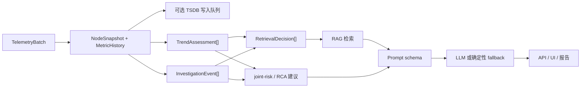

# 控制平面分析

English version: [docs/en/07-control-plane-analysis.md](../en/07-control-plane-analysis.md)

本页解释 controller 如何把进入的遥测数据转换成面向运维人员的 RCA 输出。

重点是当前 `v0.7` 真实存在的阶段：

- 归一化与历史保留
- 单变量趋势分析
- 多变量弱信号融合
- RAG / LLM 的门控
- 建议与行动输出

核心设计原则只有一句话：

> 控制平面不会把原始节点遥测直接塞进 RAG 或 LLM，而是先转换成更小、更可审计、成本更低的结构化证据。

## 为什么需要这一层

如果 controller 跳过预处理，直接把热态数据堆进 prompt：

- 趋势方向会和一次性尖峰混在一起
- 多变量组合问题要等到某个指标爆红才会显现
- RAG 查询会变得噪声大且泛化
- prompt 成本增长速度会快于诊断价值
- 未变化问题会不断触发重复的昂贵分析

因此项目明确分开：

1. 症状发现
2. 证据压缩
3. 根因推理
4. 建议输出

对非技术读者来说，这一层的意义是：把“CPU 高了”变成“为什么高、下一步该看什么、什么动作最安全”。

## 为什么控制面要把“症状检测”和“根因推理”拆开

controller 刻意没有把所有步骤揉成一个“AI 决策”。

| 层次 | 主要问题 | 这个仓库里的真实输出 | 为什么要分开 |
| --- | --- | --- | --- |
| 症状检测 | “什么变了，或者什么正在变坏？” | `TrendAssessment`、deterministic findings、telemetry-quality 标记 | 这一层必须便宜、可审计，而且即使没有 RAG 或 LLM 也要稳定工作 |
| 弱信号融合 | “几个中等症状放在一起，是否已经指向同一个问题？” | `InvestigationEvent`、`JointRiskCooccurrence`、scope risks | 这一层先降噪，再决定是否值得走更昂贵的路径 |
| 根因推理 | “基于这些结构化证据和可选知识命中，最可能的解释是什么？” | joint-risk verdict、RCA hypothesis、`QueryResponse.root_cause` | RAG 和 LLM 的价值主要出现在证据已经被压缩之后 |
| 推荐输出 | “操作员下一步最安全、最值得先做的事是什么？” | workflow recommendation、checks、retrieved commands、remediation steps | 行动建议必须绑定证据，而不是直接从原始 telemetry 猜出来 |

如果这些层次在前面就混在一起，系统会更难审计、更昂贵，也更容易在证据很弱时附着上不相关的 retrieval 或模型输出。

## 关键文件

| 文件 | 职责 |
| --- | --- |
| [`../../backend/internal/controller/ingest/store.go`](../../backend/internal/controller/ingest/store.go) | 归一化 `NodeSnapshot` 热态与历史样本 |
| [`../../backend/internal/controller/timeseries/service.go`](../../backend/internal/controller/timeseries/service.go) | 可选 TSDB 写入队列、批量 flush、fallback |
| [`../../backend/internal/controller/agentcore/workflow_eventization.go`](../../backend/internal/controller/agentcore/workflow_eventization.go) | 趋势评估、基线漂移、调查事件 |
| [`../../backend/internal/controller/agentcore/workflow_recommendations.go`](../../backend/internal/controller/agentcore/workflow_recommendations.go) | 事件专属检查项、知识库命令融合、最强趋势和最强弱信号簇的选择 |
| [`../../backend/internal/controller/agentcore/workflow_engine.go`](../../backend/internal/controller/agentcore/workflow_engine.go) | joint-risk 工作流、RCA 工作流、retrieval 决策、建议生成 |
| [`../../backend/internal/controller/agentcore/incident_decision.go`](../../backend/internal/controller/agentcore/incident_decision.go) | incident synthesis 与 recommendation shaping |
| [`../../backend/internal/controller/agentcore/agent.go`](../../backend/internal/controller/agentcore/agent.go) | query-service 路径、prompt input、RAG/LLM 门控、fallback |
| [`../../backend/internal/controller/agentcore/prompts.go`](../../backend/internal/controller/agentcore/prompts.go) | 发给模型的紧凑证据 schema |
| [`../../backend/internal/controller/rag/service.go`](../../backend/internal/controller/rag/service.go) | RAG 检索运行时 |

## 总体流程



## 阶段 1：归一化与热态

这一层解决的问题：

- 进入控制器的是传输对象，不是推理对象
- collector 侧的抑制字段必须在控制面被正确延续

当前实现：

- [`../../backend/internal/controller/ingest/server.go`](../../backend/internal/controller/ingest/server.go) 接收 `TelemetryBatch`
- [`../../backend/internal/controller/ingest/store.go`](../../backend/internal/controller/ingest/store.go) 写入：
  - `NodeSnapshot.Metrics`
  - `NodeSnapshot.Processes`
  - `NodeSnapshot.Logs`
  - 结构化进程、存储、文件系统、安全、runtime 上下文
  - `MetricHistorySample`

为什么必要：

- 之后所有控制面阶段都基于统一的 `NodeSnapshot` / history 读取
- collector 端做了抑制，控制器必须知道如何 carry-forward

如果省略：

- prompt、workflow、UI、RAG 都得各自重复解析原始 batch

## 阶段 2：时序保留与 TSDB 写入

控制器不会把所有指标都写入历史，只保留趋势相关子集。

真实代码路径：

- [`../../backend/internal/controller/ingest/history_provider.go`](../../backend/internal/controller/ingest/history_provider.go)
- [`../../backend/internal/controller/ingest/store.go`](../../backend/internal/controller/ingest/store.go)
- [`../../backend/internal/controller/timeseries/service.go`](../../backend/internal/controller/timeseries/service.go)

### 写什么，为什么写

[`aggregateBatchMetrics`](../../backend/internal/controller/timeseries/service.go) 只会把满足 `ingest.IsTrendMetric(...)` 的指标送入持久化写队列。

原因：

- 趋势分析需要一个稳定、可控的历史指标集合
- 没必要把所有高基数低层指标都塞进 TSDB 队列

典型例子：

- `node_cpu_usage_percent`
- `node_memory_Used_bytes`
- `node_disk_request_latency_p99_seconds`
- `node_tcp_retransmit_ratio`
- `node_pressure_io_full_avg10`
- `collector_self_cpu_percent`
- `collector_protection_spool_fill_ratio`

### 为什么 TSDB 前面还要有写队列

之前的问题：

- 如果同步写 TSDB，TSDB 抖动会直接进入 ingest 热路径

当前行为：

- [`Service.queue`](../../backend/internal/controller/timeseries/service.go) 是一个有界 channel
- `ProcessBatch(...)` 在队列已满时直接丢弃这批 durable-history points
- `runWriter(...)` 按批量大小和定时器 flush
- TSDB 关闭或退化时，读取回落到内存历史

它解决了什么：

- ingest 不会因为 TSDB 短暂变慢而被拖死
- 内存由 `WriteQueueSize` 上限控制
- TSDB 变成增强项，而不是 controller 生存的硬依赖

代价：

- 写队列满时，长窗口历史会变薄
- 但热态 `NodeSnapshot` 仍然可用

### 哪些东西会进 TSDB，哪些不会

| 数据形态 | 当前处理方式 | 原因 |
| --- | --- | --- |
| 稳定的数值型节点指标 | 写入内存历史，并可进入可选 TSDB 队列 | 它们适合做 slope、drift 和 persistence 分析 |
| 完整进程列表 | 只留在热状态，不转成 TSDB 点 | 这类数据形态变化大，更适合归因而不是时间序列运算 |
| 日志指纹 | 留在热状态和 log index，不写成 TSDB 指标 | 它们是证据对象，不适合做长时间窗数值历史 |
| low-churn runtime inventory | 留在热状态并周期性刷新 | 把它们写成密集时序，成本高但诊断收益很低 |
| suppression marker 和 protection counter | 其中一部分会作为 trend metric 保留 | controller 需要回答“监控路径本身是不是在退化”这种问题 |

## 阶段 3：单变量趋势路径

这是控制平面的“某一个信号正在持续恶化”路径。

### 它用来抓什么

- 内存持续上涨，逐步逼近耗尽
- 磁盘延迟持续变坏，但还没完全爆表
- retransmit ratio 上升，但业务暂时还没有完全失败
- GPU 温度或显存压力逐步走高

### 实际实现

- 风险序列定义：[`riskSeriesSpecs()`](../../backend/internal/controller/agentcore/workflow_eventization.go)
- 阈值与权重：[`riskSignalProfiles()`](../../backend/internal/controller/agentcore/workflow_eventization.go)
- 主要机制：
  - `averageSlopePerMinute(...)`
  - `thresholdBreaches(...)`
  - `trailingPersistence(...)`
  - `classifySeriesTrend(...)`
  - `trendSeverity(...)`
  - `trendConfidence(...)`
  - `buildTrendAssessments(...)`

### 为什么它存在

仅靠硬阈值太晚。很多真实故障在“真正红线”之前就已经有明确恶化趋势。

### 如果没有这一层会漏掉什么

- 慢性退化
- 反复的小超阈值
- 仍处于“可以安全处理”窗口期的早期预警

### 具体例子

符合当前实现的示例：

```text
memory_used_mb: 13240 -> 13680 -> 14020 -> 14320
memory_total_mb: 16384
memory_usage_pct: 80.8 -> 83.5 -> 85.6 -> 87.4
```

控制器生成的结果可以是：

```json
{
  "series_key": "memory_pressure",
  "trend": "rising",
  "severity": "medium",
  "delta_percent": 8.2,
  "slope_per_minute": 0.63,
  "persistence_points": 3,
  "triggered": true
}
```

业务意义：

- 在 OOM 前，系统就能建议先看 reclaim 压力和 top RSS 进程，而不是等故障爆发

## 阶段 4：多变量弱信号路径

这是控制平面的“单个指标都不算灾难，但组合起来很危险”路径。

### 它用来抓什么

- 中等 CPU iowait + 持续上升的磁盘延迟 + queue depth 变高
- 温和的内存增长 + reclaim 压力 + timeout 日志
- 少量 NIC drop + retransmit 增长 + 服务延迟增加

### 实际实现

- cooccurrence / risk clustering 在 [`../../backend/internal/controller/agentcore/workflow_engine.go`](../../backend/internal/controller/agentcore/workflow_engine.go)
- 事件提升在 [`buildInvestigationEvents`](../../backend/internal/controller/agentcore/workflow_eventization.go)
- 事件专属检查项在 [`../../backend/internal/controller/agentcore/workflow_recommendations.go`](../../backend/internal/controller/agentcore/workflow_recommendations.go)

### 为什么它存在

真实事故经常不是从一个“爆红指标”开始，而是从几个中等信号同时出现开始。

### 如果没有它会漏掉什么

- 多个中等症状叠加形成的隐性退化
- 逐个看卡片时得出的错误“还没事”结论

### 具体例子

```text
cpu_iowait_pct = 18.2
disk_await_ms = 31.4
node_disk_queue_depth_total = 22
log_burst = 12
```

控制器可能提升为：

```json
{
  "category": "weak_signal_cluster",
  "title": "Compound signal cluster: io_latency + io_pressure + log_burst",
  "confidence": 0.74,
  "probable_cause": "storage or IO bottleneck"
}
```

为什么单变量路径和多变量路径都需要：

| 路径 | 擅长发现 | 单独使用时会漏掉什么 |
| --- | --- | --- |
| 单变量趋势路径 | 一个关键信号持续恶化 | 多个中等信号组合成的风险 |
| 多变量弱信号路径 | 组合型隐性退化 | 某个单独关键指标的慢性恶化 |

## 阶段 5：在检索之前先事件化

控制器现在是基于结构化证据做检索，而不是把原始遥测直接转成查询词。

真实对象：

- `TrendAssessment`
- `InvestigationEvent`
- `RetrievalDecision`

为什么必要：

- 用“症状模式”做检索，比用原始数字堆做检索更稳定
- 降低 query 噪声
- 让 API 和 UI 可以审计“为什么检索了 / 为什么跳过了”

示例 retrieval decision：

```json
{
  "tool": "runbook_retrieval",
  "intent": "runbook",
  "query": "memory pressure rising disk latency increasing reclaim io contention",
  "evidence_signals": ["memory_pressure", "io_latency"],
  "skipped": false
}
```

跳过示例：

```json
{
  "tool": "rag_query",
  "intent": "general",
  "skipped": true,
  "skip_reason": "insufficient symptom context"
}
```

## 阶段 6：Prompt 装配与 LLM 门控

prompt 路径使用的是紧凑证据，而不是整个 `NodeSnapshot`。

主要文件：

- [`../../backend/internal/controller/agentcore/agent.go`](../../backend/internal/controller/agentcore/agent.go)
- [`../../backend/internal/controller/agentcore/prompts.go`](../../backend/internal/controller/agentcore/prompts.go)

真正发给模型的内容：

- telemetry quality 摘要
- compact metrics
- deterministic findings
- trend assessments
- investigation events
- 有界的 retrieved evidence

不会完整发送的内容：

- 整个 `NodeSnapshot`
- 所有设备、进程、日志明细
- 原始 collector batch

原因：

- 降低 token 成本
- 降低 prompt 噪声
- 提高可审计性

## 阶段 7：建议生成

当前 controller 的建议不再只来自“某个阈值被触发”。

实际来源：

- 最强恶化趋势
- 最高优先级 risk signals
- 最强弱信号簇
- 最高置信度 RCA hypothesis
- 检索到的相似 case 和 runbook

实现位置：

- [`stepJointRiskRecommendations`](../../backend/internal/controller/agentcore/workflow_engine.go)
- [`stepRCARecommendations`](../../backend/internal/controller/agentcore/workflow_engine.go)
- [`../../backend/internal/controller/agentcore/workflow_recommendations.go`](../../backend/internal/controller/agentcore/workflow_recommendations.go)

这一轮增强后的行为：

- 趋势路径会直接生成对应建议
- 弱信号簇会生成自己的验证建议，而不是只停留在事件层
- 检索出的 runbook 命令和 remediation step 可以进入 recommendation checks

示例输出：

```json
{
  "summary": "Validate correlated weak-signal cluster on checkout-api",
  "checks": [
    "inspect disk queue depth and latency",
    "identify io-heavy processes",
    "verify that the same signals overlap in the same collector and time window",
    "run: iostat -x 1 5"
  ],
  "safe": true,
  "dry_run_default": true,
  "confidence": 0.74
}
```

这比“系统觉得可能有问题”更像一个真正可执行的运维输出。

## 端到端例子：RAG 辅助诊断

示例值：

```text
memory_usage_pct = 87.4
disk_await_ms = 41.7
cpu_iowait_pct = 28.4
nic_rx_drops = 134
log_burst = 12
```

### 1. 归一化后的控制面状态

`NodeSnapshot.Metrics` 里有当前值，`MetricHistorySample` 里有近窗口历史。

### 2. 单变量路径

- `memory_pressure` => rising
- `io_latency` => worsening

### 3. 多变量路径

- `memory_pressure + io_latency + timeout logs` => `weak_signal_cluster`

### 4. 检索查询

```text
memory pressure rising disk latency increasing timeout rollout reclaim io contention
```

### 5. 检索结果

与真实结构一致的示例：

```json
{
  "title": "Runbook: memory reclaim plus storage wait after rollout",
  "knowledge_type": "runbook",
  "score": 0.82,
  "remediation_steps": [
    "check top RSS processes",
    "verify writeback pressure",
    "pause rollout only after confirming latency source"
  ],
  "commands": [
    "vmstat 1 5",
    "iostat -x 1 5"
  ]
}
```

### 6. Prompt 影响

最终 prompt 会同时包含：

- 趋势摘要
- 弱信号事件摘要
- runbook 片段
- 紧凑 telemetry schema

### 7. 最终诊断

预期输出应该回答：

- 可能根因：reclaim 压力与存储等待互相放大
- 低风险优先检查：
  - 看 top RSS 进程
  - 看磁盘 queue depth 和延迟
  - 运行 `vmstat 1 5`
  - 运行 `iostat -x 1 5`

## 如何本地验证

1. 启用 agent workflow 启动 controller
2. 查询：
   - `/api/v1/agent/joint-risk?limit=5`
   - `/api/v1/agent/rca?limit=5`
   - `/api/v1/agent/status`
3. 验证：
   - 恶化节点上 `trend_assessments` 会有内容
   - 存在 cooccurrence 时，`investigation_events` 里会出现 `weak_signal_cluster`
   - `control_plane.triggered_trends` 与 `control_plane.weak_signal_clusters` 能反映最新报告
   - `control_plane.top_recommendation` 能对应最新建议

## 仍然存在的限制

- 趋势逻辑是启发式，不是学习型预测器
- 弱信号融合是可读规则，不是因果图引擎
- retrieval planning 更可控了，但仍是规则驱动
- recommendation 可以带出 runbook 命令，但系统不会宣称这些命令在所有环境都绝对安全

另见：

- [数据流](05-data-flow.md)
- [采集队列与压缩](06-collector-queue-and-compaction.md)
- [数据集与 RAG](11-dataset-and-rag.md)
- [提示词与定制](12-prompts-and-customization.md)
