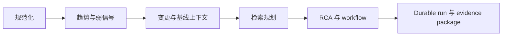

# 控制平面分析

English version: [docs/en/07-control-plane-analysis.md](../en/07-control-plane-analysis.md)

本页说明 controller 在当前 `v0.8` 代码树里，如何把 telemetry 变成 incident reasoning 与 governed workflow output。

## 核心设计选择

controller 不把原始 telemetry 直接当成最终推理平面。

它会先构造更小、更显式的证据对象，再用这些对象去做：

- trend 与 weak-signal 分析
- retrieval planning
- RCA hypothesis ranking
- incident workflow planning

正是这种拆分，让系统更便宜、更可审计，也更适合在 UI 中解释。

## 控制平面路径

## 控制平面的证据收敛原则

当前控制平面并不是“阶段越多越高级”，它的核心是把不确定性逐层收敛，而不是把更多材料一次性塞进 prompt。

这里有四条实际在代码里生效的原则：

1. 先统一事实，再做解释。`NodeSnapshot` 和相关结构化状态必须先稳定下来，后续分析才有共享输入。
2. 先做确定性压缩，再决定是否调用模型。趋势、弱信号、change correlation 和 retrieval decision 都是为了减少 prompt 面积。
3. 检索只在能提高答案质量时触发。静态知识和 incident memory 都是补充证据，不是默认主叙事。
4. 执行总是比解释更严格。越接近 remediation，越依赖 policy、approval、verification 和 compensation。

这四条原则合在一起，解释了为什么当前 controller 看起来比简单问答路径更长，但 operator 更容易知道“系统到底基于什么得出这个结论”。

## 当前控制平面的阶段

| 阶段 | 主要文件 | 为什么需要它 |
| --- | --- | --- |
| 规范化 | [`../../backend/internal/controller/ingest/store.go`](../../backend/internal/controller/ingest/store.go) | 把 partial transport batch 重建成统一当前态 |
| 趋势与弱信号生成 | [`../../backend/internal/controller/agentcore/workflow_eventization.go`](../../backend/internal/controller/agentcore/workflow_eventization.go) | 在最终 RCA 之前先发现漂移与复合风险 |
| predictive hint | [`../../backend/internal/controller/predictive/`](../../backend/internal/controller/predictive/) | 增加 deterministic 的短期预警 |
| 变更关联 | [`../../backend/internal/controller/changeintel/`](../../backend/internal/controller/changeintel/) | 把 incident 与 recent operational change 连接起来 |
| retrieval planning | [`../../backend/internal/controller/agentcore/agent.go`](../../backend/internal/controller/agentcore/agent.go), [`../../backend/internal/controller/agentcore/workflow_engine.go`](../../backend/internal/controller/agentcore/workflow_engine.go) | 决定是否值得检索知识 |
| RCA 与 workflow runtime | [`../../backend/internal/controller/agentcore/workflow_engine.go`](../../backend/internal/controller/agentcore/workflow_engine.go) | 构造 incident、hypothesis、evidence、recommendation 与 plan-act-verify step |
| durable recording | [`../../backend/internal/controller/agentcore/workflow_orchestrator.go`](../../backend/internal/controller/agentcore/workflow_orchestrator.go) | 持久化 run state、audit artifact 与 evidence package |

## 为什么要把症状检测和根因推理拆开

如果 controller 跳过中间阶段，直接从 `NodeSnapshot` 进入 prompt：

- 趋势方向会和 transient spike 混在一起
- 复合弱信号会被埋掉
- change evidence 只能停留在隐式层
- retrieval 会更嘈杂
- workflow output 更难解释和审计

当前拆分其实是在顺序回答四个问题：

1. 发生了什么变化？
2. 哪些变化是一起发生的？
3. 哪些外部知识或历史上下文与这次 incident 相关？
4. 最可信的解释和最安全的下一步是什么？

## 阶段 1：规范化与有界历史

在这一步之前的问题：

- collector batch 是 transport object，不是 reasoning object
- 被 suppression 的 low-churn payload 需要安全续接

当前机制：

- ingest 重建 `NodeSnapshot`
- trend-safe metrics 被保留成 `MetricHistorySample`
- log、GPU、process、storage、runtime context 被合并进同一当前态

它解决了什么：

- 后续每一层都能共享同一份 controller-owned fact model

## 阶段 2：Trend 与 Weak-Signal 证据

在这一步之前的问题：

- 只看硬阈值太晚
- 单看每个中等症状可能没意义，但组合起来可能已经危险

当前机制：

- trend 逻辑生成 `TrendAssessment[]`
- weak-signal 逻辑生成 `InvestigationEvent[]` 与 `JointRiskCooccurrence[]`

为什么需要：

- 在 retrieval 和 RCA 之前先完成一层噪声压缩
- 给 UI 和 API 提供更可读的证据层

## 阶段 3：Change Correlation 与 Adaptive Baseline

在这一步之前的问题：

- incident 可以怀疑 regression，但很难显式建模“最近变更”
- 对混合 GPU/AI workload 来说，通用 baseline 太弱

当前机制：

- `change_query` 会关联 recent deploy/config/driver/flag/infrastructure change
- adaptive baseline helper 会分类 workload-aware drift 与 spike

为什么重要：

- rollout-linked degradation 终于可以被审计
- RCA 可以基于 workload class、pod/job identity 与 hardware profile，而不只是泛化 host profile

## 阶段 4：Retrieval Planning

在这一步之前的问题：

- 默认全量检索会浪费 context budget，还可能引入无关文本

当前机制：

- query-service 与 workflow runtime 都会产生显式 retrieval decision
- static knowledge 与 incident memory 是两个分开的 retrieval source

为什么重要：

- controller 可以在证据 stale、太弱或已经足够时跳过 retrieval
- 一旦检索触发，命中的上下文会更贴近 incident

## 阶段 5：RCA 与 Governed Workflow

在这一步之前的问题：

- 只有解释，没有治理过的 action path，不足以支撑生产运维
- 没有 policy 和 verification 的 action planning 很危险

当前机制：

- RCA 构造 incident synthesis、hypothesis、evidence、recommendation 与 proposed action
- plan-act-verify step 会被 durable 记录
- 可执行步骤会进入 policy、approval 与 verification 边界

主要 runtime 输出包括：

- suspected root-cause entity
- causal path 与 impact scope
- evidence provenance
- uncertainty decomposition
- change links
- incident-memory matches

## 阶段 6：Durable Recording 与 Evidence Package

在这一步之前的问题：

- 如果 workflow run 不能在事后重建，它的运维价值会大幅下降

当前机制：

- durable run record 会保存 tool call、policy decision、approval、verification、compensation 与结果 artifact
- evidence package 会写到磁盘并通过 API 暴露

为什么重要：

- operator 可以检查 workflow 当时到底看到了什么、做了什么
- evaluation 可以对照稳定的 artifact trail 做回归验证

## 如何阅读当前控制平面

如果你想把一个 incident 从头看到尾，建议按这个顺序理解：

1. `ingest` 先重建事实模型
2. `workflow_eventization` 再把 telemetry 压成 trend 和 event
3. `changeintel` 补上 recent operational context
4. `workflow_engine` 构造 RCA 与 plan step
5. `causalgraph` 重新排序更可信的原因
6. `workflow_orchestrator` 持久化 run 与 evidence

这就是当前代码树里的真实 controller pipeline。

## 一个 incident 在控制平面里如何逐步收敛

以“同一 workload 再次出现 CPU burst”为例，控制面不会直接把它当成异常或当成正常，而是逐层收敛：

1. ingest 先确认这次 spike 属于哪个节点、哪个 workload、哪些相关信号同时在场。
2. eventization 判断它是短时尖峰、持续恶化，还是和其他信号形成 weak-signal 组合。
3. 行为记忆和 change context 再回答两个问题：
   - 这是不是历史上反复出现、通常健康结束的 burst？
   - 最近有没有 rollout、配置变更、runtime 事件让这次 spike 的语义变了？
4. 如果没有旁证，控制面倾向于保守降权；如果同时出现错误率、日志异常或 service latency 回归，分类会重新升级。
5. 到 workflow runtime 时，operator 看到的就不是一个原始 CPU 数值，而是一条带来源、带上下文、带置信度的 incident 解释链。

这也是控制面最重要的价值：它把“看到异常值”变成“知道为什么这个异常值值得进一步行动”。

## 边界

控制平面已经比单纯 analysis engine 更强，但仍然有明确边界：

- 它不是分布式 workflow 平台
- 它不能在科学意义上证明因果
- 它不能保证 retrieval 总是有帮助
- 它默认不会开放自主修改执行

这些边界恰恰是实现保持可信的原因。

## 建议继续阅读

- [事故 Agent 运行时](17-incident-agent-runtime.md)
- [API 参考](../en/24-api-reference.md)
- [测试与评估](19-testing-and-evaluation.md)
