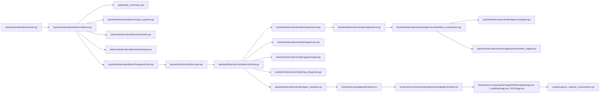

# 代码库地图

English version: [docs/en/09-codebase-map.md](../en/09-codebase-map.md)

本页是给工程师看的仓库导航图，目标不是罗列所有文件，而是回答下面这些问题：

- 仓库为什么要按这些目录拆分
- 主执行路径在代码里怎么串起来
- 我想改某个能力时，第一眼该去哪里看

## 为什么需要这张地图

这个仓库同时包含多条运行路径：

- 主机侧遥测采集
- controller 侧 ingest 和存储
- controller 侧 RAG 和 prompt 组装
- controller 侧工作流、预警和诊断
- 单独的 Web UI、脚本和部署层

如果没有代码库地图，新读者即使知道“有 collector / controller / RAG / agent”，也仍然不知道哪些目录才是真正拥有主路径的代码。

## 仓库总览

```text
ai_sre_agent_pub/
├── backend/
│   ├── cmd/                  # Go 入口：collector、controller、ragctl、security-audit
│   └── internal/
│       ├── collector/        # 主机侧采集、保护、spool、transport
│       └── controller/       # ingest、API、RAG、workflow、存储
├── cpp/
│   └── probe_core/           # collector 使用的原生 probe runtime
├── frontend/
│   └── src/                  # React UI 与 API 客户端
├── configs/                  # 默认配置、容器配置、playbook
├── dataset/                  # controller 侧 RAG 的种子知识源
├── deploy/                   # Docker、Kubernetes、Helm、systemd 资产
├── docs/                     # 中英文指南与参考文档
├── scripts/                  # 本地运行、构建、bootstrap、测试脚本
└── tests/                    # backend 外围的集成、E2E、UI 测试
```

## 主执行路径在代码里怎么走



这条链路体现了项目最关键的设计：采集尽量靠近主机，存储、检索和推理尽量留在 controller。

## 主要源码区域

### 1. Go 入口层

这一层存在的原因，是让每个运行时角色都有清晰的进程边界和配置入口。

| 路径 | 为什么存在 | 它启动什么 |
| --- | --- | --- |
| [`../../backend/cmd/collector/`](../../backend/cmd/collector/) | 定义 collector 的进程生命周期 | 主机侧采集、指标端点、配置重载 |
| [`../../backend/cmd/controller/`](../../backend/cmd/controller/) | 定义 controller 的进程生命周期 | ingest、API、UI、RAG、workflow |
| [`../../backend/cmd/ragctl/`](../../backend/cmd/ragctl/) | 不启动 controller 也能维护 RAG | `status`、`query`、`update`、`rebuild` |
| [`../../backend/cmd/security-audit/`](../../backend/cmd/security-audit/) | 提供单独的安全审计入口 | collector 侧安全检查和报告 |

如果这一层不清楚，就很难区分“库代码”“服务进程”“运维 CLI”到底各自属于什么角色。

### 2. 主机侧采集运行时

这一层存在，是因为短时效主机证据、内核事件和本地背压只能在被观测节点附近处理，不能指望 controller 事后再还原。

| 路径 | 负责什么 | 你通常会在这里找什么答案 |
| --- | --- | --- |
| [`../../backend/internal/collector/`](../../backend/internal/collector/) | collector 编排、batch、transport、自我保护、硬件画像 | 遥测如何采样、限流和发送 |
| [`../../backend/internal/collector/aux_sampling.go`](../../backend/internal/collector/aux_sampling.go) | 兼容进程扫描、日志 tail、external metrics 的慢速节奏与缓存复用 | 为什么这些 helper 不再每个主循环都跑一次 |
| [`../../backend/internal/collector/process_payload_suppression.go`](../../backend/internal/collector/process_payload_suppression.go) | 在有界刷新之间抑制近似不变的热点进程 payload | 为什么 collector 不再每个周期都重发同一份 top-process 列表 |
| [`../../backend/internal/collector/probe/cadence.go`](../../backend/internal/collector/probe/cadence.go) | legacy Go compatibility probe 的分层节奏和异常触发深采样 | 为什么 fallback 模式在平稳期更便宜、事故期又能及时加深采样 |
| [`../../backend/internal/collector/hardware_warnings.go`](../../backend/internal/collector/hardware_warnings.go) | 用已采信号产出 broad hardware warning | 为什么系统能增加硬件导向提示，却没有新增一条常驻高开销探针 |
| [`../../backend/internal/collector/probe/`](../../backend/internal/collector/probe/) | 兼容路径采集器，以及 `/proc` / sysfs 扩展采样 | probe-core 或 eBPF 不可用时还能看到什么 |
| [`../../backend/internal/collector/probe/ebpf/`](../../backend/internal/collector/probe/ebpf/) | 事件流式内核可见性 | runtime/security/kernel 事件从哪里进入 |
| [`../../backend/internal/collector/probecore/`](../../backend/internal/collector/probecore/) | Go 侧 probe-core 客户端 | collector 如何和 C++ probe 通信 |
| [`../../cpp/probe_core/`](../../cpp/probe_core/) | 原生 host/process/network/GPU 采样 | 主路径主机遥测到底从哪里来 |

### 3. Controller 运行时与控制面

这一层存在，是因为项目刻意把存储、检索和推理放在 controller，而不是放在业务主机上。

| 路径 | 负责什么 | 你通常会在这里找什么答案 |
| --- | --- | --- |
| [`../../backend/internal/controller/controller.go`](../../backend/internal/controller/controller.go) | controller 的总装配点 | controller 到底把哪些服务接起来了 |
| [`../../backend/internal/controller/ingest/`](../../backend/internal/controller/ingest/) | gRPC ingest、热内存状态、嵌入式持久化 | 遥测如何变成可查询状态 |
| [`../../backend/internal/controller/timeseries/`](../../backend/internal/controller/timeseries/) | 可选持久化趋势历史 | 更长时间窗的趋势从哪里来 |
| [`../../backend/internal/controller/agentcore/workflow_eventization.go`](../../backend/internal/controller/agentcore/workflow_eventization.go) | 趋势评估、弱信号融合和检索规划 | 控制面是在哪一步把原始状态变成排序后的调查证据的 |
| [`../../backend/internal/controller/logindex/`](../../backend/internal/controller/logindex/) | 日志索引 | log fingerprint 如何变成可检索证据 |
| [`../../backend/internal/controller/gpuobs/`](../../backend/internal/controller/gpuobs/) | GPU fleet snapshot 与历史 | GPU timeline 和汇总在哪里聚合 |
| [`../../backend/internal/controller/inventory/`](../../backend/internal/controller/inventory/) | fleet inventory 与分组 | controller 如何维护节点身份和拓扑信息 |

### 4. 检索、Prompt 与推理

这一层存在，是因为单纯靠静态 prompt 不足以提供环境相关的 runbook、历史故障和操作证据。

| 路径 | 负责什么 | 为什么重要 |
| --- | --- | --- |
| [`../../backend/internal/controller/rag/`](../../backend/internal/controller/rag/) | 数据源发现、规范化、chunk、索引、检索 | 把仓库内知识变成可检索的运维上下文 |
| [`../../backend/internal/controller/rag_integration.go`](../../backend/internal/controller/rag_integration.go) | controller 的 RAG HTTP 接口 | 让 RAG 成为一个可操作、可观察的服务面 |
| [`../../backend/internal/controller/agentcore/`](../../backend/internal/controller/agentcore/) | query-service prompt 组装、workflow tool、安全校验 | 定义遥测和证据如何进入 LLM 上下文 |
| [`../../backend/internal/controller/agent/`](../../backend/internal/controller/agent/) | 定时预警和事件驱动分析 | 生成周期性报告和策略化结论 |
| [`../../backend/internal/controller/analysis/`](../../backend/internal/controller/analysis/) | 独立 analysis-engine LLM 路径 | 把旧路径或替代路径和主 query-service 隔离开 |

### 5. UI 与 API 消费层

这一层存在，是为了让 UI 永远通过 controller API 读取数据，而不是直接耦合内部 store。

| 路径 | 负责什么 |
| --- | --- |
| [`../../frontend/src/main.tsx`](../../frontend/src/main.tsx) | 启动 React 应用并恢复主题状态 |
| [`../../frontend/src/App.tsx`](../../frontend/src/App.tsx) | 顶层页面壳、导航与页面路由 |
| [`../../frontend/src/api/`](../../frontend/src/api/) | controller API 的前端封装层 |
| [`../../frontend/src/api/agentWorkflows.ts`](../../frontend/src/api/agentWorkflows.ts) | trend、investigation event、retrieval decision、RCA 数据的共享类型层 |
| [`../../frontend/src/components/Insights/InvestigationPanels.tsx`](../../frontend/src/components/Insights/InvestigationPanels.tsx) | 控制面输出的共享证据面板 |
| [`../../frontend/src/components/Insights/RiskInsightsPage.tsx`](../../frontend/src/components/Insights/RiskInsightsPage.tsx) | 风险导向的调查控制台页面 |
| [`../../frontend/src/components/Insights/JointRiskPage.tsx`](../../frontend/src/components/Insights/JointRiskPage.tsx) | 相关风险和弱信号 verdict 页面 |
| [`../../frontend/src/components/Insights/RCAPage.tsx`](../../frontend/src/components/Insights/RCAPage.tsx) | 带证据链的 RCA 调查控制台 |

### 6. 配置、部署与引导层

这一层存在，是因为同一套代码既要能源码本地跑，也要能容器化、集群化部署。

| 路径 | 负责什么 |
| --- | --- |
| [`../../configs/`](../../configs/) | 默认 YAML 配置、容器配置、playbook、环境覆盖 |
| [`../../scripts/`](../../scripts/) | 本地引导、docker 包装、smoke test、dataset bootstrap |
| [`../../deploy/`](../../deploy/) | Docker Compose、Kubernetes、Helm、systemd 资产 |
| [`../../Makefile`](../../Makefile) | 标准 build、test、run、RAG 运维入口 |

现在更关键的部署相关文件还有：

- [`../../backend/internal/collector/deployment.go`](../../backend/internal/collector/deployment.go)：在非本地模式下改写 collector 默认路径，并写入 cluster/deployment 标签
- [`../../backend/internal/controller/deployment.go`](../../backend/internal/controller/deployment.go)：在非本地模式下改写 controller 默认路径，并驱动 `/api/v1/status.deployment`
- [`../../deploy/k8s/push-first/`](../../deploy/k8s/push-first/)：原始 `cluster-lite` manifest 集合
- [`../../deploy/charts/sre-agent/templates/controller-configmap.yaml`](../../deploy/charts/sre-agent/templates/controller-configmap.yaml) 和 [`../../deploy/charts/sre-agent/templates/collector-configmap.yaml`](../../deploy/charts/sre-agent/templates/collector-configmap.yaml)：Helm 的配置注入点
- [`../../deploy/k8s/push-first/collector-daemonset.yaml`](../../deploy/k8s/push-first/collector-daemonset.yaml) 和 [`../../deploy/charts/sre-agent/templates/collector-daemonset.yaml`](../../deploy/charts/sre-agent/templates/collector-daemonset.yaml)：把 `spec.nodeName` 注入到 `SRE_COLLECTOR_ID` 和 `SRE_COLLECTOR_HOSTNAME`，这就是集群里 node-local collector 身份保持稳定的方式

这一层里还有一个现在直接影响文档正确性的脚本：

- [`../../scripts/capture_readme_screenshots.mjs`](../../scripts/capture_readme_screenshots.mjs) 是 README 和 UI 指南截图的维护入口
- 它会先经历 warmup，再在页面 ready 后继续等待一段稳定时间，避免把只加载出 shell 的页面截进文档

## 按任务找代码

| 如果你要... | 先看这里 | 再看这里 |
| --- | --- | --- |
| 理解启动与运行边界 | [`../../backend/cmd/controller/main.go`](../../backend/cmd/controller/main.go)、[`../../backend/cmd/collector/main.go`](../../backend/cmd/collector/main.go) | [core-files.md](10-core-files.md)、[architecture.md](04-architecture.md) |
| 调整 collector 的限速、load shedding 或保护策略 | [`../../backend/internal/collector/protection.go`](../../backend/internal/collector/protection.go)、[`../../backend/internal/collector/aux_sampling.go`](../../backend/internal/collector/aux_sampling.go) | [`../../backend/internal/collector/collector.go`](../../backend/internal/collector/collector.go)、[hardware-considerations.md](14-hardware-considerations.md) |
| 调整 compatibility fallback 的分层节奏或异常触发深采样 | [`../../backend/internal/collector/probe/cadence.go`](../../backend/internal/collector/probe/cadence.go) | [`../../backend/internal/collector/probe/collector.go`](../../backend/internal/collector/probe/collector.go)、[metrics-and-signals.md](13-metrics-and-signals.md) |
| 修改硬件识别或硬件自适应采样 | [`../../backend/internal/collector/hardware_profile.go`](../../backend/internal/collector/hardware_profile.go) | [`../../configs/collector.yaml`](../../configs/collector.yaml)、[metrics-and-signals.md](13-metrics-and-signals.md) |
| 调整 probe-core 数据如何映射到 Go 遥测 | [`../../backend/internal/collector/probe_core_convert.go`](../../backend/internal/collector/probe_core_convert.go) | [`../../cpp/probe_core/main.cpp`](../../cpp/probe_core/main.cpp) |
| 调整 ingest 校验或去重 | [`../../backend/internal/controller/ingest/server.go`](../../backend/internal/controller/ingest/server.go) | [`../../backend/internal/controller/ingest/store.go`](../../backend/internal/controller/ingest/store.go) |
| 修改趋势逻辑、弱信号融合或 retrieval 规划 | [`../../backend/internal/controller/agentcore/workflow_eventization.go`](../../backend/internal/controller/agentcore/workflow_eventization.go) | [`../../backend/internal/controller/agentcore/workflow_engine.go`](../../backend/internal/controller/agentcore/workflow_engine.go)、[`../../backend/internal/controller/agentcore/incident_decision.go`](../../backend/internal/controller/agentcore/incident_decision.go) |
| 修改 RAG 数据集或索引逻辑 | [`../../backend/internal/controller/rag/ingest.go`](../../backend/internal/controller/rag/ingest.go)、[`../../backend/internal/controller/rag/retriever.go`](../../backend/internal/controller/rag/retriever.go) | [dataset-and-rag.md](11-dataset-and-rag.md)、[`../../dataset/README.md`](../../dataset/README.md) |
| 改 prompt 文案或安全边界 | [`../../backend/internal/controller/agentcore/prompts.go`](../../backend/internal/controller/agentcore/prompts.go)、[`../../backend/internal/controller/agentcore/llm_safety.go`](../../backend/internal/controller/agentcore/llm_safety.go) | [prompts-and-customization.md](12-prompts-and-customization.md) |
| 调整定时报告与预警逻辑 | [`../../backend/internal/controller/agent/engine.go`](../../backend/internal/controller/agent/engine.go)、[`../../backend/internal/controller/agent/report_dedupe.go`](../../backend/internal/controller/agent/report_dedupe.go) | [`../../backend/internal/controller/agent/policy.go`](../../backend/internal/controller/agent/policy.go) |
| 调整 workflow 工具与 tool-driven RCA | [`../../backend/internal/controller/agentcore/workflow_engine.go`](../../backend/internal/controller/agentcore/workflow_engine.go) | [`../../backend/internal/controller/agentcore/actions.go`](../../backend/internal/controller/agentcore/actions.go)、[`../../backend/internal/controller/agentcore/trace_store.go`](../../backend/internal/controller/agentcore/trace_store.go) |
| 修改调查控制台 UI 结构 | [`../../frontend/src/components/Insights/InvestigationPanels.tsx`](../../frontend/src/components/Insights/InvestigationPanels.tsx)、[`../../frontend/src/components/Insights/RiskInsightsPage.tsx`](../../frontend/src/components/Insights/RiskInsightsPage.tsx)、[`../../frontend/src/components/Insights/JointRiskPage.tsx`](../../frontend/src/components/Insights/JointRiskPage.tsx)、[`../../frontend/src/components/Insights/RCAPage.tsx`](../../frontend/src/components/Insights/RCAPage.tsx) | [ui-guide.md](08-ui-guide.md)、[`../../frontend/src/api/agentWorkflows.ts`](../../frontend/src/api/agentWorkflows.ts) |
| UI 改完后刷新 README / 文档截图 | [`../../scripts/capture_readme_screenshots.mjs`](../../scripts/capture_readme_screenshots.mjs) | [ui-guide.md](08-ui-guide.md)、[`../../docs/images/`](../../docs/images/) |
| 调整本地启动或 demo 行为 | [`../../scripts/run-local.sh`](../../scripts/run-local.sh) | [`../../Makefile`](../../Makefile)、[`../../docker-compose.yaml`](../../docker-compose.yaml) |

## 三条更具体的改动路径

### 1. 某个节点上 collector CPU 太高

当操作员反馈“监控自己太贵”时，建议按这个顺序读代码：

1. [`../../backend/internal/collector/collector.go`](../../backend/internal/collector/collector.go)
   先看 `collectBatch`。这里能看到每一轮真正做了哪些工作，以及哪些路径可以被 shed。
2. [`../../backend/internal/collector/aux_sampling.go`](../../backend/internal/collector/aux_sampling.go)
   这里定义了兼容进程扫描、日志采集和 external metrics 如何改成慢速缓存节奏。
3. [`../../backend/internal/collector/probe/cadence.go`](../../backend/internal/collector/probe/cadence.go)
   这里定义了 legacy Go fallback 的 extended、deep、RCA、kernel-event、GPU helper 不再共用一个刷新循环。
4. [`../../backend/internal/collector/protection.go`](../../backend/internal/collector/protection.go)
   这里决定 collector 进入 `normal`、`incident`、`pressure` 还是 `critical`，以及何时关闭可选工作。
5. [`../../backend/internal/collector/hardware_profile.go`](../../backend/internal/collector/hardware_profile.go)
   这里决定大 CPU、NUMA、GPU、NIC 画像如何改变子采集器节奏。
6. [`../../configs/collector.yaml`](../../configs/collector.yaml)
   这里是操作员真正能改的默认值：`collection_interval`、`probe_core.*interval_samples`、`protection.*`。

可以先盯这些信号：

- `collector_self_cpu_percent`
- `collector_protection_mode`
- `collector_aux_collection_cache_hit{component="logs"}`
- `collector_aux_payload_suppressed{component="process_fallback"}`
- `collector_process_payload_suppressed`
- `collector_aux_collection_interval_seconds{component="process_fallback"}`
- `collector_compat_collection_interval_seconds{component="hardware"}`
- `collector_compat_collection_interval_seconds{component="deep"}`
- `collector_compat_collection_anomaly_triggered{component="deep"}`
- `collector_hardware_warning_total`
- `collector_process_fallback_shed`

如果只看顶层 collector 循环，很容易忽略现在还多了一层 helper cadence 和显式 shed 信号。

### 2. RAG 回答太泛或者不相关

当 retrieval-backed 回答看起来不接地气时，建议按这个顺序排查：

1. [`../../backend/internal/controller/rag/service.go`](../../backend/internal/controller/rag/service.go)
   这里负责索引加载、重建策略和坏索引 quarantine。
2. [`../../backend/internal/controller/rag/retriever.go`](../../backend/internal/controller/rag/retriever.go)
   这里决定 lexical/vector/hybrid 如何打分和选中命中项。
3. [`../../backend/internal/controller/rag/index.go`](../../backend/internal/controller/rag/index.go)
   这里决定 controller 在信任本地索引前会做哪些完整性校验。
4. [`../../backend/internal/controller/agentcore/agent.go`](../../backend/internal/controller/agentcore/agent.go)
   这里决定 retrieval 只在真正的 LLM 路径上附加，会先通过 `rag_max_findings` / `rag_max_query_chars` 压缩查询，在上下文有意义时把 anomaly hints 也并进去，过滤掉低价值 telemetry boilerplate，并在 query 过于泛化、telemetry 太 stale、retrieval 置信度太低或最近成功分析可安全复用时直接跳过更贵的 RAG / LLM 路径。
5. [`../../backend/internal/controller/agentcore/prompts.go`](../../backend/internal/controller/agentcore/prompts.go)
   这里决定检索出的知识如何被压缩成 prompt 证据块。

可以先做的真实检查：

- `make rag-status`
- `make rag-query QUERY='disk latency queue depth nvme'`
- `/api/v1/rag/status`
- controller RAG 存储路径下是否出现 `index.corrupt-*.json`

如果你只改 dataset，仍然可能错过真正的问题：stale telemetry 会直接短路 retrieval，而 prompt compaction 也会主动删除低价值上下文。

### 3. UI 是好的，但诊断看起来很“规则化”

当页面能打开，但 agent 明显没有走 retrieval 或 LLM 时，可以按这个顺序看：

1. [`../../configs/controller.yaml`](../../configs/controller.yaml)
   先确认 `agent.rag_enabled`、`agent.llm_enabled`、`rag_rebuild_policy`。
2. [`../../backend/internal/controller/agentcore/agent.go`](../../backend/internal/controller/agentcore/agent.go)
   看看 telemetry stale 或为空时跳过 RAG / LLM 的分支。
3. [`../../backend/internal/controller/agentcore/llm_safety.go`](../../backend/internal/controller/agentcore/llm_safety.go)
   这里会拒绝格式错误或不安全的模型输出。
4. [`../../backend/internal/controller/agentcore/prompts.go`](../../backend/internal/controller/agentcore/prompts.go)
   这里展示 LLM 真正看到的紧凑 prompt schema。
5. [deployment.md](15-deployment.md)
   这里解释如何验证“只是 deterministic mode”还是“确实坏了”。

应该预期的是：

- 即使 `agent.llm_enabled: false`，UI 仍然可以正常工作
- 即使 RAG 被关闭或被跳过，controller 仍然能返回 deterministic findings
- telemetry freshness 不够时，系统会刻意不做 retrieval，以避免浪费模型成本

## 仓库里常见的几个误解点

- `backend/internal/controller/agentcore/` 是主 query-service 和 prompt 组装路径；`backend/internal/controller/analysis/` 是隔离开的另一条 analysis-engine 路径。
- `configs/` 和 `configs/container/` 不是意外重复，它们对应源码模式和容器模式不同的文件系统根路径与默认值。
- `dataset/` 是 controller 侧 retrieval 的种子知识，不是 live fleet telemetry。实时遥测仍然通过 `ingest/` 进入系统。
- `ragctl` 不是另一套 RAG 引擎，它只是对同一套 controller RAG 包的维护 CLI。

## 给新贡献者的阅读顺序

1. 先读 [architecture.md](04-architecture.md)，理解运行时拆分。
2. 再读 [data-flow.md](05-data-flow.md)，理解数据怎么走。
3. 然后读 [core-files.md](10-core-files.md)，明确真正拥有主路径的文件。
4. 如果要改推理行为，再读 [dataset-and-rag.md](11-dataset-and-rag.md) 和 [prompts-and-customization.md](12-prompts-and-customization.md)。
5. 如果要改采集行为，再读 [metrics-and-signals.md](13-metrics-and-signals.md) 和 [hardware-considerations.md](14-hardware-considerations.md)。

## 参见

- [核心文件](10-core-files.md)
- [架构](04-architecture.md)
- [数据流](05-data-flow.md)
- [数据集与 RAG](11-dataset-and-rag.md)
- [Prompt 与定制](12-prompts-and-customization.md)
