# 核心文件

English version: [docs/en/10-core-files.md](../en/10-core-files.md)

本页解释真正决定项目行为的关键文件。它不是逐函数 API 文档，而是帮助工程师理解：

- 每个重要文件到底是干什么的
- 它为什么存在
- 它接收什么输入、产出什么输出
- 它位于端到端链路的哪个位置
- 如果删掉、配错或理解错，会造成什么问题

## 如何阅读这页

1. 如果你想先看系统视图，先读 [architecture.md](04-architecture.md) 或 [data-flow.md](05-data-flow.md)
2. 如果你已经知道自己关心哪条链路，就用本页定位拥有职责的文件
3. 想追一个功能时，可以直接沿着“下一站文件”阅读

## 核心执行路径

```mermaid
flowchart LR
    A["cpp/probe_core/main.cpp"] --> B["collector/probe_core_convert.go"]
    B --> C["collector/collector.go"]
    C --> D["collector/transport/client.go"]
    D --> E["controller/ingest/server.go"]
    E --> F["controller/ingest/store.go"]
    F --> G["controller/agentcore/workflow_eventization.go"]
    G --> H["controller/agentcore/workflow_engine.go"]
    G --> I["controller/agentcore/agent.go"]
    I --> J["controller/rag/*.go"]
    I --> K["controller/agentcore/prompts.go"]
    K --> L["controller/agentcore/agent.go chatClient.Complete"]
    L --> M["parseLLMPayload / fallbackPayload"]
    H --> N["agent_handlers.go / UI / reports"]
    M --> N
```

如果你想理解“一条异常为什么会变成一条模型回答”，这就是最值得顺着读的文件路径。

## 文件之间真实传递的对象

很多新读者觉得这个仓库“文件很多”，真正的原因其实不是目录多，而是关键边界都体现在类型边界上。

| 从哪个文件 | 到哪个文件 | 真正传递的对象 | 为什么要有这道边界 |
| --- | --- | --- | --- |
| [`../../cpp/probe_core/main.cpp`](../../cpp/probe_core/main.cpp) | [`../../backend/internal/collector/probe_core_convert.go`](../../backend/internal/collector/probe_core_convert.go) | `probeipcv1.ProbeBatch` | 把原生采样和 Go 侧命名/批处理契约隔开 |
| [`../../backend/internal/collector/probe_core_convert.go`](../../backend/internal/collector/probe_core_convert.go) | [`../../backend/internal/collector/collector.go`](../../backend/internal/collector/collector.go) | `[]*telemetryv1.Metric`、`[]*telemetryv1.ProcessSample` | 把原生输出翻译成后续系统真正依赖的指标名和进程摘要 |
| [`../../backend/internal/collector/collector.go`](../../backend/internal/collector/collector.go) | [`../../backend/internal/collector/transport/client.go`](../../backend/internal/collector/transport/client.go) | `*telemetryv1.TelemetryBatch` | 让采集和发送解耦，避免 backlog/retry 反向污染采集循环 |
| [`../../backend/internal/collector/transport/client.go`](../../backend/internal/collector/transport/client.go) | [`../../backend/internal/controller/ingest/server.go`](../../backend/internal/controller/ingest/server.go) | gRPC `PushTelemetry` request/ack | 给 controller 一个明确的“已收到且已接受”边界 |
| [`../../backend/internal/controller/ingest/store.go`](../../backend/internal/controller/ingest/store.go) | [`../../backend/internal/controller/agentcore/agent.go`](../../backend/internal/controller/agentcore/agent.go) | `NodeSnapshot` + metric history | query-service 读取的是系统状态，而不是原始 transport batch |
| [`../../backend/internal/controller/ingest/store.go`](../../backend/internal/controller/ingest/store.go) | [`../../backend/internal/controller/agentcore/workflow_eventization.go`](../../backend/internal/controller/agentcore/workflow_eventization.go) | `NodeSnapshot`、baseline series、risk signal sample | 在更深层分析前，把原始 controller 状态先压缩成趋势、行为记忆、弱信号和检索规划对象 |
| [`../../backend/internal/controller/agentcore/workflow_eventization.go`](../../backend/internal/controller/agentcore/workflow_eventization.go) | [`../../backend/internal/controller/agentcore/workflow_engine.go`](../../backend/internal/controller/agentcore/workflow_engine.go) | `TrendAssessment[]`、`BehavioralSignalAssessment[]`、`InvestigationEvent[]`、`RetrievalDecision[]` | 让 workflow 基于排序后的证据推理，而不是直接面对原始快照 |
| [`../../backend/internal/controller/agentcore/agent.go`](../../backend/internal/controller/agentcore/agent.go) | [`../../backend/internal/controller/agentcore/prompts.go`](../../backend/internal/controller/agentcore/prompts.go) | `PromptInput` | 把证据选择和 prompt 文案分开 |
| [`../../backend/internal/controller/agentcore/prompts.go`](../../backend/internal/controller/agentcore/prompts.go) | [`../../backend/internal/controller/agentcore/agent.go`](../../backend/internal/controller/agentcore/agent.go) | `LLMSchema`、system prompt、user prompt | 让模型 I/O 可追踪、可测试 |
| [`../../backend/internal/controller/agentcore/agent.go`](../../backend/internal/controller/agentcore/agent.go) | [`../../backend/internal/controller/agent_handlers.go`](../../backend/internal/controller/agent_handlers.go) | `QueryResponse` | 把 HTTP 响应格式和推理主循环隔离开 |

如果你不跟踪这些 handoff type，就很容易在错误的层排查。很多“agent 问题”其实是更前面的 metric contract 或 ingest state 问题。

## 示例追踪：一台慢节点是如何走到最终回答的

下面这张表追踪一个具体案例：

- probe-core 采到了高 CPU、高内存、高磁盘等待
- controller 先生成 deterministic findings
- RAG 命中了 rollout 相关 runbook
- prompt 同时带着 telemetry 和 retrieval 片段进入模型

| 文件 | 为什么存在 | 这个例子里的输入 | 这个例子里的输出 | 下一站文件 | 如果没有它会怎样 |
| --- | --- | --- | --- | --- | --- |
| [`../../cpp/probe_core/main.cpp`](../../cpp/probe_core/main.cpp) | 主路径原生采样器 | 内核 / procfs 原始状态 | `probe_core_cpu_usage_percent`、`probe_core_memory_used_bytes`、`probe_core_disk_await_ms` | [`probe_core_convert.go`](../../backend/internal/collector/probe_core_convert.go) | 高保真主机指标根本不会产生 |
| [`../../backend/internal/collector/probe_core_convert.go`](../../backend/internal/collector/probe_core_convert.go) | 把原生计数器翻译成 controller 指标名 | `probe_core_*` metrics | `node_cpu_usage_percent`、`node_memory_Used_bytes`、`node_disk_request_latency_p99_seconds` | [`collector.go`](../../backend/internal/collector/collector.go) | 下游代码看不到预期指标名 |
| [`../../backend/internal/collector/collector.go`](../../backend/internal/collector/collector.go) | collector 总编排和 batching | 规范化 metrics、process、logs | `TelemetryBatch` 和 collector 自身指标 | [`transport/client.go`](../../backend/internal/collector/transport/client.go) | 采集、保护、发送逻辑会混成一团 |
| [`../../backend/internal/collector/transport/client.go`](../../backend/internal/collector/transport/client.go) | 有边界的发送与重试 | 序列化 batch | gRPC 发送、ack、重试状态 | [`ingest/server.go`](../../backend/internal/controller/ingest/server.go) | transport 故障和 collector 故障难以区分 |
| [`../../backend/internal/controller/ingest/server.go`](../../backend/internal/controller/ingest/server.go) | 校验并接收 telemetry | `TelemetryBatch` | store 写入和 `batch_id` ack | [`ingest/store.go`](../../backend/internal/controller/ingest/store.go) | 没有清晰边界区分“收到”和“可信” |
| [`../../backend/internal/controller/ingest/store.go`](../../backend/internal/controller/ingest/store.go) | controller 热状态 | metrics、process、logs、runtime context | `NodeSnapshot` 和 history | [`agentcore/agent.go`](../../backend/internal/controller/agentcore/agent.go) | controller 没有统一 current state；它还负责把被抑制的低频 collector 状态和慢 compatibility 硬件视图续接起来 |
| [`../../backend/internal/controller/agentcore/workflow_eventization.go`](../../backend/internal/controller/agentcore/workflow_eventization.go) | 在 retrieval 或操作员输出之前构造趋势与弱信号证据 | `NodeSnapshot`、baseline history、risk signal、predictive evaluation、行为记忆分类 | `TrendAssessment[]`、`BehavioralSignalAssessment[]`、`InvestigationEvent[]`、`RetrievalDecision[]` | [`workflow_engine.go`](../../backend/internal/controller/agentcore/workflow_engine.go)、[`agent.go`](../../backend/internal/controller/agentcore/agent.go)、UI 页面 | 没有它，控制面只能退回更平的阈值 finding 和更泛的 retrieval query |
| [`../../backend/internal/controller/agentcore/agent.go`](../../backend/internal/controller/agentcore/agent.go) | 筛选、findings、RAG、analysis reuse、LLM、fallback 的总路径 | `NodeSnapshot`、history、GPU state、query | `PromptInput`、`QueryResponse` | [`prompts.go`](../../backend/internal/controller/agentcore/prompts.go)、[`rag/service.go`](../../backend/internal/controller/rag/service.go) | 无法解释 telemetry 如何变成 reasoning input，也无法解释为什么重复相同查询时不再支付完整 RAG / LLM 成本 |
| [`../../backend/internal/controller/rag/service.go`](../../backend/internal/controller/rag/service.go) | 检索服务生命周期 | dataset、index、query | `QueryResult`、`SearchHit` | [`prompts.go`](../../backend/internal/controller/agentcore/prompts.go) | RAG 会像“凭空出现的上下文” |
| [`../../backend/internal/controller/agentcore/prompts.go`](../../backend/internal/controller/agentcore/prompts.go) | system/user prompt builder 和 `LLMSchema` | `PromptInput` | 最终 prompt 和 evidence schema | [`agent.go`](../../backend/internal/controller/agentcore/agent.go) | 模型到底看到了什么会变得不可见 |
| [`../../backend/internal/controller/agentcore/agent.go`](../../backend/internal/controller/agentcore/agent.go) | `chatClient.Complete`、`parseLLMPayload`、`fallbackPayload` | 已组装 prompt | 解析后的 JSON 回答或 deterministic fallback | [`agent_handlers.go`](../../backend/internal/controller/agent_handlers.go) | 模型 I/O、校验和回退行为无法追踪 |

## 入口与运行时装配文件

这些文件存在，是为了给每种运行角色明确的进程边界。否则生命周期、配置加载和部署行为都会散落在库代码里。

| 文件 | 主要职责 | 输入 | 输出 | 为什么重要 |
| --- | --- | --- | --- | --- |
| [`../../backend/cmd/collector/main.go`](../../backend/cmd/collector/main.go) | 启动 collector 进程 | collector 配置、环境变量覆盖 | 运行中的 collector、`/metrics`、`/healthz`、`/readyz` | 定义 collector 实际如何启动 |
| [`../../backend/cmd/controller/main.go`](../../backend/cmd/controller/main.go) | 启动 controller | controller 配置、环境变量覆盖 | 运行中的 HTTP / gRPC / RAG / workflow 服务，以及带 deployment 元数据的 `/healthz` / `/readyz` / `/api/v1/status` | 定义控制面如何启动 |
| [`../../backend/internal/controller/controller.go`](../../backend/internal/controller/controller.go) | 装配 controller 子系统 | config、logger、stores、handlers | 完整 controller runtime | 真正的 controller composition root |
| [`../../backend/cmd/ragctl/main.go`](../../backend/cmd/ragctl/main.go) | 不启动全 controller 也能做 RAG 运维 | RAG env/config | CLI status/query/update/rebuild | 让索引维护路径显式化 |
| [`../../scripts/run-local.sh`](../../scripts/run-local.sh) | 标准本地启动脚本 | 仓库路径、可选参数 | 本地构建和启动的服务 | 展示项目实际建议的运行方式 |
| [`../../Makefile`](../../Makefile) | 统一 build/run/test 命令入口 | repo 本地命令和 env | 可重复开发任务 | 保持工作流可发现 |

现在还有两个紧挨入口层的重要部署辅助文件：

- [`../../backend/internal/collector/deployment.go`](../../backend/internal/collector/deployment.go)：把 repo-local collector 默认路径改写成更适合集群的路径，并补上 `cluster` / `deployment_mode` 标签
- [`../../backend/internal/controller/deployment.go`](../../backend/internal/controller/deployment.go)：在非本地模式下改写 controller 默认路径，并驱动 `/api/v1/status.deployment`

## collector 侧关键文件

这些文件存在，是因为主机侧采集必须被限速、保护，并且和 controller 可达性解耦。否则监控不是太重，就是太脆弱。

| 文件 | 解决什么问题 | 主要输入 | 主要输出 | 哪些文件依赖它 |
| --- | --- | --- | --- | --- |
| [`../../backend/internal/collector/collector.go`](../../backend/internal/collector/collector.go) | 中央采集循环和 batching | config、source pipeline、protection、spool、transport | outgoing batch、collector 自监控指标 | entrypoint、transport、protection、tests |
| [`../../backend/internal/collector/metric_suppression.go`](../../backend/internal/collector/metric_suppression.go) | 抑制不变的低频 collector/runtime inventory | 已规范化的 collector 指标和 refresh interval 配置 | 更小的 steady-state batch，以及 `collector_metrics_partial_update` / `collector_metrics_suppressed_count` | `collector.go`、controller ingest 重建逻辑、operator 排障 |
| [`../../backend/internal/collector/aux_sampling.go`](../../backend/internal/collector/aux_sampling.go) | 给昂贵辅助采集加 cadence-cache | collector interval、protection mode、log/process/external helper | 缓存后的 logs、兼容进程扫描、external metrics、节奏指标，以及 cache-hit payload suppression 标记 | `collector.go`、ingest 清理语义、operator 验证 |
| [`../../backend/internal/collector/process_payload_suppression.go`](../../backend/internal/collector/process_payload_suppression.go) | 在有界刷新之间抑制近似不变的主路径进程 payload | 主路径采集出的 top-process 列表、重发间隔配置 | 更小的 `TelemetryBatch.Processes`，以及 `collector_process_payload_refreshed` / `collector_process_payload_suppressed` | `collector.go`、operator payload 成本排障 |
| [`../../backend/internal/collector/probe/cadence.go`](../../backend/internal/collector/probe/cadence.go) | 给 legacy Go compatibility path 增加分层节奏和异常触发刷新 | compatibility fallback 指标、collector 基础周期 | runtime/hardware/deep/kernel/RCA/GPU 的缓存刷新决策，以及 `collector_compat_collection_*` / `collector_compat_payload_*` 指标 | `probe/collector.go`、fallback 开销验证 |
| [`../../backend/internal/collector/source_pipeline.go`](../../backend/internal/collector/source_pipeline.go) | probe-core 与 compatibility fallback 的切换 | probe-core 健康状态、runtime mode | 带 source 标签的 metrics / fallback state | `collector.go` |
| [`../../backend/internal/collector/probe_core_convert.go`](../../backend/internal/collector/probe_core_convert.go) | metric / process 规范化 | 原生 `probeipcv1.ProbeBatch` | `telemetryv1.Metric`、`telemetryv1.ProcessSample` | collector loop、controller 消费者 |
| [`../../backend/internal/collector/protection.go`](../../backend/internal/collector/protection.go) | 以主机优先为原则的 load shedding | self CPU/memory、backlog、hardware profile | protection mode、降低后的工作量、自身保护指标 | collector 主循环 |
| [`../../backend/internal/collector/hardware_profile.go`](../../backend/internal/collector/hardware_profile.go) | 硬件发现缓存 | `/proc`、`/sys`、设备拓扑 | hardware capability profile 和阈值 | protection、collector pacing |
| [`../../backend/internal/collector/hardware_warnings.go`](../../backend/internal/collector/hardware_warnings.go) | 不增加新探针的 broad hardware hint | 已采集的 node 指标和缓存 hardware threshold | `collector_hardware_warning_total` 与 `collector_hardware_warning{domain=...,reason=...}` | collector batch 组装、operator 排障、下游筛选 |
| [`../../backend/internal/collector/spool/spool.go`](../../backend/internal/collector/spool/spool.go) | 持久化发送缓冲 | 待发送 batch | 可回放 backlog | collector、transport |
| [`../../backend/internal/collector/transport/client.go`](../../backend/internal/collector/transport/client.go) | 有边界的发送和重试 | spool 中的序列化 batch | ack、retry state、mirror/failover 行为 | collector 和 ingest |
| [`../../backend/internal/collector/security_audit.go`](../../backend/internal/collector/security_audit.go) | collector 侧安全 finding | process data、runtime state、event 摘要 | security metrics 和 findings | controller 安全分析 |
| [`../../backend/internal/collector/config.go`](../../backend/internal/collector/config.go) | collector runtime schema | YAML 和 env | 规范化配置 | entrypoint、runtime、tests |

### 为什么 `probe_core_convert.go` 特别重要

它是原生采样和后续整个系统之间的桥梁。这里定义了：

- `probe_core_cpu_usage_percent` -> `node_cpu_usage_percent`
- `probe_core_memory_used_bytes` -> `node_memory_Used_bytes`
- `probe_core_disk_await_ms` -> `node_disk_avg_request_latency_seconds`
- per-device 数据 -> `node_disk_queue_depth_total` 这类节点级聚合
- 默认还会去掉大多数已经有 alias 的 raw `probe_core_*` host/resource duplicate；只有显式打开 `probe_core.emit_raw_aliased_metrics` 才会恢复双份发送

如果这一层理解错了，工程师很容易在错误的一侧改 collector 或 controller。

### 为什么需要 `metric_suppression.go`

如果没有这个文件，collector 会在每个循环都重复发送同一份低频 runtime/hardware inventory，例如：

- probe source
- runtime mode 和 capability flag
- probe-core module selection
- hardware profile、threshold、capability

这些重复状态会增加 CPU、protobuf、spool 和网络开销，但在平稳期几乎不会提高诊断质量。

这个文件就是为了解决这个问题而存在：

- 它记住每个低频 metric identity 上次发出的值
- 在 `low_churn_metrics_refresh_interval` 之前，如果值没变就抑制
- 同时输出 `collector_metrics_partial_update` 和 `collector_metrics_suppressed_count`，让 controller 可以显式重建状态，而不是靠猜

如果把这个文件删掉，系统仍然能工作，但 steady-state 下 collector 开销和 payload 体积会重新升高。

### 为什么 `aux_sampling.go` 比看起来更重要

这个文件现在不只是决定“多久重跑一次 helper collector”，还负责决定“哪些 helper payload 可以整批省略”：

- cache-hit 的 compatibility process 列表可以不再进入下一轮 batch
- cache-hit 的日志指纹也可以不再进入下一轮 batch
- 文件会输出 `collector_aux_payload_refreshed` 和 `collector_aux_payload_suppressed`，让 ingest 能区分“沿用旧视图”与“helper 真的刷新后发现为空”

这就是当前仓库在不改 gRPC schema 的前提下，继续降低平稳期网络与序列化开销的关键点。

### 为什么需要 `process_payload_suppression.go`

即使已经做了 raw metric 去重和低频 inventory 抑制，steady-state 里还有一块容易继续膨胀的内容：`TelemetryBatch.Processes` 里的热点进程列表。

在很多“忙但稳定”的主机上，这份列表每个周期都会有轻微抖动，但对诊断意义并没有真正变化：

- 主导进程还是同一个 PID
- CPU 只波动了零点几
- RSS 还在同一个粗粒度桶里
- IO 变化只是小噪声

如果没有这个文件，collector 仍然会在每个周期重新序列化并重发一份几乎相同的进程 payload。

这个文件的作用就是：

- 用 PID、规范化进程名、CPU bucket、RSS bucket、IO bucket 生成粗粒度指纹
- 当这个指纹没有实质变化时，抑制 outbound process payload
- 通过 `process_payload_refresh_interval` 强制周期性重发，避免 controller 永远只看到旧列表
- 输出 `collector_process_payload_refreshed` 与 `collector_process_payload_suppressed`，让 operator 看得出“这是刻意省略”，不是采集丢了

它的权衡是明确的：节点级压力指标仍然每轮都来，但进程归因在两个强制刷新之间会更粗一些。对 steady-state 来说这是合理的，因为进程归因是昂贵上下文，不应该和基础压力信号用同一强度持续重发。

### 为什么 `probe/cadence.go` 现在更值得单独看

compatibility fallback 现在已经不再是“所有 helper 每次一起刷新”。

这个文件现在负责：

- 拆分 runtime、hardware、deep / kernel / RCA / GPU helper 的 cadence
- 在基础异常出现时提前刷新本来更慢的层
- 通过 `collector_compat_payload_suppressed{component="hardware"}` 表示慢硬件层 cache-hit 时刻意省略了重复 payload

如果没有这层拆分，fallback 模式要么在平稳期太贵，要么在真正需要 compatibility coverage 的主机上又太迟钝。

### 一个具体的 collector 排错例子：指标看起来“丢了”

如果有人说“controller 里根本看不到 `node_disk_request_latency_p99_seconds`”，最快的阅读顺序通常是：

1. [`../../cpp/probe_core/main.cpp`](../../cpp/probe_core/main.cpp)
   先确认原始源指标还在，比如 `probe_core_disk_await_ms`。
2. [`../../backend/internal/collector/probe_core_convert.go`](../../backend/internal/collector/probe_core_convert.go)
   再确认 alias 和聚合逻辑还在产生 `node_disk_avg_request_latency_seconds`、`node_disk_request_latency_p99_seconds`。
3. [`../../backend/internal/collector/collector.go`](../../backend/internal/collector/collector.go)
   再确认 batch 里确实还带着转换后的指标。
4. [`../../backend/internal/controller/ingest/store.go`](../../backend/internal/controller/ingest/store.go)
   最后确认最新 snapshot 里仍然以预期 key 存着这个指标。

这个顺序通常比直接去看 prompt 或 UI 更快，因为“指标消失”大多是契约断裂或采集路径回归，而不是 prompt 层的问题。

## 原生 probe-core 文件

这些文件存在，是因为 Linux 主机、进程、磁盘、网络、GPU 采样在原生二进制里更高效。

| 文件 | 主要职责 | 输入 | 输出 | 为什么重要 |
| --- | --- | --- | --- | --- |
| [`../../cpp/probe_core/main.cpp`](../../cpp/probe_core/main.cpp) | 主路径原生 probe runtime | `/proc`、`/sys`、kernel state、netlink、可选 eBPF socket | `probeipc` batches | 低开销主机遥测的主要来源 |
| [`../../cpp/probe_core/gpu_nvml.cpp`](../../cpp/probe_core/gpu_nvml.cpp) | 可选 NVIDIA GPU 采样 | NVML 库、GPU runtime state | GPU inventory 和利用率数据 | 解释 GPU 指标为什么存在或缺失 |

## controller ingest 与状态文件

这些文件存在，是因为后面的 retrieval、prompt、reasoning 都建立在“已验证、已规范化”的 controller 状态之上。

| 文件 | 拥有什么职责 | 输入 | 输出 | 为什么重要 |
| --- | --- | --- | --- | --- |
| [`../../backend/internal/controller/ingest/server.go`](../../backend/internal/controller/ingest/server.go) | 接收、校验、去重、ack telemetry | `TelemetryBatch` | 被接受的 store/history 写入 | 定义 telemetry 何时变成可信证据 |
| [`../../backend/internal/controller/ingest/store.go`](../../backend/internal/controller/ingest/store.go) | controller 热状态 | metrics、process、logs、runtime events | `NodeSnapshot`、history、device summary | 所有 API、workflow、prompt 都依赖它 |
| [`../../backend/internal/controller/telemetry_quality.go`](../../backend/internal/controller/telemetry_quality.go) | 全局 freshness / coverage 计算 | node snapshot 和 query time | quality metadata | 区分“数据坏了”和“机器健康” |
| [`../../backend/internal/controller/timeseries/service.go`](../../backend/internal/controller/timeseries/service.go) | 可选长时间窗历史 | accepted ingest batch | 持久趋势历史 | 趋势诊断依赖它 |
| [`../../backend/internal/controller/gpuobs/store.go`](../../backend/internal/controller/gpuobs/store.go) | GPU 专用 fleet 视图 | GPU 相关 metrics 和 labels | GPU snapshot 和 timeline | 让 GPU 分析不必完全塞进平面 node metrics |

### 为什么 `store.go` 如此关键

`store.go` 是项目从“遥测 batch 流”变成“可查询系统状态”的边界。它拥有：

- `NodeSnapshot.Metrics`
- `NodeSnapshot.Processes`
- `NodeSnapshot.Logs`
- storage devices / filesystems
- runtime security events / findings
- process graph state

如果没有它，controller 侧几乎所有 API 和 prompt 路径都会失去 source of truth。

`v0.8` 里它还有一个新的关键职责：当 collector 发来 `collector_metrics_partial_update = 1` 时，`StoreMetrics` 会把之前的低频 collector/runtime 状态 carry forward，而不是直接擦掉。这就是 collector 侧状态抑制仍然安全的原因。

同一时期，[`ingest/server.go`](../../backend/internal/controller/ingest/server.go) 也新增了另一个边界语义：

- 当 collector 发来 `collector_aux_payload_refreshed{component="process_fallback|logs"} = 1` 时，空的 helper payload 才会被当成“真实清空”
- 如果只是 cache hit 抑制，没有 refreshed 标记，controller 会继续保留上一轮 process/log 视图

如果不理解这层语义，很容易把“有意省略 payload”误诊成 ingest 丢数据。

## RAG 与数据集文件

这些文件存在，是因为仓库知识不是天然可检索、也不是天然 prompt-safe。

| 文件 | 主要职责 | 输入 | 输出 | 为什么重要 |
| --- | --- | --- | --- | --- |
| [`../../backend/internal/controller/rag/service.go`](../../backend/internal/controller/rag/service.go) | 索引生命周期和查询服务 | dataset path、source paths、config | ready retriever、`QueryResult`、stats | retrieval 有明确 owner |
| [`../../backend/internal/controller/rag/ingest.go`](../../backend/internal/controller/rag/ingest.go) | source discovery 和解析 | JSON、JSONL、CSV、archive、markdown、text | `SourceDocument` 列表和 quarantine | 解释原始文件怎样变成可检索文档 |
| [`../../backend/internal/controller/rag/knowledge.go`](../../backend/internal/controller/rag/knowledge.go) | 分类和知识富化 | 原始 `SourceDocument` 内容与 metadata | knowledge type、case type、summary、causes、steps、retrieval text | 解释为什么某些文档会排成 runbook / incident / QA |
| [`../../backend/internal/controller/rag/chunk.go`](../../backend/internal/controller/rag/chunk.go) | 有语义地切块 | 富化后的 `SourceDocument` 与配置 | 带 retrieval / embedding text 的 `Chunk` | 保住 runbook 和 incident 的结构 |
| [`../../backend/internal/controller/rag/index.go`](../../backend/internal/controller/rag/index.go) | 排序并返回 search hit | query plan、lexical/vector 分数、chunks | `QueryResult` 和 `SearchHit` | retrieval 质量和多样性在这里定型 |
| [`../../backend/internal/controller/rag/retriever.go`](../../backend/internal/controller/rag/retriever.go) | 定义共享 RAG 契约 | config 和公共类型 | `QueryRequest`、`SearchHit`、`Stats` | retrieval 数据形态在这里定义 |
| [`../../dataset/README.md`](../../dataset/README.md) | 仓库数据集维护说明 | repo 内 dataset 文件 | contributor guidance | 想改语料时最安全的入口 |

### 想改 dataset logic，应当先读哪几个文件

推荐顺序：

1. [`rag/ingest.go`](../../backend/internal/controller/rag/ingest.go)
2. [`rag/knowledge.go`](../../backend/internal/controller/rag/knowledge.go)
3. [`rag/chunk.go`](../../backend/internal/controller/rag/chunk.go)
4. [`rag/index.go`](../../backend/internal/controller/rag/index.go)

这就是数据从“文件”变成“可检索 evidence”的真实通路。

如果你在排查的是“启动时索引为什么被禁用或重建”，还要额外读 [`rag/service.go`](../../backend/internal/controller/rag/service.go)。坏索引的 quarantine 和 rebuild policy 就是在这里生效的。

## prompt、query-service 和 workflow 文件

这些文件存在，是因为原始 telemetry 和 retrieval hits 本身还不能直接成为安全的 reasoning interface。

| 文件 | 主要职责 | 输入 | 输出 | 为什么重要 |
| --- | --- | --- | --- | --- |
| [`../../backend/internal/controller/agentcore/agent.go`](../../backend/internal/controller/agentcore/agent.go) | 构造 `PromptInput`、调用 RAG、调用 LLM、做 fallback | user query、`NodeSnapshot`、history、GPU state、retrieved docs | `QueryResponse`、explainability、actions | query-service 主执行路径 |
| [`../../backend/internal/controller/agentcore/prompts.go`](../../backend/internal/controller/agentcore/prompts.go) | 构造 system prompt、user prompt 和 `LLMSchema` | `PromptInput` | 稳定 prompt 字符串和 evidence JSON | 定义模型真正看到什么 |
| [`../../backend/internal/controller/agentcore/llm_analysis.go`](../../backend/internal/controller/agentcore/llm_analysis.go) | workflow prompt 路径 | `ContextBundle`、workflow request | workflow prompt 和解析后的分析结果 | 定时 / 多步分析路径 |
| [`../../backend/internal/controller/agentcore/llm_safety.go`](../../backend/internal/controller/agentcore/llm_safety.go) | 清洗不可信上下文、校验输出 | logs、retrieved docs、model response | 接受或拒绝的分析结果 | 防止 logs / retrieved text 变成指令 |
| [`../../backend/internal/controller/agentcore/workflow_eventization.go`](../../backend/internal/controller/agentcore/workflow_eventization.go) | 趋势打分、弱信号融合、检索规划 | snapshot、baseline sample、predictive signal | 已排序的 trend assessment、investigation event、retrieval decision | 让控制面走“先证据、后 prompt”的分析路径 |
| [`../../backend/internal/controller/agentcore/behavioral_memory.go`](../../backend/internal/controller/agentcore/behavioral_memory.go) | workload 历史查询与 recurring-burst 判别 | `RiskSeries`、node labels、top-process 上下文、log/runtime/security 摘要、metric-history provider | `BehavioralSignalAssessment[]` 与一个有界读取 cache | 在不再造第二份历史存储的前提下，防止 workflow 把已知的 build/deploy/backup burst 一遍又一遍地当成新 incident |
| [`../../backend/internal/controller/agentcore/workflow_recommendations.go`](../../backend/internal/controller/agentcore/workflow_recommendations.go) | 面向证据的检查项与 recommendation helper | trend assessment、cooccurrence、retrieved document | 具体 investigation checks、命令带出、control-plane 摘要 helper | 让 recommendation 输出真正跟结构化证据对齐，而不是停留在泛化文字 |
| [`../../backend/internal/controller/agentcore/workflow_engine.go`](../../backend/internal/controller/agentcore/workflow_engine.go) | deterministic + tool-driven workflow | workflow request、ingest store、log index、knowledge base | report、audit、proposed action | 非 query 的 reasoning 路径 |
| [`../../backend/internal/controller/agent/engine.go`](../../backend/internal/controller/agent/engine.go) | 定时预警与报告引擎 | fleet snapshot、policy、可选 RAG/LLM | 周期性 report 和 metrics | 自主分析路径 |
| [`../../backend/internal/controller/agent/report_dedupe.go`](../../backend/internal/controller/agent/report_dedupe.go) | 对不变 legacy 报告做语义去重，并给 predictive log 加 cooldown | 已生成 report、predictive finding、report-engine 配置 | 原地刷新决策和 suppression counter | 避免 history、日志和 UI 卡片被没变化的 legacy 输出刷屏 |
| [`../../backend/internal/controller/analysis/llm_client.go`](../../backend/internal/controller/analysis/llm_client.go) | 独立 analysis-engine provider 包装 | analysis payload、provider config | 另一条 LLM-backed RCA 输出路径 | 说明不是所有 LLM 调用都走同一套 prompt |
| [`../../backend/internal/controller/agent_handlers.go`](../../backend/internal/controller/agent_handlers.go) | `/api/v1/agent/query` 和 `/api/v1/agent/execute` 的 HTTP 桥接 | API 请求体 | JSON 响应 | agent query 对外入口 |

### 想改 prompt 行为，应当先读哪几个文件

推荐顺序：

1. [`agentcore/prompts.go`](../../backend/internal/controller/agentcore/prompts.go)
2. [`agentcore/agent.go`](../../backend/internal/controller/agentcore/agent.go)
3. [`agentcore/llm_safety.go`](../../backend/internal/controller/agentcore/llm_safety.go)

原因是：

- `prompts.go` 定义文案和 schema
- `agent.go` 决定哪些证据会被插进去
- `llm_safety.go` 决定什么样的输出会被接受

只改 wording，不理解 evidence selection 和 validation，是最常见的隐性破坏来源之一。

当前两个很重要的文件级行为是：

- [`agent.go`](../../backend/internal/controller/agentcore/agent.go) 现在会先判断 stale / 缺失 telemetry 是否直接 bypass LLM，再决定是否附加 RAG
- [`agent.go`](../../backend/internal/controller/agentcore/agent.go) 现在也会在症状上下文太弱时直接跳过 retrieval，在上下文足够时把 findings + anomaly hints 压缩进 retrieval query，并在低置信度时抑制 RAG 结果进入 prompt
- [`prompts.go`](../../backend/internal/controller/agentcore/prompts.go) 现在会压缩 LLM-facing 的 metric map，但 API 响应里仍保留完整 telemetry context

### 为什么需要 `workflow_eventization.go`

如果没有这个文件，controller 往往只剩两条路：

- 阈值式 deterministic finding
- 把趋势和弱信号关系很晚才留给 prompt 自己猜

这对一个更像样的 RCA 控制面来说太扁平了。这个文件的存在，就是为了插入一个明确的中间层：

- 把 risk series 变成带 slope、持续越阈和短期 forecast hint 的 `TrendAssessment`
- 接收 `behavioral_memory.go` 产出的 `BehavioralSignalAssessment`，把“历史上健康的 recurring burst”与“真正异常”一起暴露给 workflow 和 UI
- 把多个中等强度信号融合成 `InvestigationEvent`，例如磁盘争用、内存压力漂移、网络退化怀疑
- 构造 `RetrievalDecision`，让 RAG 看到的是运维风格的事件摘要，而不是噪声很大的 metric dump

如果删掉这个文件，query-service 和 workflow 仍然能跑，但它们会失去现在同时喂给 UI、retrieval 规划和 deterministic incident synthesis 的那层最可读证据。

### 为什么需要 `behavioral_memory.go`

如果没有这个文件，controller 即使已经有趋势、弱信号和 logs/runtime 旁证，仍然会反复犯同一个错误：

- build worker 的 CPU/memory 峰值每次都像新异常
- backup 或 artifact upload 的网络尖峰每次都像 incident
- deploy helper 的短时 log burst 会不断被重新升级

这个文件的职责很窄，但很关键：

- 复用现有 metric-history provider，而不是为每个 workload 再存一份 profile 历史
- 用 recent baseline、long-window baseline 和小时级 recurrence 比较当前 burst
- 当 burst 反复出现且长期没有下游损伤时，把分类降到 `expected_recurring_burst`
- 当同类 burst 这次伴随错误率、日志异常、runtime/security 异常或 service-latency 回归时，先升级成 `correlated_anomaly`；如果同时超过历史高水位或出现 OOM、驱动故障、eviction 这类硬故障证据，再升级成 `confirmed_anomaly`

它存在的原因，不是为了“多存一份历史”，而是为了让 workflow 真正改变决策，同时坚持长期指标历史只有一个来源。

## 三个很常见的文件级误判

### 1. 以为是 prompt wording 问题，其实是 evidence selection 问题

如果回答很弱，问题常常不在 wording：

- [`agentcore/agent.go`](../../backend/internal/controller/agentcore/agent.go) 决定 LLM 会不会被调用
- [`agentcore/agent.go`](../../backend/internal/controller/agentcore/agent.go) 也决定 RAG 会不会被附加
- [`agentcore/prompts.go`](../../backend/internal/controller/agentcore/prompts.go) 只是把已经筛剩下的证据格式化出来

如果忽略这一点，你可能会不停改 prompt，但 query-service 其实只是因为 telemetry stale 而正确地 bypass 了模型。

### 2. 以为是 controller finding 规则不对，其实是 metric naming 契约断了

如果某条阈值规则一直不触发，先看 [`probe_core_convert.go`](../../backend/internal/collector/probe_core_convert.go)，再改 controller 逻辑。controller 主要是围绕 `node_*`、`collector_*`、`rca_*`、`node_gpu_*` 这些名字推理，不是围绕原始 `probe_core_*`。

### 3. 以为是 ranking 质量问题，其实是索引已经坏了

如果 RAG 看起来是空的，先看 [`service.go`](../../backend/internal/controller/rag/service.go) 和 [`index.go`](../../backend/internal/controller/rag/index.go)，再去调 retrieval ranking。索引已经被 quarantine 或根本没加载时，调 ranking 没有意义。

## UI 与 API 消费文件

这些文件存在，是为了让 UI 始终做 controller API 的消费者，而不是后端内部状态的第二套读者。

| 文件 | 主要职责 | 为什么重要 |
| --- | --- | --- |
| [`../../frontend/src/main.tsx`](../../frontend/src/main.tsx) | React 入口和 bootstrapping | 说明前端如何启动 |
| [`../../frontend/src/App.tsx`](../../frontend/src/App.tsx) | 顶层 dashboard shell 和路由 | 说明 API 页面如何被组合起来 |
| [`../../frontend/src/api/client.ts`](../../frontend/src/api/client.ts) | 共享 HTTP client | 集中管理 API transport 行为 |
| [`../../frontend/src/api/agentWorkflows.ts`](../../frontend/src/api/agentWorkflows.ts) | trend、event、retrieval-decision 等 workflow 数据的类型契约 | 让新的控制面对象在前端数据流里显式可见 |
| [`../../frontend/src/components/Insights/InvestigationPanels.tsx`](../../frontend/src/components/Insights/InvestigationPanels.tsx) | trend watch、investigation event、retrieval decision 的共享面板 | 保证调查控制台跨页面的一致性 |
| [`../../frontend/src/components/Insights/RiskInsightsPage.tsx`](../../frontend/src/components/Insights/RiskInsightsPage.tsx) | fleet 级风险与弱信号怀疑视图 | 展示 potential-risk 输出如何落成操作员页面 |
| [`../../frontend/src/components/Insights/JointRiskPage.tsx`](../../frontend/src/components/Insights/JointRiskPage.tsx) | 联合风险与 control-plane verdict 视图 | 展示相关风险报告如何被摘要 |
| [`../../frontend/src/components/Insights/RCAPage.tsx`](../../frontend/src/components/Insights/RCAPage.tsx) | RCA 调查控制台和证据链 | 展示上下文、诊断和建议动作如何一起呈现 |
| [`../../scripts/capture_readme_screenshots.mjs`](../../scripts/capture_readme_screenshots.mjs) | 带 warmup 和稳定等待的 headless 截图刷新脚本 | 让 README / 文档截图真正跟随 UI 变化更新，而不是继续引用旧图 |

## 配置与部署接线文件

代码本身不会告诉你哪些功能开启、数据落在哪、默认保护策略是什么。这些信息依赖显式 runtime wiring。

| 文件 | 主要职责 | 为什么重要 |
| --- | --- | --- |
| [`../../configs/collector.yaml`](../../configs/collector.yaml) | collector runtime 配置 | 解释采集开销、fallback、protection、spool、hardware 行为 |
| [`../../configs/controller.yaml`](../../configs/controller.yaml) | controller runtime 配置 | 解释 RAG、agent、ingest、TSDB、HTTP 行为 |
| [`../../configs/agent_playbooks.yaml`](../../configs/agent_playbooks.yaml) | remediation catalog 和策略规则 | 解释 action suggestions 从哪里来 |
| [`../../deploy/docker/`](../../deploy/docker/) | Docker 部署资产 | 最短容器启动路径 |
| [`../../deploy/k8s/push-first/`](../../deploy/k8s/push-first/) | Kubernetes 清单 | 展示预期的 push-first 拓扑 |

## 常见任务应该先读什么

| 任务 | 建议阅读路径 |
| --- | --- |
| 追一条采集指标如何进入 prompt | [`../../cpp/probe_core/main.cpp`](../../cpp/probe_core/main.cpp) → [`../../backend/internal/collector/probe_core_convert.go`](../../backend/internal/collector/probe_core_convert.go) → [`../../backend/internal/controller/ingest/store.go`](../../backend/internal/controller/ingest/store.go) → [`../../backend/internal/controller/agentcore/agent.go`](../../backend/internal/controller/agentcore/agent.go) → [`../../backend/internal/controller/agentcore/prompts.go`](../../backend/internal/controller/agentcore/prompts.go) |
| 理解一次 query 为什么用了或跳过了 LLM | [`../../backend/internal/controller/agentcore/agent.go`](../../backend/internal/controller/agentcore/agent.go) → [`../../backend/internal/controller/agentcore/prompts.go`](../../backend/internal/controller/agentcore/prompts.go) |
| 修改 dataset ingest 或 ranking | [`../../backend/internal/controller/rag/ingest.go`](../../backend/internal/controller/rag/ingest.go) → [`../../backend/internal/controller/rag/knowledge.go`](../../backend/internal/controller/rag/knowledge.go) → [`../../backend/internal/controller/rag/chunk.go`](../../backend/internal/controller/rag/chunk.go) → [`../../backend/internal/controller/rag/index.go`](../../backend/internal/controller/rag/index.go) |
| 降低 collector 开销 | [`../../backend/internal/collector/protection.go`](../../backend/internal/collector/protection.go) → [`../../backend/internal/collector/aux_sampling.go`](../../backend/internal/collector/aux_sampling.go) → [`../../backend/internal/collector/hardware_profile.go`](../../backend/internal/collector/hardware_profile.go) → [`../../configs/collector.yaml`](../../configs/collector.yaml) |
| 理解定时报告而不是临时 query | [`../../backend/internal/controller/agent/engine.go`](../../backend/internal/controller/agent/engine.go) → [`../../backend/internal/controller/agent/report_dedupe.go`](../../backend/internal/controller/agent/report_dedupe.go) → [`../../backend/internal/controller/agentcore/workflow_engine.go`](../../backend/internal/controller/agentcore/workflow_engine.go) |
| 修改趋势逻辑或弱信号融合 | [`../../backend/internal/controller/agentcore/workflow_eventization.go`](../../backend/internal/controller/agentcore/workflow_eventization.go) → [`../../backend/internal/controller/agentcore/workflow_recommendations.go`](../../backend/internal/controller/agentcore/workflow_recommendations.go) → [`../../backend/internal/controller/agentcore/workflow_engine.go`](../../backend/internal/controller/agentcore/workflow_engine.go) → [`../../backend/internal/controller/agentcore/incident_decision.go`](../../backend/internal/controller/agentcore/incident_decision.go) |
| 修改调查控制台 UI | [`../../frontend/src/components/Insights/InvestigationPanels.tsx`](../../frontend/src/components/Insights/InvestigationPanels.tsx) → [`../../frontend/src/components/Insights/RiskInsightsPage.tsx`](../../frontend/src/components/Insights/RiskInsightsPage.tsx) → [`../../frontend/src/components/Insights/JointRiskPage.tsx`](../../frontend/src/components/Insights/JointRiskPage.tsx) → [`../../frontend/src/components/Insights/RCAPage.tsx`](../../frontend/src/components/Insights/RCAPage.tsx) |
| UI 改完后刷新文档截图 | [`../../scripts/capture_readme_screenshots.mjs`](../../scripts/capture_readme_screenshots.mjs) → [ui-guide.md](08-ui-guide.md) → [`../../docs/images/`](../../docs/images/) |

## 参见

- [代码库地图](09-codebase-map.md)
- [数据流](05-data-flow.md)
- [采集队列与压缩](06-collector-queue-and-compaction.md)
- [控制平面分析](07-control-plane-analysis.md)
- [数据集与 RAG](11-dataset-and-rag.md)
- [Prompt 与定制](12-prompts-and-customization.md)
- [指标与信号](13-metrics-and-signals.md)
