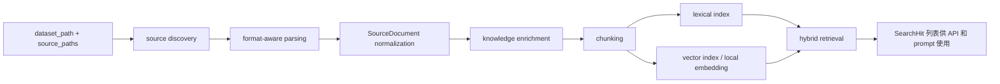

# 数据集与 RAG

English version: [docs/en/11-dataset-and-rag.md](../en/11-dataset-and-rag.md)

本页说明 `v0.8` 里仓库本地知识是如何真正进入系统的：仓库自带了什么数据、这些数据如何被解析和索引、检索结果长什么样，以及它们如何影响最终 agent prompt。

## 为什么这个项目需要 RAG

live telemetry 能告诉 controller：

- CPU 很高
- 内存在涨
- 磁盘延迟在飙
- retransmits 在增加

但 telemetry 本身并不能回答：

- 过去是否出现过类似案例
- 仓库里的 runbook 对这种症状写了什么步骤
- 某个故障模式有哪些已知处置经验

单靠 prompting 不够，因为模型默认并不知道你的仓库内运维知识。RAG 服务存在的意义，就是把有边界、可追溯的 repository knowledge 补进推理链路。

如果 RAG 关闭，系统仍然可用。损失的不是基础观测，而是历史经验和程序化处置上下文。

## 端到端 RAG 工作流

理解当前 RAG 路径时，最好把它看成一条有边界的工作流，而不是一个隐藏的“搜索动作”。

| 步骤 | 实际发生什么 | 主要文件 | 为什么这一步存在 | 如果没有会怎样 |
| --- | --- | --- | --- | --- |
| 1. 发现数据源 | controller 扫描 `dataset_path` 和已知输入文件 | [`../../backend/internal/controller/rag/ingest.go`](../../backend/internal/controller/rag/ingest.go) | 仓库必须先知道哪些文件是知识源、哪些只是 archive 或元数据 | 检索会退化成对每个文件手工硬编码 |
| 2. 规范化文档 | JSONL、CSV、Markdown、文本、archive 内容先转成统一的 `SourceDocument` | [`../../backend/internal/controller/rag/ingest.go`](../../backend/internal/controller/rag/ingest.go), [`../../backend/internal/controller/rag/knowledge.go`](../../backend/internal/controller/rag/knowledge.go) | retriever 需要统一的内部文档形态 | 不同格式会产生完全不同的检索行为，质量不可控 |
| 3. 知识分类 | controller 给记录打上 `runbook`、`historical_incident`、`question_pattern`、`dataset_meta` 等类型 | [`../../backend/internal/controller/rag/knowledge.go`](../../backend/internal/controller/rag/knowledge.go) | 只有知道知识类型，检索结果才更像 AIOps，而不是泛文本搜索 | runbook、元数据、FAQ 会在排序里互相挤占 |
| 4. 切 chunk 并建索引 | 文档被切成更小的 `Chunk` 并写入本地或外部后端 | [`../../backend/internal/controller/rag/chunk.go`](../../backend/internal/controller/rag/chunk.go), [`../../backend/internal/controller/rag/index.go`](../../backend/internal/controller/rag/index.go), [`../../backend/internal/controller/rag/retriever.go`](../../backend/internal/controller/rag/retriever.go) | 小 chunk 比整篇长文更容易和具体症状精确匹配 | 一份长文可能淹没真正有用的那一段 runbook |
| 5. 构造检索查询 | 控制面把结构化证据压缩成较小的运维检索串 | [`../../backend/internal/controller/agentcore/agent.go`](../../backend/internal/controller/agentcore/agent.go), [`../../backend/internal/controller/agentcore/workflow_engine.go`](../../backend/internal/controller/agentcore/workflow_engine.go) | 检索应该反映症状，而不是把整份节点状态 dump 过去 | 查询会变得嘈杂、泛化，而且更贵 |
| 6. 排序与过滤命中 | retriever 对结果打分、检查置信度，并可以压制弱命中 | [`../../backend/internal/controller/rag/index.go`](../../backend/internal/controller/rag/index.go), [`../../backend/internal/controller/rag/service.go`](../../backend/internal/controller/rag/service.go) | 不是每个 lexical/vector 命中都值得进入 prompt | 弱相关文本会污染最终诊断 |
| 7. 注入有边界的证据 | 只有置信度足够高、数量受控的命中才会进入 prompt 或 workflow 输出 | [`../../backend/internal/controller/agentcore/prompts.go`](../../backend/internal/controller/agentcore/prompts.go), [`../../backend/internal/controller/agentcore/workflow_recommendations.go`](../../backend/internal/controller/agentcore/workflow_recommendations.go) | prompt 空间有限，输出必须保持可审计 | 检索文本会从“辅助证据”退化成“噪声” |

这就是为什么仓库要把 dataset 规范化、chunk、检索、prompt 附着拆成独立阶段，而不是一个笼统的 “RAG call”。

当前控制面的一个关键变化是：检索越来越由结构化证据驱动，而不是由扁平的 metrics dump 驱动：

- `TrendAssessment[]` 提供“哪个单指标正在恶化”
- `InvestigationEvent[]` 提供“哪些弱信号组合成了可疑模式”
- `RetrievalDecision[]` 记录“为什么检索、为什么跳过”

这些逻辑位于：

- [`../../backend/internal/controller/agentcore/workflow_eventization.go`](../../backend/internal/controller/agentcore/workflow_eventization.go)
- [`../../backend/internal/controller/agentcore/workflow_engine.go`](../../backend/internal/controller/agentcore/workflow_engine.go)
- [`../../backend/internal/controller/agentcore/workflow_recommendations.go`](../../backend/internal/controller/agentcore/workflow_recommendations.go)

这很重要，因为“disk wait 上升并伴随 reclaim pressure”这种查询，远比把整个节点 metric JSON 原样拼进去更适合做 AIOps 检索。

## 为什么 retrieval 不是默认永远执行

当前 controller 会在多种情况下主动跳过或压制 retrieval。这不是缺功能，而是设计的一部分。

| 条件 | 为什么会跳过或压制 | 工程原因 |
| --- | --- | --- |
| telemetry stale 或缺失 | query-service 会在 prompt 前直接绕过 retrieval | 如果 live evidence 本身就不可信，仓库知识也很难弥补这个问题 |
| 症状上下文太弱 | 像 “what is happening here?” 这种泛问题不一定值得检索 | 低信号查询往往只会带回宽泛文本，增加成本却不增加特异性 |
| 命中置信度低于 `rag_min_confidence` | 结果不会进入 prompt | prompt 质量比“至少给点文档”更重要 |
| 最近成功分析可复用 | 重复相同问题时可以跳过 retrieval | 在不改变证据结论的前提下减少重复成本 |

对业务读者来说，这一层的意义是：系统不会为每一次提问都支付 RAG 成本，而只会在它能明显提升答案质量时才用它。

当前一个重要边界是：

- 默认 embedding 路径来自 [`backend/internal/controller/rag/retriever.go`](../../backend/internal/controller/rag/retriever.go) 里的 `local-hash-64`
- 这条路径便宜、离线、可重复
- 但它不是强语义 embedding，因此检索质量会更依赖 title、summary、tags、retrieval text 写得是否清晰
- query-service 和定时 agent 在索引之上又加了一层保护：
  - 用 `rag_max_findings` 和 `rag_max_query_chars` 压缩 retrieval query
  - 当症状上下文太弱时，直接跳过 retrieval
  - 当 retrieval 置信度低于 `rag_min_confidence` 时，不把命中的 RAG 片段送进 prompt

## 面向部署的检索后端

仓库现在把检索后端更明确地暴露出来，便于集群部署。

```yaml
agent:
  rag_vector_backend: "local"          # local | milvus
  rag_vector_endpoint: ""
  rag_vector_collection: "ai_sre_agent_knowledge"
  rag_vector_database: ""
  rag_vector_token: ""
  rag_vector_timeout: "5s"
```

在集群部署里，推荐的拆分方式是：

- 后端地址、collection 这类非敏感配置继续放在 YAML 里
- `SRE_AGENT_RAG_VECTOR_TOKEN` 通过 Kubernetes Secret 注入

参考部署资产：

- [`../../deploy/charts/sre-agent/templates/controller-rag-secret.yaml`](../../deploy/charts/sre-agent/templates/controller-rag-secret.yaml)
- [`../../deploy/charts/sre-agent/examples/distributed-values.yaml`](../../deploy/charts/sre-agent/examples/distributed-values.yaml)

这些字段真正进入的代码路径：

- [`../../backend/internal/controller/rag/retriever.go`](../../backend/internal/controller/rag/retriever.go)
- [`../../backend/internal/controller/rag/service.go`](../../backend/internal/controller/rag/service.go)
- [`../../backend/internal/controller/controller.go`](../../backend/internal/controller/controller.go)
- [`../../backend/internal/controller/agent/engine.go`](../../backend/internal/controller/agent/engine.go)
- [`../../backend/internal/controller/agentcore/agent.go`](../../backend/internal/controller/agentcore/agent.go)

从运维角度看：

| 后端 | 更适合什么场景 | 主要权衡 |
| --- | --- | --- |
| `local` | local-dev、standalone、cluster-lite | 最简单，但检索状态只在单个 controller 实例本地 |
| `milvus` | distributed controller 部署 | 更适合共享检索状态，但会增加外部依赖，并且认证建议通过 Secret 管理 |

## 仓库今天实际带了哪些数据

当前仓库已经不再只是一个很小的 seed corpus，而是一个“混合型运维知识集”。它至少包含以下几类真实来源：

| 语料族 | 当前仓库里的实际形态 | 当前代码如何使用 |
| --- | --- | --- |
| Prometheus operator runbooks | [`dataset/sources/git/prometheus-operator-runbooks/content/runbooks/`](../../dataset/sources/git/prometheus-operator-runbooks/content/runbooks/) 下 118 个 runbook | 作为高价值运维 runbook，按 `prometheus`、`kubernetes`、`linux_node` 域进行标注和加权 |
| Scoutflo Kubernetes playbooks | [`dataset/sources/git/scoutflo-sre-playbooks/K8s Playbooks/`](../../dataset/sources/git/scoutflo-sre-playbooks/K8s Playbooks/) 下 245 个文件 | 作为高价值 Kubernetes / 节点运维 playbook |
| Scoutflo AWS playbooks | [`dataset/sources/git/scoutflo-sre-playbooks/AWS Playbooks/`](../../dataset/sources/git/scoutflo-sre-playbooks/AWS Playbooks/) 下 159 个文件 | 保留，但只有在 query 明显像 AWS 事件时才更有机会排到前面 |
| Scoutflo Sentry playbooks | [`dataset/sources/git/scoutflo-sre-playbooks/Sentry Playbooks/`](../../dataset/sources/git/scoutflo-sre-playbooks/Sentry Playbooks/) 下 27 个文件 | 保留，主要在 Sentry/告警平台相关事件中使用 |
| 处理后的 GPU 文档 | `dataset/processed/gpu-docs/` 在生成时可用 | 作为高价值 GPU 故障文档，并优先于原始 HTML |
| 原始 GPU HTML | [`dataset/sources/web/`](../../dataset/sources/web/) | 保留来源链路，但当存在处理后的 Markdown 时默认跳过 |
| 结构化 QA 数据 | [`dataset/raw/structured/question.jsonl`](../../dataset/raw/structured/question.jsonl), [`dataset/raw/structured/helpdesk_dataset.csv`](../../dataset/raw/structured/helpdesk_dataset.csv) | 按记录规范化；泛 helpdesk 数据默认降权 |
| archive 手册类语料 | [`dataset/raw/archives/data.zip`](../../dataset/raw/archives/data.zip), [`dataset/raw/archives/ZTE_eReader_V4.11_20230525_lite.zip`](../../dataset/raw/archives/ZTE_eReader_V4.11_20230525_lite.zip) | 作为背景参考知识索引，但默认权重较低 |
| 数据集元数据 | [`dataset/raw/structured/aiops2024-challenge-dataset.json`](../../dataset/raw/structured/aiops2024-challenge-dataset.json), [`dataset/raw/archives/manifest.json`](../../dataset/raw/archives/manifest.json) | 主要用于 provenance / debug，而不是直接给 RCA 提建议 |

这意味着当前工程问题已经从“能不能读几个文档”变成了“如何在混合语料里优先召回真正有价值的运维知识”。

当前代码给出的答案是：

- [`../../backend/internal/controller/rag/ingest.go`](../../backend/internal/controller/rag/ingest.go) 在 ingest 阶段排除明显的仓库噪声
- [`../../backend/internal/controller/rag/knowledge.go`](../../backend/internal/controller/rag/knowledge.go) 给文档打上 `source_family`、`source_domain`、`operational_value`、`freshness_hint`
- [`../../backend/internal/controller/rag/index.go`](../../backend/internal/controller/rag/index.go) 在 rerank 阶段真正使用这些字段

仍然要诚实说明：这个语料比以前有用了很多，但依然是混合数据，不是完全精炼的私有事故知识库。新的路由和降噪逻辑解决的是“明显不该排前面的文本”，不是“已经拥有完整生产记忆”。

## 哪些内容会被默认排除或降权

当前 retrieval 路径是有选择性的。

在 ingest 阶段直接排除：

- `README`、`CHANGELOG`、`CODEOWNERS`、`CODE_OF_CONDUCT`、`CONTRIBUTING`、`.github/**` 这类仓库/社区管理文档
- 当 `dataset/processed/gpu-docs/` 已经有处理后 Markdown 时，对应的原始 GPU HTML
- 不支持的 binary / archive 资源

会被索引但默认降权：

- [`dataset/raw/structured/helpdesk_dataset.csv`](../../dataset/raw/structured/helpdesk_dataset.csv) 里的泛 FAQ / helpdesk 行
- archive 展开的手册/产品文档
- 当事件证据明显是 Linux/Kubernetes/GPU 基础设施问题时，AWS 或 Sentry playbook

这样做的原因很简单：更新后的 `dataset/` 已经足够大，如果继续使用“什么都索引，然后让 BM25 自己排”的方式，错误来源会经常挤到前面。

## 当前的 source-aware 路由规则

当前代码会从真实数据路径推导 source profile，并在排序时使用。

例如：

- `dataset/sources/git/prometheus-operator-runbooks/content/runbooks/node/...`
  - `source_family=prometheus_operator_runbook`
  - `source_domain=linux_node`
  - `operational_value=high`
- `dataset/sources/git/scoutflo-sre-playbooks/K8s Playbooks/02-Nodes/...`
  - `source_family=scoutflo_k8s_playbook`
  - `source_domain=linux_node`
  - `operational_value=high`
- `dataset/sources/web/gpu-operator-troubleshooting.html`
  - `source_family=nvidia_gpu_doc_processed`
  - `source_domain=gpu`
  - `operational_value=high`
- `dataset/raw/structured/helpdesk_dataset.csv`
  - `source_family=structured_helpdesk`
  - `operational_value=low`

这些字段不是为了好看，它们会直接改变排序结果。

说明性效果：

- query: `kubernetes node network receive errors packet drops`
  - 会提升 Prometheus node runbook 和 Scoutflo Kubernetes node playbook
  - 会压低 AWS networking playbook 和 generic helpdesk 行
- query: `gpu operator dcgm exporter crashloop`
  - 会优先命中处理后的 NVIDIA GPU troubleshooting Markdown
  - 会跳过原始 HTML duplicate
- query: `route53 dns resolution failing`
  - 因为证据本身就明显像 AWS 事件，所以 AWS playbook 会重新变得重要

## 仓库里真实存在的数据样例

### 样例 1：`question.jsonl`

来自 [`dataset/raw/structured/question.jsonl`](../../dataset/raw/structured/question.jsonl) 的真实一行：

```json
{"id":1,"query":"PCF与NRF对接时，一般需要配置哪些数据？","document":"rcp"}
```

当前代码会怎么处理它：

- [`parseJSONLDocuments`](../../backend/internal/controller/rag/ingest.go) 逐行读取 JSON 对象
- [`chooseStructuredTitle`](../../backend/internal/controller/rag/ingest.go) 发现 `query`，于是把它作为 title
- [`structuredContent`](../../backend/internal/controller/rag/ingest.go) 把记录转成排序后的 key/value 文本
- [`mergeStructuredMetadata`](../../backend/internal/controller/rag/knowledge.go) 存入 `field.id`、`field.query`、`field.document`
- [`finalizeDocument`](../../backend/internal/controller/rag/knowledge.go) 用 `query` 推 summary，并把它分类成 `question_pattern`

规范化后的文档形态大致是：

```json
{
  "title": "PCF与NRF对接时，一般需要配置哪些数据？",
  "summary": "PCF与NRF对接时，一般需要配置哪些数据？",
  "knowledge_type": "question_pattern",
  "case_type": "operational_qa",
  "tags": ["rcp"],
  "content": "document: rcp\nid: 1\nquery: PCF与NRF对接时，一般需要配置哪些数据？"
}
```

为什么这个 shape 对当前 heuristics 友好：

- 有稳定的 `query`
- `document` 能变成 tag
- 记录很短，chunk 很干净

### 样例 2：`helpdesk_dataset.csv`

来自 [`dataset/raw/structured/helpdesk_dataset.csv`](../../dataset/raw/structured/helpdesk_dataset.csv) 的真实内容：

```csv
Question,LinkToAnswer
"My Mac does not boot, what can I do ?",http://faq/mac-does-not-boot
Can Mac Air get infected by a Virus,http://faq/mac-book-virus
```

当前代码会怎么处理它：

- [`parseDelimitedDocuments`](../../backend/internal/controller/rag/ingest.go) 把每一行转成一条 record
- `mergeStructuredMetadata` 会把表头转成小写元数据，如 `field.question` 和 `field.linktoanswer`
- [`structuredFieldValue`](../../backend/internal/controller/rag/knowledge.go) 仍然能读出 `question` 和 `linktoanswer`
- [`defaultRetrievalWeight`](../../backend/internal/controller/rag/knowledge.go) 会给这种泛 FAQ 材料较低权重

这里有一个实现细节：

- `chooseStructuredTitle` 只检查原始 record 里的 `title`、`query`、`question`、`name`、`summary`、`id`
- 这个 CSV 用的是大写 `Question`
- 所以 ingestion 虽然能工作，但 title 推断会弱一些

也就是说：不会坏，但可读性和检索 inspectability 会下降。

### 样例 3：`aiops2024-challenge-dataset.json`

来自 [`dataset/raw/structured/aiops2024-challenge-dataset.json`](../../dataset/raw/structured/aiops2024-challenge-dataset.json) 的真实内容：

```json
{"question_file":{"train":{"meta":"raw/structured/question.jsonl","file":"jsonl"}}}
```

当前代码会怎么处理它：

- 把它当成一个结构化 JSON 文档解析
- 因为路径命中元数据模式，被分类成 `dataset_meta`
- 权重会被明显压低，避免和真正运维知识竞争

它更适合做 provenance / inventory，而不是直接参与 RCA。

## RAG 实现主要在哪些文件里

| 路径 | 职责 |
| --- | --- |
| [`backend/internal/controller/rag/service.go`](../../backend/internal/controller/rag/service.go) | 服务生命周期、启动加载、`Update`、`Rebuild`、查询服务 |
| [`backend/internal/controller/rag/ingest.go`](../../backend/internal/controller/rag/ingest.go) | source discovery、格式识别、archive 展开、解析 |
| [`backend/internal/controller/rag/knowledge.go`](../../backend/internal/controller/rag/knowledge.go) | 分类、summary 推断、likely causes / remediation 提取 |
| [`backend/internal/controller/rag/chunk.go`](../../backend/internal/controller/rag/chunk.go) | 把 record 切成 chunk |
| [`backend/internal/controller/rag/index.go`](../../backend/internal/controller/rag/index.go) | lexical/vector 检索、重排、构造 `QueryResult` |
| [`backend/internal/controller/rag/retriever.go`](../../backend/internal/controller/rag/retriever.go) | 共享 RAG config、`SourceDocument`、`Chunk`、`SearchHit`、`QueryRequest` |
| [`backend/internal/controller/rag_integration.go`](../../backend/internal/controller/rag_integration.go) | `/api/v1/rag/*` HTTP 接口 |
| [`backend/cmd/ragctl/main.go`](../../backend/cmd/ragctl/main.go) | `status`、`query`、`update`、`rebuild`、`doc` CLI |

## 一条检索工作流示例

下面这个示例值是说明性的，但和当前代码路径完全一致：

```text
memory_usage_pct = 87.4
disk_await_ms = 41.7
cpu_iowait_pct = 28.4
nic_rx_drops = 134
log_burst = 12
```

检索前，控制面先形成结构化证据：

```json
{
  "trend_assessments": [
    {"series_key":"memory_pressure","trend":"rising","severity":"medium"},
    {"series_key":"io_latency","trend":"worsening","severity":"medium"}
  ],
  "investigation_events": [
    {
      "category":"weak_signal_cluster",
      "probable_cause":"memory reclaim and storage wait are amplifying each other"
    }
  ],
  "retrieval_decisions": [
    {
      "tool":"runbook_retrieval",
      "intent":"runbook",
      "query":"memory pressure rising disk latency worsening reclaim io contention timeout"
    }
  ]
}
```

基于真实 `SearchHit` 结构的说明性命中结果可以像这样：

```json
{
  "title": "Runbook: reclaim and storage wait after rollout",
  "knowledge_type": "runbook",
  "case_type": "runbook",
  "score": 0.82,
  "summary": "Check reclaim pressure and queued disk IO before scaling blindly.",
  "likely_causes": [
    "memory reclaim is amplifying storage latency",
    "writeback congestion after rollout"
  ],
  "remediation_steps": [
    "check top RSS processes",
    "check iostat queue depth"
  ],
  "commands": [
    "vmstat 1 5",
    "iostat -x 1 5"
  ]
}
```

retrieval 带来的变化是：

- 没有 retrieval 时，controller 仍然能说“内存和存储压力正在一起上升”
- 有 retrieval 时，它还能把更具体的检查步骤和命令附着进最终建议
- 如果命中很弱，系统仍然会返回基于 telemetry 的答案，但不会假装 runbook 匹配很强

## 启动时的索引完整性与恢复

本地 JSON 索引在启动时已经不再被无条件信任。

[`loadIndex`](../../backend/internal/controller/rag/index.go) 现在会校验：

- document ID 是否重复
- chunk ID 是否重复
- source key 是否重复
- chunk 到 document 的 lineage
- source 到 document / chunk 的 lineage
- chunk 的 strategy 和 offset 是否有效

如果校验失败，[`backend/internal/controller/rag/service.go`](../../backend/internal/controller/rag/service.go) 会：

1. 把错误写进 `Stats.LastError`
2. 把坏文件重命名到 `storagePath(index_path)/index.corrupt-<timestamp>.json`
3. 再按 `rag_rebuild_policy` 决定后续行为

含义是：

- `manual`：检索保持关闭，直到操作员手工 rebuild
- `if_missing`：因为坏索引已经被 quarantine 掉，所以服务只在“没有可用索引”时重建
- `startup`：每次 controller 启动都重建

这样做是为了避免 controller 在启动时静默接受一个损坏索引。

## 检索结果进入 prompt 前的运行时保护

索引健康，不代表某一次查询就一定适合把检索结果直接塞进模型。真正消费检索结果的逻辑在：

- [`backend/internal/controller/agentcore/agent.go`](../../backend/internal/controller/agentcore/agent.go)
- [`backend/internal/controller/agent/engine.go`](../../backend/internal/controller/agent/engine.go)

这两处又增加了两层保护。

还有一个与当前控制面输出直接相关的细节：

- 命中文档里的 `commands` 和 `remediation_steps` 现在可以进入 workflow recommendation 的 `checks`
- 这意味着好的 runbook 记录不只改变解释文本，也会改变最终展示给操作员的具体下一步命令

### 1. 压缩 retrieval query

controller 不再把“操作员原始问题 + 所有 findings”原样拼成一个大查询，而是会：

- 先对 findings 去重
- 先丢掉 `No critical anomalies detected`、telemetry stale banner、observability coverage 提示这类低价值检索文本
- 在 anomaly / trend hints 本身携带真实运维症状时，把它们也并入检索上下文
- 只保留去重后的前 `rag_max_findings` 条综合症状线索
- 用 `rag_max_query_chars` 限制最终查询字符串长度

基于真实实现的示意例子：

```json
{
  "operator_query": "why did node-a slow down after rollout?",
  "findings": [
    "CPU utilization is above 85%",
    "CPU utilization is above 85%",
    "Memory utilization is above 85%",
    "Disk I/O pressure is elevated",
    "Network retransmits or timeout bursts are active"
  ],
  "rag_max_findings": 3,
  "rag_max_query_chars": 120,
  "query_sent_to_rag": "why did node-a slow down after rollout? CPU utilization is above 85% Memory utilization is above 85%"
}
```

这样做的原因：

- 检索通常更需要少量清晰症状，而不是一整个 prompt 大小的上下文
- 可以减少重复 finding 带来的 token 和 CPU 浪费
- 当信号本身已经很 noisy 时，避免 RAG 进一步放大噪声

query-service 现在还会在下面两个条件同时满足时直接跳过 retrieval：

- 过滤后的 findings / anomaly hints 为空
- operator query 本身也不包含明显运维关键词，例如 `cpu`、`memory`、`timeout`、`latency`、`gpu`、`disk`、`network`、`retransmit`、`deployment`、`security`

这样做的原因是，像 `"what is happening here"` 这种没有症状上下文的泛化问题，更容易召回噪声 runbook，而不是有帮助的 RCA 证据。

## 控制面事件化上下文如何进入 retrieval

现在的 retrieval 更常直接消费 controller 生成的调查摘要，而不是原始 metrics dump。

相关文件：

- [`backend/internal/controller/agentcore/workflow_eventization.go`](../../backend/internal/controller/agentcore/workflow_eventization.go)
- [`backend/internal/controller/agentcore/workflow_engine.go`](../../backend/internal/controller/agentcore/workflow_engine.go)
- [`backend/internal/controller/agentcore/agent.go`](../../backend/internal/controller/agentcore/agent.go)

说明性链路：

```json
{
  "trend_assessments": [
    {
      "display": "Disk latency",
      "trend": "rising",
      "forecast": "disk latency likely crosses high-risk threshold within 12m"
    }
  ],
  "investigation_events": [
    {
      "title": "Disk wait and CPU iowait are rising together",
      "probable_cause": "storage contention is building before a hard outage",
      "supporting_signals": [
        "node_disk_request_latency_p99_seconds",
        "node_disk_queue_depth_total",
        "node_cpu_iowait_percent"
      ]
    }
  ]
}
```

随后会形成类似这样的 retrieval decision：

```json
{
  "tool": "runbook_retrieval",
  "intent": "incident_rag",
  "query": "disk wait and CPU iowait are rising together storage contention queue depth latency",
  "evidence_signals": [
    "io_latency",
    "io_pressure",
    "cpu_pressure"
  ]
}
```

这比拿一整坨原始 metrics 直接去搜更有意义，因为：

- query 携带的是症状语义，而不是所有 metric key
- query 更短、更省
- retrieval 现在可以通过 `RetrievalDecision[]` 被明确审计

### 1.4. Incident memory 作为带 trust 的独立检索源来排序

相关文件：

- [`backend/internal/controller/incidentmemory/store.go`](../../backend/internal/controller/incidentmemory/store.go)
- [`backend/internal/controller/agentcore/workflow_memory.go`](../../backend/internal/controller/agentcore/workflow_memory.go)
- [`backend/internal/controller/agentcore/workflow_tools.go`](../../backend/internal/controller/agentcore/workflow_tools.go)

静态 dataset 内容和 incident memory 不是一回事，所以这里不会用同一套排序逻辑。

现在的 incident-memory scorer 会把自由文本匹配和下面这些因素一起考虑：

- signal hint
- change hint
- remediation hint
- collector affinity
- verification 与 successful action outcome
- operator feedback
- recency

为什么不直接把所有历史 incident 一股脑附上，或者永远优先最新的 resolved case？

- 表面症状词重复，并不代表触发条件相同
- 陈旧或验证不足的 incident memory，很多时候比没有 memory 更危险
- 这个仓库需要 deterministic、可调试、可以从本地工件里解释的 retrieval 行为

因此，incident memory 命中现在即使在没有静态知识库命中的情况下，也会进入 retrieval summary 和 confidence；同时每条命中会带上简短的 `match_reasons` metadata，方便值班工程师检查 controller 为什么会附上它。

这里仍然保持保守：

- memory hit 只能帮助排序证据，不能绕过 policy、verification、approval
- scorer 仍然是本地 heuristic，所以面对表述完全不同的远距离类比，仍然可能漏掉

### 1.5. 在证据没变时复用最近成功分析

[`backend/internal/controller/agentcore/agent.go`](../../backend/internal/controller/agentcore/agent.go) 现在还会维护一个有上界的最近成功分析缓存。

只要下面这些内容没有实质变化：

- 操作员 query 文本
- prompt-facing 的压缩 metrics
- telemetry quality 状态和 runtime mode
- alerts、anomalies、最热进程摘要、最热视频志摘要

query-service 就可以在 `analysis_reuse_window` 内复用最近一次成功分析，而不是再次执行 retrieval 和 LLM。

说明性的序列：

```text
t=00s  "why is disk latency growing?"  -> 执行 retrieval + LLM
t=15s  同一问题 + 同一压缩证据指纹         -> 复用最近分析
t=55s  同一问题，但 queue depth 和 CPU 变了 -> 再次执行 retrieval + LLM
```

重要限制：

- fallback 回答不会进入这个缓存
- stale 或空 telemetry 不会进入这个缓存
- 这是一个有界的内存缓存，不是持久化 incident 历史

它存在的原因很直接：dashboard 刷新和操作员重复追问，不应该在证据没变的情况下持续支付 RAG / LLM 成本。

### 2. 低置信度检索抑制

controller 仍然会做检索，但不再把弱命中直接塞进 prompt。

抑制前的说明性 `QueryResult`：

```json
{
  "confidence": 0.12,
  "summary": "retrieved 1 knowledge hits across 1 documents (runbook=1)",
  "hits": [
    {
      "title": "Generic Timeout Runbook",
      "knowledge_type": "runbook",
      "score": 0.23
    }
  ]
}
```

如果 `rag_min_confidence` 是 `0.18`，query-service 会把 prompt-facing 结果改成：

```json
{
  "summary": "retrieved 1 knowledge hits, but retrieval suppressed because confidence 0.12 is below minimum 0.18",
  "hits_forwarded_to_prompt": []
}
```

这是一种刻意保守的取舍：弱检索结果仍然保留给调试使用，但不允许它主导最终回答。

## 数据集是如何被处理的



当前实现的实际流程：

1. [`service.go`](../../backend/internal/controller/rag/service.go) 读取 `dataset_path` 和额外 `source_paths`
2. [`ingest.go`](../../backend/internal/controller/rag/ingest.go) 发现支持的文件
3. archive 会展开到 cache；二进制或不支持条目写入 quarantine
4. 结构化文件（`json`、`jsonl`、`csv`、`tsv`）按 record 解析
5. [`knowledge.go`](../../backend/internal/controller/rag/knowledge.go) 做知识类型分类和 retrieval text 构造
6. [`chunk.go`](../../backend/internal/controller/rag/chunk.go) 根据策略切块
7. [`index.go`](../../backend/internal/controller/rag/index.go) 构建本地检索索引并响应查询
8. query-service 或定时 agent 再决定这个 `QueryResult` 是否足够可信，值得进入 prompt

## 一个规范化文档长什么样

真正进入 chunk 之前的核心结构是 [`SourceDocument`](../../backend/internal/controller/rag/retriever.go)。

一个比较理想的 runbook 风格文档，大致会长这样：

```json
{
  "doc_id": "cases/timeout-runbook.md",
  "source_path": "cases/timeout-runbook.md",
  "source_type": "markdown",
  "knowledge_type": "runbook",
  "case_type": "runbook",
  "title": "Timeout Runbook",
  "summary": "Check retry rates and deployment timing.",
  "content": "When payment requests time out after a deployment:\n- inspect dependency retry rates\n- compare rollout timestamps with latency spikes\n- validate cache credentials and downstream DNS",
  "likely_causes": ["stale cache credential after rollout"],
  "remediation_steps": ["inspect retry rate", "validate cache credentials"],
  "signals": ["deployment", "network"]
}
```

仓库本身没有把这份 runbook 直接放在 `dataset/` 里，但这个 shape 在下面这些测试中被真实使用：

- [`backend/internal/controller/rag/service_test.go`](../../backend/internal/controller/rag/service_test.go)
- [`backend/internal/controller/agentcore/agent_test.go`](../../backend/internal/controller/agentcore/agent_test.go)
- [`backend/internal/controller/agentcore/prompts_test.go`](../../backend/internal/controller/agentcore/prompts_test.go)

这类高价值 RAG 记录通常具备：

- 短 title
- 明确 summary
- likely causes
- remediation steps
- signals

## chunk 是如何保住运维语义的

如果文档已经长得像运维知识，[`chunkStructuredKnowledge`](../../backend/internal/controller/rag/chunk.go) 会优先切成 4 类 section：

- `summary`
- `evidence`
- `remediation`
- `body`

之所以这么做，是因为 runbook / incident 查询通常关心的是不同部分：

- summary 用来排位
- causes 用来做诊断
- steps 用来给推荐

示例 chunk：

```json
{
  "chunk_id": "doc-1#001",
  "doc_id": "doc-1",
  "knowledge_type": "runbook",
  "case_type": "runbook",
  "section_type": "remediation",
  "retrieval_text": "Timeout Runbook\nCheck retry rates and deployment timing.\nRemediation steps\n- inspect retry rate\n- validate cache credentials",
  "embedding_text": "Timeout Runbook\nCheck retry rates and deployment timing.\nstale cache credential after rollout\ninspect retry rate\nvalidate cache credentials"
}
```

如果没有这层 structured chunking，长 runbook 会退化成普通段落检索问题，丢掉大部分运维语义。

## RAG 查询是怎么形成的

query-service 在 [`buildQueryServiceRAGRequest`](../../backend/internal/controller/agentcore/agent.go) 中构造检索请求。输入来自：

- 操作员 query
- 已经由 telemetry 推导出的 findings
- intent 推断
- knowledge / case type filter

说明性请求：

```json
{
  "query": "how to fix deployment timeout after rollout timeout spikes after deployment",
  "top_k": 4,
  "intent": "runbook",
  "knowledge_types": ["runbook", "question_pattern"],
  "case_types": ["runbook", "operational_qa"]
}
```

当前代码里的 intent 规则：

- `how to`、`steps`、`fix`、`排查`、`处理`、`修复` -> `runbook`
- `similar`、`history`、`incident`、`案例` -> `historical_incident`
- `recommend`、`next step`、`建议` -> `recommendation`
- `security`、`permission`、`证书`、`安全` -> `security`

然后 [`buildQueryPlan`](../../backend/internal/controller/rag/knowledge.go) 还会按 intent 扩展 query，比如补上：

- `root cause evidence remediation runbook similar incident`
- `runbook playbook remediation troubleshooting steps`

这层设计是因为很多 operator query 本身太短，不足以成为高质量 retrieval query。

query-service 只有在真的要调用 LLM 时才会走这一步。如果 stale / 缺失 telemetry 已经在 [`backend/internal/controller/agentcore/agent.go`](../../backend/internal/controller/agentcore/agent.go) 里触发 deterministic fallback，那么 RAG 会被整个跳过。

## 一个检索结果长什么样

API 对外返回的是 [`QueryResult`](../../backend/internal/controller/rag/retriever.go)，其中包含 `[]SearchHit`。

一个代表性的 `SearchHit`，可以参考测试里走通的 runbook 路径：

```json
{
  "evidence_id": "rag-1",
  "doc_id": "doc-1",
  "chunk_id": "chunk-1",
  "score": 0.92,
  "source_path": "cases/timeout-runbook.md",
  "source_type": "markdown",
  "knowledge_type": "runbook",
  "case_type": "runbook",
  "title": "Timeout Runbook",
  "summary": "Check retry rates and deployment timing.",
  "snippet": "Inspect retries and cache credentials after rollout.",
  "likely_causes": ["stale cache credential after rollout"],
  "remediation_steps": ["inspect retry rate", "validate cache credentials"],
  "signals": ["deployment", "network"]
}
```

[`index.go`](../../backend/internal/controller/rag/index.go) 里的当前排序行为包括：

- 按 `knowledge_type`、`case_type`、tags、intent 重排
- 同一文档最多保留两个 chunk
- 近重复 chunk 会按 fingerprint 去重
- 每个返回 hit 都会生成 `evidence_id`

这样做的目的，是避免 top-k 全被同一文档刷屏。

## 几个更具体的检索示例

### 示例 A：当前仓库自带数据集今天能影响什么

如果操作员问的是：

```text
PCF与NRF对接时，一般需要配置哪些数据？
```

那么 `question.jsonl` 里的那条记录会比较容易命中，因为：

- title 和 query 几乎一致
- 记录被分类成 `question_pattern`
- 内容短而集中

它能带来的提升是：

- prompt 里会出现一条短 operational QA 证据
- 在这个狭窄领域问题上，回答会更像“基于仓库知识的问答”

但它做不到：

- 解释 Linux 主机的 CPU / 磁盘异常
- 充当通用 SRE runbook

### 示例 B：真正的 runbook 如何改变诊断

[`rag/service_test.go`](../../backend/internal/controller/rag/service_test.go) 里构造的测试数据集包含：

```markdown
# Timeout Runbook

When payment requests time out after a deployment:
- inspect dependency retry rates
- compare rollout timestamps with latency spikes
- validate cache credentials and downstream DNS
```

还包含历史 JSONL：

```json
{"id":"case-1","query":"deployment timeout","document":"Timeouts after rollout were fixed by reverting a bad cache credential change."}
```

以及 FAQ CSV：

```csv
Question,LinkToAnswer
How to inspect retry rate?,Use the retry dashboard and deployment audit timeline.
```

如果 query 是：

```text
how to troubleshoot deployment timeout cache credentials
```

当前 retrieval pipeline 往往会把 runbook 排到前面，因为：

- intent 会变成 `runbook`
- `runbook` 类型获得额外加权
- remediation steps 和 commands 会进一步提高 runbook 意图下的得分

这会具体改变最终回答：

- 没有 retrieval 时，只会停留在“有 timeout / latency”
- 有 runbook 命中时，回答更可能提 rollout timing、retry rate、cache credentials、downstream DNS

### 示例 C：不同 hit 类型会把回答推向不同方向

| 命中的知识类型 | 对最终回答的典型影响 |
| --- | --- |
| `runbook` + remediation steps | 把答案推向具体排查步骤和处置建议 |
| `historical_incident` + likely causes | 把答案推向类比和假设排序 |
| `question_pattern` / `operational_qa` | 更适合事实问答，对 RCA 帮助较弱 |
| `dataset_meta` | 通常不应该明显影响最终答案，因为权重被压低了 |

这也是为什么不能只说“RAG 提升 reasoning”。不同类型的知识，会把模型往不同运维方向拉。

## RAG 内容是如何进入 prompt 的

query-service 不会把整篇文档塞进 prompt。[`BuildUserPrompt`](../../backend/internal/controller/agentcore/prompts.go) 只会追加：

1. `RAG context snippets`
2. `Retrieval summary`
3. `Retrieval routing`
4. 最多 3 条 `Retrieved operational knowledge`

典型 prompt 行：

```text
- [Timeout Runbook] runbook/runbook | summary=Check retry rates and deployment timing. | causes=stale cache credential after rollout | steps=inspect retry rate; validate cache credentials
```

这种结构的设计目标是：

- provenance 可见
- token 成本有边界
- 模型重点看 summary / causes / steps，而不是全文 prose

## 当前配置、缓存与更新模型

默认 controller 侧路径：

| 项 | 默认值 | 说明 |
| --- | --- | --- |
| Dataset path | `./dataset` | controller 默认配置 |
| Index path | `./data/agent/rag/index.json` | 本地持久化索引 |
| Storage directory | `./data/agent/rag/` | 由 index path 推导 |
| Cache path | `./data/agent/rag/cache/` | archive 展开和中间产物 |
| Quarantine manifest | `./data/agent/rag/quarantine.json` | 不支持或二进制源 |
| Retrieval mode | `hybrid` | 本地优先默认值 |
| Embedding provider | `local` | 不强依赖外部 embedding 服务 |
| Embedding model | `local-hash-64` | 默认模型标识 |
| Rebuild policy | `manual` | `manual`、`if_missing`、`startup` |

当前实现行为：

- 启动时如果已有 index，会优先加载
- `Update()` 会按 source signature 复用未变更内容
- `Rebuild()` 会强制全量扫描和重建
- 即使外部 vector sync 失败，本地 retrieval 仍然可以工作

## 如何安全修改或替换数据集

### 推荐流程

1. 在 [`dataset/`](../../dataset/) 下新增或修改文件，或者把自定义语料挂到 `source_paths`
2. 尽量使用能暴露 `title`、`summary`、`question`、`query`、`service`、`topic`、`timestamp`、`likely_causes`、`remediation_steps`、`commands` 的结构
3. 运行 `ragctl update` 或 controller 侧 update
4. 用 `ragctl query` 或 `/api/v1/rag/query` 检查结果
5. 确认效果后，再扩大数据规模或修改 schema 约定

### 你通常会碰到哪些文件和配置

- [`dataset/`](../../dataset/) 下的数据文件
- controller 配置：
  - [`configs/controller.yaml`](../../configs/controller.yaml)
  - [`configs/container/controller.yaml`](../../configs/container/controller.yaml)
- RAG CLI：
  - [`backend/cmd/ragctl/main.go`](../../backend/cmd/ragctl/main.go)

### 数据 shape 改坏时会发生什么

| 改动 | 典型后果 |
| --- | --- |
| 去掉 `title`、`query`、`question` 一类字段 | title 和 summary 推断明显变弱 |
| CSV 只用 `Doc`、`Note` 这类泛列名 | tag 和 summary 质量下降 |
| 把运维记录换成长篇无结构大文本 | chunk 质量变差，重排效果变弱 |
| 混入大量二进制 archive | quarantine 增长，索引构建浪费时间 |

## 当前仓库里需要诚实说明的限制

当前实现虽然灵活，但并不是“什么文档都能自动变好知识库”：

- 没有单一强约束 schema
- 仓库自带的 seed dataset 不是完整 SRE 知识库
- retrieval 质量高度依赖文档 shape 和 title
- prompt 质量最明显的提升，来自更好的 runbook、incident、operational QA 数据

如果你想让 RCA 更强，第一优先通常不是改 prompt，而是改 dataset 质量。

## 参见

- [数据流](05-data-flow.md)
- [Prompt 与定制](12-prompts-and-customization.md)
- [核心文件](10-core-files.md)
- [数据集 README](../../dataset/README.md)
