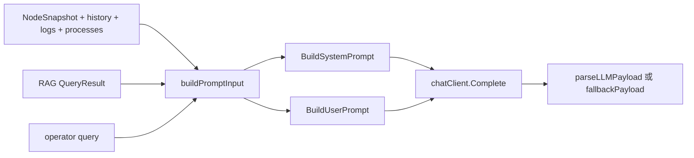

# Prompt 与定制

English version: [docs/en/12-prompts-and-customization.md](../en/12-prompts-and-customization.md)

这个仓库没有单独的 `prompts/` 目录。prompt 文本主要写在 Go 代码里，并在运行时由下面几类信息动态组装：

- controller 侧 telemetry
- deterministic findings 和 trend hints
- 检索出来的 RAG 证据
- 操作员输入的问题

本页说明 prompt 的真实层次、运行时数据在哪里插入、最终发给模型的请求体如何形成。

## 为什么这里的 prompt 约束这么严格

项目用 LLM 做 RCA、推荐生成和 workflow 分析，但前提是 prompt 必须：

- 被当前 telemetry 约束
- 明确表达证据质量
- 输出能被稳定解析
- 不被 logs 或 retrieved docs 注入成“指令”

如果没有这些约束：

1. 模型可能会虚构缺失指标
2. logs 或检索文档可能被当成命令来源
3. controller 无法可靠解析返回结果

所以这里的 prompt 设计是保守而硬约束的。

## 用工作流来理解 prompt 路径

当前 prompt 路径不是一个字符串模板，而是一条工作流。

| 步骤 | 实际发生什么 | 主要文件 | 为什么这一步存在 | 如果删掉会怎样 |
| --- | --- | --- | --- | --- |
| 1. 收集可信运行时证据 | controller 读取 `NodeSnapshot`、history、findings、process、logs、telemetry-quality | [`../../backend/internal/controller/agentcore/agent.go`](../../backend/internal/controller/agentcore/agent.go) | 模型应该看到 controller 拥有的事实，而不是原始传输对象 | prompt 会更嘈杂，也更不可信 |
| 2. 压缩证据 | metric 会被压缩，findings 会去重，只保留有边界的 process/log 摘要 | [`../../backend/internal/controller/agentcore/prompts.go`](../../backend/internal/controller/agentcore/prompts.go) | token 成本必须可控，证据必须可读 | prompt 体积会比诊断价值膨胀得更快 |
| 3. 决定是否附加 retrieval | 只有上下文足够强、置信度足够高时，RAG 结果才会附到 prompt | [`../../backend/internal/controller/agentcore/agent.go`](../../backend/internal/controller/agentcore/agent.go) | prompt 空间宝贵，弱 retrieval 反而会拉低答案质量 | 不相关的 runbook 文本会挤掉 live telemetry |
| 4. 应用 system 约束 | prompt 明确规定 grounding、JSON 结构和不得编造事实 | [`../../backend/internal/controller/agentcore/prompts.go`](../../backend/internal/controller/agentcore/prompts.go) | controller 必须能解析并信任输出 | 模型输出会变成自由文本、不可解析或更容易幻觉 |
| 5. 在 guardrail 下调用模型 | timeout、retry、rate limit、concurrency、safety validation 同时生效 | [`../../backend/internal/controller/agentcore/agent.go`](../../backend/internal/controller/agentcore/agent.go), [`../../backend/internal/controller/agentcore/llm_safety.go`](../../backend/internal/controller/agentcore/llm_safety.go) | LLM 不应该变成 API 的不稳定依赖 | 一次慢调用或坏输出就可能拖垮响应路径 |
| 6. 必要时走 deterministic fallback | stale、空、危险或不可用时，controller 返回基于证据的 fallback | [`../../backend/internal/controller/agentcore/agent.go`](../../backend/internal/controller/agentcore/agent.go) | 即使模型路径不可信，操作员也需要有边界的答案 | API 会要么空白，要么在错误证据上继续假装有把握 |

对非技术读者来说，这条工作流的意义是：项目把“AI 帮助”牢牢绑在证据上，而不是让它变成一个自由聊天机器人。

## prompt 实际定义在哪些文件里

| 路径 | 负责什么 |
| --- | --- |
| [`backend/internal/controller/agentcore/prompts.go`](../../backend/internal/controller/agentcore/prompts.go) | `BuildSystemPrompt`、`BuildUserPrompt`、`BuildAnomalyPrompt`、`BuildRCAPrompt`、`BuildSchema` |
| [`backend/internal/controller/agentcore/agent.go`](../../backend/internal/controller/agentcore/agent.go) | 收集 telemetry、trend、findings、RAG，然后调用 LLM 或 fallback |
| [`backend/internal/controller/agentcore/llm_analysis.go`](../../backend/internal/controller/agentcore/llm_analysis.go) | workflow-analysis 的 system/user prompt |
| [`backend/internal/controller/agentcore/llm_safety.go`](../../backend/internal/controller/agentcore/llm_safety.go) | 清洗不可信上下文、校验模型输出 |
| [`backend/internal/controller/analysis/llm_client.go`](../../backend/internal/controller/analysis/llm_client.go) | 独立 analysis-engine 的 prompt 路径 |
| [`docs/reference/llm_schema.md`](../reference/llm_schema.md) | query-service 证据 schema 说明 |

仓库里没有隐藏的文件模板层。

## prompt 的层次

| 层 | 构造位置 | 信任级别 | 作用 |
| --- | --- | --- | --- |
| System constraints | `BuildSystemPrompt`、`BuildWorkflowSystemPrompt` | 可信代码 | 定义允许行为和 JSON 契约 |
| Runtime telemetry | `buildPromptInput`、`BuildSchema`、workflow `ContextBundle` | 可信 controller 数据 | 给模型提供允许使用的事实 |
| Retrieved knowledge | `ragContext`、workflow retrieved docs | 有价值但明确标成不可信 | 提供 runbook、历史案例和流程知识 |
| User input | `/api/v1/agent/query` 请求体 | 不可信外部输入 | 告诉系统用户想问什么 |
| Validation + fallback | `parseLLMPayload`、`llm_safety.go`、`fallbackPayload` | 可信代码 | 拒绝坏输出并保证 API 稳定 |

## 为什么每一层 prompt 都必须存在

| 层 | 没有这一层之前的问题 | 它解决了什么 | 主要取舍 |
| --- | --- | --- | --- |
| system constraints | 模型会更容易编造事实，或返回 API 无法消费的自由文本 | 强制 grounding 与机器可解析契约 | 风格上的自由度更少 |
| runtime telemetry | 用户问题本身不包含足够的运维真相 | 提供当前节点事实和数据质量信息 | 必须对 telemetry 做压缩，不能无限展开 |
| retrieved knowledge | telemetry 自身不提供 runbook 步骤或历史案例语言 | 补充仓库本地的运维知识 | 如果不过滤，弱 retrieval 会伤害质量 |
| user input | controller 仍然需要知道操作员到底想问什么 | 给分析过程提供方向 | 用户措辞可能很模糊，不能单独作为依据 |
| validation + fallback | LLM 输出可能格式错误、不安全或不可用 | 保持 API 稳定且可审计 | deterministic fallback 没有优秀模型输出那么灵活 |

## 现在有哪些新的控制面证据会进入 prompt

prompt 路径现在在最终 wording 之前，多了一层结构化控制面证据。

相关文件：

- [`backend/internal/controller/agentcore/workflow_eventization.go`](../../backend/internal/controller/agentcore/workflow_eventization.go)
- [`backend/internal/controller/agentcore/workflow_engine.go`](../../backend/internal/controller/agentcore/workflow_engine.go)
- [`backend/internal/controller/agentcore/llm_analysis.go`](../../backend/internal/controller/agentcore/llm_analysis.go)

这些文件现在会把三类 controller 侧对象送进 workflow / RCA 分析：

- `TrendAssessment[]`
- `InvestigationEvent[]`
- `RetrievalDecision[]`

说明性的 context bundle 片段：

```json
{
  "trend_assessments": [
    {
      "display": "Memory pressure",
      "trend": "rising",
      "severity": "high",
      "forecast": "memory pressure likely crosses high-risk threshold within 18m"
    }
  ],
  "investigation_events": [
    {
      "title": "Memory growth and disk wait are rising together",
      "probable_cause": "memory reclaim and IO contention are amplifying each other"
    }
  ],
  "retrieval_decisions": [
    {
      "tool": "runbook_retrieval",
      "intent": "incident_rag",
      "query": "memory growth and disk wait rising together reclaim io contention latency",
      "skipped": false
    }
  ]
}
```

为什么这很重要：

- 模型现在看到的是更压缩的 controller 推理结果，而不是更多原始 metric 噪声
- UI 和 workflow report 可以直接展示与 prompt 同源的中间证据
- retrieval planning 不再是不可见黑盒
- recommendation generation 现在也能复用同一批事件化证据和检索出的命令，因此最终建议与 prompt 实际看到的证据更加一致

## 请求工作流：从证据到最终响应

query-service 路径现在可以概括成：

```text
NodeSnapshot/history -> PromptInput -> telemetry-quality gate -> optional RAG attach -> system/user prompts -> model call -> JSON validation -> QueryResponse or fallback
```

这条工作流之所以存在，是因为每一层解决的问题不同：

| 阶段 | 主要解决的问题 |
| --- | --- |
| `PromptInput` 组装 | 收敛成一份统一的 controller-owned 证据包 |
| telemetry-quality gate | 防止系统在 stale 或 partial 证据上假装高置信度 |
| optional RAG attach | 只在能明显提升答案时才补充运维知识 |
| system/user prompts | 清晰表达证据和输出契约 |
| model call | 在有边界证据上综合出诊断和建议 |
| JSON validation | 拒绝格式错误或不安全输出 |
| fallback response | 即使模型不可信，API 仍然稳定可用 |

## query-service 的真实 system prompt

来自 [`BuildSystemPrompt`](../../backend/internal/controller/agentcore/prompts.go)：

```text
You are a senior SRE. Use only provided telemetry facts. Never invent metrics or command outputs. Return strict JSON with fields: summary, root_cause, confidence, findings, recommendations, actions, evidence, limitations.
```

它的存在理由有三个：

- grounding：只能使用给定事实
- safety：不能编造命令输出
- contract stability：controller 只接受固定 JSON 结构

如果把这层约束去掉，模型仍然可能返回“看起来能读”的文字，但 controller 就很难再安全地信任和解析它。

## query-service prompt 是怎么组装的



[`BuildUserPrompt`](../../backend/internal/controller/agentcore/prompts.go) 的固定顺序是：

1. `BuildAnomalyPrompt`
2. `BuildRCAPrompt`
3. telemetry-quality 摘要
4. RAG block
5. `Telemetry JSON (schema v1)`
6. 输出约束

为什么顺序要这样安排：

1. anomaly framing 先把问题钉在“观察到的症状”上
2. RCA framing 再要求模型给出排序后的原因和低风险检查
3. telemetry-quality 放在 RAG 前面，是为了先告诉模型“证据能不能信”
4. RAG 放在 schema 前面，是为了让外部知识和原始 telemetry 事实保持分层
5. schema 放在后面，是为了让 prompt 以机器可解析的证据结束
6. 输出约束最后再强调一次，是为了在生成前最后收紧响应契约

当前一个重要实现细节是：

- `BuildUserPrompt` 现在使用的是 prompt-facing 的压缩 schema，也就是 `buildPromptSchema`
- `QueryResponse.TelemetryContext` 仍然使用 `BuildSchema`
- 这意味着：操作员通过 API 仍然能看到完整上下文，但模型只会收到有上界的 metric 子集
- retrieval 返回结果现在还会受 `rag_min_confidence` 约束，所以不是所有成功检索到的命中都会进入 prompt
- retrieval 现在还会受“症状上下文是否足够”的约束，所以泛化、弱信号问题不会自动附加 RAG 片段

在 workflow 路径里，recommendation generation 现在也使用同样的证据拆分：

- 最强恶化趋势
- 最强弱信号簇
- 已验证的 RCA hypothesis
- 检索命中的 runbook commands 与 remediation steps

相关逻辑位于 [`../../backend/internal/controller/agentcore/workflow_recommendations.go`](../../backend/internal/controller/agentcore/workflow_recommendations.go) 和 [`../../backend/internal/controller/agentcore/workflow_engine.go`](../../backend/internal/controller/agentcore/workflow_engine.go)。

## 具体示例：没有 retrieval 和有 retrieval 时 prompt 的区别

下面这个例子结合了：

- [`buildPromptInput`](../../backend/internal/controller/agentcore/agent.go) 组装的 telemetry
- [`agent_test.go`](../../backend/internal/controller/agentcore/agent_test.go) 与 [`prompts_test.go`](../../backend/internal/controller/agentcore/prompts_test.go) 里真实使用过的 retrieval hit 形态

### 运行时 telemetry 上下文

说明性的 `PromptInput` 片段：

```json
{
  "query": "why did node-a slow down after rollout?",
  "node_name": "node-a",
  "telemetry_quality": {
    "state": "degraded",
    "coverage_percent": 100,
    "confidence": 0.8,
    "safe_to_act": false
  },
  "metrics": {
    "node_cpu_usage_percent": 92.1,
    "node_memory_Used_bytes": 15032385536,
    "node_memory_MemTotal_bytes": 17179869184,
    "node_disk_request_latency_p99_seconds": 0.0385,
    "node_disk_queue_depth_total": 11,
    "node_tcp_retransmits_per_second": 0.8
  },
  "findings": [
    "CPU utilization is above 85%",
    "Memory utilization is above 85%",
    "CPU wait and disk latency are rising together, which points to a storage bottleneck rather than pure CPU saturation"
  ],
  "processes": [
    {"pid":4128,"name":"trainer","cpu_percent":71.2}
  ],
  "logs": [
    {"fingerprint":"dial tcp timeout","count":42}
  ]
}
```

### 没有 retrieval 时的 prompt

如果 `ragContext` 没查到结果，user prompt 依然会正常构造：

```text
Question: "why did node-a slow down after rollout?"
Explain anomalies simply. Example style: "CPU at 90% is like a clogged pipe; flow backs up."

Telemetry shows pressure on node "node-a". Identify likely blockers, rank confidence, and suggest safe fixes first.

Telemetry quality: state=degraded age_seconds=18 stale=false coverage=100% safe_to_act=false

RAG context snippets: none

Telemetry JSON (schema v1):
{...full schema...}

Output only JSON with actionable, low-risk guidance first.

Every recommendation must be tied to evidence or clearly marked as a limitation.
```

模型在这种情况下更可能：

- 只围绕 CPU、内存、磁盘、retrans 等 telemetry 说话
- 给出较泛的建议，例如“先看最热磁盘和 IO 最重进程”

### 有 retrieval 时的 prompt

如果 retrieval 命中了 runbook 风格内容，`BuildUserPrompt` 会多出下面这些块：

```text
RAG context snippets:
- [runbook] Timeout Runbook :: summary=Check retry rates and deployment timing. | causes=stale cache credential after rollout | steps=inspect retry rate; validate cache credentials | signals=deployment, network
Retrieval summary: retrieved 1 knowledge hits across 1 documents (runbook=1)
Retrieval routing: intent=runbook mode=hybrid

Retrieved operational knowledge:
- [Timeout Runbook] runbook/runbook | summary=Check retry rates and deployment timing. | causes=stale cache credential after rollout | steps=inspect retry rate; validate cache credentials
```

这会具体改变模型行为：

- 它更容易把 rollout timing、retry spike、cache credentials 联系起来
- 推荐会更 procedural，而不是只停留在“系统很忙”
- 但它仍然必须服从 system prompt 的“Use only provided telemetry facts”

也就是说：RAG 不是替代 telemetry，而是增加假设和处置层。

## 最终响应理论上应该长什么样

系统不是让模型写一段泛化 prose，而是让它给出有边界的运维输出。

query-service 的主要响应结构包括：

- `summary`
- `root_cause`
- `confidence`
- `findings`
- `recommendations`
- `actions`
- `evidence`
- `limitations`

这意味着系统在尝试回答四个操作问题：

1. 可能出了什么问题
2. controller 为什么这么判断
3. 哪些低风险检查应该先做
4. 当前证据还存在哪些限制

当检索命中包含 `commands` 和 `remediation_steps` 时，workflow recommendation generation 现在还可以把它们提升成 operator-visible 的 `checks` 列表。这也是 retrieval 不只是改变解释文本，还会改变下一步工作流的原因。

### 哪些情况下 retrieval 会被刻意省略

现在有四种常见情况，会导致 prompt 里没有任何 RAG snippet，即使 controller 支持 RAG：

1. telemetry stale 或缺失，[`fallbackPayload`](../../backend/internal/controller/agentcore/agent.go) 在 retrieval 之前就已经短路
2. RAG 被关闭，或本地索引不可用
3. operator query 加上过滤后的 findings / anomaly hints 仍然不足以形成有意义的运行时症状上下文
4. retrieval 虽然执行了，但 `result.Confidence < rag_min_confidence`

说明性的“上下文太弱，直接跳过 retrieval”例子：

```text
Question: "what is happening here"
Findings after filtering: none
Anomaly hints after filtering: none
RAG context snippets: none
```

在这种情况下，controller 会刻意保持 prompt 更小，只依赖 live telemetry。这个跳过动作可以通过 `agent_rag_skipped_context_total` 观察到。

抑制后的说明性 prompt 片段：

```text
RAG context snippets: none
Retrieval summary: retrieved 1 knowledge hits, but retrieval suppressed because confidence 0.12 is below minimum 0.18
Retrieval routing: intent=runbook mode=hybrid
```

这背后的生产理由很直接：低价值 retrieval 不是“中性”的，它会和当前 telemetry 竞争注意力，把本来精确的答案拉成泛化 runbook 答案。

## prompt schema 里实际有哪些字段

[`BuildSchema`](../../backend/internal/controller/agentcore/prompts.go) 会构造一个 `LLMSchema`，顶层字段包括：

- `schema_version`
- `generated_at`
- `node_name`
- `telemetry_quality`
- `metrics`
- `trends`
- `alerts`
- `anomalies`
- `rag_context`
- `context`
- `evidence`

`evidence` 是压缩后的视图：

- `summary`：绝对值最大的 6 个指标
- `top_metrics`：绝对值最大的 8 个指标
- `gpu`、`network`、`disk`、`memory`：按前缀过滤的子图
- `processes`、`logs`
- `alerts`、`anomalies`
- `context`

说明性 `LLMSchema` 片段：

```json
{
  "schema_version": "v1",
  "node_name": "node-a",
  "telemetry_quality": {
    "state": "degraded",
    "coverage_percent": 100,
    "safe_to_act": false
  },
  "metrics": {
    "node_cpu_usage_percent": 92.1,
    "node_memory_Used_bytes": 15032385536,
    "node_memory_MemTotal_bytes": 17179869184,
    "node_disk_request_latency_p99_seconds": 0.0385
  },
  "alerts": [
    "CPU utilization is above 85%",
    "Memory utilization is above 85%"
  ],
  "rag_context": [
    "[runbook] Timeout Runbook :: summary=Check retry rates and deployment timing. | causes=stale cache credential after rollout | steps=inspect retry rate; validate cache credentials"
  ],
  "evidence": {
    "summary": {
      "node_memory_MemTotal_bytes": 17179869184,
      "node_memory_Used_bytes": 15032385536,
      "node_cpu_usage_percent": 92.1
    },
    "top_metrics": [
      {"name":"node_memory_MemTotal_bytes","value":17179869184},
      {"name":"node_memory_Used_bytes","value":15032385536},
      {"name":"node_cpu_usage_percent","value":92.1}
    ],
    "disk": {
      "node_disk_request_latency_p99_seconds": 0.0385
    },
    "processes": [
      {"pid":4128,"name":"trainer","cpu_percent":71.2}
    ]
  }
}
```

schema 存在的理由：

- controller 需要稳定的 prompt 契约
- operator 需要能审计模型看到的证据
- explainability 和 response parser 也依赖同一份结构

## 为了降低 prompt 成本，当前实现做了什么

[`backend/internal/controller/agentcore/prompts.go`](../../backend/internal/controller/agentcore/prompts.go) 里现在有一个明确的大小边界：

- LLM 看到的 `metrics` 块会被压缩到 24 个条目
- 优先保留 CPU、内存、磁盘、网络、GPU、pressure、collector 完整性相关指标
- `evidence.summary` 和 `evidence.top_metrics` 仍然基于完整 metric map 计算

这么做的原因是：

- `NodeSnapshot.Metrics` 很容易有几百个字段
- 全量塞进模型会消耗 token，却不一定提升 RCA 质量
- controller 仍然在内存和 API 里保留完整 metric map

## retrieval 什么时候会真正进入 prompt

`PromptInput` 是先构建、后补 RAG 的。

当前 query-service 路径在 [`backend/internal/controller/agentcore/agent.go`](../../backend/internal/controller/agentcore/agent.go) 里是：

1. 先构造 telemetry findings 和 quality
2. 判断 stale / 缺失 telemetry 是否应该直接 bypass LLM
3. 判断是否可以复用未变化的最近成功分析
4. 只有确认真的要调用模型时，才调用 `attachRAGContext`
5. 再组装 prompt 并调用模型

这能避免两个问题：

- 明明已经要 deterministic fallback 了，却还额外花代价做 retrieval
- 响应里看起来像“被 retrieval 影响过”，但实际上根本没走模型

如果 `SkipLLMOnNoTelemetry` 或 `SkipLLMOnStaleTelemetry` 提前短路，这次响应就是 deterministic 的，`RetrievedDocs` 也会保持为空。

如果同一节点、规范化 query、压缩后 metric 集合、top findings、top process/log 证据在最近分析窗口内都没实质变化，query-service 也可以直接复用上一次成功回答，跳过 retrieval 和模型调用。这是为了防止 dashboard 刷新或操作员反复点击相同问题时持续消耗 controller 资源。

## 一个更具体的例子：retrieval query 在进入 prompt 之前如何先被过滤

retrieval 现在来自“操作员问题 + 过滤后的症状列表”，而不是把所有 findings 原样拼进去。

说明性的原始 finding 列表：

```json
[
  "No critical anomalies detected",
  "Telemetry snapshot is stale (age 420s > threshold 120s)",
  "Telemetry freshness is degraded because the collector is replaying backlog",
  "Disk I/O pressure is elevated",
  "Network retransmits or timeout bursts are active"
]
```

`filterFindingsForRetrieval` 会先删掉这些低价值 boilerplate，再由 `compactRAGQueryText` 应用 `rag_max_findings` 和 `rag_max_query_chars`。

最终送进 RAG 的说明性 query 更接近：

```text
why did latency rise after rollout Disk I/O pressure is elevated Network retransmits or timeout bursts are active
```

这样做的原因：

- telemetry-quality banner 对操作员很重要，但通常不是好的检索关键词
- 把它们留在 API/debug 输出里，同时不让它们污染检索，可以提高 signal-to-noise ratio

## 哪些检索参数会直接改变 prompt 内容

当前 controller 配置在 [`configs/controller.yaml`](../../configs/controller.yaml) 里增加了三组直接影响“RAG 能不能进入 prompt”的参数：

| 键 | 控制什么 | 运行时效果 |
| --- | --- | --- |
| `rag_max_query_chars` | operator query + 过滤后的症状线索构造出的 retrieval query 最大字符数 | 防止把 oversized 查询送进 RAG |
| `rag_max_findings` | 允许进入 retrieval query 的综合症状线索上限 | 让检索聚焦在最重要的 findings / anomaly hints 上 |
| `rag_min_confidence` | 允许进入 prompt 的最小 retrieval 置信度 | 在弱命中时直接抑制 RAG snippet |

可以这样理解这些参数：

- 如果 RAG 太啰嗦、太慢，先考虑降低 `rag_max_query_chars`
- 如果重复 finding 淹没了操作员问题，降低 `rag_max_findings`
- 如果 generic QA 或 helpdesk 命中污染 RCA，适当提高 `rag_min_confidence`

对应风险也很明确：

- `rag_max_query_chars` 太小，会让后面的关键信号进不了检索
- `rag_max_findings` 太小，会让检索过度偏向单一子系统
- `rag_min_confidence` 太高，会把一些中等但有价值的 incident match 也压掉

## 真正发给模型的 HTTP 请求长什么样

[`chatClient.Complete`](../../backend/internal/controller/agentcore/agent.go) 发送的是：

```json
{
  "model": "gpt-4o-mini",
  "messages": [
    {
      "role": "system",
      "content": "You are a senior SRE. Use only provided telemetry facts. Never invent metrics or command outputs. Return strict JSON with fields: summary, root_cause, confidence, findings, recommendations, actions, evidence, limitations."
    },
    {
      "role": "user",
      "content": "...the assembled user prompt..."
    }
  ],
  "temperature": 0.1,
  "max_tokens": 900
}
```

所以当前 query-service 的真实 prompt 边界其实很简单：

- 1 条 system message
- 1 条大 user message

这里没有隐藏的 tool-calling 或 function-calling 层。

## controller 是如何接受或拒绝模型输出的

[`parseLLMPayload`](../../backend/internal/controller/agentcore/agent.go) 会从模型回复里提取第一个 JSON 对象，并校验：

- `summary` 必须存在
- `root_cause` 必须存在
- `confidence` 必须在 `[0, 1]` 之间

如果校验不通过，controller 不会继续信任这份结果，而是退回 [`fallbackPayload`](../../backend/internal/controller/agentcore/agent.go)。

fallback 的行为是：

- `root_cause` 优先取第一条 deterministic finding
- confidence 会被 telemetry quality 限制
- recommendations 由 deterministic findings 推导，比如 storage bottleneck、feeder starvation、memory amplification、network retransmits

这就是为什么即使 LLM timeout 或返回坏 JSON，controller 仍然能稳定工作。

## retrieved context 会怎样改变最终回答

一个更具体的对比：

| 输入上下文 | 更可能出现的答案风格 |
| --- | --- |
| 只有 metrics | “节点存在 CPU、内存、存储压力。优先检查 IO-heavy process 和磁盘延迟。” |
| metrics + runbook 命中 | “节点存在 CPU、内存、存储压力，且 rollout 相关 runbook 提示应检查 retry rate、deployment timing、cache credentials、DNS。” |
| metrics + 无关 FAQ 命中 | prompt 预算被低价值内容占用，回答通常会变差 |

这背后的工程意义是：

- 泛化 prompt 只能描述症状
- 高质量检索命中能补上机制和处置步骤
- 无关 retrieval 不是“没帮助”，而是会主动降低质量

## workflow 的 prompt 路径

workflow-analysis 与 `/api/v1/agent/query` 不是一条路径。

相关文件：

- [`backend/internal/controller/agentcore/llm_analysis.go`](../../backend/internal/controller/agentcore/llm_analysis.go)
- [`backend/internal/controller/agentcore/llm_safety.go`](../../backend/internal/controller/agentcore/llm_safety.go)

它的特点是：

- 先构造结构化 `ContextBundle`
- retrieved docs 和 logs 会被明确标成 untrusted context
- prompt 里会多出 workflow type、scope、time window、risk score，以及 JSON-only 规则

这条路径存在，是因为定时分析和多步 workflow 需要比 query-service 更丰富的证据包。

## 如何安全地改 prompt

### 什么样的改动通常是安全的

安全改动要保住三件事：

- 严格 JSON 输出
- 只能基于证据回答
- 现有字段名不变

示例：

```text
Return strict JSON with concise findings and low-risk recommendations first.
```

这种改动改变的是风格，不是契约。

### 更安全的第一步：先调 retrieval，不急着改文案

如果你觉得 prompt 质量嘈杂，通常更应该先调这些参数，而不是直接改 prompt 文本：

- `agent.rag_top_k`
- `agent.rag_max_snippet_chars`
- `agent.rag_chunk_size`
- `agent.rag_chunk_overlap`
- `agent.rag_chunk_strategy`

相关配置文件：

- [`configs/controller.yaml`](../../configs/controller.yaml)
- [`configs/container/controller.yaml`](../../configs/container/controller.yaml)

### 哪些改动风险很高

高风险改动包括：

- 把输出从 JSON 改成 Markdown
- 告诉模型可以“推断缺失指标”
- 删除 “use only provided telemetry facts”
- 往 prompt 里塞太多原始日志或整篇文档

这些改动要么会破坏 parser，要么会降低 grounding，要么会提高 prompt injection 风险。

## 两个实用定制示例

### 示例 1：安全地收紧输出风格

当前：

```text
Return strict JSON with fields: summary, root_cause, confidence, findings, recommendations, actions, evidence, limitations.
```

相对安全的变体：

```text
Return strict JSON with fields: summary, root_cause, confidence, findings, recommendations, actions, evidence, limitations. Prefer short findings and the lowest-risk recommendations first.
```

### 示例 2：想让 RAG 更有帮助，不要先改 prompt 文案

不好的做法：

- 加更多泛化 snippet
- 一路把 `top_k` 调高

更好的做法：

- 往 dataset 里加更好的 runbook 和 incident record
- 让 snippet 更短更聚焦
- 让 retrieval 返回更少但更高质量的 hit

这改善的是 prompt 里真正的信息质量，而不是只改措辞。

## 参见

- [数据流](05-data-flow.md)
- [数据集与 RAG](11-dataset-and-rag.md)
- [核心文件](10-core-files.md)
- [LLM schema 参考](../reference/llm_schema.md)
