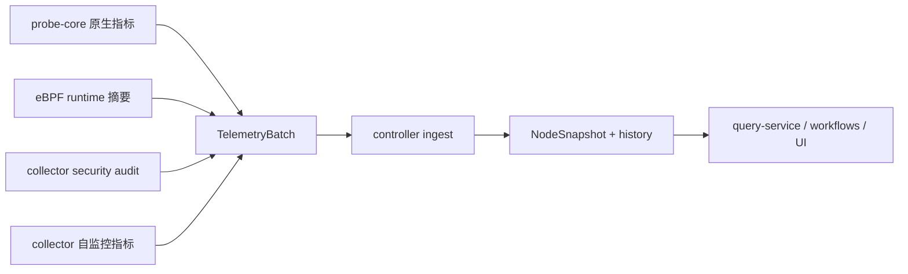

# 指标与信号

English version: [docs/en/13-metrics-and-signals.md](../en/13-metrics-and-signals.md)

本页说明这个项目到底采集哪些数据、这些数据进入 controller 后长什么样，以及在进入 retrieval、prompt 和 RCA 之前，系统是如何筛选这些信号的。

## 为什么这里的信号模型不止基础主机指标

只看 CPU、内存、磁盘曲线，不足以支撑这个项目的诊断目标。controller 还必须知道：

- collector 自己是否健康
- 主路径 probe 是否在工作还是已经退化
- 到底是哪个进程、设备、网卡在驱动症状
- 硬件画像是否改变了阈值含义
- 当前证据是否足够可信，足以支撑 LLM 或 workflow 决策

所以这里既有 workload signals，也有“监控系统自身状态”的 signals。

如果你想继续看这些信号在后续阶段如何被压缩和分析，请结合阅读：

- [采集队列与压缩](06-collector-queue-and-compaction.md)：说明未变化数据如何被抑制、排队、重放
- [控制平面分析](07-control-plane-analysis.md)：说明这些信号如何变成趋势评估、弱信号事件、TSDB 写入、检索查询和建议

## 为什么这些信号家族存在

下表同时面向工程读者和非技术读者。

| 信号家族 | 工程上为什么要采 | 对业务意味着什么 | 采太频繁会怎样 | 采太稀疏会怎样 | 完全不采会怎样 |
| --- | --- | --- | --- | --- | --- |
| CPU、内存、PSI | 发现饱和、reclaim、阻塞任务、调度压力 | 在用户真正感知故障前捕获容量风险 | 增加 collector CPU 与 `/proc` 压力 | 恶化检测变慢 | 系统容易把资源耗尽误判成泛化慢 |
| 磁盘延迟、队列深度、文件系统压力 | 区分存储瓶颈和计算瓶颈 | 降低把延迟事故归错层的概率 | 增加设备轮询和序列化成本 | queue buildup 可能发现太晚 | 存储问题会被看成应用问题 |
| 网络 drop、retransmit、利用率 | 区分传输层问题和应用层问题 | 避免本该看网络却去做无效应用回滚 | 增加接口/sysfs 采样成本 | 间歇性网络退化更难发现 | timeout 类事故更难定位 |
| GPU 利用率、显存、温度 | 解释 accelerator 争用和 feeder starvation | 保护昂贵 GPU 资源，提高训练/推理慢问题的 RCA 质量 | 增加 GPU 运行时采集和复制成本 | 热漂移或显存压力发现更晚 | GPU 节点只会被解释成普通节点问题 |
| Collector 自监控和保护状态 | 证明遥测本身是否可信、是否太贵 | 帮助区分“业务正常”与“监控本身已退化” | 成本较低但仍应有边界 | 操作员可能错过 collector 自身已经吃紧 | 平滑曲线可能被误读成业务健康 |
| 安全与运行时行为 | 把异常 runtime 行为和性能症状连接起来 | 让策略漂移或暴露类事故的 RCA 更可信 | 太多 runtime 细节会增加噪声 | 微弱安全/运行时漂移更晚被发现 | 系统会漏掉非资源型根因 |

## 五类最影响最终答案的核心信号

仓库里会发出很多指标，但真正决定日常诊断质量的，主要还是下面五类。这个表同时解释它们的业务意义，以及为什么它们处在现在的采样层级。

| 信号族 | 代表指标 | 在实际运行中测量什么 | 为什么当前层级合适 | 如果采得更快 | 如果采得更慢 | 如果完全不采 |
| --- | --- | --- | --- | --- | --- | --- |
| CPU 与内存压力 | `node_cpu_usage_percent`、`node_memory_Used_bytes`、`node_memory_MemTotal_bytes`、`node_pressure_memory_some_avg10` | 主机是否接近算力饱和或内存回收极限 | 这是第一层“节点是不是在承压”的信号，所以保留在 fast path | `/proc` 读取更频繁，重复序列化更多，收益有限 | 对慢性资源恶化的感知会更晚 | 控制面会失去最基础的“节点是否过载”判断 |
| 磁盘与 IO 健康 | `node_disk_request_latency_p99_seconds`、`node_disk_queue_depth_total`、`node_pressure_io_full_avg10` | 是否出现存储等待、队列堆积或写回压力 | 存储症状经常比 CPU 更早解释延迟，所以需要足够快进入趋势分析 | 设备轮询和 collector CPU 成本会更高 | 短时存储退化更容易等到用户延迟明显时才被发现 | 存储瓶颈会被误读成泛化的应用变慢 |
| 网络质量 | `node_tcp_retransmit_ratio`、`node_tcp_retransmits_per_second`、`node_network_receive_errs_total`、`node_softnet_dropped_per_second` | 网络路径是否在丢包、重传、过载 | 这类指标足够便宜，适合保留在 fast path，且能很好地区分“网络问题”和“服务问题” | 接口轮询成本会上升，但平静期新增信息不多 | 间歇性网络退化更难被看到 | 超时类故障更难被准确定类 |
| GPU 执行上下文 | `node_gpu_utilization_sm_avg_percent`、`node_gpu_memory_used_total_mib`、`node_gpu_temperature_peak_celsius`、`node_gpu_process_total` | 加速器节点是饱和、喂数不足、受热限制还是显存受限 | GPU 节点成本高，GPU 摘要在有 GPU 上下文时值得走快路径 | accelerator 主机上的 probing 与序列化成本会增加 | 喂数不足、温漂、显存压力会被更晚看到 | GPU 故障会退化成普通 CPU/内存问题 |
| telemetry 完整性与保护状态 | `collector_probe_core_fresh`、`collector_self_cpu_percent`、`collector_spool_backlog_bytes`、`collector_protection_mode`、`collector_metrics_partial_update` | 监控路径本身是否可信、是否有边界、是否在有意压缩状态 | 这些信号必须新鲜，因为 controller 会用它们判断整份证据值不值得信任 | 这类指标本身已经很轻量，再快也收益有限 | 过旧的完整性信号很危险，因为盲区会被误认成健康 | 系统会把缺失或 stale telemetry 当成主机健康 |

### 为什么这些信号既对工程团队重要，也对业务方重要

| 信号族 | 技术价值 | 业务价值 |
| --- | --- | --- |
| CPU 与内存压力 | 提前抓到饱和、回收压力和 OOM 风险 | 降低用户可见的性能下降，避免突发容量事故 |
| 磁盘与 IO 健康 | 把存储等待和算力压力分开 | 缩短延迟和吞吐下降时的 RCA 时间 |
| 网络质量 | 区分传输问题和服务自身问题 | 避免在真正的问题是丢包或拥塞时做无效回滚或重启 |
| GPU 执行上下文 | 解释昂贵 GPU 节点是否真的在高效干活 | 保护 GPU 投入，缩短训练/推理慢问题的诊断时间 |
| telemetry 完整性与保护状态 | 告诉你监控路径是否在撒谎、是否不完整、是否处于保护模式 | 降低基于坏证据做错误操作决策的风险 |

## 生产这些信号的层次



## 实际采集了什么

最完整的指标参考还是 [docs/en/25-metrics-reference.md](../en/25-metrics-reference.md)。下面这张表只聚焦真正影响 reasoning 的信号家族。

| 类别 | 代码里能看到的代表性指标 | 主要生产者 | 为什么重要 | 缺失会怎样 |
| --- | --- | --- | --- | --- |
| 节点压力 | `node_cpu_usage_percent`, `node_memory_Used_bytes`, `node_memory_MemTotal_bytes`, `node_network_total_receive_bytes_per_second`, `node_disk_total_read_bytes_per_second` | [`probe_core_convert.go`](../../backend/internal/collector/probe_core_convert.go) | 提供节点压力和趋势的基础上下文 | RCA 证据明显变弱 |
| 存储压力 | `node_disk_request_latency_p99_seconds`, `node_disk_queue_depth_total`, `node_disk_total_iops_per_second`, `node_disk_utilization_peak_percent` | probe-core 转换 + ingest 汇总 | 区分“CPU 高”还是“存储在拖后腿” | 容易把存储瓶颈误判成泛化慢节点 |
| 网络健康 | `node_tcp_retransmits_per_second`, `node_network_receive_errs_total`, `node_network_transmit_errs_total`, `node_network_utilization_peak_percent` | probe-core 转换 | 区分拥塞、丢包、链路错误和纯应用延迟 | timeout 类问题更难归因 |
| GPU 状态 | `node_gpu_utilization_sm_avg_percent`, `node_gpu_memory_used_total_mib`, `node_gpu_process_total`, `node_gpu_pcie_rx_total_mb_s`, `node_gpu_temperature_peak_celsius` | probe-core GPU 路径 + GPU store merge | 区分真正 GPU 饱和和 feeder starvation / PCIe 问题 | GPU 相关故障只能退化成泛化节点问题 |
| RCA 归因 | `rca_cpu_sched_contention_events_per_second`, `rca_io_latency_seconds_avg`, `rca_net_ebpf_flow_bytes_per_second`，以及 process CPU/RSS/IO 样本 | probe-core 转换、eBPF 摘要、process 样本 | 把问题定位到具体进程或子系统 | 结论会停留在“机器有压力” |
| collector 健康 | `collector_probe_source`, `collector_primary_probe_core_healthy`, `collector_self_cpu_percent`, `collector_self_rss_bytes`, `collector_spool_backlog_bytes` | collector runtime | 说明遥测本身是否健康、是否代价可控 | 很容易把空白图误当健康系统 |
| 自我保护状态 | `collector_protection_mode`, `collector_protection_cpu_budget_ratio`, `collector_protection_memory_budget_ratio`, `collector_protection_load_shed` | [`protection.go`](../../backend/internal/collector/protection.go) | 解释为什么监控主动降速或关闭可选采集 | 数据缺口原因会变得不透明 |
| 辅助采集节奏 | `collector_aux_collection_interval_seconds`, `collector_aux_collection_age_seconds`, `collector_aux_collection_cache_hit`, `collector_aux_payload_refreshed`, `collector_aux_payload_suppressed` | [`aux_sampling.go`](../../backend/internal/collector/aux_sampling.go) | 说明日志、兼容进程扫描、external metrics 是在复用缓存、真的重新采集，还是因为缓存仍然有效而刻意省略了重复 payload | 操作员无法区分“没有新数据”“collector 在重复重扫”与“collector 故意沿用了之前的 process/log 视图” |
| 进程 payload 抑制 | `collector_process_payload_refreshed`, `collector_process_payload_suppressed` | [`process_payload_suppression.go`](../../backend/internal/collector/process_payload_suppression.go) | 说明当前热点进程 payload 是真的随 batch 发送了，还是因为粗粒度进程指纹近似不变而被刻意省略 | top-process 归因列表本身很容易占 steady-state payload 体积 |
| compatibility fallback 分层节奏 | `collector_compat_collection_interval_seconds`, `collector_compat_collection_age_seconds`, `collector_compat_collection_cache_hit`, `collector_compat_collection_anomaly_triggered` | [`probe/cadence.go`](../../backend/internal/collector/probe/cadence.go) | 说明 legacy Go fallback 是在复用缓存，还是因为 fallback 自己看到异常而刷新更深层 helper | fallback 模式的额外开销否则会显得像“随机抖动” |
| compatibility payload 抑制 | `collector_compat_payload_refreshed{component="hardware"}`, `collector_compat_payload_suppressed{component="hardware"}` | [`probe/cadence.go`](../../backend/internal/collector/probe/cadence.go) 和 [`store.go`](../../backend/internal/controller/ingest/store.go) | 说明慢速 fallback 硬件指标这一轮到底真的刷新了，还是沿用旧视图并刻意不再重发 payload | 否则很容易把更低 payload 量误读成“硬件遥测消失了” |
| payload 缩减状态 | `collector_metrics_partial_update`, `collector_metrics_suppressed_count` | [`metric_suppression.go`](../../backend/internal/collector/metric_suppression.go) 和 [`store.go`](../../backend/internal/controller/ingest/store.go) | 说明哪些低频 collector/runtime inventory 是被故意省略并在 ingest 侧重建的 | 否则容易把“因为没变而省略”误认为“状态真的丢了” |
| 广义硬件提示 | `collector_hardware_warning_total`, `collector_hardware_warning{domain=...,reason=...,signal=...}` | [`hardware_warnings.go`](../../backend/internal/collector/hardware_warnings.go) | 用已采集信号压缩出更便宜的 CPU / 内存 / 磁盘 / NIC / GPU 异常摘要 | 操作员和下游筛选就失去了一层廉价的硬件导向提示 |
| 遥测完整性 | `collector_probe_core_fresh`, `collector_probe_core_active`, `collector_probe_core_last_frame_age_seconds` | collector runtime | 说明主路径 probe 是否新鲜可用 | stale 数据容易被误当 live 数据 |
| 安全与运行时行为 | `node_security_findings_total`, `node_security_unexpected_listening_ports_count`, `node_ebpf_category_events_total`, `node_ebpf_sensitive_path_events_total` | collector security audit 与 eBPF 摘要 | 把安全迹象和资源问题放到同一时窗里看 | 安全相关根因更难识别 |
| 硬件画像上下文 | `collector_hardware_cpu_numa_nodes`, `collector_hardware_gpu_devices_total`, `collector_hardware_threshold_disk_latency_seconds` | hardware profile + protection | 让阈值背后的硬件前提可见 | 阈值解释变得黑箱化 |

## 一条采样记录长什么样

### 原始 probe-core 指标

下面这些名字都是真实被转换代码处理的指标：

```text
probe_core_cpu_usage_percent = 92.1
probe_core_memory_total_bytes = 17179869184
probe_core_memory_used_bytes = 15032385536
probe_core_disk_await_ms{device="nvme0n1"} = 38.5
probe_core_disk_queue_depth{device="nvme0n1"} = 11
probe_core_network_tcp_retransmissions_per_sec = 0.8
```

### 转换后的 controller 可见指标

[`convertProbeCoreBatch`](../../backend/internal/collector/probe_core_convert.go) 会把它们变成 controller 主要消费的 alias 指标。默认情况下，已经有 alias 的 raw `probe_core_*` 主机/资源指标不会在 outbound batch 里重复发送。

```json
{
  "node_cpu_usage_percent": 92.1,
  "node_memory_MemTotal_bytes": 17179869184,
  "node_memory_Used_bytes": 15032385536,
  "node_disk_avg_request_latency_seconds": 0.0385,
  "node_disk_queue_depth": 11,
  "node_disk_queue_depth_total": 11,
  "node_disk_request_latency_p99_seconds": 0.0385,
  "node_tcp_retransmits_per_second": 0.8
}
```

如果你明确需要这些 raw duplicate，可以设置 `probe_core.emit_raw_aliased_metrics: true`。默认保持 `false`，因为 steady-state 下重复发送同一份主机状态只会增加序列化和传输成本。

### 在 controller 热状态中的样子

随后它们会被保存在 [`NodeSnapshot`](../../backend/internal/controller/ingest/store.go)：

```json
{
  "collector_id": "node-a",
  "metrics": {
    "node_cpu_usage_percent": 92.1,
    "node_memory_Used_bytes": 15032385536,
    "node_memory_MemTotal_bytes": 17179869184,
    "node_disk_request_latency_p99_seconds": 0.0385,
    "node_disk_queue_depth_total": 11,
    "node_tcp_retransmits_per_second": 0.8
  },
  "processes": [
    {"pid": 4128, "name": "trainer", "cpu_percent": 71.2, "rss_bytes": 8589934592}
  ],
  "logs": [
    {"fingerprint": "dial tcp timeout", "count": 42, "example": "request to cache service timed out"}
  ]
}
```

一个关键事实是：controller 在 ingest 阶段并不会把大部分指标丢掉。真正的大筛选发生在后面的 `PromptInput` 组装阶段。

## 平面指标之外的结构化信号

并不是所有重要证据都是 `metric_name -> value`。

| 信号类型 | 存放位置 | 为什么存在 |
| --- | --- | --- |
| `ProcessSample` | `NodeSnapshot.Processes` | 把压力归因到具体进程 |
| `LogFingerprint` | `NodeSnapshot.Logs` | 保留高价值重复日志证据，同时控制体积 |
| `StorageDeviceSample` / `FilesystemSample` | `NodeSnapshot.StorageDevices`、`NodeSnapshot.Filesystems` | 保留设备级和挂载点级存储上下文 |
| `RuntimeSecurityEvent` | `NodeSnapshot.RuntimeSecurityEvents` | 记录运行时行为和安全证据 |
| `SecurityFinding` | `NodeSnapshot.SecurityFindings` | 把姿态漂移转成结构化 finding |
| `ProcessGraphSnapshot` | `NodeSnapshot.ProcessGraphSnapshot` | 支撑基于 lineage 的排查，而不是只看 PID |

这些结构之所以重要，是因为 RCA 往往关心“关系”，而不只是标量阈值。

## controller 派生出来的分析对象

当前仓库里，不是所有重要信号都来自 collector。控制面现在还会在最终 RCA 输出之前派生三层结构化证据：

| 对象 | 主要文件 | 它表达什么 | 为什么需要它 |
| --- | --- | --- | --- |
| `TrendAssessment` | [`backend/internal/controller/agentcore/workflow_eventization.go`](../../backend/internal/controller/agentcore/workflow_eventization.go) | 斜率、delta、持续越阈、forecast hint | 在单个硬阈值真正爆发前就暴露“正在恶化”的行为 |
| `BehavioralSignalAssessment` | [`backend/internal/controller/agentcore/behavioral_memory.go`](../../backend/internal/controller/agentcore/behavioral_memory.go) | 当前 burst 更像历史上健康的 recurring pattern，还是更像新异常 | 让 controller 能把 build/deploy/backup 类正常峰值与真正 incident 分开 |
| `InvestigationEvent` | [`backend/internal/controller/agentcore/workflow_eventization.go`](../../backend/internal/controller/agentcore/workflow_eventization.go), [`backend/internal/controller/agentcore/incident_decision.go`](../../backend/internal/controller/agentcore/incident_decision.go) | 多变量弱信号融合后的 probable cause 与 recommended checks | 把多个中等信号压缩成一条操作员可读的调查怀疑 |
| `RetrievalDecision` | [`backend/internal/controller/agentcore/workflow_engine.go`](../../backend/internal/controller/agentcore/workflow_engine.go), [`backend/internal/controller/agentcore/agent.go`](../../backend/internal/controller/agentcore/agent.go) | retrieval 是否执行、query 是什么、为什么跳过或抑制 | 让 RAG 的成本和路由变得可审计 |

说明性的控制面派生证据：

```json
{
  "trend_assessments": [
    {
      "display": "Disk latency",
      "trend": "rising",
      "delta_percent": 22.4,
      "threshold_breaches": 3
    }
  ],
  "investigation_events": [
    {
      "title": "Disk wait and CPU iowait are rising together",
      "probable_cause": "storage contention is building before a hard outage"
    }
  ],
  "retrieval_decisions": [
    {
      "tool": "runbook_retrieval",
      "query": "disk wait and CPU iowait rising together storage contention",
      "skipped": false
    }
  ]
}
```

## 不同信号类别已经不再共用一个采样策略

collector 现在按真实信号类别分层：

| 层级 | 例子 | 定义位置 | 默认行为 |
| --- | --- | --- | --- |
| 快路径 | probe-core 主路径指标、eBPF 摘要、collector protection state | [`backend/internal/collector/collector.go`](../../backend/internal/collector/collector.go) 和 [`configs/collector.yaml`](../../configs/collector.yaml) | 每个 active collector cycle 都采 |
| 中路径 | 兼容 `/proc` 进程 fallback | [`backend/internal/collector/aux_sampling.go`](../../backend/internal/collector/aux_sampling.go) | `max(collection_interval, probe_core.interval * host_proc_fallback_interval_samples)` |
| 中路径 | legacy Go compatibility extended host metrics | [`backend/internal/collector/probe/cadence.go`](../../backend/internal/collector/probe/cadence.go) | `max(2 * collection_interval, 10s)` |
| 慢路径 | legacy Go compatibility 硬件扫描（thermal、NIC sysfs、IRQ、RDMA） | [`backend/internal/collector/probe/cadence.go`](../../backend/internal/collector/probe/cadence.go) | `max(6 * collection_interval, 30s)` |
| 慢路径 | legacy Go compatibility deep scan、kernel 摘要、GPU fallback helper | [`backend/internal/collector/probe/cadence.go`](../../backend/internal/collector/probe/cadence.go) | `max(3 * collection_interval, 15s)` |
| 慢路径 | legacy Go compatibility RCA helper | [`backend/internal/collector/probe/cadence.go`](../../backend/internal/collector/probe/cadence.go) | `max(6 * collection_interval, 30s)` |
| 慢路径 | 日志指纹 | [`backend/internal/collector/aux_sampling.go`](../../backend/internal/collector/aux_sampling.go) | `max(15s, 3 * collection_interval)` |
| 慢路径 | external metrics command | [`backend/internal/collector/aux_sampling.go`](../../backend/internal/collector/aux_sampling.go) | `max(30s, 6 * collection_interval)` |
| 低频路径 | 硬件发现、安全 baseline walk | [`backend/internal/collector/hardware_profile.go`](../../backend/internal/collector/hardware_profile.go)、[`backend/internal/collector/security_audit.go`](../../backend/internal/collector/security_audit.go) | 小时级或分钟级，而不是每个 collector loop |

当 `protectionMode` 进入 `incident` 时，这些辅助路径会暂时收紧；当进入 `pressure` 或 `critical` 时，可选工作会优先被 shed。

### 一个 30 秒窗口里的具体节奏例子

用源码模式默认 collector 配置举例：

- `collection_interval = 5s`
- `probe_core.interval = 1s`
- `host_proc_fallback_interval_samples = 10`

这些 helper collector 并不会在每个 `5s` 周期都重新刷新。

| 时间 | 快路径 | 兼容 process fallback | compatibility 硬件 tier | 日志指纹 | external metrics |
| --- | --- | --- | --- | --- | --- |
| `t=0s` | refresh | refresh | refresh | refresh | refresh |
| `t=5s` | refresh | cache hit | cache hit | cache hit | cache hit |
| `t=10s` | refresh | refresh | cache hit | cache hit | cache hit |
| `t=15s` | refresh | cache hit | cache hit | refresh | cache hit |
| `t=20s` | refresh | refresh | cache hit | cache hit | cache hit |
| `t=25s` | refresh | cache hit | cache hit | cache hit | cache hit |
| `t=30s` | refresh | refresh | refresh | refresh | refresh |

在 collector 指标里，你应该看到：

- `collector_aux_collection_interval_seconds{component="process_fallback"} = 10`
- `collector_aux_collection_interval_seconds{component="logs"} = 15`
- `collector_aux_collection_interval_seconds{component="external"} = 30`
- `collector_compat_collection_interval_seconds{component="hardware"} = 30`
- 非刷新轮次里 `collector_aux_collection_cache_hit{component="logs"} = 1`

这是 `v0.8` 一个很关键的低开销变化：collector 可以保持主遥测 cadence，但不必让每个昂贵 helper 在每轮都重跑。

当 `suppress_cached_aux_payloads: true` 时，cache-hit 的 process/log helper 还会继续减少 send-path 体积。你更可能看到的是：

- `collector_aux_payload_suppressed{component="process_fallback"} = 1`
- `collector_aux_payload_suppressed{component="logs"} = 1`
- controller 继续沿用上一轮 process/log 视图，直到 `collector_aux_payload_refreshed{component=...} = 1`

当 `suppress_cached_compat_hardware_metrics: true` 时，同样的模式也会出现在慢速 compatibility 硬件层：

- 硬件层 cache-hit 周期会打出 `collector_compat_payload_suppressed{component="hardware"} = 1`
- 真正重扫时会打出 `collector_compat_payload_refreshed{component="hardware"} = 1`
- ingest 会继续沿用上一轮 fallback `node_thermal_*`、`node_network_interface_*`、`node_rdma_*` 视图，直到下一次真实刷新到来

在这之上，`v0.8` 还多了一层 steady-state 进程 payload 缩减：

- `collector_process_payload_suppressed = 1` 表示 collector 重新计算了进程归因，但由于粗粒度进程指纹仍在同一组 CPU/RSS/IO bucket 内，因此没有重发进程列表
- `collector_process_payload_refreshed = 1` 表示这一轮 batch 真的重新带上了一份当前进程 payload

说明性的进程 payload 对：

```json
[
  {
    "cycle": "first send",
    "processes": [
      {"pid": 4128, "name": "trainer", "cpu_percent": 71.2, "rss_bytes": 9663676416}
    ],
    "metrics": [
      {"name":"collector_process_payload_refreshed","value":1}
    ]
  },
  {
    "cycle": "near-identical next cycle",
    "processes": [],
    "metrics": [
      {"name":"collector_process_payload_suppressed","value":1}
    ]
  }
]
```

这样做会减少 batch 大小，但不会丢掉节点级压力指标。代价是两个强制刷新之间的进程归因会更粗一些。

## RAG / LLM 之前的 controller 侧筛选计数

controller 还会导出一小组推理路径计数器，用来确认它是否真的在减少昂贵工作：

- `agent_llm_bypassed_stale_total`
- `agent_llm_bypassed_empty_total`
- `agent_rag_skipped_context_total`
- `agent_fallback_total`

说明性的序列：

```text
query="what is happening here"                         -> agent_rag_skipped_context_total +1
query="why is disk latency growing after rollout"     -> 允许 retrieval
15s 后同一 query + 同一份压缩证据                     -> analysis_reused_total +1
同一 query 但 telemetry 已 stale                       -> agent_llm_bypassed_stale_total +1
```

这些计数器的价值在于，它能告诉你 controller 是否真的做到了：

- 泛化问题不乱进 retrieval
- stale 或空证据不乱进 LLM
- 同一 incident 状态没变化时不重复支付 RAG / LLM 成本

## 现在有哪些东西会在平稳期被抑制

[`metric_suppression.go`](../../backend/internal/collector/metric_suppression.go) 现在会在周期性 full refresh 之间抑制不变的低频 collector 状态。

典型家族包括：

- `collector_probe_source`
- `collector_runtime_mode`
- `collector_runtime_mode_requested`
- `collector_runtime_mode_degraded`
- `collector_runtime_containerized`
- `collector_runtime_capability_available{capability=...}`
- `collector_runtime_signal_coverage{signal=...}`
- `collector_primary_ebpf_expected`
- `collector_primary_ebpf_healthy`
- `collector_primary_probe_core_expected`
- `collector_primary_probe_core_healthy`
- `collector_compatibility_fallback_active`
- `collector_probe_core_client_available`
- `collector_probe_core_active`
- `collector_probe_core_collector_selection_valid`
- `collector_probe_core_collector_module_requested{module=...}`
- `collector_probe_core_collector_module_active{module=...}`
- `collector_hardware_*` 下的 inventory/profile/threshold/capability 指标

不会被抑制、仍然每轮发送的典型信号：

- `collector_self_cpu_percent`
- `collector_self_rss_bytes`
- `collector_transport_*`
- `collector_probe_core_last_error`
- `collector_primary_ebpf_reason`
- `collector_compatibility_fallback_reason`
- `collector_hardware_*_anomaly_score`
- spool 和 protection 相关指标

### 一个具体的 steady-state 抑制例子

说明性的平稳期 batch：

```json
{
  "sent_metrics": [
    {"name":"node_cpu_usage_percent","value":24.7},
    {"name":"node_memory_Used_bytes","value":8589934592},
    {"name":"collector_self_cpu_percent","value":1.3},
    {"name":"collector_spool_backlog_bytes","value":0},
    {"name":"collector_metrics_partial_update","value":1},
    {"name":"collector_metrics_suppressed_count","value":21}
  ]
}
```

这个例子里被抑制的是：

- 没变化的 runtime mode 和 capability label
- 没变化的 probe source 和 probe-core module selection
- 没变化的 hardware inventory/profile/threshold
- helper 没有真正刷新时，被省略掉的 fallback process 列表和日志指纹
- `process_payload_refresh_interval` 之内近似不变而被省略的热点进程 payload

为什么可以抑制：

- 这些值变化很慢
- 它们会带来重复的 label 和 protobuf 条目
- 当值和上一轮完全相同时，对诊断价值很低

### 一个具体的慢硬件层 payload 抑制例子

说明性的 fallback 模式两轮：

```json
[
  {
    "cycle": "hardware refresh",
    "metrics": [
      {"name":"node_thermal_zone_temp_celsius","value":87.5},
      {"name":"node_network_interface_speed_mbps","value":25000,"labels":{"device":"eth0"}},
      {"name":"collector_compat_payload_refreshed","value":1,"labels":{"component":"hardware"}}
    ]
  },
  {
    "cycle": "hardware cache hit",
    "metrics": [
      {"name":"collector_compat_collection_cache_hit","value":1,"labels":{"component":"hardware"}},
      {"name":"collector_compat_payload_suppressed","value":1,"labels":{"component":"hardware"}}
    ]
  }
]
```

它的含义是：

- 第二轮 collector 避免了重复发送同一份慢速硬件 fallback 指标
- controller 仍然保留了上一轮 thermal / interface 视图
- 下一次真实硬件刷新可以显式更新或清空这份视图

什么机制还保留了这些信息：

- controller 会在 [`StoreMetrics`](../../backend/internal/controller/ingest/store.go) 里 carry forward 之前的值
- `low_churn_metrics_refresh_interval` 会强制定期 full refresh
- 一旦值或 labels 发生变化，就会立刻重新发送

引入的风险：

- 如果某个消费者把 `collector_metrics_partial_update = 1` 误判成“数据丢失”，就会把健康抑制误读成缺失遥测
- 如果某个消费者把“本轮没发 process/log payload”误判成“当前没有 process/log”，也会把 cache-hit 抑制误读成真实清空
- 所以 controller 明确实现了 ingest 侧的状态续接

## 默认不再重复发送的 raw `probe_core_*` 指标

collector 内部仍然会接收到 raw probe-core 值，但大多数已经有 alias 的主机/资源指标不再默认双份发送。

常见例子：

- `probe_core_cpu_usage_percent`
- `probe_core_memory_total_bytes`
- `probe_core_memory_used_bytes`
- `probe_core_disk_await_ms`
- `probe_core_disk_read_bytes_per_sec`
- `probe_core_network_rx_bytes_per_sec`
- `probe_core_network_tcp_retransmissions_per_sec`
- `probe_core_gpu_count`
- `probe_core_process_cpu_percent`

为什么要减掉这些重复项：

- controller 主要消费的本来就是 `node_cpu_usage_percent`、`node_memory_Used_bytes`、`node_disk_request_latency_p99_seconds`、`node_tcp_retransmits_per_second` 这类 alias
- 同一份主机状态同时发 `probe_core_*` 和 `node_*`，只会放大序列化和 spool 压力

默认仍然保留的 raw `probe_core_*`：

- probe-core 内部/source-selection/sampler 指标，例如 `probe_core_sampling_*`
- source/fallback 上下文，比如 `probe_core_host_collection_source`
- queue/backpressure/internal-health 指标，比如 `probe_core_backpressure_queue_depth`
- 目前还没有 alias 合约的 raw 指标，例如 `probe_core_cgroup_cpu_throttled_ratio`

### compatibility fallback 的异常触发例子

legacy Go fallback 路径现在会用自己的基础指标决定是否提前刷新更深层 tier。

说明性 fallback 指标：

```json
{
  "node_cpu_usage_percent": 91.4,
  "node_cpu_iowait_percent": 12.8,
  "node_memory_MemTotal_bytes": 17179869184,
  "node_memory_Used_bytes": 15139799040,
  "node_disk_request_latency_p99_seconds": 0.041,
  "node_tcp_retransmits_per_second": 0.7
}
```

因为这些值命中了 [`compatibilityAnomalyTriggered`](../../backend/internal/collector/probe/cadence.go) 的真实阈值，fallback collector 会立刻刷新更深层缓存，并输出：

```text
collector_compat_collection_anomaly_triggered{component="deep"} = 1
collector_compat_collection_cache_hit{component="deep"} = 0
collector_compat_collection_interval_seconds{component="deep"} = 15
```

这样做的意义是：平稳期保持低开销，事故期又不会因为等慢节奏而错过关键信号。

### 广义硬件 warning 的具体例子

collector 现在还会在不增加新重探针的情况下输出一层 broad hardware hint：

```text
collector_hardware_warning_total = 2
collector_hardware_warning{domain="disk",reason="latency",signal="node_disk_request_latency_p99_seconds"} = 0.78
collector_hardware_warning{domain="network",reason="retransmit",signal="node_tcp_retransmit_ratio"} = 0.63
```

这些值来自 [`hardware_warnings.go`](../../backend/internal/collector/hardware_warnings.go)，不是另一条新采样链路。它只是把当前已经有的磁盘、网络、GPU、CPU、内存信号压缩成更容易消费的硬件摘要：

- steady state 下通常保持 `0`
- 当已有 signal 同时支持某一类硬件退化时才上升
- 既方便 operator 先做粗判，也让后面的 prompt / workflow 可以更快知道应该优先怀疑哪个硬件域

## 进入模型前，系统是怎么筛选信号的

真正决定“哪些东西进 prompt”的主逻辑在：

- [`buildPromptInput`](../../backend/internal/controller/agentcore/agent.go)
- [`BuildSchema`](../../backend/internal/controller/agentcore/prompts.go)

### 哪些会被保留

- 全量 `Metrics` 会继续保留在 controller 内存和 `QueryResponse.TelemetryContext` 里
- 用于趋势判断的 `Trends` 会保留
- CPU 最高的 5 个进程会保留
- count 最高的 5 个日志 fingerprint 会保留
- deterministic findings 和 anomalies 会保留
- 只有真的走 LLM 路径并且检索成功时，RAG snippets 才会保留

### 哪些会被压缩

`Evidence` 块会比完整 `NodeSnapshot` 小得多：

- `Summary`: `summarizeMetrics` 取绝对值最大的 6 个指标
- `TopMetrics`: `topMetrics` 取绝对值最大的 8 个指标
- `GPU`: 只保留前缀是 `node_gpu_` 的指标
- `Network`: 只保留前缀是 `node_network_` 的指标
- `Disk`: 只保留前缀是 `node_disk_` 的指标
- `Memory`: 只保留前缀是 `node_memory_` 的指标

这样设计，是为了减少 prompt 噪声，但又不把完整 metrics map 整个扔掉。

### 现在有哪些东西会在进入模型前被硬性限流

[`buildPromptSchema`](../../backend/internal/controller/agentcore/prompts.go) 会把 prompt-facing 的 `metrics` 压缩到 24 个条目。排序并不是只看绝对值大小，当前代码还会优先保留：

- CPU / 内存 / 磁盘 / 网络的核心压力指标
- pressure 和 GPU 指标
- spool backlog、transport error 这类 collector 完整性指标

这是一个 token-control 策略。它不会改变 controller 存的内容，只会改变模型看到的内容。

### 一个更具体的 prompt 压缩例子

[`compactMetricsForPrompt`](../../backend/internal/controller/agentcore/prompts.go) 会把 LLM-facing 的 `metrics` 限制到最多 `24` 个。它当前优先保留：

1. 一小组硬编码的高优先级压力 / 完整性指标
2. pressure 和 GPU 指标
3. 其他 `node_cpu_`、`node_memory_`、`node_disk_`、`node_network_`
4. 最后才是 `collector_*`

说明性输入：

```json
{
  "node_cpu_usage_percent": 92.1,
  "node_cpu_iowait_percent": 12.4,
  "node_memory_Used_bytes": 15032385536,
  "node_memory_MemAvailable_bytes": 2147483648,
  "node_disk_request_latency_p99_seconds": 0.0385,
  "node_disk_queue_depth_total": 11,
  "node_pressure_memory_some_avg10": 73,
  "node_pressure_io_some_avg10": 41,
  "node_gpu_utilization_sm_avg_percent": 20,
  "node_gpu_memory_used_percent": 89,
  "node_tcp_retransmit_ratio": 0.012,
  "collector_spool_backlog_bytes": 4194304,
  "collector_transport_retries_total": 3,
  "collector_hardware_cpu_threads": 128,
  "collector_hardware_network_max_speed_mbps": 100000,
  "node_network_interface_speed_bits_per_second": 100000000000,
  "node_filesystem_files_free": 983040,
  "node_filesystem_files": 1048576
}
```

更可能保留到 prompt 里的会是：

- `node_cpu_usage_percent`
- `node_cpu_iowait_percent`
- `node_memory_Used_bytes`
- `node_memory_MemAvailable_bytes`
- `node_disk_request_latency_p99_seconds`
- `node_disk_queue_depth_total`
- `node_pressure_memory_some_avg10`
- `node_pressure_io_some_avg10`
- `node_gpu_utilization_sm_avg_percent`
- `node_gpu_memory_used_percent`
- `collector_spool_backlog_bytes`
- `collector_transport_retries_total`

当条目超过 `24` 时，更可能先被挤掉的是：

- `node_tcp_retransmit_ratio`
- `collector_hardware_cpu_threads`
- `collector_hardware_network_max_speed_mbps`
- `node_network_interface_speed_bits_per_second`
- `node_filesystem_files_free`
- `node_filesystem_files`

一个很重要的细节是：

- API 响应仍然会通过 `QueryResponse.TelemetryContext` 暴露完整 telemetry context
- 只有发给 LLM 的 prompt schema 会被压缩

还有一个很重要的现实点：`node_tcp_retransmit_ratio` 在仓库里是真实存在的诊断指标，但它不是 [`metricPromptPriority`](../../backend/internal/controller/agentcore/prompts.go) 当前硬编码的高优先级键之一。所以在 prompt 很拥挤时，它可能会输给 CPU、内存、磁盘、pressure、GPU 或 collector 完整性指标，尽管它仍然保留在 controller 状态里。

### 哪些会被排序

#### 进程排序

[`summarizeProcesses`](../../backend/internal/controller/agentcore/agent.go) 会按 `CpuPercent` 降序排序，再保留最高的 `limit` 个。

说明性输入：

```json
[
  {"pid":4128,"name":"trainer","cpu_percent":71.2},
  {"pid":778,"name":"python-loader","cpu_percent":18.1},
  {"pid":99,"name":"journald","cpu_percent":2.7}
]
```

如果 `limit=2`，则输出：

```json
[
  {"pid":4128,"name":"trainer","cpu_percent":71.2},
  {"pid":778,"name":"python-loader","cpu_percent":18.1}
]
```

#### 日志排序

[`summarizeLogs`](../../backend/internal/controller/agentcore/agent.go) 会按 `Count` 降序排序，保留最热的重复日志模式。

说明性输入：

```json
[
  {"fingerprint":"dial tcp timeout","count":42},
  {"fingerprint":"retry budget exceeded","count":17},
  {"fingerprint":"info heartbeat ok","count":3}
]
```

如果 `limit=2`，则输出：

```json
[
  {"fingerprint":"dial tcp timeout","count":42},
  {"fingerprint":"retry budget exceeded","count":17}
]
```

### 哪些会被提升成 findings

进入模型前，当前实现有两层 deterministic finding。

#### `systemFindings`

[`systemFindings`](../../backend/internal/controller/agentcore/agent.go) 会生成直接阈值型 finding，例如：

- `CPU utilization is above 85%`
- `Memory utilization is above 85%`
- `Disk I/O pressure is elevated`

#### `operationalFindings`

[`operationalFindings`](../../backend/internal/controller/agentcore/agent.go) 会看指标组合、trend 和 logs。当前重要规则包括：

- 存储瓶颈：
  - `node_cpu_iowait_percent >= 10` 或 iowait trend rising
  - 且磁盘延迟 `>= 40ms`，或 queue depth `>= 8`，或 disk trend rising
- GPU feeder starvation：
  - GPU 上有进程
  - GPU 利用率 `< 35%`
  - CPU、磁盘或 retrans trend 在升高
- 内存泄漏 / retry amplification：
  - 内存使用 `>= 80%`
  - 内存 trend rising
  - logs 含 `timeout` / `error` / `oom`
- 网络拥塞 / 丢包：
  - retrans ratio `>= 0.02`
  - 或 retransmits/s `>= 0.5`
  - 或 retrans trend rising
  - 或日志含 `timeout` / `refused`

具体示例：

```json
{
  "metrics": {
    "node_cpu_iowait_percent": 12.4,
    "node_disk_request_latency_p99_seconds": 0.0385,
    "node_disk_queue_depth_total": 11,
    "node_memory_Used_bytes": 15032385536,
    "node_memory_MemTotal_bytes": 17179869184,
    "node_tcp_retransmits_per_second": 0.8
  },
  "trends": {
    "node_memory_Used_bytes": "rising",
    "node_disk_request_latency_p99_seconds": "rising"
  },
  "logs": [
    {"fingerprint":"dial tcp timeout","count":42}
  ]
}
```

deterministic 提升结果：

```text
CPU utilization is above 85%
Memory utilization is above 85%
CPU wait and disk latency are rising together, which points to a storage bottleneck rather than pure CPU saturation
Memory growth is being reinforced by error or timeout activity, which looks more like leak or retry amplification than a one-off spike
Network retransmits or timeout bursts are active, which suggests congestion or packet loss instead of application-only latency
```

为什么要先做这一层筛选：

- 把几十上百个原始信号压成运维可读的重点事实
- 给 LLM 一个有 deterministic grounding 的起点
- 减少 token 浪费

如果筛选太弱：

- prompt 会变成噪声很大的 metric dump
- retrieval query 也会跟着变噪

如果筛选太激进：

- 弱信号可能被提前抹掉
- 结论会变得过于武断

## 在哪些情况下，系统会完全跳过 Retrieval 和 LLM

当前 query-service 并不会总是尝试 retrieval 或模型推理。

[`Query`](../../backend/internal/controller/agentcore/agent.go) 里的关键分支是：

1. 先构造 `PromptInput`
2. 再判断 telemetry 是否 stale 或 insufficient
3. 如果 telemetry insufficient 且启用了 `SkipLLMOnNoTelemetry`：
   - 直接走 `fallbackPayload`
   - 不附加 RAG
4. 否则如果 telemetry stale 且启用了 `SkipLLMOnStaleTelemetry`：
   - 直接走 `fallbackPayload`
   - 不附加 RAG
5. 只有不是以上两种情况时：
   - 才调用 `attachRAGContext`
   - 再调用 LLM

这意味着 retrieval 不是“永远开启”的，它明确依赖 telemetry trust。

### 一个具体的 bypass 例子

说明性的 query-time 状态：

```json
{
  "telemetry_age_seconds": 182,
  "telemetry_quality": {
    "state": "stale",
    "safe_to_act": false,
    "blind_spots": ["collector replay backlog is still draining"]
  },
  "metrics_count": 0,
  "processes_count": 0,
  "logs_count": 0
}
```

实际效果：

- `QueryResponse.UsedFallback = true`
- `QueryResponse.FallbackReason = "agent telemetry stale"` 或 `"agent telemetry unavailable"`
- `RetrievedDocs` 会保持为空，因为 `attachRAGContext` 根本不会被调用
- recommendations 会明显偏向“先刷新遥测，再执行 remediation”

这套行为的意义，是在坏证据上减少 LLM 成本和错误自信，而不是说明 retrieval 本身坏了。

## telemetry quality 也是一类一等信号

系统不会把“缺失”自动当成“零”。

[`assessPromptTelemetryQuality`](../../backend/internal/controller/agentcore/agent.go) 会看：

- freshness age
- ingest delay
- 缺失的关键指标组
- blind spots，例如没有 logs、没有 processes、spool backlog、runtime degraded、probe-core inactive

当前 hardcode 的 5 个关键指标组：

| 代码里的组名 | 实际检查的指标 |
| --- | --- |
| CPU pressure | `node_cpu_usage_percent` |
| Memory pressure | `node_memory_Used_bytes`, `node_memory_used_bytes`, `node_memory_MemTotal_bytes`, `node_memory_total_bytes` |
| Network throughput | `node_network_total_receive_bytes_per_second`, `node_network_receive_bytes_per_second`, `node_network_total_transmit_bytes_per_second`, `node_network_transmit_bytes_per_second` |
| Storage activity | `node_disk_total_read_bytes_per_second`, `node_disk_read_bytes_per_second`, `node_disk_total_written_bytes_per_second`, `node_disk_written_bytes_per_second`, `node_disk_request_latency_p99_seconds` |
| Telemetry integrity | `collector_probe_core_fresh`, `collector_probe_core_active` |

可能的状态：

- `fresh`
- `delayed`
- `degraded`
- `stale`
- `unavailable`

示例退化质量块：

```json
{
  "state": "degraded",
  "coverage_percent": 80,
  "confidence": 0.7,
  "missing_signals": ["network throughput"],
  "blind_spots": [
    "log evidence is missing",
    "collector replay backlog is still draining"
  ],
  "safe_to_act": false
}
```

这类信号的重要性在于：当证据不完整或已经 stale 时，模型不应该给出高置信度动作建议。

## 这些信号最后如何到达 agent 和 UI

主要有三条 controller 侧消费面：

1. [`NodeSnapshot`](../../backend/internal/controller/ingest/store.go) 和历史样本
2. [`backend/internal/controller/telemetry_quality.go`](../../backend/internal/controller/telemetry_quality.go) 以及 query-service 里的 quality 判断
3. prompt / workflow 组装逻辑：
   - [`backend/internal/controller/agentcore/agent.go`](../../backend/internal/controller/agentcore/agent.go)
   - [`backend/internal/controller/agentcore/prompts.go`](../../backend/internal/controller/agentcore/prompts.go)
   - [`backend/internal/controller/agentcore/llm_analysis.go`](../../backend/internal/controller/agentcore/llm_analysis.go)

UI 只消费 controller API，不直接读取 collector 或 store 内部结构。

## 信号缺失时会怎样

当前实现不会悄悄把缺失数据当作正常。

- 缺失关键组会降低 coverage
- blind spots 会降低 confidence
- stale telemetry 在启用 `SkipLLMOnStaleTelemetry` 时可以直接绕过 LLM
- 没有 telemetry 时，在启用 `SkipLLMOnNoTelemetry` 时会触发 deterministic fallback

运维层面的效果：

- 可以区分“主机很安静”和“观测管道坏了”
- prompt 里会出现 limitations，而不是静默猜测
- 当 `safe_to_act=false` 时，动作建议会被抑制

## 限制与取舍

当前信号模型是有边界的：

- 不是每个高基数原始事件都会永久保存
- eBPF 行为会被压成分类摘要
- 日志进入 prompt 前会先做 fingerprint 和摘要
- prompt evidence 一定比完整 `NodeSnapshot` 更小

这样做的好处是系统成本可控、链路可追踪；代价是更深的 forensic 分析仍然可能要依赖主机本地或外部日志系统。

## 参见

- [数据流](05-data-flow.md)
- [数据集与 RAG](11-dataset-and-rag.md)
- [Prompt 与定制](12-prompts-and-customization.md)
- [硬件相关考虑](14-hardware-considerations.md)
- [核心文件](10-core-files.md)
- [指标参考](../en/25-metrics-reference.md)
