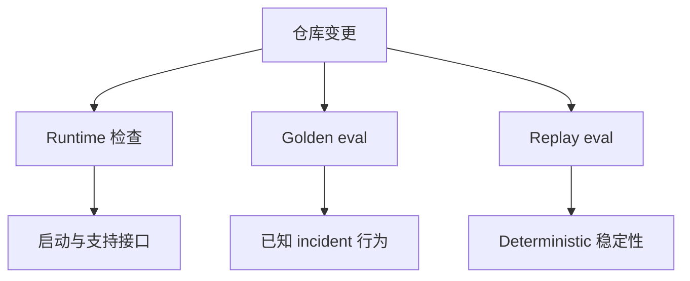

# 测试与评估

English version: [docs/en/19-testing-and-evaluation.md](../en/19-testing-and-evaluation.md)

仓库现在刻意保留三层不同的验证体系：

1. runtime 与 integration 检查
2. golden behavior evaluation
3. replay stability 检查

每一层回答的问题都不同。

## 验证栈



## 为什么要分层

如果你只测启动和 health endpoint，仍然可能发布一个行为已经退化的 incident agent：

- retrieval 可能偏了
- RCA ranking 可能退化
- workflow governance 可能没有被正确记录
- verification coverage 可能悄悄下降

所以仓库现在显式区分：

| 层次 | 它回答什么问题 |
| --- | --- |
| runtime checks | 系统能不能按支持的方式启动并暴露接口？ |
| golden eval | 已知 incident 和 retrieval case 上，系统行为是否仍然正确？ |
| replay eval | 同一 deterministic 路径重复运行时，结果是否稳定？ |

## 主要代码路径

| 层次 | 主要文件 |
| --- | --- |
| runtime tests | [`../../tests/`](../../tests/), [`../en/23-testing.md`](../en/23-testing.md) |
| golden eval | [`../../backend/internal/controller/eval/`](../../backend/internal/controller/eval/) |
| replay eval | [`../../backend/internal/controller/evaluation/`](../../backend/internal/controller/evaluation/) |

## 双 Agent RCA 覆盖

RCA runtime 现在已经拆成 `AnalysisAgent` 和 `ValidationActionAgent`，所以测试也专门覆盖了这层分工。

controller 侧目前会验证：

- 从真实 RCA state 生成 `AnalysisHandoff`
- 为 hypothesis、change correlation、recommendation 和 contradiction search 构造 validation target
- 面向 change、resource、network、GPU、安全场景的 target-aware tool 路由
- validation loop 在 iteration / tool-call budget 下的有界行为
- 当 validation 侧查到“健康证据”时，是否会把目标标成 contradicted
- recommendation 是否能通过 runbook 和 prior action outcome 得到验证
- analysis handoff、validation loop record 和最终 validation report 是否被 durable 持久化
- 最终 RCA report 和 evidence package 是否真的暴露了双 agent 结构

golden workflow suite 现在也会在报告层面给这些对象单独计分，而不是只看“durable run 是否存在”。它会逐 case 检查：

- `AnalysisAgent` 是否产出了非空 `AnalysisHandoff`
- `ValidationActionAgent` 是否产出了非空 `ValidationActionReport`
- durable run 里是否真的保存了有界的 `ValidationLoopRecord`

## Golden Evaluation 实际测什么

golden evaluation 不是一条 mock pipeline。它复用了真实代码：

- 真实 retrieval service
- 真实 workflow engine
- 真实 query-service path
- 真实 controller store 的 synthetic incident seeding

主要数据集：

- [`../../eval_data/retrieval_cases.json`](../../eval_data/retrieval_cases.json)
- [`../../eval_data/incident_cases.json`](../../eval_data/incident_cases.json)
- [`../../eval_data/anomaly_cases.json`](../../eval_data/anomaly_cases.json)
- [`../../eval_data/knowledge/`](../../eval_data/knowledge/)

## Anomaly Evaluation Suite

anomaly suite 的存在，是因为“controller 能跑起来”不等于“分类判断是对的”。

每个 anomaly case 都显式定义四类约束：

- 输入上下文：当前指标、日志、peer、副本历史
- 期望标签：`expected_recurring_burst`、`suspicious_deviation`、`correlated_anomaly`、`confirmed_anomaly`
- 期望理由：解释里必须出现的关键词
- 期望处理方式：应被 suppress、downgrade 还是 escalate

这层评估不会去调一个假的分类器。它会把 synthetic telemetry seed 到真实 controller store，然后跑真实的 `EvaluateJointRisk(...)`，最后检查真正输出的 `BehavioralAssessments` 和 `JointRiskSignal`。

### fast scope 覆盖的案例

当前 fast scope 一共包含 20 个 anomaly case：

| 类别 | 覆盖场景 |
| --- | --- |
| CPU | build burst、流量突增但无损伤、busy loop、deployment CPU spike |
| Memory | 启动预热、渐进式内存泄漏、OOM kill pressure、node eviction pressure |
| GPU | 预期训练 burst、显存异常打满、低利用率但显存被钉住、XID 类故障、GPU 忙且伴随延迟/错误恶化 |
| 多信号 | 干净的 batch CPU burst、带损伤的 recurring batch burst、backup/upload 网络 burst、deployment log burst、deployment 或 startup 触发、但历史仍然稀疏的 service latency warmup、已经形成重复模式的 deployment service latency warmup、CPU 中度偏离但延迟和错误同步恶化 |

这个集合不是为了追求“覆盖一切”，而是优先覆盖真实生产里最容易制造误报或漏报的模式。

### 评估方法

每个 case 都按同一条路径执行：

1. 如果要验证 recurrence，就先 seed 历史窗口
2. seed 当前窗口里的 metrics、logs 和可选 peer 副本
3. 运行真实 workflow engine 的 `EvaluateJointRisk(...)`
4. 检查实际输出的标签、disposition、triggered 状态和 explanation

case 文件本身就是契约。只要分类器开始：

- 对历史不足的 case suppress 过早
- 把健康 burst 错升成 incident
- 漏掉 OOM / GPU fault 这类硬故障信号

这一层就会直接失败。

### fast scope 指标

下面这组结果来自 2026 年 3 月 24 日，命令是：

```bash
go run ./cmd/evalctl -scope fast -format json
```

在最早那轮工业化 anomaly 修正前，fast suite 已经明显强于阈值式判断，但还有真实误判：

| 指标 | 修正前 |
| --- | --- |
| 通过用例数 | 12 / 18 |
| accuracy | 0.83 |
| precision | 0.80 |
| recall | 0.80 |
| F1 | 0.80 |
| false positive rate | 0.06 |
| false negative rate | 0.20 |
| disposition accuracy | 0.83 |

当前修正后，包括 rollout / startup latency warmup 这两类新案例：

| 指标 | 修正后 |
| --- | --- |
| 通过用例数 | 20 / 20 |
| accuracy | 1.00 |
| precision | 1.00 |
| recall | 1.00 |
| F1 | 1.00 |
| false positive rate | 0.00 |
| false negative rate | 0.00 |
| disposition accuracy | 1.00 |

这轮提升并不是因为加了新基础设施，而是因为把现有决策路径修正对了：

- rollout / startup 的 warning burst 不再一律算作 `error_log_burst`
- `service_log_burst_count` 及相关 log-burst 指标被保留进 trend history，deployment log 的重复模式终于能真的匹配到历史
- deployment / startup 上下文现在也会作用到 `service_latency`，所以 rollout 期间的 warmup latency spike 不会再只被解释成“历史太少”
- disk latency 类案例里，不再因为一点点内存漂移就虚构出 memory leak 假设，把 storage RCA 挤出前三

### 可选的 LLM explanation judge

上面的分类指标是确定性的。它回答的是：分类器有没有选对标签和处理方式。

但有时这还不够。系统可能“分对了类”，却把理由讲得很差。仓库现在多了一条可选的 LLM judge，用来专门检查这个问题。

命令需要从 Go module 根目录执行：

```bash
cd backend
SRE_AGENT_LLM_API_KEY=... \
SRE_AGENT_LLM_PROVIDER=gemini \
go run ./cmd/evalctl -scope fast -judge-llm -judge-limit 5 -format json
```

它实际做的事情是：

- 复用正常 anomaly eval 的输出
- 只把预测标签、disposition、explanation 和 case contract 发给配置好的 provider
- 让模型判断 explanation 是否真的支撑这次分类
- 把 pass/fail 和有界分数写进 `anomaly.explanation_judge`

为什么这层是 opt-in：

- 它有成本，而且依赖外部 provider
- 它不适合作为所有 CI 路径里的硬性、完全确定性检查
- 它的用途是抓 explanation drift，不是替代确定性的 anomaly contract

2026 年 3 月 24 日用 Gemini 跑 `-judge-limit 5` 的一组 live 样例结果：

| 指标 | 结果 |
| --- | --- |
| 判分 case 数 | 5 |
| 通过数 | 5 |
| agreement rate | 1.00 |
| average score | 1.00 |

代表性输出：

```json
{
  "id": "deployment_cpu_spike_after_rollout",
  "passed": true,
  "score": 1,
  "rationale": "The predicted label, disposition, and trigger status match the contract, and the explanation logically supports the downgraded suspicious_deviation classification by citing a deployment as context."
}
```

这层 judge 更适合在 prompt 调整、provider 切换或 explanation 风格变化后做抽样检查。不要把它当成主准确率指标。

### Live API-backed evaluation 路径

仓库现在还多了一条单独的 live 测试路径，专门给 explanation judge 用：

```bash
cd backend
SRE_AGENT_LLM_API_KEY=... \
SRE_AGENT_LLM_PROVIDER=gemini \
SRE_AGENT_LLM_MODEL=gemini-flash-latest \
go test -tags liveeval ./internal/controller/eval -run TestGoldenEvaluationFastLiveJudge -v -count=1
```

为什么它要单独分出来：

- 普通 unit test 和 golden eval 不能依赖外部 key 才能跑
- live 路径的目的，是检查 explanation 在真实 provider 下是否还成立
- key 只通过 `SRE_AGENT_LLM_API_KEY` 读取，不进入代码、配置或样例数据

这条 live 测试路径现在有三种明确结果：

- 没有 key：直接 skip，并给出清晰提示
- 有 key，provider 可用：执行 fast suite 加 live explanation judge
- 有 key，但 provider quota 用尽：skip live judge，而不是把外部配额问题误记成 agent 准确率下降

最后这一点很重要。provider quota 是外部可用性问题，不是 anomaly classifier 逻辑退化。

### batching 改动前后

最早那版 live judge 会对每个 anomaly case 单独发一次 provider 请求。用同一个 key 跑完整 fast suite 时，很容易在中途把 Gemini quota 打满。

改动前：

| 指标 | 数值 |
| --- | --- |
| retrieval 成功率 | 3 / 3 = 100% |
| anomaly classification 成功率 | 20 / 20 = 100% |
| workflow 成功率 | 3 / 3 = 100% |
| live explanation judge 成功率 | 4 / 20 = 20% |
| 含 judge 的整体成功率 | 65.22% |

这次改动做了什么：

- judge 现在会把多个 anomaly case 打包进一次请求
- `evalctl` 新增 `-judge-batch-size`
- live integration test 单独放在 `liveeval` tag 下
- live 测试里遇到 quota exhaustion 时会明确 skip，而不是误报 agent 失败

改动后，确定性指标本身没有变化：

| 指标 | 数值 |
| --- | --- |
| anomaly accuracy | 1.00 |
| precision | 1.00 |
| recall | 1.00 |
| F1 | 1.00 |
| false positive rate | 0.00 |
| false negative rate | 0.00 |

当前 live evaluation 剩下的主要弱点不是模型精度，而是 provider quota。以 2026 年 3 月 24 日这次 key 的状态看，Gemini 一旦开始返回 `RESOURCE_EXHAUSTED`，tagged live test 会选择 skip。

### fast scope 混淆矩阵

| 期望 \\ 预测 | expected_recurring_burst | suspicious_deviation | correlated_anomaly | confirmed_anomaly |
| --- | ---: | ---: | ---: | ---: |
| expected_recurring_burst | 7 | 0 | 0 | 0 |
| suspicious_deviation | 0 | 3 | 0 | 0 |
| correlated_anomaly | 0 | 0 | 3 | 0 |
| confirmed_anomaly | 0 | 0 | 0 | 7 |

同一轮评估下的按类指标：

| 类别 | Support | Precision | Recall | F1 | FPR | FNR |
| --- | ---: | ---: | ---: | ---: | ---: | ---: |
| expected_recurring_burst | 7 | 1.00 | 1.00 | 1.00 | 0.00 | 0.00 |
| suspicious_deviation | 3 | 1.00 | 1.00 | 1.00 | 0.00 | 0.00 |
| correlated_anomaly | 3 | 1.00 | 1.00 | 1.00 | 0.00 | 0.00 |
| confirmed_anomaly | 7 | 1.00 | 1.00 | 1.00 | 0.00 | 0.00 |

### 代表性案例

#### rollout 后的短时 CPU spike

场景：

- `cart-api` 在 rollout 后出现短时 CPU burst
- 有 deployment 日志
- 但没有真正的下游损伤

期望输出：

```json
{
  "classification": "suspicious_deviation",
  "reason": "cpu_pressure lines up with recent deploy or startup activity on cart-api; without corroborating harm the detector keeps it visible but downgraded instead of confirming a regression."
}
```

为什么这样判是对的：

- rollout 和 warmup 确实应该被看见
- 但没有错误、延迟或硬故障证据时，不应该直接升级成真实回归

#### rollout 期间的 latency warmup，但历史还不够厚

场景：

- `recommendation-api` 在 rollout 期间出现一段短 p95 latency spike
- 有明确 deployment 上下文
- TSDB 里只见过一次相似形状，说明 recurrence 还不够强

期望输出：

```json
{
  "classification": "suspicious_deviation",
  "reason": "service_latency lines up with recent deploy or startup activity on recommendation-api; without corroborating harm the detector keeps it visible but downgraded instead of confirming a regression."
}
```

为什么这样判是对的：

- 历史还不够厚时，不应该直接 suppress
- 但 deployment 上下文仍然应该改变解释方式和严重度
- operator 看到这类结果时，应该能一眼区分“warmup 痕迹”和“无上下文的真实延迟退化”

#### 已经重复出现的 deployment latency warmup

场景：

- `search-api` 在 rollout 后反复出现同样的 p95 spike
- 同一时间段已经有多次相似历史
- 没有错误、runtime 异常或其他损伤信号

期望输出：

```json
{
  "classification": "expected_recurring_burst",
  "reason": "service_latency matches 4 similar spikes from TSDB history for search-api around 13:00 UTC and has no corroborating error, runtime, or latency regression now."
}
```

#### 可重复的 deployment log burst

场景：

- `deploy-agent` 在 rollout 期间稳定刷出一小段 warning burst
- 这个形状已经多次出现
- 日志很吵，但不是 fault-like 日志

期望输出：

```json
{
  "classification": "expected_recurring_burst",
  "reason": "log_burst matches 4 similar spikes from TSDB history for deploy-agent around 11:00 UTC and has no corroborating error, runtime, or latency regression now."
}
```

#### 渐进式内存泄漏

场景：

- 内存不是一瞬间冲高，而是在更长窗口里持续上升
- 问题在斜率和持续性

期望输出：

```json
{
  "classification": "confirmed_anomaly",
  "reason": "memory_leak_rate shows sustained memory leak growth for api-service and remains materially outside the long-window baseline."
}
```

#### GPU 故障信号覆盖掉“看似正常”的 utilization

场景：

- GPU utilization 形状看起来并不陌生
- 但同时出现了 XID 类故障或 driver fault 证据

期望输出：

```json
{
  "classification": "confirmed_anomaly",
  "reason": "gpu_utilization matches prior utilization on trainer-gpu, but current GPU fault evidence makes it a confirmed anomaly."
}
```

### 当前弱点

当前 fast-scope anomaly case 没有失败项，但这不代表问题已经被完全解决。

目前仍然偏弱的地方主要有：

- trace 级季节性建模，尤其是超出当前 latency 指标之外的 span 行为
- 长时间尺度的 peer seasonality，而不只是当前时刻的副本横向对比
- 语义上很含糊的 warning burst，既不像健康噪声，也不像明确故障
- 短生命周期 workload 的 identity churn，导致历史被切碎

这些都是真问题，只是当前仓库还没有假装自己已经把它们解决完。

## v0.8 在评估层新增了什么

当前仓库测的不再只是 retrieval 和 RCA 准确性。

它还显式检查：

- governance coverage
- verification coverage
- durable run coverage
- evidence-package generation
- incident-memory write-back
- repeated run 下的 replay stability

这很重要，因为 operational agent 即使 top-level RCA 文本还“看起来合理”，也可能已经在治理和验证层退化了。

## 常用命令

快速本地验证：

```bash
make test
make test-agent-workflow
make test-agent-replay
make eval-fast
```

带 explanation judge 的 fast anomaly eval：

```bash
cd backend
SRE_AGENT_LLM_API_KEY=... \
SRE_AGENT_LLM_PROVIDER=gemini \
go run ./cmd/evalctl -scope fast -judge-llm -judge-limit 5 -judge-batch-size 5
```

带 live provider 的 tagged 测试：

```bash
cd backend
SRE_AGENT_LLM_API_KEY=... \
SRE_AGENT_LLM_PROVIDER=gemini \
go test -tags liveeval ./internal/controller/eval -run TestGoldenEvaluationFastLiveJudge -v -count=1
```

更广的回归：

```bash
make eval-regression
```

## 失败后先回到哪一层

看到失败时，最常见的误区是先去改 prompt 或 ranking。当前仓库更可靠的排查顺序是：

| 失败表象 | 先看哪里 | 为什么先看这里 |
| --- | --- | --- |
| API 起不来或 `/api/v1/status` 异常 | 启动脚本、部署配置、runtime tests | 这是支持接口和装配层问题，不是推理质量问题 |
| retrieval 命中突然变差 | golden eval case、dataset 处理、索引完整性 | 很多问题来自索引、chunking 或 query 构造变化，而不是模型 |
| RCA 还能出结果，但治理字段丢了 | `workflow_engine.go`、`workflow_orchestrator.go`、evidence package 输出 | 这通常是 runtime durable 记录退化，不是 incident 识别本身退化 |
| replay stability 波动 | evaluation 包装层、非确定性依赖、时间相关字段 | 先找 nondeterminism，再考虑 ranking 或文案 |
| remediation 相关断言失败 | verification hook、policy 路径、idempotency/approval 分支 | 这是控制环语义问题，不能只看最终报告文本 |

这个顺序的核心思想是：先确认哪一层失真，再修改那一层，而不是把所有失败都归因到“模型回答变了”。

## 如何理解失败

### Runtime failure

通常意味着：

- 支持的部署路径起不来了
- API 契约意外变化
- UI 或 controller glue 出了问题

### Golden evaluation failure

通常意味着：

- retrieval ranking 改变了
- RCA hypothesis ordering 退化了
- recommendation usefulness 下降了
- governance 或 verification artifact 丢了

### Replay stability failure

通常意味着：

- 同一 deterministic 路径的指标或 workflow coverage 不再稳定
- controller 路径里进入了新的 nondeterminism

## Replay 层到底做什么

[`../../backend/internal/controller/evaluation/`](../../backend/internal/controller/evaluation/) 里的 replay 包会把 golden evaluation 连续跑两次，然后比较：

- workflow metrics
- retrieval metrics
- stability score

这层设计刻意保持简单。

它不是在模拟完整生产分布式环境，而是在检查仓库自身的 deterministic evaluation path 有没有失稳。

## 为什么这对研究者和审阅者重要

这个仓库不只是宣称自己有 retrieval、RCA 和 workflow governance，它还提供了可重复的回归验证机制。

这意味着：

- 架构主张和数据更容易绑定
- 文档主张更可证伪
- 贡献者可以超越“endpoint 还返回 JSON 吗”去判断行为变化

## 当前评估还故意没有覆盖什么

为了让回归结果稳定、可比较，当前评估体系有意不追求“模拟一切”。

它没有完整覆盖：

- 真实多集群或多 controller 部署下的分布式时序抖动
- 外部 CMDB、ticket、企业变更系统接入后的复杂语义
- 大规模开放领域 incident 语料上的通用 benchmark 表现
- 完整的人类审批流程、令牌生命周期和组织流程差异

这不是缺陷被忽略，而是当前仓库的评估目标本来就更窄：它优先保证 repository-grounded 行为回归可见，而不是假装已经具备平台级 benchmark 体系。

## 边界

当前评估设计仍然有边界：

- corpus 很小，而且故意 deterministic
- 它更强于 regression detection，而不是 open-world benchmark
- replay stability 是仓库行为层面的，不是完整 distributed-systems replay 环境

这些边界是可以接受的，因为它的目标本来就是 repository-grounded regression control。
