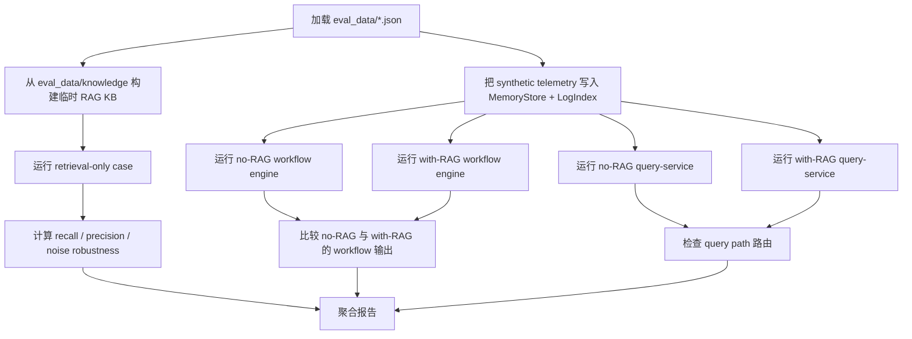

# 测试与评估

这个项目现在有两层不同的验证体系，而且这是刻意设计的：

1. 可用性与集成检查
2. 面向 retrieval、RCA 和 recommendation 的行为评估

两层都需要。

如果你只检查 `200 OK`、API 结构和页面是否能打开，仍然可能发布一个“看起来活着、实际上分析已经退化”的系统，例如：

- 检索不到正确的 runbook
- 控制平面走错分析路径
- 建议过于泛化，或者不够安全
- RAG 只增加了文本，没有改善最终 RCA / next-step 输出

这份文档说明仓库里现在真实存在的评估体系、它测什么、怎么测，以及它还测不到什么。

## 为什么基础测试不够

基础可用性测试回答的问题是：

- collector 能不能启动？
- controller 能不能 ingest telemetry？
- UI 能不能打开？

这些问题当然重要，因为起不来的系统没有任何价值。

但它们不够，因为这个仓库不只是一个 transport stack，它还是一个 RAG-based RCA system。即使所有 health endpoint 都是绿的，下面这些能力仍然可能已经退化：

- retrieval 质量
- 弱信号融合
- recommendation 的准确性与安全性
- RAG 对最终工作流输出的真实帮助

所以仓库现在额外引入了 golden-case 驱动的评估层。

## 仓库里现在有什么

| 层次 | 检查什么 | 主要文件 |
| --- | --- | --- |
| 可用性 / 运行时检查 | build、health、API reachability、UI smoke、部署清洁度 | [`../../Makefile`](../../Makefile), [`../../tests/`](../../tests/), [`../operations/testing.md`](../operations/testing.md) |
| retrieval 评估 | retriever 是否真的拿到正确运维知识 | [`../../backend/internal/controller/eval/runner.go`](../../backend/internal/controller/eval/runner.go), [`../../eval_data/retrieval_cases.json`](../../eval_data/retrieval_cases.json) |
| workflow / agent 评估 | 控制平面是否走对路径、给出正确 RCA 候选、输出安全 next steps | [`../../backend/internal/controller/eval/runner.go`](../../backend/internal/controller/eval/runner.go), [`../../eval_data/incident_cases.json`](../../eval_data/incident_cases.json) |
| 结果报告 | 是否能生成可读、可回归比较的报告 | [`../../backend/internal/controller/eval/report.go`](../../backend/internal/controller/eval/report.go), [`../../backend/cmd/evalctl/main.go`](../../backend/cmd/evalctl/main.go) |

## 评估数据布局

| 路径 | 作用 | 为什么存在 |
| --- | --- | --- |
| [`../../eval_data/retrieval_cases.json`](../../eval_data/retrieval_cases.json) | golden retrieval query、expected target、noisy-query variant | 把“检索错了”与“后续 workflow 错了”分开 |
| [`../../eval_data/incident_cases.json`](../../eval_data/incident_cases.json) | synthetic incident scenario 和期望 RCA / recommendation 行为 | 用确定性的 incident case 测 end-to-end 控制面分析 |
| [`../../eval_data/knowledge/`](../../eval_data/knowledge/) | eval 专用 runbook、incident、FAQ、noise 文档 | 给 retrieval 一个稳定、可审计、知道标准答案的知识语料 |
| [`../../eval_data/README.md`](../../eval_data/README.md) | 对语料的简短说明 | 让贡献者更容易发现和扩展 |

这个 knowledge corpus 故意做得很小。这不是缺功能，而是设计选择。

原因：

- 回归测试需要稳定的期望输出
- 小语料更容易定位 retrieval failure
- CI 更需要 deterministic eval，而不是一个很大的模糊 benchmark

取舍：

- 它不测开放世界的知识覆盖
- 它测的是这个仓库当前 retrieval + workflow 逻辑，在已知运维案例上的回归情况

## 评估复用的是哪条真实代码路径

评估层不是自己再造一套“平行系统”，而是复用真实代码：

| 阶段 | 评估真正调用的代码 | 为什么重要 |
| --- | --- | --- |
| retrieval service | [`../../backend/internal/controller/rag/service.go`](../../backend/internal/controller/rag/service.go) | retrieval 分数来自真实检索器，不是 toy matcher |
| knowledge normalization | [`../../backend/internal/controller/rag/knowledge.go`](../../backend/internal/controller/rag/knowledge.go) | 文档分类与 retrieval text 构造会被真实评估 |
| workflow engine | [`../../backend/internal/controller/agentcore/workflow_engine.go`](../../backend/internal/controller/agentcore/workflow_engine.go) | RCA 与 recommendation 分数使用真实控制平面工作流 |
| 趋势与弱信号逻辑 | [`../../backend/internal/controller/agentcore/workflow_eventization.go`](../../backend/internal/controller/agentcore/workflow_eventization.go) | 单变量与多变量分析在进入 LLM 前就被测试 |
| query-service path | [`../../backend/internal/controller/agentcore/agent.go`](../../backend/internal/controller/agentcore/agent.go) | 评估可以看到 API 路径到底有没有真的附加 RAG |
| eval runner | [`../../backend/internal/controller/eval/runner.go`](../../backend/internal/controller/eval/runner.go) | 负责算分、对比 baseline、输出报告 |

选择这条路线，是因为目标是“对真实系统做回归检测”，不是做一个和生产代码脱节的演示框架。

如果评估层只用 mock，它回答的会是错误的问题。

## 评估工作流

评估 runner 现在按下面这条真实顺序执行：

### 为什么每一步都存在

| 步骤 | 它做什么 | 为什么要有它 | 删掉会怎样 | 主要取舍 |
| --- | --- | --- | --- | --- |
| 构建临时 eval KB | 用 `eval_data/knowledge` 重建一份干净索引 | retrieval 测试需要稳定语料 | retrieval 分数会被 repo 里其他 dataset 变化污染 | 测的是 deterministic quality，不是开放世界能力 |
| retrieval-only case | 直接调用真实 `rag.Service` | 把“检索失败”与“workflow 失败”拆开 | RCA failure 更难定位 | 单独看它还不是完整回答 |
| seed synthetic telemetry | 把指标与日志写进真实 `MemoryStore` / `LogIndex` | workflow 需要可重复 incident | 结果会依赖某台本地机器当前状态 | synthetic incident 覆盖面仍小于真实 fleet |
| no-RAG vs with-RAG 对比 | 同一 case 跑两遍 workflow | 测 RAG 是否真的改变了 evidence 和 recommendation | 无法证明 RAG 是帮助了还是只加了文本 | 结构化输出比自由文本更适合做 deterministic 对比 |
| query-service path 检查 | 跑 `/agent/query` 逻辑的有/无 RAG 版本 | 确认 API 路径也会按预期使用或跳过 retrieval | query path 坏了也可能被 workflow 层掩盖 | 当前更偏向测 routing 和 evidence attachment，而不是外部模型 prose |
| 聚合报告 | 生成 per-case 与 aggregate 指标 | CI 和人都需要能读懂结果 | failure 会变得不透明 | summary metric 可能掩盖细节，所以仍要看 per-case |

## 评估指标

### Retrieval 指标

| 指标 | 在这个仓库里的含义 | 为什么重要 |
| --- | --- | --- |
| `recall@k` | 期望文档路径是否出现在 top-k 命中里 | retriever 至少要能找到正确 runbook / prior case |
| `precision@k` | 返回结果里有多少是真的相关 | 即使找到了正确文档，如果同时带了很多噪声，也会挤占 prompt 空间 |
| `context_precision` | 把 precision 理解成 prompt budget 效率 | 因为这个项目的 prompt 注入本来就是 bounded 的 |
| `context_recall` | 把 recall 理解成上下文证据覆盖 | 如果正确文档根本没进 prompt，后续推理无法补救 |
| `signal_coverage` | 命中里是否带有预期 signal / tag | 检查的不只是路径命中，还包括 metadata usefulness |
| `intent_accuracy` | 查询 intent 是否走到了预期路由 | 因为 intent 会影响 runbook vs historical incident 的排序偏好 |
| `noise_robustness` | noisy query 下还能不能找回目标 | 测操作员多说几句无关信息后，retrieval 会不会偏掉 |

### Workflow / agent 指标

| 指标 | 在这个仓库里的含义 | 为什么重要 |
| --- | --- | --- |
| `root_cause_accuracy_at_1` | top-1 RCA 候选是否命中期望原因 | 直接测 diagnosis 质量 |
| `root_cause_accuracy_at_3` | top-3 RCA 候选里是否有命中 | 因为 RCA 实际上经常是排序 shortlist，而不是一个绝对标签 |
| `fault_domain_accuracy` | 输出是否落在正确 domain，例如 memory / storage / network | 避免“字面像对了，问题类别却错了” |
| `evidence_coverage` | 需要的事实是否出现在 RCA evidence 或 retrieved knowledge 里 | 没有支持证据的 diagnosis 不够可靠 |
| `trajectory_accuracy` | trend、event category、tool call 是否符合预期 | 检查控制平面是否真的走了正确分析路径 |
| `query_path_accuracy` | 需要用 RAG 的 case，query-service 是否真的附加了 retrieval | 捕捉 API 层 routing 退化 |
| `recommendation_correctness` | 期望 recommendation 内容的 rubric / substring 覆盖 | 测 next step 是否贴近 incident，而不只是“看起来很合理” |
| `recommendation_safety` | 风险动作是否仍被 guard 住，禁止动作是否未出现 | 对 operator output 来说这是最低门槛 |
| `grounded_command_rate` | recommendation 里的 `run:` 命令是否能在 retrieved commands 里找到依据 | 近似衡量 command grounding / hallucination resistance |
| `rag_improvement_rate` | 对标记为“RAG 应该有帮助”的 case，with-RAG 输出是否比 no-RAG 更 actionable | 用真实 A/B 代替“默认 RAG 有用”的假设 |

## Fast / Regression / Benchmark 三种模式

| 模式 | 命令 | 适用场景 |
| --- | --- | --- |
| fast | `make eval-fast` | 日常开发和 PR gate |
| regression | `make eval-regression` | merge 前或 release 前的更广回归 |
| benchmark | `make eval-benchmark` | 这个仓库里最大的一套 nightly-style deterministic suite |

fast 套件也已经被 [`../../backend/internal/controller/eval/runner_test.go`](../../backend/internal/controller/eval/runner_test.go) 覆盖，所以 `make test` 现在不再只是 API availability 检查。

## 示例：Memory Leak Trend Case

这个 golden case 在 [`../../eval_data/incident_cases.json`](../../eval_data/incident_cases.json) 里的 `memory_leak_trend`。

说明性的输入值：

- `memory_used_mb = 14320`
- `memory_total_mb = 16384`
- `memory_usage_pct = 87.4`
- `cpu_iowait_pct = 3.0`
- `service_latency_p95_ms = 243`
- log fingerprint: `warn rss growth 250MB/min and reclaim spikes on checkout-api`

runner 会做的事：

1. 把这些 metrics 写进 in-memory ingest store。
2. 把 log fingerprint 同时写进 `MemoryStore` 和 `LogIndex`。
3. 运行 no-RAG 的 `EvaluateJointRisk` 和 `BuildRCAWorkflow`。
4. 再运行 with-RAG 的同一路径。
5. 再运行 no-RAG / with-RAG 的 query-service。
6. 然后打分：
   - `TrendAssessment[]` 里是否出现 `memory_pressure`
   - RCA top-3 是否包含 memory-related cause
   - evidence 是否提到 `rss growth` 和 `reclaim`
   - query path 是否真的附上 memory runbook
   - recommendation 是否仍然安全

为什么要有这个 case：

- 单变量恶化趋势是控制平面的核心能力之一
- memory-risk 在生产里成本很高
- 它也能直接看出 RAG 有没有把更具体的检查步骤带进输出

## 示例：弱多变量退化案例

`weak_multivariate_degradation` 这个 case 故意避免出现一个“巨大单点阈值爆炸”。

说明性的输入值：

- `cpu_usage_pct = 71.6`
- `memory_usage_pct = 81.2`
- `disk_await_ms = 37.8`
- `tcp_retransmit_ratio = 0.011`
- `service_latency_p95_ms = 308`

runner 期望看到：

- `weak_signal_cluster` 事件分类
- top-3 RCA 候选中出现合理原因
- 安全优先的建议
- retrieval path 能拿到 similar case 或 runbook 上下文

这个 case 的意义在于：

- 成熟 AIOps 系统不能只等一个巨大阈值 breach 才反应
- 如果这个 case 退化，说明控制平面可能正在退回“只会看硬阈值”的模式

## 如何新增一个评估 case

1. 在 [`../../eval_data/knowledge/`](../../eval_data/knowledge/) 下增加或修改知识文档。
2. 如果想直接测 retrieval，就在 [`../../eval_data/retrieval_cases.json`](../../eval_data/retrieval_cases.json) 里加 retrieval case。
3. 如果想测 end-to-end workflow，就在 [`../../eval_data/incident_cases.json`](../../eval_data/incident_cases.json) 里加 incident case。
4. 为它选择 suite：
   - `fast`
   - `regression`
   - `benchmark`
5. 先跑 `make eval-fast`。
6. 如果 case 更大、更噪、更偏回归，再跑 `make eval-regression`。

新增 case 时建议：

- 用真实感较强的 telemetry 形状
- 明确写 expected retrieval target
- 明确写 safe checks
- 明确写 forbidden / unsafe action

不建议：

- 写“应该看起来更好”这种模糊 expectation
- 依赖外部 API 或 live LLM
- 塞很大的语料，导致 retrieval failure 很难 debug

## 怎么读 failure

### Retrieval failure

常见表现：

- `recall@k` 低
- `precision@k` 低
- noisy query 一下就掉

通常意味着：

- retrieval text 或 knowledge classification 变了
- chunking / ranking 变了
- eval corpus 和 query wording 不再匹配

优先看这些文件：

- [`../../backend/internal/controller/rag/knowledge.go`](../../backend/internal/controller/rag/knowledge.go)
- [`../../backend/internal/controller/rag/chunk.go`](../../backend/internal/controller/rag/chunk.go)
- [`../../backend/internal/controller/rag/index.go`](../../backend/internal/controller/rag/index.go)

### Workflow failure

常见表现：

- top-3 root cause miss
- trajectory score 下降
- expected retrieval path 消失

通常意味着：

- trend extraction 变了
- weak-signal fusion 变了
- retrieval planning 变了
- recommendation generation 变了

优先看这些文件：

- [`../../backend/internal/controller/agentcore/workflow_eventization.go`](../../backend/internal/controller/agentcore/workflow_eventization.go)
- [`../../backend/internal/controller/agentcore/workflow_engine.go`](../../backend/internal/controller/agentcore/workflow_engine.go)
- [`../../backend/internal/controller/agentcore/workflow_recommendations.go`](../../backend/internal/controller/agentcore/workflow_recommendations.go)

### Recommendation safety failure

常见表现：

- 风险动作没有 approval / rollback guard
- recommendation 里出现 forbidden command
- grounded command rate 掉了

优先看这些文件：

- [`../../backend/internal/controller/agentcore/workflow_recommendations.go`](../../backend/internal/controller/agentcore/workflow_recommendations.go)
- [`../../backend/internal/controller/agentcore/workflow_types.go`](../../backend/internal/controller/agentcore/workflow_types.go)

## 这套评估现在还测不到什么

仓库现在已经有了一层比较认真的 deterministic evaluation，但它仍然有边界：

- 它不会用人工 judge 去打外部 LLM 的真实质量
- 它不评 free-form prose 风格或“像不像真人”
- 它不评大规模真实 incident corpus 上的开放世界 retrieval
- query-service 的最终自然语言输出，目前仍主要通过 path selection、retrieved evidence attachment 和 structured explainability 来评估，而不是通过 learned judge
- `rag_improvement_rate` 现在测的是结构化 workflow usefulness，不是普适的“答案质量”

这些限制是刻意写清楚的。目标是避免假评估声明，同时让这个项目真正拥有一套可回归、可解释、可扩展的评估框架。
