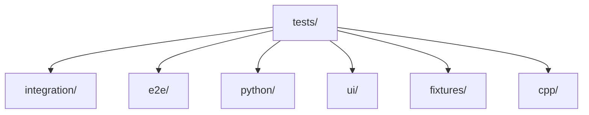
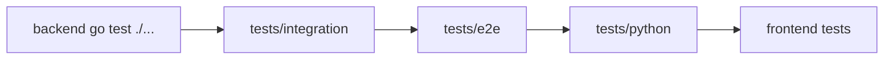

# Test Suite Layout

## Structure


## Execution Order (Stability Suite)


- `integration/`: Go integration tests for runtime interactions.
- `e2e/`: end-to-end scenarios (including optional external-stack tags).
- `python/`: Python-side analysis/runtime tests.
- `ui/`: Playwright browser tests.
- `fixtures/`: shared test data and config fixtures.

## Common Commands
```bash
# backend + integration + e2e + python + frontend tests
make test-stability

# backend tests only
make test

# ui tests only
make test-ui
```

## Notes
- Some `e2e` paths require external dependencies and may skip when prerequisites are missing.
- UI tests assume controller/UI is reachable or launchable in test setup.
