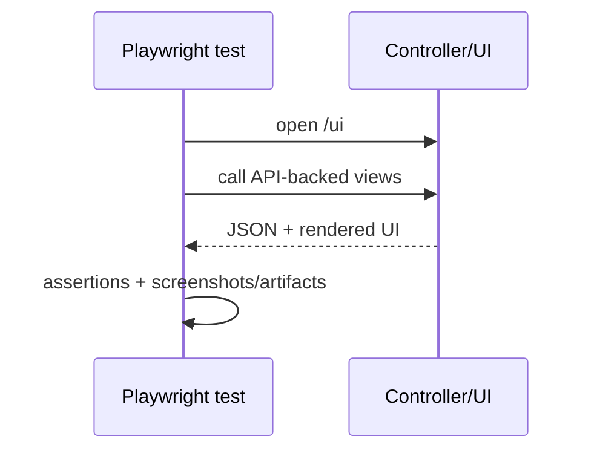
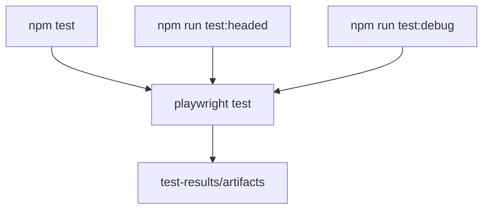

# UI Tests (Playwright)

## Setup
```bash
cd tests/ui
npm install
npx playwright install chromium
```

## Run
```bash
# headless
npm test

# headed
npm run test:headed

# debug mode
npm run test:debug
```

## Repository-Level Shortcut
```bash
make test-ui
```

## Execution Model


## UI Test Entry Points


## Artifacts
Playwright outputs under `tests/ui/test-results/` (including HTML reports and artifacts when enabled).
