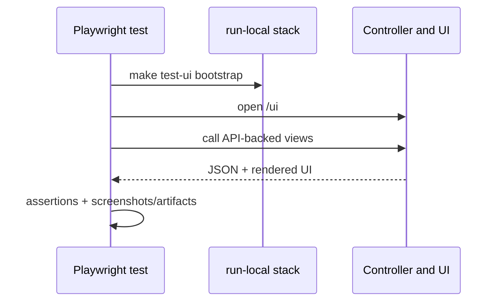
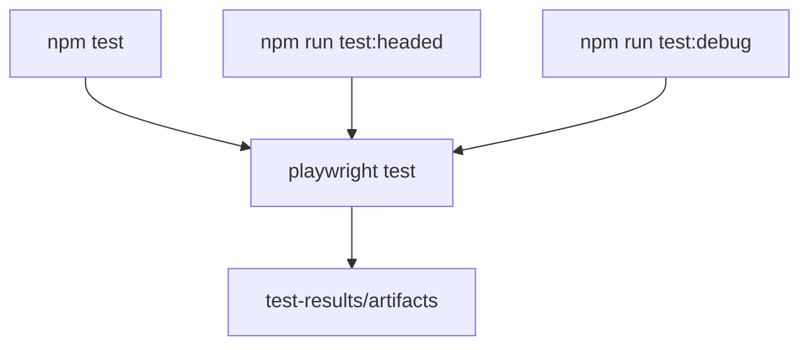

# UI Tests (Playwright)

## Setup
```bash
cd tests/ui
npm install
npx playwright install chromium
```

## Run
```bash
# preferred: auto-build + auto-start stack + run tests
make test-ui

# run directly against an already-running stack
# headless
npm test

# headed
npm run test:headed

# debug mode
npm run test:debug
```

`make test-ui` now bootstraps a local stack automatically via `scripts/test/ui-smoke.sh`.

## 中文说明

- UI 测试文档强调的是“浏览器如何进入真实控制面闭环”，而不是只做静态页面截图。Playwright 会连到实际启动的本地 stack，验证 UI 与 API 的组合行为。
- `make test-ui` 被推荐，是因为它把 build、stack bootstrap 和 test execution 串成了一条默认路径，减少手动启动顺序错误。

## Execution Model


中文原因补充:

- 图里把 `run-local stack` 单独画出来，是为了强调 UI smoke test 不是孤立执行的前端单测，而是依赖一个真实 controller/UI 运行面。
- `Controller and UI` 放在同一个 participant 上，是因为这份 README 关注的是浏览器入口和渲染结果，而不是细拆 controller 内部模块。

## UI Test Entry Points


## Artifacts
Playwright outputs under `tests/ui/test-results/` (including HTML reports and artifacts when enabled).

中文补充:

- 保留 artifacts 的目的不是“看截图好不好看”，而是让失败时能快速回放页面状态、请求结果和断言上下文。
