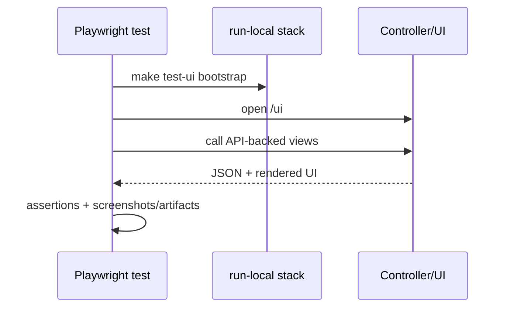
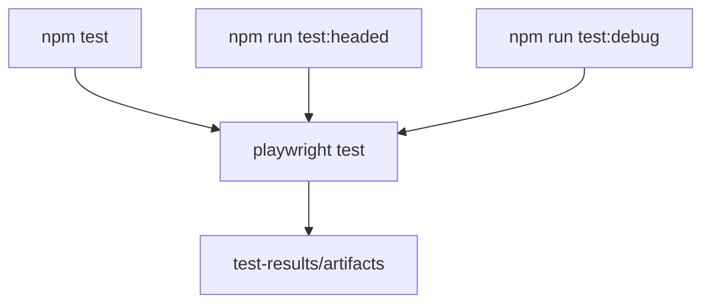

# UI Tests (Playwright)

## Setup
```bash
cd tests/ui
npm install
npx playwright install chromium
```

## Run
```bash
# preferred: auto-build + auto-start stack + run tests
make test-ui

# run directly against an already-running stack
# headless
npm test

# headed
npm run test:headed

# debug mode
npm run test:debug
```

`make test-ui` now bootstraps a local stack automatically via `scripts/test/ui-smoke.sh`.

## Execution Model


## UI Test Entry Points


## Artifacts
Playwright outputs under `tests/ui/test-results/` (including HTML reports and artifacts when enabled).
